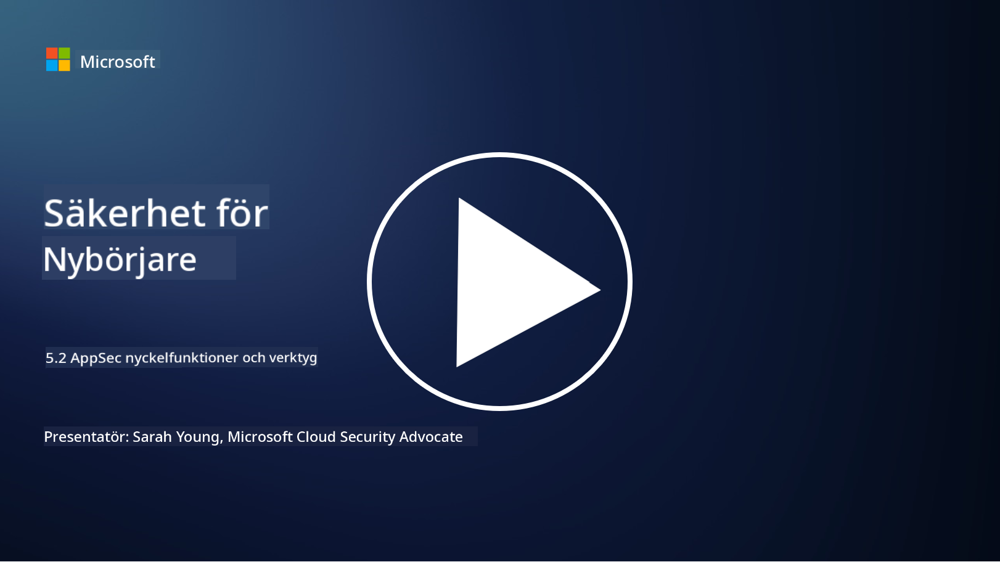

<!--
CO_OP_TRANSLATOR_METADATA:
{
  "original_hash": "790a3fa7e535ec60bb51bde13e759781",
  "translation_date": "2025-09-04T00:50:32+00:00",
  "source_file": "5.2 AppSec key capabilities.md",
  "language_code": "sv"
}
-->
## Introduktion

I den här lektionen kommer vi att gå igenom vilka nyckelfunktioner och verktyg som används inom applikationssäkerhet.

## Nyckelfunktioner och verktyg inom AppSec

Nyckelfunktioner och verktyg som används inom applikationssäkerhet är avgörande för att identifiera, mildra och förhindra säkerhetsbrister och hot i mjukvaruapplikationer. Här är några av de viktigaste:

**1. Statisk applikationssäkerhetstestning (SAST)**:

- **Funktioner**: Analyserar källkod, bytekod eller binärkod för att identifiera säkerhetsbrister i applikationens kodbas.

- **Verktyg**: Exempel inkluderar Fortify, Checkmarx och Veracode.

**2. Dynamisk applikationssäkerhetstestning (DAST)**:

- **Funktioner**: Skannar en körande applikation för att identifiera sårbarheter genom att skicka inmatningsförfrågningar och analysera svar.

- **Verktyg**: Exempel inkluderar ZAP, Burp Suite och Qualys Web Application Scanning.

**3. Interaktiv applikationssäkerhetstestning (IAST)**:

- **Funktioner**: Kombinerar element från SAST och DAST för att analysera kod under körning, vilket ger mer exakta resultat och minskar falska positiva.

- **Verktyg**: Exempel inkluderar Contrast Security och HCL AppScan.

**4. Runtime Application Self-Protection (RASP)**:

- **Funktioner**: Övervakar och skyddar applikationer i realtid genom att upptäcka och reagera på säkerhetshot när de inträffar.

- **Verktyg**: Exempel inkluderar Veracode Runtime Protection och F5 Advanced WAF med RASP.

**5. Web Application Firewalls (WAFs)**:

- **Funktioner**: Ger ett skyddande lager mellan applikationen och internet genom att filtrera inkommande trafik och blockera skadliga förfrågningar.

- **Verktyg**: Exempel inkluderar ModSecurity, AWS WAF och Akamai Kona Site Defender.

**6. Beroendeskanning**:

- **Funktioner**: Identifierar sårbarheter i tredjepartsbibliotek och komponenter som används i applikationen.

- **Verktyg**: Exempel inkluderar OWASP Dependency-Check och Snyk.

**7. Penetrationstestning (Pen Testing)**:

- **Funktioner**: Simulerar verkliga attacker för att upptäcka sårbarheter och bedöma säkerheten i en applikation.

- **Verktyg**: Utförs av certifierade etiska hackare och säkerhetsproffs med hjälp av olika verktyg som Metasploit och Nmap.

**8. Säkerhetsskanning och analys**:

- **Funktioner**: Skannar efter kända sårbarheter, konfigurationsfel och säkerhetsmisskonfigurationer.

- **Verktyg**: Exempel inkluderar Nessus, Qualys Vulnerability Management och OpenVAS.

**9. Verktyg för containersäkerhet**:

- **Funktioner**: Fokuserar på att säkra containeriserade applikationer och deras miljöer.

- **Verktyg**: Exempel inkluderar Docker Security Scanning och Aqua Security.

**10. Utbildning i säker utveckling**:

- **Funktioner**: Erbjuder utbildnings- och medvetenhetsprogram för utvecklingsteam för att främja säkra kodningsmetoder.

- **Verktyg**: Anpassade utbildningsprogram och plattformar.

**11. Ramverk för säkerhetstestning**:

- **Funktioner**: Tillhandahåller omfattande testningsramverk för olika behov inom applikationssäkerhetstestning.

- **Verktyg**: OWASP Amass, OWASP OWTF och FrAppSec.

**12. Verktyg för säker kodgranskning**:

- **Funktioner**: Granskar källkod för säkerhetsbrister och kodningsbästa praxis.

- **Verktyg**: Exempel inkluderar SonarQube och Checkmarx.

**13. Verktyg för säkra API:er och mikrotjänster**:

- **Funktioner**: Fokuserar på att säkra API:er och mikrotjänster, inklusive autentisering, auktorisering och dataskydd.

- **Verktyg**: Exempel inkluderar Apigee, AWS API Gateway och Istio.

## Vidare läsning

- [What Is Application Security? Concepts, Tools & Best Practices | HackerOne](https://www.hackerone.com/knowledge-center/what-application-security-concepts-tools-best-practices)  
- [What is IAST? (Interactive Application Security Testing) (comparitech.com)](https://www.comparitech.com/net-admin/what-is-iast/)  
- [10 Types of Application Security Testing Tools: When and How to Use Them (cmu.edu)](https://insights.sei.cmu.edu/blog/10-types-of-application-security-testing-tools-when-and-how-to-use-them/)  
- [Shifting the Balance of Cybersecurity Risk: Principles and Approaches for Security-by-Design and Default | Cyber.gov.au](https://www.cyber.gov.au/about-us/view-all-content/publications/principles-and-approaches-for-security-by-design-and-default)  

---

**Ansvarsfriskrivning**:  
Detta dokument har översatts med hjälp av AI-översättningstjänsten [Co-op Translator](https://github.com/Azure/co-op-translator). Även om vi strävar efter noggrannhet, vänligen notera att automatiska översättningar kan innehålla fel eller felaktigheter. Det ursprungliga dokumentet på sitt ursprungliga språk bör betraktas som den auktoritativa källan. För kritisk information rekommenderas professionell mänsklig översättning. Vi ansvarar inte för eventuella missförstånd eller feltolkningar som uppstår vid användning av denna översättning.