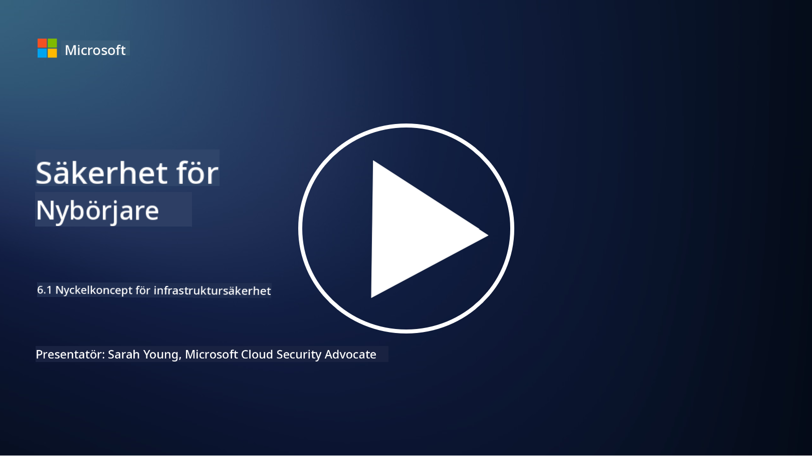

<!--
CO_OP_TRANSLATOR_METADATA:
{
  "original_hash": "882ebf66a648f419bcbf680ed6aefa00",
  "translation_date": "2025-09-03T23:14:04+00:00",
  "source_file": "6.1 Infrastructure security key concepts.md",
  "language_code": "sv"
}
-->
# Nyckelkoncept för infrastruktursäkerhet

"Infrastruktur" avser byggstenarna i varje IT-miljö, inklusive servrar, molntjänster och containrar – en mängd olika teknologier. Applikationerna som diskuterades i föregående avsnitt körs på infrastruktur, vilket gör att även den kan bli ett mål för angripare.

I denna lektion kommer vi att gå igenom:

- Vad är säkerhetshygien och varför är det viktigt?

- Vad är säkerhetslägeshantering?

- Vad är patchning och varför är det viktigt?

- Vad är containrar och vad är annorlunda med deras säkerhet?

## Vad är säkerhetshygien och varför är det viktigt?

**Säkerhetshygien** avser de rutiner och beteenden som individer och organisationer följer för att upprätthålla goda cybersäkerhetsvanor. Det handlar om att vidta åtgärder för att skydda system, data och nätverk från hot och sårbarheter. God säkerhetshygien är viktig av flera skäl:

- **Förebygga attacker**: Att följa bästa praxis kan förhindra vanliga cyberattacker, såsom nätfiske, skadlig kod och obehörig åtkomst.

- **Skydda data**: Rätt säkerhetshygien skyddar känslig och konfidentiell data från stöld eller exponering.

- **Bygga förtroende**: Organisationer som visar god säkerhetshygien bygger förtroende hos kunder och samarbetspartners.

- **Efterlevnad**: Många regler och standarder kräver att organisationer följer säkerhetshygienrutiner.

- **Minska risker**: Konsekvent säkerhetshygien minskar den övergripande risken för säkerhetsincidenter och intrång.

Säkerhetshygien inkluderar rutiner som att hålla programvara uppdaterad, använda starka lösenord och multifaktorautentisering, regelbundna säkerhetskopior, utbildning av anställda och övervakning av misstänkta aktiviteter. Det är grunden för en stark cybersäkerhetsstrategi.

## Vad är säkerhetslägeshantering?

Säkerhetslägeshantering (Security Posture Management) avser praxis att bedöma, övervaka och hantera en organisations övergripande cybersäkerhetsläge. Ett cybersäkerhetsläge beskriver en organisations övergripande strategi och beredskap för att skydda sina IT-system, nätverk, data och tillgångar från cyberhot och attacker. Det omfattar de strategier, policyer, rutiner och teknologier som en organisation använder för att skydda sina digitala tillgångar och upprätthålla konfidentialitet, integritet och tillgänglighet av sin information. 

Det handlar om att utvärdera och upprätthålla säkerheten för system, nätverk, applikationer och data för att säkerställa att de överensstämmer med säkerhetspolicyer, bästa praxis och efterlevnadskrav. Målet med säkerhetslägeshantering är att ge en omfattande bild av en organisations säkerhetsstatus, identifiera sårbarheter och svagheter samt prioritera åtgärdsinsatser.

## Vad är patchning och varför är det viktigt?

**Patchning** avser processen att tillämpa programuppdateringar, även kallade patchar eller fixar, på programvara, operativsystem och applikationer. Dessa uppdateringar åtgärdar vanligtvis säkerhetssårbarheter, buggar och andra problem som kan utnyttjas av angripare. Även hårdvaruenheter kräver patchning: det kan vara deras firmware eller inbyggda operativsystem. Hårdvarupatchning kan vara mycket svårare än programvarupatchning.

Patchning är viktigt av flera skäl:

- **Säkerhet**: Patchar åtgärdar kända sårbarheter som angripare kan utnyttja för att kompromettera system och stjäla data.

- **Stabilitet**: Patchar innehåller ofta förbättringar av stabilitet och prestanda, vilket minskar risken för krascher eller systemfel.

- **Efterlevnad**: Många regler och efterlevnadsstandarder kräver att organisationer tillämpar säkerhetspatchar snabbt.

- **Bygga förtroende**: Regelbunden patchning hjälper till att upprätthålla kunders och intressenters förtroende genom att visa ett engagemang för säkerhet.

- **Riskminskning**: Patchning minskar attackytan och sannolikheten för framgångsrika cyberattacker.

Underlåtenhet att tillämpa patchar i tid kan lämna system sårbara för kända exploateringar, vilket ökar risken för säkerhetsintrång och dataförlust.

## Vad är containrar och vad är annorlunda med deras säkerhet?

Containrar är en form av lätta, fristående och körbara mjukvarupaket som innehåller allt som behövs för att köra en programvara, inklusive kod, runtime, bibliotek och systemverktyg. Containrar tillhandahåller en konsekvent och isolerad miljö för applikationer, vilket gör det enklare att utveckla, paketera och distribuera programvara över olika miljöer och plattformar. Populära containerteknologier inkluderar Docker och Kubernetes.

Containersäkerhet avser de rutiner och teknologier som används för att skydda containrar och de applikationer de värdar från olika säkerhetshot och sårbarheter. Containersäkerhet är avgörande eftersom, även om containrar erbjuder många fördelar i form av portabilitet och skalbarhet, introducerar de också potentiella säkerhetsutmaningar:

1. **Bildsäkerhet:** Containerbilder kan innehålla sårbarheter, och om dessa bilder inte uppdateras och patchas regelbundet kan de utnyttjas av angripare. Containersäkerhet innebär att skanna bilder efter kända sårbarheter och säkerställa att endast betrodda bilder används.

2. **Körsäkerhet:** Körande containrar måste isoleras från varandra och värdsystemet för att förhindra obehörig åtkomst och potentiella attacker. Mekanismer för körsäkerhet inkluderar containerisoleringsteknologier som namespaces och cgroups, samt verktyg för att övervaka och granska containerbeteende.

3. **Nätverkssäkerhet:** Containrar kommunicerar med varandra och externa system över nätverk. Korrekt nätverkssegmentering och brandväggsregler är avgörande för att kontrollera trafik mellan containrar och förhindra obehörig åtkomst.

4. **Åtkomstkontroll:** Att säkerställa att endast auktoriserade användare och processer kan komma åt och ändra containrar är kritiskt. Rollbaserad åtkomstkontroll (RBAC) och identitetshanteringsverktyg används ofta för åtkomstkontroll.

5. **Loggning och övervakning:** Containersäkerhet innebär insamling och analys av loggar samt övervakningsdata för att upptäcka och svara på säkerhetsincidenter och avvikelser i realtid.

6. **Orkestreringssäkerhet:** Vid användning av containerorkestreringsplattformar som Kubernetes är det lika viktigt att säkra orkestreringslagret. Detta inkluderar att säkra Kubernetes API-servern, säkerställa korrekta RBAC-policyer och granska klusteraktivitet.

7. **Hantering av hemligheter:** Hantering av känslig information, såsom API-nycklar och lösenord, i containrar kräver säkra lagrings- och hanteringslösningar för att förhindra exponering.

Containersäkerhetslösningar involverar ofta en kombination av säkerhetsbästa praxis, verktyg för sårbarhetsskanning, skyddsmekanismer för körning, nätverkssäkerhetskonfigurationer och säkerhetsfunktioner för containerorkestrering. Kontinuerlig övervakning och automatisering är viktiga komponenter i containersäkerhet för att snabbt upptäcka och svara på hot när containeriserade applikationer utvecklas och skalas.

## Vidare läsning

- [The importance of security hygiene | Security Magazine](https://www.securitymagazine.com/articles/99510-the-importance-of-security-hygiene)
- [What is CSPM? | Microsoft Security](https://www.microsoft.com/security/business/security-101/what-is-cspm?WT.mc_id=academic-96948-sayoung)
- [What is Cloud Security Posture Management (CSPM)? | HackerOne](https://www.hackerone.com/knowledge-center/what-cloud-security-posture-management)
- [Function of cloud security posture management - Cloud Adoption Framework | Microsoft Learn](https://learn.microsoft.com/azure/cloud-adoption-framework/organize/cloud-security-posture-management?WT.mc_id=academic-96948-sayoung)
- [What Is a CNAPP? | Microsoft Security](https://www.microsoft.com/security/business/security-101/what-is-cnapp)
- [Why Everyone Is Talking About CNAPP (forbes.com)](https://www.forbes.com/sites/forbestechcouncil/2021/12/10/why-everyone-is-talking-about-cnapp/?sh=567275ca1549)
- [Why is patching important to cybersecurity? - CyberSmart](https://cybersmart.co.uk/blog/why-is-patching-important-to-cybersecurity/)
- [What Is Container Security? Complete Guide [2023] (aquasec.com)](https://www.aquasec.com/cloud-native-academy/container-security/container-security/)

---

**Ansvarsfriskrivning**:  
Detta dokument har översatts med hjälp av AI-översättningstjänsten [Co-op Translator](https://github.com/Azure/co-op-translator). Även om vi strävar efter noggrannhet, bör det noteras att automatiserade översättningar kan innehålla fel eller inexaktheter. Det ursprungliga dokumentet på dess originalspråk bör betraktas som den auktoritativa källan. För kritisk information rekommenderas professionell mänsklig översättning. Vi ansvarar inte för eventuella missförstånd eller feltolkningar som uppstår vid användning av denna översättning.