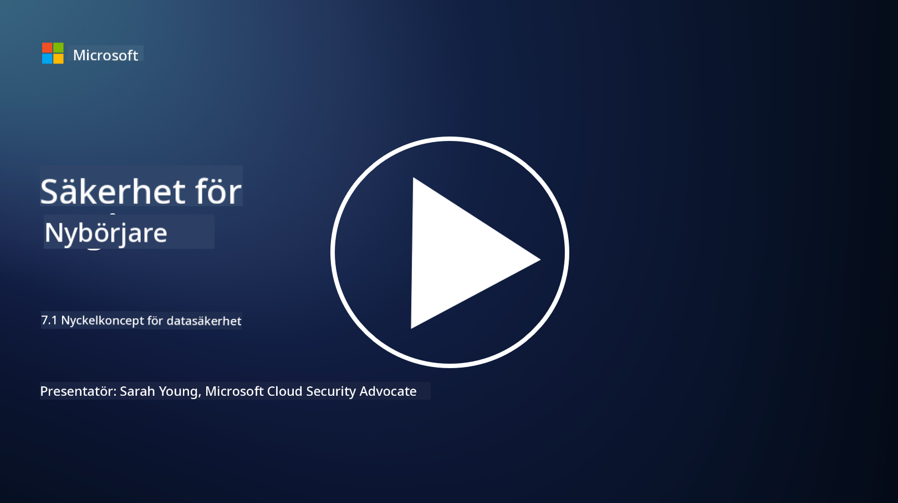

<!--
CO_OP_TRANSLATOR_METADATA:
{
  "original_hash": "9703868f41dcddd5a98dea9ea6fcd94d",
  "translation_date": "2025-09-03T23:57:02+00:00",
  "source_file": "7.1 Data security key concepts.md",
  "language_code": "sv"
}
-->
# Nyckelkoncept för datasäkerhet

Vi har nämnt datasäkerhet och berört ämnet flera gånger under kursen. Nu ska vi fördjupa oss i detta ämne. I denna lektion kommer du att lära dig:

- Vad är datasäkerhet?

- Vad är dataklassificering?

- Vad är hantering av datalivscykel?

- Vad är Data Loss Prevention (DLP)?

- Varför är datasäkerhet viktigt för en organisation?

## Vad är datasäkerhet?

**Datasäkerhet** avser praxis att skydda digital data, såsom databaser, filer och känslig information, från obehörig åtkomst, avslöjande, ändring eller förstörelse. Det primära målet med datasäkerhet är att säkerställa datakonfidentialitet, integritet och tillgänglighet. Detta innebär att implementera en kombination av tekniska, administrativa och fysiska säkerhetsåtgärder för att skydda data mot olika hot och sårbarheter, inklusive cyberattacker, interna hot och dataintrång. Åtgärder för datasäkerhet kan inkludera kryptering, åtkomstkontroller, autentisering, granskningsspår och säkerhetspolicyer.

## Vad är dataklassificering?

**Dataklassificering** är processen att kategorisera data baserat på dess känslighet, värde och betydelse för en organisation. Syftet med dataklassificering är att hjälpa organisationer att identifiera och prioritera skyddet och hanteringen av olika typer av data. Vanliga kategorier för dataklassificering inkluderar "offentlig," "intern," "konfidentiell" och "begränsad" eller "högst konfidentiell." När data har klassificerats kan organisationer tillämpa lämpliga säkerhetskontroller och åtkomstbegränsningar för att säkerställa att känslig data skyddas tillräckligt och att efterlevnad av lagstadgade krav upprätthålls.

## Vad är hantering av datalivscykel?

**Hantering av datalivscykel** är ett strukturerat tillvägagångssätt för att hantera data genom hela dess livscykel, från skapande eller insamling till arkivering eller radering. Datalivscykeln består vanligtvis av stadier som skapande, lagring, bearbetning, överföring, arkivering och borttagning. Hantering av datalivscykel innebär att definiera policyer och procedurer för varje steg i datans livscykel, inklusive datalagring, åtkomstkontroller, säkerhetskopiering och datarensning. Effektiv hantering av datalivscykel hjälper organisationer att optimera datalagring, förbättra datakvalitet och säkerställa efterlevnad av dataskyddsregler.

## Vad är Data Loss Prevention (DLP)?

**Data Loss Prevention (DLP)** avser en uppsättning teknologier, policyer och praxis som är utformade för att förhindra obehörig åtkomst, delning eller läckage av känslig eller konfidentiell data. DLP-lösningar använder innehållsinspektion och kontextuell analys för att övervaka och kontrollera data i rörelse (t.ex. e-post, webbtrafik), data i vila (t.ex. lagrade filer och databaser) och data i användning (t.ex. data som används eller bearbetas av användare). DLP syftar till att identifiera och blockera eller kryptera känslig data för att förhindra dataintrång, följa dataskyddsregler och skydda organisationens rykte.

## Varför är datasäkerhet viktigt för en organisation?

Datasäkerhet är avgörande för organisationer av flera skäl:

- **Skydd av känslig information**: Organisationer lagrar ofta känslig data, såsom kundregister, immateriella rättigheter, finansiell data och anställdas information. Datasäkerhet skyddar denna känsliga information från obehörig åtkomst eller stöld.

- **Efterlevnad**: Många branscher och jurisdiktioner har strikta regler för dataskydd och integritet. Datasäkerhet hjälper organisationer att följa dessa lagar och undvika juridiska påföljder och skador på sitt rykte.

- **Förebyggande av dataintrång**: Dataintrång kan leda till ekonomiska förluster, skador på rykte och juridiska konsekvenser. Effektiva datasäkerhetsåtgärder hjälper till att förhindra dataintrång eller begränsa deras påverkan.

- **Bevarande av förtroende**: Kunder och intressenter litar på att organisationer hanterar deras data. Datasäkerhetsintrång underminerar förtroendet. Att upprätthålla stark datasäkerhet hjälper till att bevara förtroende och kundernas tillit.

- **Konkurrensfördel**: Att visa engagemang för datasäkerhet kan vara en konkurrensfördel. Kunder och partners är mer benägna att samarbeta med organisationer som tar datasäkerhet på allvar.

- **Operativ kontinuitet**: Datasäkerhetsåtgärder, inklusive säkerhetskopiering och katastrofåterställningsplanering, hjälper till att säkerställa tillgängligheten av kritisk data och affärskontinuitet vid dataförlust eller katastrofer.

- **Skydd mot interna hot**: Datasäkerhetsåtgärder hanterar också hot från organisationens insida, inklusive oavsiktlig dataexponering av anställda och skadliga handlingar från insiders.

Sammanfattningsvis är datasäkerhet avgörande för att skydda känslig information, följa regler, förhindra dataintrång, bevara förtroende och säkerställa organisationens fortsatta framgång och rykte.

## Vidare läsning

- [What Is Data Security? | Microsoft Security](https://www.microsoft.com/en-au/security/business/security-101/what-is-data-security?WT.mc_id=academic-96948-sayoung)
- [Automatically Classify & Protect Documents & Data | Microsoft Purview Information Protection](https://youtu.be/v8LqmzBUaOo)
- [Example data classification policy](https://www.cmu.edu/data/guidelines/data-classification.html)
- [What is Data Security? Data Security Definition and Overview | IBM](https://www.ibm.com/topics/data-security)
- [Data Lifecycle Management: A 2023 Guide for Your Business (cloudwards.net)](https://www.cloudwards.net/data-lifecycle-management/)
- [What is data loss prevention (DLP)? | Microsoft Security](https://www.microsoft.com/security/business/security-101/what-is-data-loss-prevention-dlp?WT.mc_id=academic-96948-sayoung)
- [What is DLP? How data loss prevention software works and why you need it | CSO Online](https://www.csoonline.com/article/569559/what-is-dlp-how-data-loss-prevention-software-works-and-why-you-need-it.html)

---

**Ansvarsfriskrivning**:  
Detta dokument har översatts med hjälp av AI-översättningstjänsten [Co-op Translator](https://github.com/Azure/co-op-translator). Även om vi strävar efter noggrannhet, bör du vara medveten om att automatiska översättningar kan innehålla fel eller felaktigheter. Det ursprungliga dokumentet på dess originalspråk bör betraktas som den auktoritativa källan. För kritisk information rekommenderas professionell mänsklig översättning. Vi ansvarar inte för eventuella missförstånd eller feltolkningar som uppstår vid användning av denna översättning.