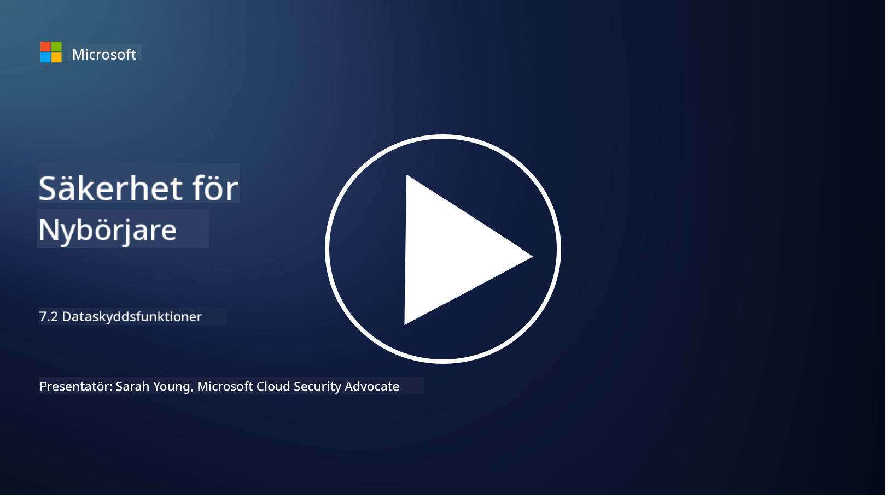

<!--
CO_OP_TRANSLATOR_METADATA:
{
  "original_hash": "50697add9758e54693442d502d2d5f8a",
  "translation_date": "2025-09-04T00:56:17+00:00",
  "source_file": "7.2 Data security capabilities.md",
  "language_code": "sv"
}
-->
# Dataskyddsfunktioner

I den här sektionen går vi igenom mer detaljer om de centrala verktygen och funktionerna som används för dataskydd:

**Introduktion**

I den här lektionen går vi igenom:

- Vad är verktyg för att förhindra dataförlust?

- Vad är verktyg för hantering av insiderrisker?

- Vilka verktyg för dataarkivering finns tillgängliga?

## Vad är verktyg för att förhindra dataförlust?

Verktyg för att förhindra dataförlust (Data Loss Prevention, DLP) syftar på en uppsättning mjukvarulösningar och teknologier som är utformade för att förhindra obehörig åtkomst, delning eller läckage av känslig eller konfidentiell data inom en organisation. Dessa verktyg använder innehållsinspektion, policyimplementering och övervakning för att identifiera och skydda känslig data från att exponeras eller missbrukas. Exempel på DLP-produkter inkluderar: Symantec Data Loss Prevention, McAfee Total Protection for Data Loss Prevention, Microsoft 365 DLP**: Integreras med Microsoft 365-applikationer för att hjälpa organisationer att identifiera och skydda känslig data i e-postmeddelanden, dokument och meddelanden.

## Vad är verktyg för hantering av insiderrisker?

Verktyg för hantering av insiderrisker hjälper organisationer att identifiera och minska risker som orsakas av anställda, konsulter eller partners som avsiktligt eller oavsiktligt kan äventyra datasäkerheten. Dessa verktyg övervakar användarbeteende, åtkomstmönster och dataanvändning för att upptäcka misstänkta aktiviteter och potentiella insiderhot. Exempel på produkter för hantering av insiderrisker inkluderar: Microsoft Insider Risk Management (del av Microsoft 365), Forcepoint Insider Threat Data Protection, Varonis Insider Threat Detection.

## Vilka verktyg för dataarkivering finns tillgängliga?

Verktyg för dataarkivering inkluderar mjukvara och lösningar som är utformade för att hantera lagring och borttagning av data i enlighet med en organisations policyer för dataarkivering och juridiska krav. Dessa verktyg hjälper till att automatisera processen för att lagra data under specifika tidsperioder och att säkert ta bort den när den inte längre behövs. Exempel på produkter för dataarkivering inkluderar: Veritas Enterprise Vault, Commvault Complete Data Protection, Microsoft data lifecycle management. Dessa lösningar hjälper organisationer att behålla kontrollen över dataarkivering och borttagning, säkerställa efterlevnad av dataskyddsregler och effektivt hantera data genom hela dess livscykel.

## Vidare läsning

- [Guide till hantering av datasäkerhetsläge (DSPM) | CSA (cloudsecurityalliance.org)](https://cloudsecurityalliance.org/blog/2023/03/31/the-big-guide-to-data-security-posture-management-dspm/)
- [Förhindra dataförlust på enheter, appar och tjänster | Microsoft Purview](https://youtu.be/hvqq8L_0kgI)
- [18 bästa verktygen för att förhindra dataförlust 2023 (gratis + betalda) (comparitech.com)](https://www.comparitech.com/data-privacy-management/data-loss-prevention-tools-software/)
- [Förhindra dataförlust (nist.gov)](https://tsapps.nist.gov/publication/get_pdf.cfm?pub_id=904672)
- [Lär dig om hantering av insiderrisker | Microsoft Learn](https://learn.microsoft.com/purview/insider-risk-management?WT.mc_id=academic-96948-sayoung)
- [Data Lifecycle Management | IBM](https://www.ibm.com/topics/data-lifecycle-management)
- [Vad är Data Lifecycle Management (DLM)? | 2023 bästa praxis (selecthub.com)](https://www.selecthub.com/big-data-analytics/data-lifecycle-management/)

---

**Ansvarsfriskrivning**:  
Detta dokument har översatts med hjälp av AI-översättningstjänsten [Co-op Translator](https://github.com/Azure/co-op-translator). Även om vi strävar efter noggrannhet, bör det noteras att automatiserade översättningar kan innehålla fel eller felaktigheter. Det ursprungliga dokumentet på dess originalspråk bör betraktas som den auktoritativa källan. För kritisk information rekommenderas professionell mänsklig översättning. Vi ansvarar inte för eventuella missförstånd eller feltolkningar som uppstår vid användning av denna översättning.