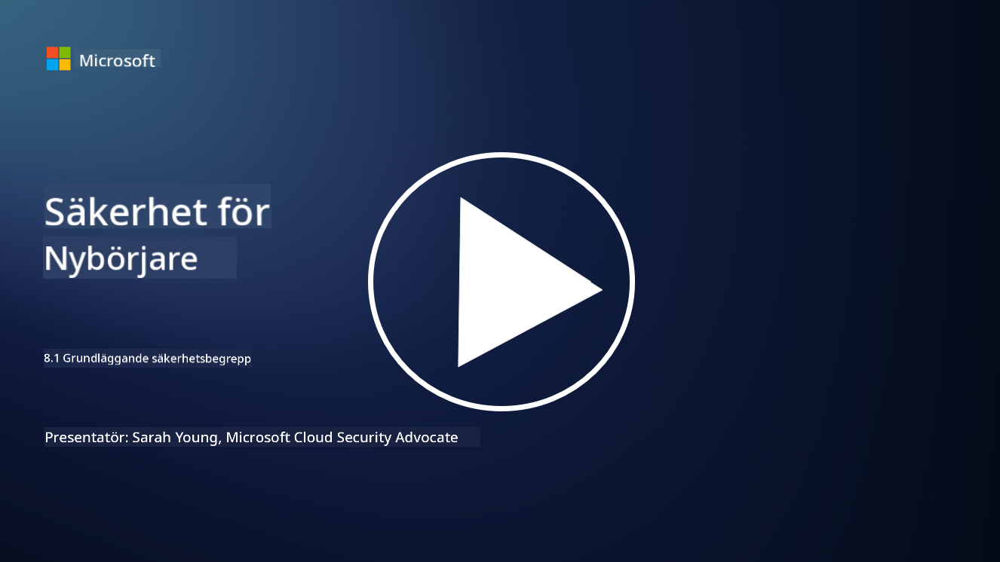

<!--
CO_OP_TRANSLATOR_METADATA:
{
  "original_hash": "66b61d96936cf25d20fcb411d4ce5227",
  "translation_date": "2025-09-03T22:48:22+00:00",
  "source_file": "8.1 AI security key concepts.md",
  "language_code": "sv"
}
-->
# AI-säkerhet: Nyckelkoncept

## Hur skiljer sig AI-säkerhet från traditionell cybersäkerhet?

Att säkra AI-system innebär unika utmaningar jämfört med traditionell cybersäkerhet, främst på grund av AI:s inlärningsförmåga och beslutsprocesser. Här är några viktiga skillnader:

-   **Dataintegritet**: AI-system är starkt beroende av data för att lära sig. [Att säkerställa integriteten hos dessa data är avgörande, eftersom angripare kan manipulera data för att påverka AI:s beteende, en metod som kallas datapåverkan (data poisoning).
-   **Modellsäkerhet**: AI:s beslutsmodell i sig kan vara ett mål. [Angripare kan försöka baklängeskonstruera modellen eller utnyttja dess svagheter för att få den att fatta felaktiga eller skadliga beslut.
-   **Adversarial Attacks**: AI-system kan vara sårbara för adversarial-attacker, där små, ofta omärkliga förändringar i indata kan få AI att göra fel eller ge felaktiga förutsägelser.
-   **Infrastruktursäkerhet**: Även om traditionell cybersäkerhet också fokuserar på att skydda infrastruktur, kan AI-system ha ytterligare lager av komplexitet, såsom molnbaserade tjänster eller specialiserad hårdvara, som kräver specifika säkerhetsåtgärder.
-   **Etiska överväganden**: Användningen av AI inom säkerhet medför etiska frågor, såsom integritetsproblem och risken för partiskhet i beslutsfattandet, som måste hanteras i säkerhetsstrategin.

Sammanfattningsvis kräver säkerhet för AI-system ett annat tillvägagångssätt som tar hänsyn till AI-teknikens unika aspekter, inklusive skydd av data, modeller och AI:s inlärningsprocess, samtidigt som de etiska implikationerna av AI-implementering beaktas.

AI-säkerhet och traditionell cybersäkerhet har många likheter, men de skiljer sig också åt på grund av de unika egenskaperna och kapaciteterna hos artificiella intelligenssystem. Här är hur de skiljer sig:

- **Hotens komplexitet**: AI-system introducerar nya lager av komplexitet i cybersäkerhet. Traditionell cybersäkerhet hanterar främst hot som skadlig kod, nätfiskeattacker och nätverksintrång. AI-system kan dock vara sårbara för attacker som adversarial-attacker, datapåverkan och modellundvikande, som specifikt riktar sig mot maskininlärningsalgoritmerna själva.

- **Angreppsytan**: AI-system har ofta större angreppsytor jämfört med traditionella system. Detta beror på att de inte bara är beroende av mjukvara utan också av data och modeller. Angripare kan rikta in sig på träningsdata, manipulera modeller eller utnyttja sårbarheter i algoritmerna själva.

- **Hotens anpassningsförmåga**: AI-system kan anpassa sig och lära sig från sin omgivning, vilket kan göra dem mer mottagliga för adaptiva och utvecklande hot. Traditionella cybersäkerhetsåtgärder kanske inte räcker för att försvara mot attacker som ständigt utvecklas baserat på AI-systemets beteende.

- **Tolkbarhet och förklarbarhet**: Att förstå varför ett AI-system fattade ett visst beslut är ofta mer utmanande jämfört med traditionella mjukvarusystem. Denna brist på tolkbarhet och förklarbarhet kan göra det svårt att upptäcka och hantera attacker mot AI-system på ett effektivt sätt.

- **Dataintegritetsproblem**: AI-system är ofta beroende av stora mängder data, vilket kan medföra integritetsrisker om de inte hanteras korrekt. Traditionella cybersäkerhetsåtgärder kanske inte tillräckligt adresserar dessa dataintegritetsproblem som är specifika för AI-system.

- **Regulatorisk efterlevnad**: Den regulatoriska miljön för AI-säkerhet utvecklas fortfarande, med specifika regler och standarder som framträder för att hantera de unika utmaningar som AI-system innebär. Traditionella cybersäkerhetsramverk kan behöva utökas eller anpassas för att säkerställa efterlevnad av dessa nya regler.

- **Etiska överväganden**: AI-säkerhet handlar inte bara om att skydda system från skadliga attacker utan också om att säkerställa att AI-system används på ett etiskt och ansvarsfullt sätt. Detta inkluderar överväganden som rättvisa, transparens och ansvarsskyldighet, som kanske inte är lika framträdande inom traditionell cybersäkerhet.

## Hur är AI-säkerhet lik traditionell IT-säkerhet?

Att säkra AI-system delar flera grundläggande principer med traditionell cybersäkerhet:

-   **Hotsskydd**: Både AI- och traditionella system måste skyddas mot obehörig åtkomst, datamodifiering och förstörelse, samt andra vanliga hot.
-   **Sårbarhetshantering**: Många sårbarheter som påverkar traditionella system, såsom mjukvarubuggar eller felkonfigurationer, kan också påverka AI-system.
-   **Datasäkerhet**: Skyddet av bearbetade data är avgörande i båda områdena för att förhindra dataintrång och säkerställa konfidentialitet.
-   **Leverantörskedjans säkerhet**: Båda typer av system är sårbara för attacker mot leverantörskedjan, där en komprometterad komponent kan undergräva säkerheten för hela systemet.

Dessa likheter visar att även om AI-system introducerar nya säkerhetsutmaningar, kräver de också tillämpning av etablerade cybersäkerhetsmetoder för att säkerställa ett robust skydd. Det handlar om att kombinera traditionell säkerhetskunskap med anpassning till AI-teknikens unika aspekter.

## Vidare läsning

 - [Not with a Bug, But with a Sticker [Book] (oreilly.com)](https://www.oreilly.com/library/view/not-with-a/9781119883982/)
   
 - [Intro to AI Security Part 1: AI Security 101 | by HarrietHacks | Medium](https://medium.com/@harrietfarlow/intro-to-ai-security-part-1-ai-security-101-b8662a9efe5)
   
- [Best practices for AI security risk management | Microsoft Security Blog](https://www.microsoft.com/en-us/security/blog/2021/12/09/best-practices-for-ai-security-risk-management/?WT.mc_id=academic-96948-sayoung)
   
- [OWASP AI Security and Privacy Guide | OWASP Foundation](https://owasp.org/www-project-ai-security-and-privacy-guide/)

---

**Ansvarsfriskrivning**:  
Detta dokument har översatts med hjälp av AI-översättningstjänsten [Co-op Translator](https://github.com/Azure/co-op-translator). Även om vi strävar efter noggrannhet, bör det noteras att automatiserade översättningar kan innehålla fel eller brister. Det ursprungliga dokumentet på dess originalspråk bör betraktas som den auktoritativa källan. För kritisk information rekommenderas professionell mänsklig översättning. Vi ansvarar inte för eventuella missförstånd eller feltolkningar som uppstår vid användning av denna översättning.