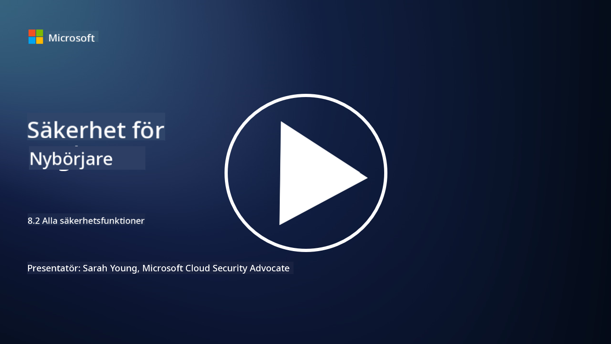

<!--
CO_OP_TRANSLATOR_METADATA:
{
  "original_hash": "b6bb7175672298d1e2f73ba7e0006f95",
  "translation_date": "2025-09-04T01:05:29+00:00",
  "source_file": "8.2 AI security capabilities.md",
  "language_code": "sv"
}
-->
# AI-säkerhetsfunktioner

## Vilka verktyg och funktioner har vi för att säkra AI-system idag?

För närvarande finns det flera verktyg och funktioner tillgängliga för att säkra AI-system:

-   **Counterfit**: Ett open-source automatiseringsverktyg för säkerhetstestning av AI-system, utformat för att hjälpa organisationer att genomföra riskbedömningar för AI-säkerhet och säkerställa algoritmernas robusthet.
-   **Verktyg för Adversarial Machine Learning**: Dessa verktyg utvärderar robustheten hos maskininlärningsmodeller mot adversarial attacker, vilket hjälper till att identifiera och åtgärda sårbarheter.
-   **AI-säkerhetsverktyg**: Det finns open-source verktyg som erbjuder resurser för att säkra AI-system, inklusive bibliotek och ramverk för att implementera säkerhetsåtgärder.
-   **Samarbetsplattformar**: Partnerskap mellan företag och AI-gemenskaper för att utveckla AI-specifika säkerhetsskannrar och andra verktyg för att säkra AI-leveranskedjan.

Dessa verktyg och funktioner är en del av ett växande område som syftar till att förbättra säkerheten för AI-system mot olika hot. De representerar en kombination av forskning, praktiska verktyg och branschsamverkan som adresserar de unika utmaningar som AI-teknologier medför.

## Vad gäller AI-red teaming? Hur skiljer det sig från traditionell säkerhetsred teaming?

AI-red teaming skiljer sig från traditionell säkerhetsred teaming på flera viktiga sätt:

-   **Fokus på AI-system**: AI-red teaming riktar sig specifikt mot de unika sårbarheterna hos AI-system, såsom maskininlärningsmodeller och datapipelines, snarare än traditionell IT-infrastruktur.
-   **Testning av AI-beteende**: Det innebär att testa hur AI-system reagerar på ovanliga eller oväntade indata, vilket kan avslöja sårbarheter som kan utnyttjas av angripare.
-   **Utforskning av AI-fel**: AI-red teaming undersöker både skadliga och ofarliga fel, och tar hänsyn till ett bredare spektrum av scenarier och potentiella systemfel utöver bara säkerhetsintrång.
-   **Prompt Injection och innehållsgenerering**: AI-red teaming inkluderar även att undersöka fel som prompt injection, där angripare manipulerar AI-system för att generera skadligt eller ogrundat innehåll.
-   **Etisk och ansvarsfull AI**: Det är en del av att säkerställa ansvarsfull AI-design, där AI-system görs robusta mot försök att få dem att bete sig på oavsiktliga sätt.

Sammanfattningsvis är AI-red teaming en utökad praxis som inte bara täcker säkerhetssårbarheter utan även testar för andra typer av systemfel som är specifika för AI-teknologier. Det är en viktig del av att utveckla säkrare AI-system genom att förstå och hantera nya risker som är förknippade med AI-implementering.

## Vidare läsning

 - [Microsoft AI Red Team bygger framtiden för säkrare AI | Microsoft Security Blog](https://www.microsoft.com/en-us/security/blog/2023/08/07/microsoft-ai-red-team-building-future-of-safer-ai/?WT.mc_id=academic-96948-sayoung)
 - [Tillkännager Microsofts öppna automatiseringsramverk för att red team generativa AI-system | Microsoft Security Blog](https://www.microsoft.com/en-us/security/blog/2024/02/22/announcing-microsofts-open-automation-framework-to-red-team-generative-ai-systems/?WT.mc_id=academic-96948-sayoung)
 - [AI-säkerhetsverktyg: Open-Source Toolkit | Wiz](https://www.wiz.io/academy/ai-security-tools)

---

**Ansvarsfriskrivning**:  
Detta dokument har översatts med hjälp av AI-översättningstjänsten [Co-op Translator](https://github.com/Azure/co-op-translator). Även om vi strävar efter noggrannhet, vänligen notera att automatiska översättningar kan innehålla fel eller felaktigheter. Det ursprungliga dokumentet på sitt ursprungliga språk bör betraktas som den auktoritativa källan. För kritisk information rekommenderas professionell mänsklig översättning. Vi ansvarar inte för eventuella missförstånd eller feltolkningar som uppstår vid användning av denna översättning.