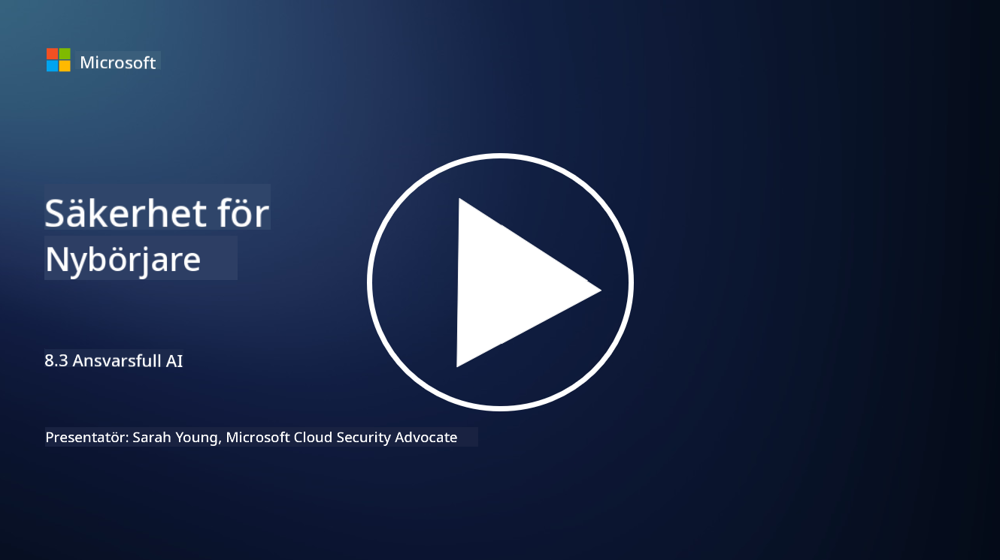

<!--
CO_OP_TRANSLATOR_METADATA:
{
  "original_hash": "5e9775ee91bde7d44577891d5f11c4c5",
  "translation_date": "2025-09-04T00:05:35+00:00",
  "source_file": "8.3 Responsible AI.md",
  "language_code": "sv"
}
-->
# Ansvarsfull AI

## Vad är ansvarsfull AI och hur relaterar det till AI-säkerhet?

Ansvarsfull AI handlar om att utveckla och använda artificiell intelligens på ett sätt som är etiskt, transparent och i linje med samhälleliga värderingar. Det omfattar principer som rättvisa, ansvarstagande och robusthet, och säkerställer att AI-system är utformade och drivs för att gynna individer, samhällen och samhället i stort.

Relationen mellan ansvarsfull AI och AI-säkerhet är betydande eftersom:

-   **Etiska överväganden**: Ansvarsfull AI innefattar etiska aspekter som direkt påverkar säkerheten, såsom integritet och dataskydd. Att säkerställa att AI-system respekterar användarnas integritet och skyddar personlig data är en central del av ansvarsfull AI.
-   **Robusthet och tillförlitlighet**: AI-system måste vara robusta mot manipulation och attacker, vilket är en kärnprincip för både ansvarsfull AI och AI-säkerhet. Detta inkluderar skydd mot fientliga attacker och att säkerställa integriteten i AI:s beslutsprocesser.
-   **Transparens och förklarbarhet**: En del av ansvarsfull AI är att säkerställa att AI-system är transparenta och att deras beslut kan förklaras. Detta är avgörande för säkerheten, eftersom intressenter behöver förstå hur AI-system fungerar för att kunna lita på deras säkerhetsåtgärder.
-   **Ansvarstagande**: AI-system bör vara ansvariga för sina handlingar, vilket innebär att det måste finnas mekanismer för att spåra beslut och åtgärda eventuella problem. Detta överensstämmer med säkerhetspraxis som övervakar och granskar systemaktiviteter för att förebygga och hantera intrång.

Sammanfattningsvis är ansvarsfull AI och AI-säkerhet sammanflätade, där ansvarsfulla AI-principer stärker säkerheten i AI-system och vice versa. Genom att implementera principer för ansvarsfull AI skapas system som inte bara är etiskt hållbara utan också mer motståndskraftiga mot potentiella hot.

## Hur kan jag säkerställa att mitt AI-system är både säkert och etiskt?

Att säkerställa att ditt AI-system är både säkert och etiskt kräver ett mångsidigt tillvägagångssätt som inkluderar följande steg:

- **Följ etiska principer**: Följ etablerade etiska riktlinjer som betonar mänskligt, samhälleligt och miljömässigt välbefinnande; rättvisa; skydd av integritet; tillförlitlighet; transparens; möjlighet till ifrågasättande; och ansvarstagande.

- **Implementera robusta säkerhetsåtgärder**: Använd proaktiva säkerhetstester och program för AI-tillit, risk- och säkerhetshantering för att skydda mot hot och sårbarheter.

- **Involvera olika intressenter**: Inkludera en bred grupp deltagare i AI-utvecklingsprocessen, inklusive etiker, samhällsvetare och representanter från berörda samhällen, för att säkerställa att olika perspektiv och värderingar beaktas.

- **Säkerställ transparens och förklarbarhet**: Se till att AI:s beslutsprocesser är transparenta och kan förklaras, vilket skapar större förtroende och gör det lättare att identifiera potentiella fördomar eller fel.

- **Skydda dataintegritet**: Skydda integriteten och äktheten hos data genom kryptering och andra dataskyddsåtgärder för att respektera användarnas rätt till integritet.

- **Möjliggör mänsklig övervakning**: Implementera mekanismer för mänsklig övervakning för att möjliggöra ifrågasättande av beslut som fattas av AI-system och för att säkerställa ansvarstagande.

- **Håll dig uppdaterad om AI-säkerhet**: Håll dig informerad om den senaste forskningen och diskussionerna kring AI-säkerhet för att förstå det föränderliga landskapet inom AI-säkerhet och etik.

- **Följ lagar och regler**: Säkerställ att ditt AI-system följer alla relevanta lagar och regler, vilket kan inkludera dataskyddslagar, antidiskrimineringslagar och branschspecifika riktlinjer.

## Kan du ge några exempel på säkerhetsproblem som orsakas av oetisk användning av AI?

Här är några exempel på säkerhetsproblem som kan uppstå vid oetisk användning av AI:

- **Partiska beslut**: AI-system kan förstärka och förvärra befintliga fördomar om de tränas på partiska datamängder. Till exempel, om en sökmotor tränas på data som speglar samhälleliga stereotyper, kan den visa partiska sökresultat, vilket kan leda till orättvis behandling eller diskriminering.

- **AI i rättssystemet**: Användningen av AI i juridiska beslut kan väcka etiska frågor, särskilt om AI:s beslutsprocess saknar transparens eller påverkas av partiska data. Detta kan leda till orättvisa rättsliga utfall och kränka individers rättigheter.

- **Manipulation av AI-system**: AI-system kan vara sårbara för fientliga attacker, där små ändringar i indata kan orsaka felaktiga resultat. Till exempel kan autonoma fordon luras att misstolka trafikskyltar, vilket kan leda till säkerhetsrisker.

- **AI-driven övervakning**: Användningen av AI för övervakning kan leda till integritetskränkningar, särskilt om det används utan korrekt samtycke eller på sätt som inskränker individers friheter. Detta kan vara särskilt problematiskt i auktoritära regimer som kan använda AI för att övervaka och undertrycka oliktänkande.

Dessa exempel belyser vikten av etiska överväganden vid utveckling och implementering av AI-system för att förhindra säkerhetsproblem och skydda individers rättigheter och integritet.

## Vidare läsning

 - [Microsoft Responsible AI Standard v2 General Requirements](https://query.prod.cms.rt.microsoft.com/cms/api/am/binary/RE5cmFl?culture=en-us&country=us&WT.mc_id=academic-96948-sayoung)
 - [Responsible AI (mit.edu)](https://sloanreview.mit.edu/big-ideas/responsible-ai/)
 - [13 Principles for Using AI Responsibly (hbr.org)](https://hbr.org/2023/06/13-principles-for-using-ai-responsibly)

---

**Ansvarsfriskrivning**:  
Detta dokument har översatts med hjälp av AI-översättningstjänsten [Co-op Translator](https://github.com/Azure/co-op-translator). Även om vi strävar efter noggrannhet, vänligen notera att automatiska översättningar kan innehålla fel eller felaktigheter. Det ursprungliga dokumentet på dess originalspråk bör betraktas som den auktoritativa källan. För kritisk information rekommenderas professionell mänsklig översättning. Vi ansvarar inte för eventuella missförstånd eller feltolkningar som uppstår vid användning av denna översättning.