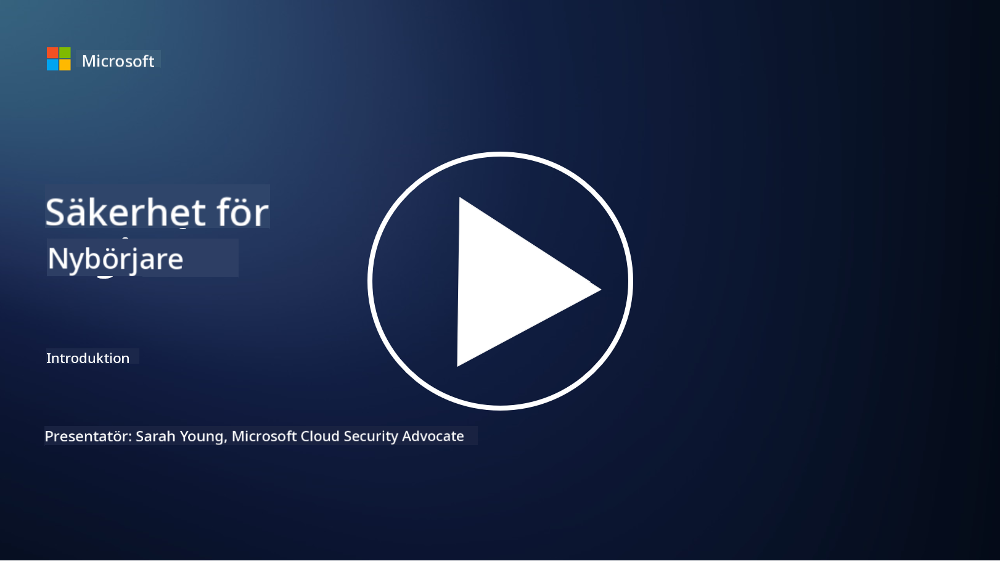

<!--
CO_OP_TRANSLATOR_METADATA:
{
  "original_hash": "79a7e63fa60f649eb3560e1cd7246272",
  "translation_date": "2025-11-18T17:30:12+00:00",
  "source_file": "README.md",
  "language_code": "sv"
}
-->

### 🌐 Stöd för flera språk

#### Stöds via GitHub Action (Automatiserat & Alltid Uppdaterat)

<!-- CO-OP TRANSLATOR LANGUAGES TABLE START -->
[Arabiska](../ar/README.md) | [Bengali](../bn/README.md) | [Bulgariska](../bg/README.md) | [Burmesiska (Myanmar)](../my/README.md) | [Kinesiska (Förenklad)](../zh/README.md) | [Kinesiska (Traditionell, Hongkong)](../hk/README.md) | [Kinesiska (Traditionell, Macau)](../mo/README.md) | [Kinesiska (Traditionell, Taiwan)](../tw/README.md) | [Kroatiska](../hr/README.md) | [Tjeckiska](../cs/README.md) | [Danska](../da/README.md) | [Holländska](../nl/README.md) | [Estniska](../et/README.md) | [Finska](../fi/README.md) | [Franska](../fr/README.md) | [Tyska](../de/README.md) | [Grekiska](../el/README.md) | [Hebreiska](../he/README.md) | [Hindi](../hi/README.md) | [Ungerska](../hu/README.md) | [Indonesiska](../id/README.md) | [Italienska](../it/README.md) | [Japanska](../ja/README.md) | [Koreanska](../ko/README.md) | [Litauiska](../lt/README.md) | [Malajiska](../ms/README.md) | [Marathi](../mr/README.md) | [Nepalesiska](../ne/README.md) | [Nigeriansk Pidgin](../pcm/README.md) | [Norska](../no/README.md) | [Persiska (Farsi)](../fa/README.md) | [Polska](../pl/README.md) | [Portugisiska (Brasilien)](../br/README.md) | [Portugisiska (Portugal)](../pt/README.md) | [Punjabi (Gurmukhi)](../pa/README.md) | [Rumänska](../ro/README.md) | [Ryska](../ru/README.md) | [Serbiska (Kyrilliska)](../sr/README.md) | [Slovakiska](../sk/README.md) | [Slovenska](../sl/README.md) | [Spanska](../es/README.md) | [Swahili](../sw/README.md) | [Svenska](./README.md) | [Tagalog (Filippinska)](../tl/README.md) | [Tamil](../ta/README.md) | [Thailändska](../th/README.md) | [Turkiska](../tr/README.md) | [Ukrainska](../uk/README.md) | [Urdu](../ur/README.md) | [Vietnamesiska](../vi/README.md)
<!-- CO-OP TRANSLATOR LANGUAGES TABLE END -->

**Om du vill ha ytterligare översättningar finns stödda språk listade [här](https://github.com/Azure/co-op-translator/blob/main/getting_started/supported-languages.md)**

#### Gå med i vår community 

# 🚀 Cybersäkerhet för nybörjare – en kursplan

I denna snabbt föränderliga tid med AI-teknikens framväxt är det ännu viktigare att förstå hur man skyddar IT-system. Den här kursen är utformad för att lära dig grundläggande koncept inom cybersäkerhet och ge dig en bra start på din säkerhetsutbildning. Kursen är leverantörsneutral och uppdelad i korta lektioner som tar cirka 30–60 minuter att genomföra. Varje lektion innehåller ett kort quiz och länkar till vidare läsning om du vill fördjupa dig i ämnet.

Vad kursen innehåller 📚

- 🔐 Grundläggande koncept inom cybersäkerhet, såsom CIA-triaden, skillnader mellan risker, hot, etc.
- 🛡️ Förståelse för vad en säkerhetskontroll är och vilka former de kan ta.
- 🌐 Förståelse för vad zero trust är och varför det är viktigt i modern cybersäkerhet.
- 🔑 Förståelse för nyckelkoncept och teman inom identitet, nätverk, säkerhetsoperationer, infrastruktur och datasäkerhet.
- 🔧 Exempel på verktyg som används för att implementera säkerhetskontroller.

Vad kursen inte innehåller 🙅‍♂️

- 🚫 Hur man använder specifika säkerhetsverktyg.
- 🚫 Hur man "hackar" eller utför red teaming/offensiv säkerhet.
- 🚫 Kunskap om specifika efterlevnadsstandarder.

När du har avslutat den här kursen kan du gå vidare till några av våra Microsoft Learn-moduler. Vi rekommenderar att du fortsätter din utbildning med [Microsoft Security, Compliance, and Identity Fundamentals.](https://learn.microsoft.com/training/paths/describe-concepts-of-security-compliance-identity/?WT.mc_id=academic-96948-sayoung) 

Slutligen kan du överväga att ta [Exam SC-900: Microsoft Security, Compliance, and Identity Fundamentals exam.](https://learn.microsoft.com/credentials/certifications/exams/sc-900/?WT.mc_id=academic-96948-sayoung)

> 💁 Om du har feedback eller förslag på den här kursen och innehåll som saknas, vill vi gärna höra från dig!

## Modulöversikt 📝 
| **Modulnummer** | **Modulnamn**                           | **Koncept som lärs ut**                  | **Lärandemål**                                                                                          |
|-------------------|-------------------------------------------|--------------------------------------|-----------------------------------------------------------------------------------------------------------------|
| **1.1**           | Grundläggande säkerhetskoncept                   | [CIA-triaden](https://github.com/microsoft/Security-101/blob/main/1.1%20The%20CIA%20triad%20and%20other%20key%20concepts.md)                        | Lär dig om konfidentialitet, tillgänglighet och integritet. Även autenticitet, oavvislighet och integritetsskydd. |
| **1.2**           | Grundläggande säkerhetskoncept                   | [Vanliga cybersäkerhetshot](https://github.com/microsoft/Security-101/blob/main/1.2%20Common%20cybersecurity%20threats.md)        | Lär dig om vanliga cybersäkerhetshot som individer och organisationer står inför.                             |
| **1.3**           | Grundläggande säkerhetskoncept                   | [Förstå riskhantering](https://github.com/microsoft/Security-101/blob/main/1.3%20Understanding%20risk%20management.md)       | Lär dig att bedöma och förstå risk – påverkan/sannolikhet och implementering av kontroller.                                                                                                               | |
| **1.4**           | Grundläggande säkerhetskoncept                   | [Säkerhetsrutiner och dokumentation](https://github.com/microsoft/Security-101/blob/main/1.4%20Security%20practices%20and%20documentation.md) | Lär dig skillnaden mellan policyer, procedurer, standarder och regler/lagar.                         |
| **1.5**           | Grundläggande säkerhetskoncept                   | [Zero trust](https://github.com/microsoft/Security-101/blob/main/1.5%20Zero%20trust.md)                           | Lär dig vad zero trust är och hur det påverkar arkitektur. Vad är försvar i flera lager?                   |
| **1.6**           | Grundläggande säkerhetskoncept                   | [Modellen för delat ansvar](https://github.com/microsoft/Security-101/blob/main/1.6%20Shared%20responsibility%20model.md)                           | Vad är modellen för delat ansvar och hur påverkar den cybersäkerhet?                  |
| **1.7**           | [Slutquiz för modulen](https://github.com/microsoft/Security-101/blob/main/1.7%20End%20of%20module%20quiz.md)                        |                                      |                                                                                                                 |
| **2.1**           | Grundläggande identitets- och åtkomsthantering | [IAM nyckelkoncept](https://github.com/microsoft/Security-101/blob/main/2.1%20IAM%20key%20concepts.md)                     | Lär dig om principen om minsta privilegium, arbetsuppdelning, hur IAM stödjer zero trust.               |
| **2.2**           | Grundläggande identitets- och åtkomsthantering | [IAM zero trust-arkitektur](https://github.com/microsoft/Security-101/blob/main/2.2%20IAM%20zero%20trust%20architecture.md)          | Lär dig om hur identitet är den nya gränsen för moderna IT-miljöer och hoten den motverkar.          |
| **2.3**           | Grundläggande identitets- och åtkomsthantering | [IAM kapabiliteter](https://github.com/microsoft/Security-101/blob/main/2.3%20IAM%20capabilities.md)                     | Lär dig om IAM kapabiliteter och kontroller för att säkra identiteter                                                  |
| **2.4**           | [Slutquiz för modulen](https://github.com/microsoft/Security-101/blob/main/2.4%20End%20of%20module%20quiz.md)                        |                                      |                                                                                                                 |
| **3.1**           | Grundläggande nätverkssäkerhet             | [Nyckelkoncept inom nätverk](https://github.com/microsoft/Security-101/blob/main/3.1%20Networking%20key%20concepts.md)              | Lär dig om nätverkskoncept (IP-adressering, portnummer, kryptering, etc.)                                 |
| **3.2**           | Grundläggande nätverkssäkerhet             | [Nätverk zero trust-arkitektur](https://github.com/microsoft/Security-101/blob/main/3.2%20Networking%20zero%20trust%20architecture.md)   | Lär dig om hur nätverk bidrar till en E2E ZT-arkitektur och hoten den motverkar.                  |
| **3.3**           | Grundläggande nätverkssäkerhet             | [Kapabiliteter för nätverkssäkerhet](https://github.com/microsoft/Security-101/blob/main/3.3%20Network%20security%20capabilities.md)        | Lär dig om verktyg för nätverkssäkerhet – brandväggar, WAF, DDoS-skydd, etc.                                    |
| **3.4**           | [Slutquiz för modulen](https://github.com/microsoft/Security-101/blob/main/3.4%20End%20of%20module%20quiz.md)                        |                                      |                                                                                                                 |
| **4.1**           | Grundläggande säkerhetsoperationer          | [Nyckelkoncept inom SecOps](https://github.com/microsoft/Security-101/blob/main/4.1%20SecOps%20key%20concepts.md)                  | Lär dig varför säkerhetsoperationer är viktiga och hur de skiljer sig från vanliga IT-operationsteam.                  |
| **4.2**           | Grundläggande säkerhetsoperationer          | [SecOps zero trust-arkitektur](https://github.com/microsoft/Security-101/blob/main/4.2%20SecOps%20zero%20trust%20architecture.md)       | Lär dig om hur SecOps bidrar till en E2E ZT-arkitektur och hoten den motverkar.                      |
| **4.3**           | Grundläggande säkerhetsoperationer          | [Kapabiliteter inom SecOps](https://github.com/microsoft/Security-101/blob/main/4.3%20SecOps%20capabilities.md)                  | Lär dig om verktyg för SecOps – SIEM, XDR, etc.                                                                    |
| **4.4**           | [Slutquiz för modulen](https://github.com/microsoft/Security-101/blob/main/4.4%20End%20of%20module%20quiz.md)                        |                                      |                                                                                                                 |
| **5.1**           | Grundläggande applikationssäkerhet         | [Nyckelkoncept inom AppSec](https://github.com/microsoft/Security-101/blob/main/5.1%20AppSec%20key%20concepts.md)                  | Lär dig om AppSec-koncept såsom säkerhet genom design, validering av indata, etc.                                    |
| **5.2**           | Grundläggande om applikationssäkerhet     | [AppSec-funktioner](https://github.com/microsoft/Security-101/blob/main/5.2%20AppSec%20key%20capabilities.md)                  | Lär dig om AppSec-verktyg: säkerhetsverktyg för pipelines, kodskanning, hemlighetsskanning, etc.                |
| **5.3**           | [Slutquiz för modulen](https://github.com/microsoft/Security-101/blob/main/5.3%20End%20of%20module%20quiz.md)                        |                                      |                                                                                                                 |
| **6.1**           | Grundläggande om infrastruktursäkerhet   | [Nyckelkoncept för infrastruktursäkerhet](https://github.com/microsoft/Security-101/blob/main/6.1%20Infrastructure%20security%20key%20concepts.md) | Lär dig om att härda system, patchning, säkerhetshygien, containersäkerhet.                                     |
| **6.2**           | Grundläggande om infrastruktursäkerhet   | [Funktioner för infrastruktursäkerhet](https://github.com/microsoft/Security-101/blob/main/6.2%20Infrastructure%20security%20capabilities.md) | Lär dig om verktyg som kan hjälpa till med infrastruktursäkerhet, t.ex. CSPM, containersäkerhet, etc.           |
| **6.3**           | [Slutquiz för modulen](https://github.com/microsoft/Security-101/blob/main/6.3%20End%20of%20module%20quiz.md)                        |                                      |                                                                                                                 |
| **7.1**           | Grundläggande om datasäkerhet            | [Nyckelkoncept för datasäkerhet](https://github.com/microsoft/Security-101/blob/main/7.1%20Data%20security%20key%20concepts.md)           | Lär dig om dataklassificering och lagring och varför detta är viktigt för en organisation.                      |
| **7.2**           | Grundläggande om datasäkerhet            | [Funktioner för datasäkerhet](https://github.com/microsoft/Security-101/blob/main/7.2%20Data%20security%20capabilities.md)           | Lär dig om datasäkerhetsverktyg – DLP, hantering av interna risker, datastyrning, etc.                          |
| **7.3**           | [Slutquiz för modulen](https://github.com/microsoft/Security-101/blob/main/7.3%20End%20of%20module%20quiz.md)                        |
| **8.1**           | Grundläggande om AI-säkerhet             | [Nyckelkoncept för AI-säkerhet](https://github.com/microsoft/Security-101/blob/main/8.1%20AI%20security%20key%20concepts.md)          | Lär dig om skillnader och likheter mellan traditionell säkerhet och AI-säkerhet.                                |
| **8.2**           | Grundläggande om AI-säkerhet             | [Funktioner för AI-säkerhet](https://github.com/microsoft/Security-101/blob/main/8.2%20AI%20security%20capabilities.md)           | Lär dig om AI-säkerhetsverktyg och kontroller som kan användas för att säkra AI.                                |
| **8.3**           | Grundläggande om AI-säkerhet             | [Ansvarsfull AI](https://github.com/microsoft/Security-101/blob/main/8.3%20Responsible%20AI.md)          | Lär dig om vad ansvarsfull AI är och AI-specifika skador som säkerhetsproffs behöver vara medvetna om.           |
| **8.4**           | [Slutquiz för modulen](https://github.com/microsoft/Security-101/blob/main/8.4%20End%20of%20module%20quiz.md)     

## 🎒 Andra kurser 

Vårt team producerar andra kurser! Kolla in:

<!-- CO-OP TRANSLATOR OTHER COURSES START -->
### Azure / Edge / MCP / Agenter

---
 
### Generativ AI-serie

[-9333EA?style=for-the-badge&labelColor=E5E7EB&color=9333EA)](https://github.com/microsoft/Generative-AI-for-beginners-dotnet?WT.mc_id=academic-105485-koreyst)
[-C084FC?style=for-the-badge&labelColor=E5E7EB&color=C084FC)](https://github.com/microsoft/generative-ai-for-beginners-java?WT.mc_id=academic-105485-koreyst)
[-E879F9?style=for-the-badge&labelColor=E5E7EB&color=E879F9)](https://github.com/microsoft/generative-ai-with-javascript?WT.mc_id=academic-105485-koreyst)

---
 
### Grundläggande lärande

---
 
### Copilot-serie

<!-- CO-OP TRANSLATOR OTHER COURSES END -->

## Få hjälp

Om du fastnar eller har frågor om att bygga AI-appar. Gå med i diskussioner med andra elever och erfarna utvecklare om MCP. Det är en stödjande community där frågor är välkomna och kunskap delas fritt.

Om du har produktfeedback eller stöter på fel under byggandet, besök:

---

<!-- CO-OP TRANSLATOR DISCLAIMER START -->
**Ansvarsfriskrivning**:  
Detta dokument har översatts med hjälp av AI-översättningstjänsten [Co-op Translator](https://github.com/Azure/co-op-translator). Även om vi strävar efter noggrannhet, bör det noteras att automatiserade översättningar kan innehålla fel eller felaktigheter. Det ursprungliga dokumentet på dess originalspråk bör betraktas som den auktoritativa källan. För kritisk information rekommenderas professionell mänsklig översättning. Vi ansvarar inte för eventuella missförstånd eller feltolkningar som uppstår vid användning av denna översättning.
<!-- CO-OP TRANSLATOR DISCLAIMER END -->