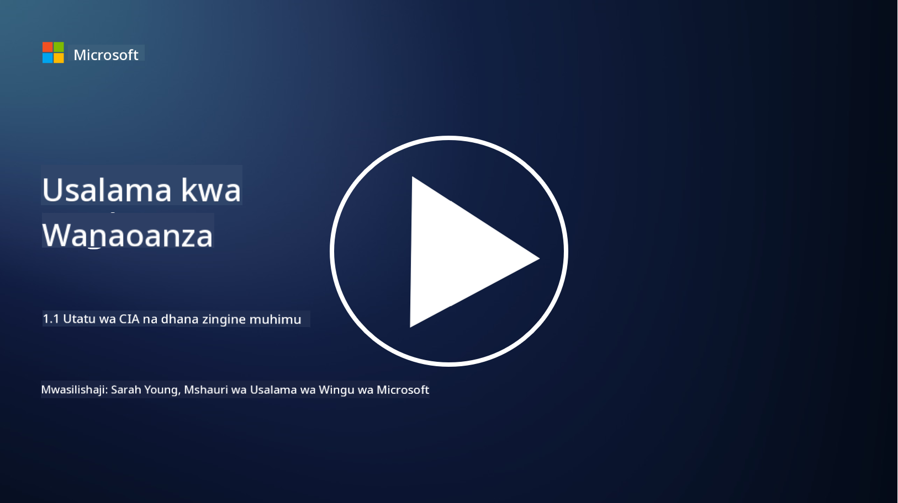
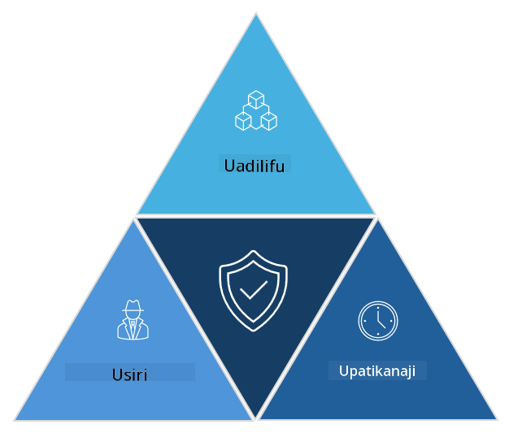

<!--
CO_OP_TRANSLATOR_METADATA:
{
  "original_hash": "16a76f9fa372fb63cffb6d76b855f023",
  "translation_date": "2025-09-04T01:11:38+00:00",
  "source_file": "1.1 The CIA triad and other key concepts.md",
  "language_code": "sw"
}
-->
# Utatu wa CIA na dhana nyingine muhimu

## Utangulizi

Katika somo hili, tutajadili:

 - Usalama wa mtandao ni nini?
   
 - Utatu wa CIA wa usalama wa mtandao ni nini?

 - Uhalisia, kutokukana, na faragha ni nini katika muktadha wa usalama wa mtandao?

## Usalama wa mtandao ni nini?

Usalama wa mtandao, unaojulikana pia kama usalama wa taarifa, ni mazoea ya kulinda mifumo ya kompyuta, mitandao, vifaa, na data dhidi ya mashambulizi ya kidijitali, ufikiaji usioidhinishwa, uharibifu, au wizi. Lengo kuu la usalama wa mtandao ni kuhakikisha usiri, uadilifu, na upatikanaji wa mali za kidijitali na taarifa. Wataalamu wa usalama wa mtandao wanabuni na kutekeleza udhibiti wa usalama ili kulinda mali, data, na taarifa. Kadri maisha yetu yanavyozidi kuwa ya kidijitali na mtandaoni, usalama wa mtandao umekuwa suala la kipaumbele kwa watu binafsi na mashirika.

## Utatu wa CIA wa usalama wa mtandao ni nini?

Utatu wa usalama wa mtandao unahusu mfano unaojumuisha mambo matatu makuu ya kuzingatia katika kazi yoyote ya usalama wa mtandao au kubuni mfumo/mazingira:

### Usiri

Hili ni jambo ambalo watu wengi wanalifahamu wanapofikiria "usalama wa mtandao": usiri ni mchakato wa kulinda data na taarifa dhidi ya majaribio ya ufikiaji usioidhinishwa, yaani, ni watu tu wanaohitaji kuona taarifa ndio wanapaswa kuweza kuifikia. Hata hivyo, si data zote zina thamani sawa, na data kwa kawaida huainishwa na kulindwa kulingana na kiwango cha madhara yanayoweza kutokea ikiwa itafikiwa na watu wasio sahihi.

### Uadilifu

Hii inahusu kulinda usahihi na uaminifu wa data iliyo ndani ya mazingira na kuhakikisha kuwa data haibadilishwi au kurekebishwa na watu wasioidhinishwa. Kwa mfano, mwanafunzi anapobadilisha tarehe yake ya kuzaliwa kwenye rekodi ya leseni ya udereva katika DMV ili kuonekana mzee zaidi na kupata leseni mpya yenye tarehe ya kuzaliwa ya awali ili kununua pombe.

### Upatikanaji

Hili ni jambo la kuzingatia katika IT ya uendeshaji, lakini upatikanaji pia ni muhimu kwa usalama wa mtandao. Kuna aina maalum za mashambulizi yanayolenga upatikanaji ambayo wataalamu wa usalama wanapaswa kuyazuia (kwa mfano, mashambulizi ya kukataa huduma yaliyosambazwa – DDoS).

**Utatu wa CIA wa Usalama wa Mtandao**

## Uhalisia, kutokukana, na faragha ni nini katika muktadha wa usalama wa mtandao?

Hizi ni dhana za ziada muhimu zinazohusiana na kuhakikisha usalama na uaminifu wa mifumo na data:

**Uhalisia** - inahusu uhakikisho kwamba taarifa, mawasiliano, au chombo unachoshughulika nacho ni halisi na hakijaharibiwa au kurekebishwa na wahusika wasioidhinishwa.

**Kutokukana** - ni dhana ya kuhakikisha kwamba mhusika hawezi kukataa ushiriki wao au uhalisia wa muamala au mawasiliano. Inazuia mtu kudai kwamba hawakutuma ujumbe au kufanya kitendo fulani wakati kuna ushahidi wa kinyume.

**Faragha** - inahusu ulinzi wa taarifa nyeti na zinazotambulika binafsi dhidi ya ufikiaji, matumizi, ufichuzi, au uharibifu usioidhinishwa. Inahusisha kudhibiti ni nani anaweza kufikia data binafsi na jinsi data hiyo inavyokusanywa, kuhifadhiwa, na kushirikiwa.

## Kusoma zaidi

[What Is Information Security (InfoSec)? | Microsoft Security](https://www.microsoft.com/security/business/security-101/what-is-information-security-infosec#:~:text=Three%20pillars%20of%20information%20security%3A%20the%20CIA%20triad,as%20guiding%20principles%20for%20implementing%20an%20InfoSec%20plan.)

---

**Kanusho**:  
Hati hii imetafsiriwa kwa kutumia huduma ya tafsiri ya AI [Co-op Translator](https://github.com/Azure/co-op-translator). Ingawa tunajitahidi kwa usahihi, tafadhali fahamu kuwa tafsiri za kiotomatiki zinaweza kuwa na makosa au kutokuwa sahihi. Hati ya asili katika lugha yake ya awali inapaswa kuzingatiwa kama chanzo cha mamlaka. Kwa taarifa muhimu, inashauriwa kutumia huduma ya tafsiri ya kitaalamu ya binadamu. Hatutawajibika kwa maelewano mabaya au tafsiri zisizo sahihi zinazotokana na matumizi ya tafsiri hii.