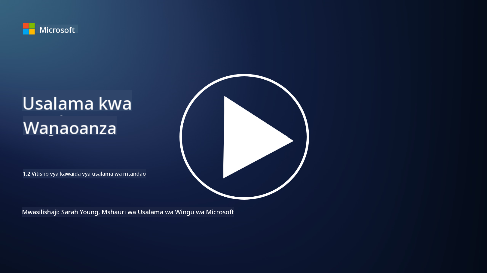

<!--
CO_OP_TRANSLATOR_METADATA:
{
  "original_hash": "6fc3030323139d7134a4ca9d03eccac9",
  "translation_date": "2025-09-03T23:27:49+00:00",
  "source_file": "1.2 Common cybersecurity threats.md",
  "language_code": "sw"
}
-->
# Vitisho vya kawaida vya usalama wa mtandao

## Utangulizi

Katika somo hili, tutajadili:

- Vitisho vya usalama wa mtandao ni nini?

- Kwa nini wahalifu wa mtandao wanataka kuhujumu data na mifumo ya IT?

- Ni aina gani za vitisho vya usalama wa mtandao zinazojulikana zaidi?

- Mfumo wa MITRE ATT&CK ni nini?

- Wapi unaweza kufuatilia hali ya vitisho vya usalama wa mtandao?

## Vitisho vya usalama wa mtandao ni nini?

Tishio la usalama wa mtandao linahusu hatari yoyote inayoweza kuhatarisha usiri, uadilifu, au upatikanaji wa data au mifumo ya IT. Vitisho hivi vinatokana na wahalifu wa mtandao wanaojaribu kutumia udhaifu ili kupata ufikiaji usioidhinishwa, kuiba taarifa nyeti, kuvuruga shughuli, au kusababisha madhara kwa watu binafsi, mashirika, au hata mataifa. Vitisho vya usalama wa mtandao vinaweza kuchukua aina mbalimbali na kulenga vipengele tofauti vya mifumo ya kidijitali na data.

## Kwa nini wahalifu wa mtandao wanataka kuhujumu data na mifumo ya IT?

Wahalifu wa mtandao huhujumu data na mifumo ya IT kwa sababu mbalimbali, mara nyingi wakichochewa na faida binafsi, malengo ya kiitikadi, au hamu ya kusababisha vurugu. Kuelewa motisha hizi kunaweza kusaidia mashirika na watu binafsi kujilinda vyema dhidi ya vitisho vya mtandao. Sababu za kawaida za wahalifu wa mtandao kufanya mashambulizi ni pamoja na:

1. **Faida ya Kifedha**: Mashambulizi mengi huchochewa na hamu ya kupata faida ya kifedha. Wahalifu wa mtandao wanaweza kuiba taarifa nyeti kama namba za kadi za mkopo, maelezo ya akaunti za benki, au taarifa za kibinafsi ili kufanya udanganyifu, wizi wa utambulisho, kudai fidia, au kuuza data iliyoibiwa kwenye mtandao wa giza.

2. **Ujasusi**: Mataifa, washindani, au vyombo vingine vinaweza kushiriki katika ujasusi wa mtandao ili kuiba data nyeti ya serikali, kampuni, au utafiti kwa faida ya kisiasa, kiuchumi, au kijeshi.

3. **Vurugu na Uharibifu**: Mashambulizi mengine yanakusudia kuvuruga miundombinu muhimu, huduma, au shughuli kwa sababu za kisiasa au kiitikadi. Mashambulizi haya yanaweza kusababisha machafuko makubwa, hasara ya kifedha, na uharibifu wa sifa.

4. **Motisha za Kiitikadi**: Wahaktivisti na vikundi vyenye motisha za kiitikadi au kisiasa vinaweza kuhujumu mifumo ili kuhamasisha uelewa kuhusu masuala fulani, kukuza imani zao, au kupinga hatua au mashirika fulani.

5. **Matendo Yasiyo ya Makusudi**: Sio kila kitendo cha uhalifu wa mtandao ni cha makusudi; watu wengine wanaweza kuchangia vitisho vya mtandao bila kujua kwa kudanganywa kupitia uhandisi wa kijamii au kuwa sehemu ya mtandao uliodukuliwa.

Hatimaye, motisha za kuhujumu data na mifumo ya IT zinaweza kutofautiana sana, na athari za mashambulizi haya zinaweza kuwa mbaya. Ni muhimu kwa watu binafsi, mashirika, na serikali kuchukua usalama wa mtandao kwa uzito na kutekeleza hatua za kujilinda dhidi ya vitisho hivi.

## Ni aina gani za vitisho vya usalama wa mtandao zinazojulikana zaidi?

Kuna aina kadhaa za mashambulizi ya usalama wa mtandao ambayo wahalifu wa mtandao hutumia kuhujumu mifumo, kuiba data, na kusababisha vurugu. Hapa kuna baadhi ya aina zinazojulikana zaidi kwa wakati wa kuandika:

1. **Ulaghai wa Mtandao (Phishing)**:

Ulaghai wa mtandao unahusisha kutuma barua pepe au ujumbe wa udanganyifu unaoonekana kutoka kwa vyanzo halali ili kuwarubuni wapokeaji kufichua taarifa nyeti, kama nywila, namba za kadi za mkopo, au maelezo ya kibinafsi. Ulaghai wa mtandao pia unaweza kupeleka wahanga kwenye tovuti hatarishi au kupakua programu hasidi.

2. **Malware**:

Malware (programu hasidi) inajumuisha programu mbalimbali za hatari zilizoundwa kuambukiza mifumo, kuiba data, au kusababisha uharibifu. Aina za malware ni pamoja na:

- **Ransomware**: Husimba faili na kudai fidia ili kuzifungua.

- **Trojans**: Zinaonekana kama programu halali lakini zinawapa wahalifu ufikiaji usioidhinishwa.

- **Virusi**: Programu zinazojirudia zenyewe ambazo huambatana na faili na kuenea.

- **Worms**: Programu zinazojirudia zenyewe ambazo huenea kupitia mitandao.

3. **Mashambulizi ya Kukataa Huduma (DoS) na Kukataa Huduma Kusambazwa (DDoS)**:

Mashambulizi ya DoS hujaza mfumo lengwa na mzigo mkubwa, na kuufanya usiweze kupatikana kwa watumiaji. Mashambulizi ya DDoS yanahusisha kutumia mtandao wa vifaa vilivyodukuliwa kuujaza mfumo lengwa na trafiki, na kuufanya usifanye kazi ipasavyo au kuacha kufanya kazi kabisa.

4. **Sindano ya SQL (SQL Injection)**:

Katika shambulio hili, wahalifu hudanganya sehemu za kuingiza data za programu za wavuti ili kuingiza maswali ya SQL hatarishi, na hivyo kupata ufikiaji usioidhinishwa wa hifadhidata na data nyeti.

5. **Uandishi wa Msalaba wa Tovuti (XSS)**:

Wahalifu huingiza maandishi hatarishi kwenye programu za wavuti, ambayo hutekelezwa na vivinjari vya watumiaji wasio na shaka. Hii inaweza kusababisha wizi wa data ya mtumiaji na/au kuenea kwa programu hasidi.

6. **Uhandisi wa Kijamii**:

Uhandisi wa kijamii hutumia saikolojia ya binadamu kuwashawishi watu kufichua taarifa za siri au kufanya vitendo vinavyohatarisha usalama.

7. **Mashambulizi ya Siku Sifuri (Zero-Day Exploits)**:

Mashambulizi haya hulenga udhaifu katika programu au vifaa ambavyo bado havijajulikana na muuzaji au umma. Wahalifu hutumia udhaifu huu kabla ya viraka kutengenezwa. Ingawa mashambulizi ya siku sifuri yanatia wasiwasi, hayajazoeleka kama mashambulizi mengine kwenye orodha hii. Wakati udhaifu wa siku sifuri unagunduliwa, watafiti wa usalama hufanya kazi haraka kutengeneza viraka, na kwa hivyo mashambulizi ya siku sifuri huwa ya muda mfupi.

8. **Mashambulizi ya Hati za Kuingia (Credential Attacks)**:

Mashambulizi haya ni pamoja na mashambulizi ya nguvu ya kikatili, ambapo wahalifu wanajaribu kubahatisha nywila mara kwa mara, na mashambulizi ya kujaza hati za kuingia, ambapo hati zilizoibiwa kutoka tovuti moja zinatumika kujaribu ufikiaji kwenye tovuti nyingine.

## Mfumo wa MITRE ATT&CK ni nini?

[MITRE ATT&CK framework](https://attack.mitre.org/) (Mbinu za Kihalifu, Mbinu, na Maarifa ya Kawaida) ni mfumo unaoorodhesha na kuainisha mbinu, mbinu, na taratibu (TTPs) ambazo wahalifu hutumia wakati wa mashambulizi ya mtandao. Mfumo huu uliundwa na Shirika la MITRE, shirika lisilo la faida linaloendesha vituo vya utafiti na maendeleo kwa mashirika mbalimbali ya serikali.

Mfumo wa MITRE ATT&CK hutoa njia sanifu ya kuelezea na kuchambua vitisho vya mtandao, na hivyo kuruhusu wataalamu wa usalama wa mtandao kuelewa vyema na kujilinda dhidi ya mbinu mbalimbali za mashambulizi. Unatumiwa sana na timu za usalama, wawindaji wa vitisho, na waendeshaji wa majibu ya matukio ili:

1. **Kuelewa Tabia za Wahalifu**: Mfumo huu huandika tabia za mashambulizi halisi, ukielezea hatua ambazo wahalifu huchukua kutoka kuingia awali hadi kufanikisha malengo yao. Unashughulikia mbinu mbalimbali za mashambulizi zinazotumiwa na vikundi tofauti vya vitisho.

2. **Kupanga na Kutekeleza Mikakati ya Ulinzi**: Timu za usalama zinaweza kutumia mfumo huu kuunda mikakati ya ulinzi ya kimaendeleo inayolingana na mbinu na mbinu maalum ambazo wahalifu wanaweza kutumia.

3. **Majibu ya Matukio na Uwindaji wa Vitisho**: Wakati wa kuchunguza matukio au kufanya uwindaji wa vitisho, wataalamu wa usalama wanaweza kurejelea mfumo huu ili kutambua na kupunguza mbinu maalum zinazotumiwa na wahalifu.

Mfumo wa MITRE ATT&CK umeandaliwa katika matriki zinazogawanya mbinu za mashambulizi kulingana na majukwaa na mazingira maalum, kama Windows, macOS, Linux, na huduma za wingu. Kila matriki imegawanywa katika mbinu (malengo ya kiwango cha juu) na mbinu (njia maalum zinazotumiwa kufanikisha malengo hayo). Kwa kila mbinu, mfumo hutoa taarifa kuhusu jinsi inavyofanya kazi, njia za kupunguza, na marejeleo yanayohusiana na wahalifu halisi wa mtandao waliotumia mbinu hiyo.

Mfumo huu unasasishwa na kupanuliwa mara kwa mara kadri taarifa mpya za vitisho zinavyokusanywa na kadri hali ya usalama wa mtandao inavyobadilika. Ni rasilimali muhimu kwa kuboresha hali ya usalama wa mtandao wa shirika kwa kuwezesha uelewa wa kina wa jinsi wahalifu wanavyofanya kazi na jinsi ya kujilinda dhidi ya mbinu zao.

## Wapi unaweza kufuatilia hali ya vitisho vya usalama wa mtandao?

Kuna vyanzo vingi vinavyoweza kutumika kufuatilia vitisho vya usalama wa mtandao, hapa kuna baadhi:

- [Open Web Application Security Project (OWASP) top 10 vulnerabilities](https://owasp.org/Top10/)
- [Common Vulnerabilities and Exposures (CVEs)](https://www.bing.com/ck/a?!&&p=53df6007f017bca2JmltdHM9MTY5MjU3NjAwMCZpZ3VpZD0zYmY4N2RiYS1jYWI1LTYwMDgtMWY1YS02ZmYyY2JjNjYxZWUmaW5zaWQ9NTc2OQ&ptn=3&hsh=3&fclid=3bf87dba-cab5-6008-1f5a-6ff2cbc661ee&psq=cve&u=a1aHR0cHM6Ly9iaW5nLmNvbS9hbGluay9saW5rP3VybD1odHRwcyUzYSUyZiUyZmN2ZS5taXRyZS5vcmclMmYmc291cmNlPXNlcnAtcnImaD1BZXN4S0VBWTNnbGhNZEFpd3daMlNSZkZQNTlrODhIUnYxRUtlSkY1RTk0JTNkJnA9a2NvZmZjaWFsd2Vic2l0ZQ&ntb=1 "Common Vulnerabilities and Exposures")
- [Microsoft Security Response Center blogs](https://msrc.microsoft.com/blog/)
- [National Institute of Standards and Technology (NIST)](https://www.dhs.gov/topics/cybersecurity): NIST hutoa rasilimali, tahadhari, na masasisho ya hivi karibuni kuhusu vitisho vya usalama wa mtandao.
- [Cybersecurity and Infrastructure Security Agency (CISA)](https://www.cisa.gov/resources-tools/resources/free-cybersecurity-services-and-tools): CISA hutoa rasilimali za usalama wa mtandao na mbinu bora kwa biashara, mashirika ya serikali, na mashirika mengine. CISA hushiriki taarifa za hivi karibuni kuhusu aina za shughuli za usalama zenye athari kubwa zinazohusu jamii kwa ujumla na uchambuzi wa kina kuhusu vitisho vipya na vinavyoendelea.
- [National Cybersecurity Center of Excellence (NCCoE)](https://www.dhs.gov/topics/cybersecurity): NCCoE ni kituo kinachotoa suluhisho za usalama wa mtandao zinazoweza kutumika katika hali halisi.
- [US-CERT](https://www.cisa.gov/resources-tools/resources/free-cybersecurity-services-and-tools): Timu ya Utayari wa Kompyuta ya Dharura ya Marekani (US-CERT) hutoa rasilimali mbalimbali za usalama wa mtandao, ikiwa ni pamoja na tahadhari, vidokezo, na zaidi.
- Timu ya Dharura ya Usalama wa Mtandao ya nchi yako (CERT).

---

**Kanusho**:  
Hati hii imetafsiriwa kwa kutumia huduma ya kutafsiri ya AI [Co-op Translator](https://github.com/Azure/co-op-translator). Ingawa tunajitahidi kuhakikisha usahihi, tafadhali fahamu kuwa tafsiri za kiotomatiki zinaweza kuwa na makosa au kutokuwa sahihi. Hati ya asili katika lugha yake ya awali inapaswa kuzingatiwa kama chanzo cha mamlaka. Kwa taarifa muhimu, tafsiri ya kitaalamu ya binadamu inapendekezwa. Hatutawajibika kwa kutoelewana au tafsiri zisizo sahihi zinazotokana na matumizi ya tafsiri hii.