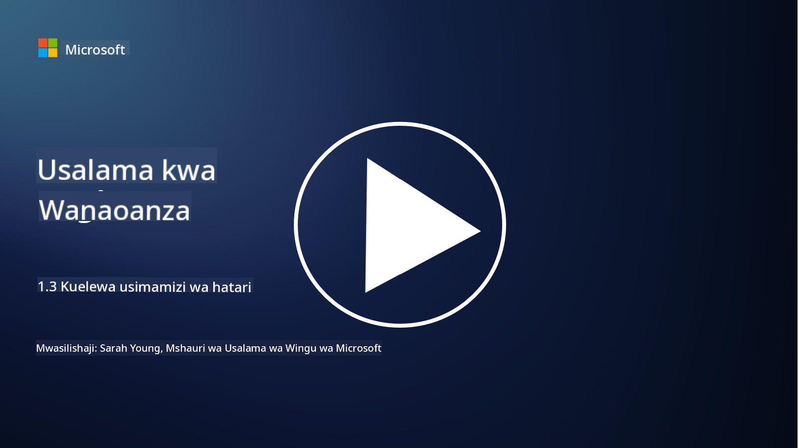
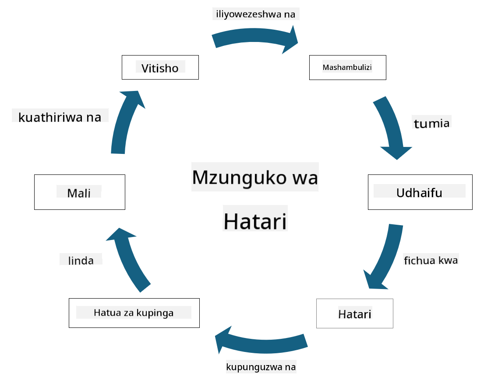

<!--
CO_OP_TRANSLATOR_METADATA:
{
  "original_hash": "fcca304f072cabf206388199e8e2e578",
  "translation_date": "2025-09-04T01:33:55+00:00",
  "source_file": "1.3 Understanding risk management.md",
  "language_code": "sw"
}
-->
# Kuelewa Usimamizi wa Hatari

## Utangulizi

Katika somo hili, tutajadili:

 - Maana ya maneno yanayotumika mara kwa mara katika usalama
   
 - Aina za udhibiti wa usalama

 - Kutathmini hatari za usalama

## Maana ya maneno yanayotumika mara kwa mara katika usalama

Maneno haya ni dhana za msingi katika uwanja wa usalama wa mtandao na usimamizi wa hatari. Hebu tuchambue kila neno na jinsi yanavyohusiana:

1. **Wakala wa Tishio**:

Wakala wa tishio ni mtu binafsi, kikundi, shirika, au mfumo wa kiotomatiki ambao una uwezo wa kutumia udhaifu katika mfumo au mtandao kusababisha madhara au uharibifu. Wakala wa tishio wanaweza kuwa wadukuzi, waandishi wa programu hasidi, wafanyakazi waliokasirika, au chombo chochote kinachoweka hatari kwa mifumo ya taarifa na teknolojia.

2. **Tishio**:

Tishio ni tukio au kitendo kinachoweza kutumia udhaifu katika mfumo na kusababisha madhara kwa rasilimali. Tishio linaweza kujumuisha vitendo kama udukuzi, uvujaji wa data, mashambulizi ya kukataa huduma, na mengineyo. Tishio ni "nini" katika muktadha wa madhara yanayoweza kusababishwa kwa rasilimali za shirika.

3. **Udhaifu**:

Udhaifu ni udhaifu au kasoro katika muundo, utekelezaji, au usanidi wa mfumo ambao unaweza kutumiwa na wakala wa tishio kuhatarisha usalama wa mfumo. Udhaifu unaweza kuwepo katika programu, vifaa, michakato, au tabia za binadamu. Kutambua na kushughulikia udhaifu ni muhimu ili kupunguza hatari ya mashambulizi kufanikiwa.

4. **Hatari**:

Hatari ni uwezekano wa hasara, madhara, au uharibifu unaotokana na mwingiliano kati ya tishio na udhaifu. Ni uwezekano kwamba wakala wa tishio atatumia udhaifu kusababisha athari mbaya. Hatari mara nyingi hutathminiwa kwa kuzingatia athari zake zinazowezekana na uwezekano wa kutokea.

5. **Rasilimali**:

Rasilimali ni kitu chochote cha thamani ambacho shirika linataka kulinda. Rasilimali zinaweza kujumuisha vitu vya kimwili (kama kompyuta na seva), data (taarifa za wateja, rekodi za kifedha), mali miliki (siri za kibiashara, hataza), na hata rasilimali watu (ujuzi na maarifa ya wafanyakazi). Kulinda rasilimali ni lengo kuu la usalama wa mtandao.

6. **Mfiduo**:

Mfiduo unahusu hali ya kuwa katika hatari ya tishio linalowezekana. Hii hutokea wakati udhaifu upo ambao unaweza kutumiwa na wakala wa tishio. Mfiduo unaonyesha hatari inayohusiana na kuwa na udhaifu katika mfumo au mtandao.

7. **Udhibiti**:

Udhibiti ni kipimo kilichowekwa ili kupunguza hatari inayohusiana na udhaifu na vitisho. Udhibiti unaweza kuwa wa kiteknolojia, wa kiutaratibu, au wa kiutawala. Udhibiti umeundwa kuzuia, kugundua, au kupunguza athari za vitisho na udhaifu. Mifano ni pamoja na firewalls, udhibiti wa ufikiaji, usimbaji wa data, sera za usalama, na mafunzo ya wafanyakazi.

Kwa muhtasari wa uhusiano kati ya maneno haya: Wakala wa tishio hutumia udhaifu kutekeleza vitisho, ambavyo vinaweza kusababisha hatari zinazoweza kusababisha madhara kwa rasilimali za thamani. Mfiduo hutokea wakati udhaifu upo, na udhibiti huwekwa ili kupunguza hatari kwa kuzuia au kupunguza athari za vitisho kwa rasilimali. Mfumo huu ndio msingi wa usimamizi wa hatari za usalama wa mtandao, unaoongoza mashirika katika kutambua, kutathmini, na kushughulikia hatari zinazoweza kutokea kwa mifumo yao ya taarifa na rasilimali.

## Aina za udhibiti wa usalama

Udhibiti wa usalama ni hatua au njia za kulinda mifumo ya taarifa na rasilimali dhidi ya vitisho na udhaifu mbalimbali. Udhibiti huu unaweza kugawanywa katika makundi kadhaa kulingana na lengo na madhumuni yake. Hapa kuna aina za kawaida za udhibiti wa usalama:

1. **Udhibiti wa Kiutawala**:

Udhibiti huu unahusiana na sera, taratibu, na miongozo inayosimamia mazoea ya usalama wa shirika na tabia za watumiaji.

- Sera na taratibu za usalama: Miongozo iliyoandikwa inayofafanua jinsi usalama unavyodumishwa ndani ya shirika.

- Uhamasishaji na mafunzo ya usalama: Programu za kuwaelimisha wafanyakazi kuhusu mazoea bora ya usalama na vitisho vinavyowezekana.

- Mwitikio na usimamizi wa matukio: Mipango ya kukabiliana na kupunguza matukio ya usalama.

2. **Udhibiti wa Kiteknolojia**:

Udhibiti wa kiteknolojia unahusisha matumizi ya teknolojia kutekeleza hatua za usalama na kulinda mifumo na data. Mifano ya udhibiti wa kiteknolojia ni:

- Udhibiti wa ufikiaji: Hatua zinazozuia ufikiaji wa rasilimali kulingana na majukumu na ruhusa za watumiaji.

- Usimbaji wa data: Kubadilisha data kuwa muundo salama ili kuzuia ufikiaji usioidhinishwa.

- Firewalls: Vifaa vya usalama wa mtandao vinavyochuja na kudhibiti trafiki inayoingia na kutoka.

- Mfumo wa Kugundua na Kuzuia Uvunjaji (IDPS): Zana zinazofuatilia trafiki ya mtandao kwa shughuli za kutiliwa shaka.

- Programu za antivirus na anti-malware: Programu zinazogundua na kuondoa programu hasidi.

- Mbinu za uthibitishaji: Njia za kuthibitisha utambulisho wa watumiaji, kama nywila, biometriki, na uthibitishaji wa vipengele vingi.

- Usimamizi wa viraka: Kusasisha programu mara kwa mara ili kushughulikia udhaifu unaojulikana.

3. **Udhibiti wa Kimwili**:

Udhibiti wa kimwili ni hatua za kulinda rasilimali za kimwili na majengo.

- Walinzi wa usalama na wafanyakazi wa udhibiti wa ufikiaji: Wafanyakazi wanaofuatilia na kudhibiti ufikiaji wa maeneo ya kimwili.

- Kamera za ufuatiliaji: Mifumo ya video ya kufuatilia na kurekodi shughuli.

- Kufuli na vizuizi vya kimwili: Hatua za kimwili za kuzuia ufikiaji wa maeneo nyeti.

- Udhibiti wa mazingira: Hatua za kudhibiti joto, unyevu, na mambo mengine ya mazingira yanayoathiri vifaa na vituo vya data.

4. **Udhibiti wa Kiutendaji**:

Udhibiti huu unahusiana na shughuli za kila siku na shughuli zinazohakikisha usalama wa mifumo unaendelea.

- Usimamizi wa mabadiliko: Michakato ya kufuatilia na kuidhinisha mabadiliko ya mifumo na usanidi.

- Hifadhi nakala na urejeshaji wa maafa: Mipango ya kuhifadhi nakala za data na kurejesha data katika hali ya kushindwa kwa mfumo au maafa.

- Kumbukumbu na ukaguzi: Kufuatilia na kurekodi shughuli za mfumo kwa madhumuni ya usalama na uzingatiaji.

- Mazoea salama ya uandishi wa programu: Miongozo ya kuandika programu ili kupunguza udhaifu.

5. **Udhibiti wa Kisheria na Kiregulatory**:

Udhibiti huu unahakikisha uzingatiaji wa sheria, kanuni, na viwango vya sekta vinavyohusika. Viwango ambavyo shirika linapaswa kuzingatia hutegemea mamlaka, sekta, na mambo mengine.

- Kanuni za ulinzi wa data: Uzingatiaji wa sheria kama GDPR, HIPAA, na CCPA.

- Viwango vya sekta maalum: Uzingatiaji wa viwango kama PCI DSS kwa usalama wa data ya kadi za malipo.

Makundi haya ya udhibiti wa usalama hufanya kazi pamoja kuunda hali ya usalama ya kina kwa mashirika, yakisaidia kulinda mifumo yao, data, na rasilimali dhidi ya vitisho mbalimbali.

## Kutathmini hatari za usalama

Baadhi ya wataalamu wa usalama wanahisi kuwa usimamizi wa hatari unapaswa kufanywa na wataalamu wa hatari pekee, lakini kuelewa mchakato wa kusimamia hatari za usalama ni muhimu kwa mtaalamu yeyote wa usalama ili kusaidia kuelezea hatari za usalama kwa lugha ambayo shirika lote linaweza kuelewa na kuchukua hatua.

Mashirika yanapaswa kutathmini hatari za usalama mara kwa mara na kuamua hatua gani (au kutokuchukua hatua) dhidi ya hatari kwa biashara. Hapa chini ni muhtasari wa jinsi mchakato huu unavyofanyika kwa kawaida. Kumbuka kuwa mchakato huu mara nyingi hufanywa na timu tofauti ndani ya shirika; ni nadra kwa timu moja kuwa na jukumu la usimamizi wa hatari kutoka mwanzo hadi mwisho.

1. **Tambua Rasilimali na Vitisho**:

Shirika linatambua rasilimali ambazo linataka kulinda. Hizi zinaweza kujumuisha data, mifumo, vifaa, programu, mali miliki, na zaidi. Kisha, wanatambua vitisho vinavyoweza kulenga rasilimali hizi.

2. **Tathmini Udhaifu**:

Mashirika yatachunguza udhaifu au mapungufu katika mifumo au michakato ambayo inaweza kutumiwa na vitisho. Udhaifu huu unaweza kutokana na kasoro za programu, usanidi mbaya, ukosefu wa udhibiti wa usalama, na makosa ya kibinadamu.

3. **Tathmini Uwezekano**:

Shirika litakadiria uwezekano wa kila tishio kutokea. Hii inahusisha kuzingatia data ya kihistoria, ujasusi wa vitisho, mwenendo wa sekta, na mambo ya ndani. Uwezekano unaweza kuwekwa katika makundi ya chini, wa kati, au wa juu kulingana na uwezekano wa tishio kutokea.

4. **Tathmini Athari**:

Kisha, shirika linaamua athari zinazowezekana za kila tishio ikiwa litatumia udhaifu. Athari zinaweza kujumuisha hasara za kifedha, usumbufu wa shughuli, uharibifu wa sifa, athari za kisheria, na zaidi. Athari pia zinaweza kuwekwa katika makundi ya chini, wa kati, au wa juu kulingana na matokeo yanayowezekana.

5. **Hesabu ya Hatari**:

Tathmini za uwezekano na athari zinachanganywa ili kuhesabu kiwango cha jumla cha hatari kwa kila tishio lililotambuliwa. Hii mara nyingi hufanywa kwa kutumia matriki ya hatari ambayo inatoa maadili ya namba au maelezo ya ubora kwa viwango vya uwezekano na athari. Kiwango cha hatari kinachotokana husaidia kupangilia vipaumbele vya hatari zinazohitaji kushughulikiwa mara moja.

6. **Upangaji wa Vipaumbele na Uamuzi**:

Shirika litaweka vipaumbele vya hatari kwa kuzingatia zile zenye viwango vya juu vya uwezekano na athari. Hii inawawezesha kugawa rasilimali na kutekeleza udhibiti kwa ufanisi zaidi. Vitisho vya hatari kubwa vinahitaji kushughulikiwa mara moja, wakati vitisho vya hatari ya chini vinaweza kushughulikiwa kwa muda mrefu zaidi.

7. **Matibabu ya Hatari**:

Kulingana na tathmini ya hatari, shirika linaamua jinsi ya kupunguza au kusimamia kila hatari. Hii inaweza kujumuisha kutekeleza udhibiti wa usalama, kuhamisha hatari kupitia bima, au hata kukubali viwango fulani vya hatari iliyobaki ikiwa inachukuliwa kuwa inasimamiwa/gharama kubwa sana kurekebisha/nk.

8. **Ufuatiliaji na Mapitio Endelevu**:

Tathmini ya hatari si mchakato wa mara moja. Inapaswa kufanywa mara kwa mara au wakati wowote kuna mabadiliko makubwa katika mazingira ya shirika. Ufuatiliaji endelevu unahakikisha kuwa vitisho vipya, udhaifu, au mabadiliko katika mazingira ya biashara yanazingatiwa.

Kwa kutathmini hatari za usalama kwa njia hii ya kimuundo, mashirika yanaweza kufanya maamuzi yenye taarifa kuhusu ugawaji wa rasilimali, udhibiti wa usalama, na mikakati ya jumla ya usimamizi wa hatari. Lengo ni kupunguza mfiduo wa hatari wa shirika huku juhudi za usalama zikilinganishwa na malengo na madhumuni ya biashara ya shirika.

---

**Kanusho**:  
Hati hii imetafsiriwa kwa kutumia huduma ya tafsiri ya AI [Co-op Translator](https://github.com/Azure/co-op-translator). Ingawa tunajitahidi kwa usahihi, tafadhali fahamu kuwa tafsiri za kiotomatiki zinaweza kuwa na makosa au kutokuwa sahihi. Hati ya asili katika lugha yake ya awali inapaswa kuzingatiwa kama chanzo cha mamlaka. Kwa taarifa muhimu, inashauriwa kutumia huduma ya tafsiri ya kitaalamu ya binadamu. Hatutawajibika kwa maelewano mabaya au tafsiri zisizo sahihi zinazotokana na matumizi ya tafsiri hii.