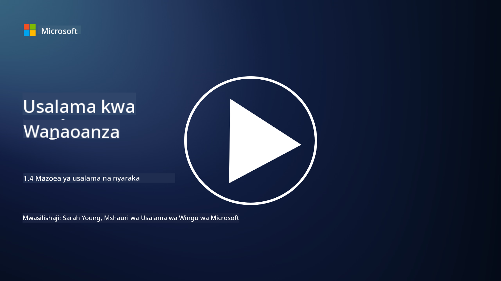

<!--
CO_OP_TRANSLATOR_METADATA:
{
  "original_hash": "d33500902124e52870935bdce4546fcc",
  "translation_date": "2025-09-04T00:21:48+00:00",
  "source_file": "1.4 Security practices and documentation.md",
  "language_code": "sw"
}
-->
# Mazoea ya Usalama na Nyaraka

Huenda umewahi kusikia misemo kama “sera ya usalama”, “kiwango cha usalama”, n.k., ikitumiwa hapo awali, lakini ukweli ni kwamba wataalamu wengi wa usalama wa mtandao hawaitumii ipasavyo. Katika sehemu hii, tutaelezea maana ya kila moja ya misemo hii na kwa nini shirika linaweza kuitumia.

## Utangulizi

Katika somo hili, tutajadili:

 - Sera ya usalama ni nini?
   
 - Kiwango cha usalama ni nini?

   

 - Msingi wa usalama ni nini?

   

 - Mwongozo wa usalama ni nini?
 - Utaratibu wa usalama ni nini?

   

 - Sheria na kanuni ni nini katika muktadha wa usalama wa mtandao?

Misemo hii mara nyingi hutumiwa katika muktadha wa usalama wa mtandao ili kufafanua viwango tofauti vya nyaraka za usalama na mazoea ndani ya shirika. Hebu tufafanue kila neno:

## Sera ya usalama ni nini?

Sera ya usalama ni nyaraka ya kiwango cha juu inayotaja malengo, kanuni, na miongozo ya jumla ya usalama wa shirika. Inatoa mfumo wa kufanya maamuzi yanayohusiana na usalama na kuweka mwelekeo wa mtazamo wa usalama wa shirika. Sera za usalama kwa kawaida hushughulikia mada kama matumizi yanayokubalika ya rasilimali, ulinzi wa data, udhibiti wa ufikiaji, mwitikio wa matukio, na zaidi. Sera ni huru kwa suluhisho na teknolojia. Mfano wa sera ya usalama ambayo wengi wanaweza kuwa nayo ni sera ya matumizi yanayokubalika ya shirika.

## Kiwango cha usalama ni nini?

Kiwango cha usalama ni nyaraka ya kina zaidi na maalum inayotoa miongozo na mahitaji ya kutekeleza udhibiti na hatua za usalama ndani ya shirika. Viwango ni vya kiufundi zaidi kuliko sera, vikitoa maagizo na mapendekezo maalum ya kusanidi na kudumisha mifumo, mitandao, na michakato ili kufikia malengo ya usalama. Mfano wa kiwango cha usalama ni _“Data yote ya ndani lazima iwe imefichwa wakati wa kupumzika na wakati wa kusafirishwa.”_

## Msingi wa usalama ni nini?

Msingi wa usalama ni seti ya usanidi wa usalama wa chini kabisa unaochukuliwa kuwa muhimu kwa mfumo, programu, au mazingira fulani kwa wakati fulani. Inafafanua hatua ya kuanzia kwa usalama ambayo inapaswa kutekelezwa katika matukio yote yanayohusika. Misingi ya usalama husaidia kuhakikisha uthabiti na kiwango fulani cha usalama katika miundombinu ya IT ya shirika. Mfano wa msingi wa usalama ni _“VM za Azure hazipaswi kuwa na ufikiaji wa moja kwa moja wa mtandao wa Intaneti.”_

## Mwongozo wa usalama ni nini?

Mwongozo wa usalama ni nyaraka inayotoa mapendekezo na mwongozo pale ambapo kiwango maalum cha usalama hakitumiki. Miongozo hujaribu kushughulikia “maeneo ya kijivu” yanayotokea pale ambapo kiwango hakifunikwi, au kinashughulikia tu sehemu ya suala.

## Utaratibu wa usalama ni nini?

Utaratibu wa usalama ni mwongozo wa kina wa hatua kwa hatua unaoelezea vitendo na kazi maalum zinazohitajika kufanywa ili kutekeleza mchakato au kazi inayohusiana na usalama. Utaratibu ni nyaraka za vitendo zinazotoa mlolongo wazi wa hatua za kufuata wakati wa mwitikio wa matukio, matengenezo ya mfumo, kuandikisha watumiaji, na shughuli nyingine zinazohusiana na usalama. Mfano wa utaratibu wa usalama ni _“Wakati tukio la usalama la P1 linazalishwa na Microsoft Sentinel, kituo cha operesheni za usalama (SOC) lazima mara moja lijulishe meneja wa usalama aliye zamu na kutuma maelezo ya tukio hilo kwake.”_

Kwa muhtasari, misemo hii inawakilisha viwango tofauti vya nyaraka na mwongozo ndani ya mfumo wa usalama wa mtandao wa shirika. Sera za usalama huweka malengo ya kiwango cha juu, viwango vinatoa mahitaji ya kina, misingi huanzisha usanidi wa usalama wa chini kabisa, miongozo hutoa mazoea bora, na taratibu hutoa hatua zinazoweza kutekelezwa kwa michakato ya usalama.

## Sheria na kanuni ni nini katika muktadha wa usalama wa mtandao?

Sheria na kanuni zinahusu mifumo ya kisheria iliyowekwa na serikali na vyombo vya udhibiti ili kufafanua na kutekeleza sheria, viwango, na mahitaji ya kulinda mifumo ya kidijitali, data, na taarifa. Sheria na kanuni hizi hutofautiana kulingana na mamlaka na huzingatia vipengele tofauti vya usalama wa mtandao, ikiwa ni pamoja na ulinzi wa data, faragha, kuripoti matukio, na usalama wa miundombinu muhimu. Hapa kuna mifano michache ya sheria na kanuni zinazohusiana na usalama wa mtandao: e.g. Kanuni ya Ulinzi wa Data ya Jumla (GDPR), Sheria ya Kubebeka kwa Bima ya Afya (HIPAA), Sheria ya Faragha ya Watumiaji ya California (CCPA), Kiwango cha Usalama wa Data cha Sekta ya Kadi ya Malipo (PCI DSS).

## Kusoma zaidi

[Templates za Sera ya Usalama wa Taarifa | Taasisi ya SANS](https://www.sans.org/information-security-policy/)

[Uzingatiaji wa Sheria na Kanuni za Usalama wa Mtandao na Faragha | NIST](https://www.nist.gov/mep/cybersecurity-resources-manufacturers/compliance-cybersecurity-and-privacy-laws-and-regulations)

---

**Kanusho**:  
Hati hii imetafsiriwa kwa kutumia huduma ya tafsiri ya AI [Co-op Translator](https://github.com/Azure/co-op-translator). Ingawa tunajitahidi kuhakikisha usahihi, tafsiri za kiotomatiki zinaweza kuwa na makosa au kutokuwa sahihi. Hati ya asili katika lugha yake ya awali inapaswa kuchukuliwa kama chanzo cha mamlaka. Kwa taarifa muhimu, tafsiri ya kitaalamu ya binadamu inapendekezwa. Hatutawajibika kwa kutoelewana au tafsiri zisizo sahihi zinazotokana na matumizi ya tafsiri hii.