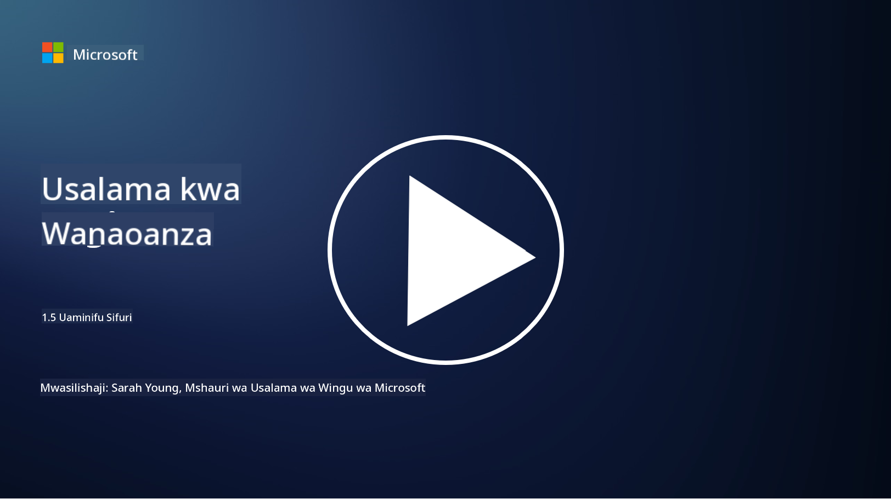
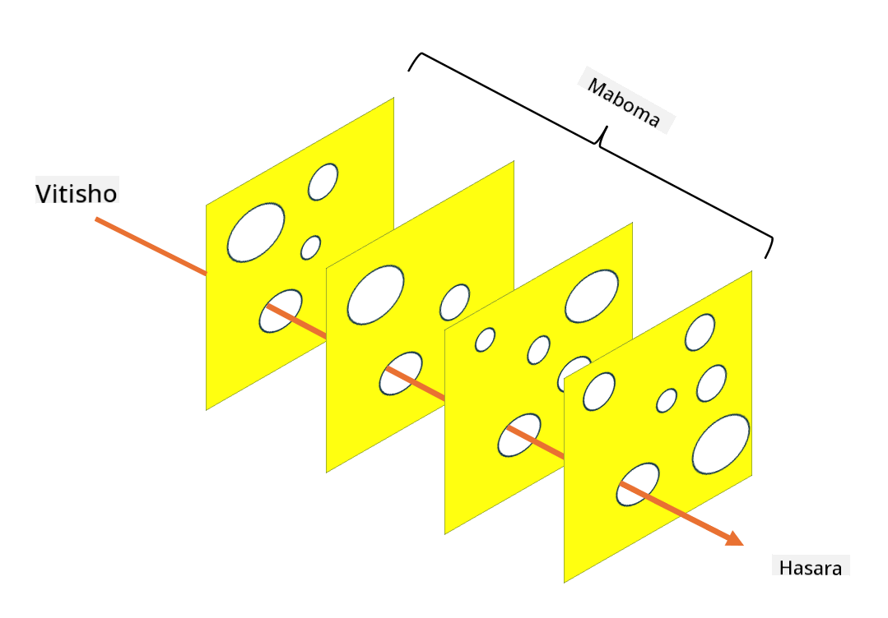

<!--
CO_OP_TRANSLATOR_METADATA:
{
  "original_hash": "75f77f972d2233c584f87c1eb96c983b",
  "translation_date": "2025-09-03T23:49:26+00:00",
  "source_file": "1.5 Zero trust.md",
  "language_code": "sw"
}
-->
# Zero Trust

"Zero trust" ni neno linalotumika sana katika mzunguko wa usalama siku hizi. Lakini linamaanisha nini, je, ni neno la mtindo tu? Katika somo hili, tutachunguza kwa undani maana ya zero trust.

## Utangulizi

 - Katika somo hili, tutajadili:
   
   
 - Zero trust ni nini?

   
  

 - Zero trust inatofautianaje na miundombinu ya usalama ya jadi?

   
   

 - Defense in depth ni nini?

## Zero Trust

Zero Trust ni mbinu ya usalama wa mtandao inayopinga dhana ya jadi ya "amini lakini thibitisha" kwa kudhani kwamba hakuna chombo, iwe ndani au nje ya mtandao wa shirika, kinachopaswa kuaminiwa bila masharti. Badala yake, Zero Trust inasisitiza kuthibitisha kila mtumiaji, kifaa, na programu inayojaribu kufikia rasilimali, bila kujali mahali ilipo. Kanuni kuu ya Zero Trust ni kupunguza "eneo la shambulio" na kupunguza athari za uvunjaji wa usalama.

Katika modeli ya Zero Trust, kanuni zifuatazo zinapewa kipaumbele:

1. **Thibitisha Utambulisho**: Uthibitishaji na ruhusa hutekelezwa kwa ukali kwa watumiaji na vifaa vyote, bila kujali mahali walipo. Kumbuka kwamba utambulisho si lazima uwe wa binadamu: unaweza kuwa kifaa, programu, n.k.

2. **Upatikanaji wa Kiwango cha Chini**: Watumiaji na vifaa hupewa kiwango cha chini cha upatikanaji kinachohitajika kutekeleza majukumu yao, kupunguza madhara yanayoweza kutokea ikiwa watavunjwa.

3. **Micro-Segmentation**: Rasilimali za mtandao hugawanywa katika sehemu ndogo ili kupunguza harakati za ndani ya mtandao endapo kutatokea uvunjaji.

4. **Ufuatiliaji Endelevu**: Ufuatiliaji wa mara kwa mara na uchambuzi wa tabia za watumiaji na vifaa hufanyika ili kugundua hali zisizo za kawaida na vitisho vinavyoweza kutokea. Mbinu za kisasa za ufuatiliaji pia hutumia ujifunzaji wa mashine, AI, na ujasusi wa vitisho ili kutoa maelezo na muktadha wa ziada kwa ufuatiliaji.

5. **Usimbaji wa Data**: Data husimbwa wakati wa kusafirishwa na inapohifadhiwa ili kuzuia upatikanaji usioidhinishwa.

6. **Udhibiti Mkali wa Upatikanaji**: Udhibiti wa upatikanaji hutekelezwa kulingana na muktadha, kama vile majukumu ya mtumiaji, hali ya kifaa, na eneo la mtandao.

Microsoft inagawanya zero trust katika nguzo tano, ambazo tutazijadili katika somo lijalo.

## Tofauti na Miundombinu ya Usalama ya Jadi

Zero Trust inatofautiana na miundombinu ya usalama ya jadi, kama vile mifumo inayotegemea mipaka, kwa njia kadhaa:

1. **Mipaka vs. Utambulisho**: Miundombinu ya jadi inalenga kulinda mipaka ya mtandao na kudhani kwamba watumiaji na vifaa vya ndani vinaweza kuaminiwa mara tu vikiwa ndani. Zero Trust, kwa upande mwingine, hudhani kwamba vitisho vinaweza kutoka ndani na nje ya mtandao na hutekeleza udhibiti mkali wa utambulisho.

2. **Imani ya Kawaida vs. Imani ya Dhahiri**: Miundombinu ya jadi huamini vifaa na watumiaji ndani ya mtandao hadi pale inapothibitishwa vinginevyo. Zero Trust huamini kwa dhahiri utambulisho na hufuatilia kwa mara kwa mara hali zisizo za kawaida.

3. **Mtandao wa Kawaida vs. Mtandao Uliogawanywa**: Miundombinu ya jadi mara nyingi huhusisha mitandao ya kawaida ambapo watumiaji wa ndani wana upatikanaji mpana. Zero Trust inasisitiza kugawanya mtandao katika maeneo madogo, yaliyotengwa ili kudhibiti uvunjaji unaoweza kutokea.

4. **Hatua za Kujibu vs. Hatua za Kuzuia**: Usalama wa jadi mara nyingi hutegemea hatua za kujibu kama vile firewalls za mipaka na mifumo ya kugundua uvamizi. Zero Trust huchukua mbinu ya kuzuia kwa kudhani uvunjaji ni jambo linalowezekana na kupunguza athari zake.

## Defense in Depth

Defense in depth, inayojulikana pia kama usalama wa tabaka, ni mkakati wa usalama wa mtandao unaohusisha kupeleka tabaka nyingi za udhibiti na hatua za usalama ili kulinda mali za shirika. Lengo ni kuunda tabaka zinazofuatana za ulinzi ili kwamba ikiwa tabaka moja litavunjwa, zingine bado ziweze kutoa ulinzi. Kila tabaka linazingatia kipengele tofauti cha usalama na huongeza hali ya jumla ya usalama wa shirika.

Defense in depth inahusisha mchanganyiko wa hatua za kiufundi, taratibu, na kimwili za usalama. Hizi zinaweza kujumuisha firewalls, mifumo ya kugundua uvamizi, udhibiti wa upatikanaji, usimbaji, mafunzo ya watumiaji, sera za usalama, na zaidi. Wazo ni kuunda vizuizi vingi ambavyo kwa pamoja hufanya iwe vigumu kwa wavamizi kupenya mifumo na mitandao ya shirika. Hii pia wakati mwingine hujulikana kama "mfano wa jibini la Uswisi" ambao pia hutumika katika kuzuia ajali katika sekta nyingine (mfano: usafiri).

## Kusoma Zaidi

[Zero Trust ni nini?](https://learn.microsoft.com/security/zero-trust/zero-trust-overview?WT.mc_id=academic-96948-sayoung)

[Evolving Zero Trust – Microsoft Position Paper](https://query.prod.cms.rt.microsoft.com/cms/api/am/binary/RWJJdT?WT.mc_id=academic-96948-sayoung)

[Zero Trust na BeyondCorp Google Cloud | Google Cloud Blog](https://cloud.google.com/blog/topics/developers-practitioners/zero-trust-and-beyondcorp-google-cloud)

---

**Kanusho**:  
Hati hii imetafsiriwa kwa kutumia huduma ya tafsiri ya AI [Co-op Translator](https://github.com/Azure/co-op-translator). Ingawa tunajitahidi kwa usahihi, tafadhali fahamu kuwa tafsiri za kiotomatiki zinaweza kuwa na makosa au kutokuwa sahihi. Hati ya asili katika lugha yake ya awali inapaswa kuzingatiwa kama chanzo cha mamlaka. Kwa taarifa muhimu, inashauriwa kutumia huduma ya tafsiri ya kitaalamu ya binadamu. Hatutawajibika kwa maelewano mabaya au tafsiri zisizo sahihi zinazotokana na matumizi ya tafsiri hii.