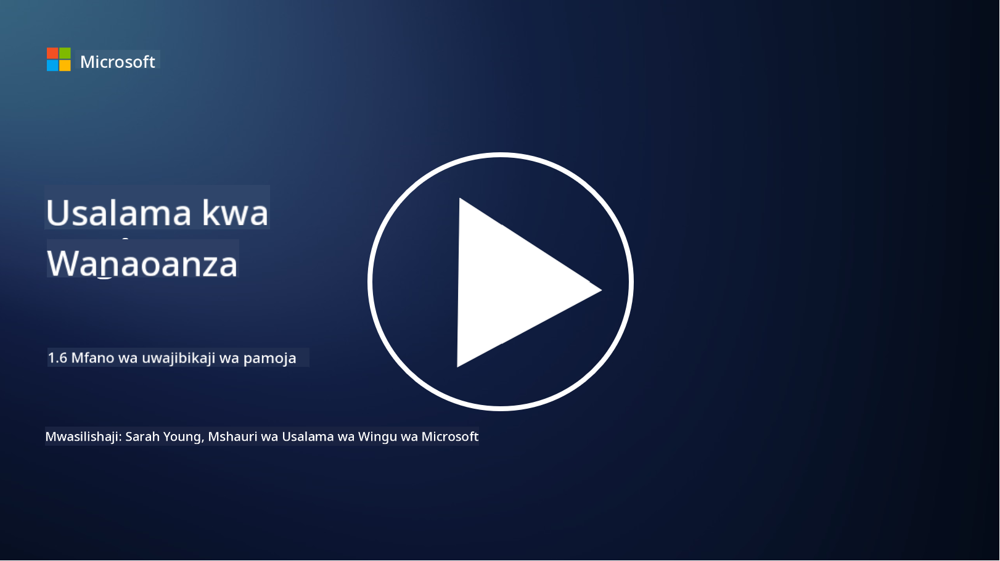

<!--
CO_OP_TRANSLATOR_METADATA:
{
  "original_hash": "a48db640d80c786b928ca178c414f084",
  "translation_date": "2025-09-04T00:28:05+00:00",
  "source_file": "1.6 Shared responsibility model.md",
  "language_code": "sw"
}
-->
# Mtindo wa Wajibu wa Pamoja

Wajibu wa pamoja ni dhana mpya katika teknolojia ya habari (IT) ambayo ilianza na ujio wa kompyuta za wingu. Kutoka kwa mtazamo wa usalama wa mtandao, ni muhimu kuelewa ni nani anayetoa udhibiti wa usalama ili kusiwe na mapungufu katika ulinzi.

## Utangulizi

Katika somo hili, tutajadili:

 - Wajibu wa pamoja ni nini katika muktadha wa usalama wa mtandao?
   
 - Tofauti ya wajibu wa pamoja kwa udhibiti wa usalama kati ya IaaS, PaaS, na SaaS ni ipi?

 - Wapi unaweza kupata maelezo kuhusu udhibiti wa usalama unaotolewa na jukwaa lako la wingu?

 - "Amini lakini hakiki" inamaanisha nini?

## Wajibu wa pamoja ni nini katika muktadha wa usalama wa mtandao?

Wajibu wa pamoja katika usalama wa mtandao unahusu mgawanyo wa majukumu ya usalama kati ya mtoa huduma wa wingu (CSP) na wateja wake. Katika mazingira ya kompyuta za wingu, kama vile Miundombinu kama Huduma (IaaS), Jukwaa kama Huduma (PaaS), na Programu kama Huduma (SaaS), CSP na mteja wote wana jukumu la kuhakikisha usalama wa data, programu, na mifumo.

## Tofauti ya wajibu wa pamoja kwa udhibiti wa usalama kati ya IaaS, PaaS, na SaaS ni ipi?

Mgawanyo wa majukumu kwa kawaida hutegemea aina ya huduma ya wingu inayotumika:

 - **IaaS (Miundombinu kama Huduma)**: CSP hutoa miundombinu ya msingi (seva, mitandao, uhifadhi), wakati mteja anawajibika kusimamia mifumo ya uendeshaji, programu, na usanidi wa usalama kwenye miundombinu hiyo.
   
 - **PaaS (Jukwaa kama Huduma):** CSP hutoa jukwaa ambalo wateja wanaweza kujenga na kuendesha programu. CSP husimamia miundombinu ya msingi, na mteja huzingatia maendeleo ya programu na usalama wa data.

 - **SaaS (Programu kama Huduma)**: CSP hutoa programu kamili zinazopatikana kupitia mtandao. Katika hali hii, CSP inawajibika kwa usalama wa programu na miundombinu, wakati mteja husimamia ufikiaji wa watumiaji na matumizi ya data.

Kuelewa wajibu wa pamoja ni muhimu kwa sababu kunabainisha ni vipengele vya usalama vinavyoshughulikiwa na CSP na ni vipi mteja anahitaji kushughulikia. Hii husaidia kuzuia kutokuelewana na kuhakikisha hatua za usalama zinatekelezwa kwa ukamilifu.

## Wapi unaweza kupata maelezo kuhusu udhibiti wa usalama unaotolewa na jukwaa lako la wingu?

Ili kupata maelezo kuhusu udhibiti wa usalama unaotolewa na jukwaa lako la wingu, unahitaji kurejelea nyaraka na rasilimali za mtoa huduma wa wingu. Hizi zinajumuisha:

 - **Tovuti na nyaraka za CSP**: Tovuti ya CSP itakuwa na maelezo kuhusu vipengele vya usalama na udhibiti unaotolewa kama sehemu ya huduma zao. CSP kwa kawaida hutoa nyaraka za kina zinazoelezea mazoea yao ya usalama, udhibiti, na mapendekezo. Hii inaweza kujumuisha makala za kitaalamu, miongozo ya usalama, na nyaraka za kiufundi.
   
 - **Tathmini na ukaguzi wa usalama**: CSP wengi hupitia tathmini za usalama zinazofanywa na wataalam wa usalama wa kujitegemea na mashirika. Mapitio haya yanaweza kutoa ufahamu kuhusu ubora wa hatua za usalama za CSP. Wakati mwingine, hii husababisha CSP kupata cheti cha kufuata viwango vya usalama (angalia kipengele kinachofuata).
   
 - **Vyeti vya kufuata viwango vya usalama**: CSP wengi hupata vyeti kama vile ISO:27001, SOC 2, na FedRAMP, n.k. Vyeti hivi vinaonyesha kuwa mtoa huduma anatimiza viwango maalum vya usalama na kufuata sheria.

Kumbuka kuwa kiwango cha maelezo na upatikanaji wa taarifa kinaweza kutofautiana kati ya watoa huduma wa wingu. Daima hakikisha unarejelea rasilimali rasmi na za kisasa zinazotolewa na mtoa huduma wa wingu ili kufanya maamuzi sahihi kuhusu usalama wa mali zako zinazotegemea wingu.

## "Amini lakini hakiki" inamaanisha nini?

Katika muktadha wa kutumia CSP, programu za wahusika wa tatu au huduma nyingine za usalama wa IT, shirika linaweza kuanza kwa kuamini madai ya mtoa huduma kuhusu hatua za usalama. Hata hivyo, ili kuhakikisha usalama wa data na mifumo yao, wangethibitisha madai haya kupitia tathmini za usalama, majaribio ya kupenya, na mapitio ya udhibiti wa usalama wa mtoa huduma kabla ya kuunganisha programu au huduma hiyo kikamilifu katika shughuli zao. Watu binafsi na mashirika yote yanapaswa kutafuta kuamini lakini hakiki udhibiti wa usalama ambao hawawajibiki nao.

## Wajibu wa pamoja ndani ya shirika

Kumbuka, wajibu wa pamoja kwa usalama ndani ya shirika kwa timu tofauti pia unapaswa kuzingatiwa. Timu ya usalama mara chache itatekeleza udhibiti wote wenyewe na itahitaji kushirikiana na timu za operesheni, watengenezaji, na sehemu nyingine za biashara ili kutekeleza udhibiti wote wa usalama unaohitajika kulinda shirika.

## Kusoma zaidi
- [Shared responsibility in the cloud - Microsoft Azure | Microsoft Learn](https://learn.microsoft.com/azure/security/fundamentals/shared-responsibility?WT.mc_id=academic-96948-sayoung)
- [What is shared responsibility model? – Definition from TechTarget.com](https://www.techtarget.com/searchcloudcomputing/definition/shared-responsibility-model)
- [The shared responsibility model explained and what it means for cloud security | CSO Online](https://www.csoonline.com/article/570779/the-shared-responsibility-model-explained-and-what-it-means-for-cloud-security.html)
- [Shared Responsibility for Cloud Security: What You Need to Know (cisecurity.org)](https://www.cisecurity.org/insights/blog/shared-responsibility-cloud-security-what-you-need-to-know)

---

**Kanusho**:  
Hati hii imetafsiriwa kwa kutumia huduma ya tafsiri ya AI [Co-op Translator](https://github.com/Azure/co-op-translator). Ingawa tunajitahidi kuhakikisha usahihi, tafsiri za kiotomatiki zinaweza kuwa na makosa au kutokuwa sahihi. Hati ya asili katika lugha yake ya awali inapaswa kuchukuliwa kama chanzo cha mamlaka. Kwa taarifa muhimu, tafsiri ya kitaalamu ya binadamu inapendekezwa. Hatutawajibika kwa kutoelewana au tafsiri zisizo sahihi zinazotokana na matumizi ya tafsiri hii.