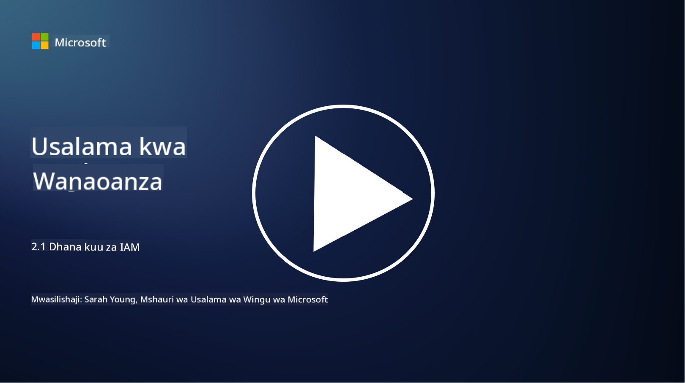

<!--
CO_OP_TRANSLATOR_METADATA:
{
  "original_hash": "2e3864e3d579f0dbb4ac2ec8c5f82acf",
  "translation_date": "2025-09-03T22:42:33+00:00",
  "source_file": "2.1 IAM key concepts.md",
  "language_code": "sw"
}
-->
# Dhana Muhimu za IAM

Je, umewahi kuingia kwenye kompyuta au tovuti? Bila shaka umewahi! Hii ina maana kwamba tayari umetumia udhibiti wa utambulisho katika maisha yako ya kila siku. Usimamizi wa utambulisho na ufikiaji (IAM) ni nguzo muhimu ya usalama, tutajifunza zaidi kuhusu hili katika masomo yanayofuata.

**Utangulizi**

Katika somo hili, tutajadili:

- Tunamaanisha nini tunaposema usimamizi wa utambulisho na ufikiaji (IAM) katika muktadha wa usalama wa mtandao?

- Kanuni ya upendeleo wa kiwango cha chini ni nini?

- Mgawanyo wa majukumu ni nini?

- Uthibitishaji na idhini ni nini?

## Tunamaanisha nini tunaposema usimamizi wa utambulisho na ufikiaji (IAM) katika muktadha wa usalama wa mtandao?

Usimamizi wa Utambulisho na Ufikiaji (IAM) unahusu seti ya michakato, teknolojia, na sera zinazotekelezwa ili kuhakikisha kwamba watu sahihi wanapata rasilimali zinazofaa ndani ya mazingira ya kidijitali ya shirika. IAM inahusisha kusimamia utambulisho wa kidijitali (watumiaji, wafanyakazi, washirika) na ufikiaji wao kwa mifumo, programu, data, na mitandao. Lengo kuu la IAM ni kuboresha usalama, kurahisisha ufikiaji wa mtumiaji, na kuhakikisha kufuata sera na kanuni za shirika. Suluhisho za IAM kwa kawaida zinajumuisha uthibitishaji wa mtumiaji, idhini, utoaji wa utambulisho, udhibiti wa ufikiaji, na usimamizi wa mzunguko wa maisha wa mtumiaji (kuhakikisha akaunti zinafutwa zinapokuwa hazitumiki tena).

## Kanuni ya upendeleo wa kiwango cha chini ni nini?

Kanuni ya upendeleo wa kiwango cha chini ni dhana ya msingi inayosisitiza kuwapa watumiaji na mifumo upendeleo wa kiwango cha chini tu unaohitajika kutekeleza majukumu au nafasi zao zilizokusudiwa. Kanuni hii husaidia kupunguza madhara yanayoweza kutokea endapo kutatokea uvunjaji wa usalama au tishio la ndani. Kwa kufuata kanuni ya upendeleo wa kiwango cha chini, mashirika hupunguza eneo la shambulio na kupunguza hatari ya ufikiaji usioidhinishwa, uvunjaji wa data, na matumizi mabaya ya upendeleo kwa bahati mbaya. Kwa vitendo, hii ina maana kwamba watumiaji wanapewa ufikiaji wa rasilimali na vipengele maalum vinavyohitajika kwa majukumu yao ya kazi, na si zaidi ya hapo. Kwa mfano, ikiwa unahitaji tu kusoma hati, itakuwa kupita kiasi kukupa upendeleo kamili wa usimamizi kwa hati hiyo.

## Mgawanyo wa majukumu ni nini?

Mgawanyo wa majukumu ni kanuni inayolenga kuzuia migongano ya maslahi na kupunguza hatari ya udanganyifu na makosa kwa kugawa majukumu muhimu na wajibu kwa watu tofauti ndani ya shirika. Katika muktadha wa usalama wa mtandao, mgawanyo wa majukumu unahusisha kuhakikisha kwamba hakuna mtu mmoja anayesimamia vipengele vyote vya mchakato au mfumo muhimu. Lengo ni kuunda mfumo wa ukaguzi na usawa unaozuia mtu mmoja kuwa na uwezo wa kutekeleza hatua zote za usanidi na idhini za mchakato. Kwa mfano, katika mifumo ya kifedha, hii inaweza kudai kwamba mtu anayeingiza miamala kwenye mfumo asiwe mtu yule yule anayethibitisha miamala hiyo. Hii inapunguza hatari ya vitendo visivyoidhinishwa au vya udanganyifu kupita bila kugunduliwa.

## Uthibitishaji na idhini ni nini?

Uthibitishaji na idhini ni dhana mbili za msingi katika usalama wa mtandao ambazo zina jukumu muhimu katika kuhakikisha usalama na uadilifu wa mifumo ya kompyuta na data. Mara nyingi hutumika pamoja kudhibiti ufikiaji wa rasilimali na kulinda taarifa nyeti.

**1. Uthibitishaji**: Uthibitishaji ni mchakato wa kuthibitisha utambulisho wa mtumiaji, mfumo, au chombo kinachojaribu kufikia mfumo wa kompyuta au rasilimali maalum. Unahakikisha kwamba utambulisho unaodaiwa ni wa kweli na sahihi. Mbinu za uthibitishaji kwa kawaida zinahusisha matumizi ya moja au zaidi ya mambo yafuatayo:

   a. Kitu unachojua: Hii inajumuisha nywila, PIN, au maarifa ya siri ambayo mtumiaji aliyeidhinishwa pekee anapaswa kuwa nayo.

   b. Kitu unachomiliki: Hii inahusisha tokeni za kimwili au vifaa kama kadi za smart, tokeni za usalama, au simu za mkononi zinazotumika kuthibitisha utambulisho wa mtumiaji.

   c. Kitu unachokuwa: Hii inahusu mambo ya kibayometriki kama alama za vidole, utambuzi wa uso, au skana za retina ambazo ni za kipekee kwa mtu binafsi.

Mbinu za uthibitishaji hutumika kuthibitisha kwamba mtumiaji ni yule wanayejidai kuwa kabla ya kuruhusu ufikiaji wa mfumo au rasilimali. Hii husaidia kuzuia ufikiaji usioidhinishwa na kuhakikisha kwamba watumiaji halali pekee wanaweza kutekeleza vitendo ndani ya mfumo.

**2. Idhini**: Idhini ni mchakato wa kutoa au kukataa ruhusa na upendeleo maalum kwa watumiaji au vyombo vilivyothibitishwa mara tu utambulisho wao umethibitishwa. Inabainisha ni vitendo au shughuli gani mtumiaji anaruhusiwa kutekeleza ndani ya mfumo au kwenye rasilimali maalum. Idhini mara nyingi hutegemea sera zilizowekwa, sheria za udhibiti wa ufikiaji, na majukumu yaliyotolewa kwa watumiaji.

Idhini inaweza kufikiriwa kama kujibu swali, "Mtumiaji aliyethibitishwa anaweza kufanya nini?" Inahusisha kufafanua na kutekeleza sera za udhibiti wa ufikiaji ili kulinda data nyeti na rasilimali dhidi ya ufikiaji au mabadiliko yasiyoidhinishwa.

**Kwa muhtasari:**

- Uthibitishaji unathibitisha utambulisho wa watumiaji au vyombo.

- Idhini inabainisha ni vitendo na rasilimali gani watumiaji waliothibitishwa wanaruhusiwa kufikia au kudhibiti.

## Kusoma zaidi

- [Describe identity concepts - Training | Microsoft Learn](https://learn.microsoft.com/training/modules/describe-identity-principles-concepts/?WT.mc_id=academic-96948-sayoung)
- [Introduction to identity - Microsoft Entra | Microsoft Learn](https://learn.microsoft.com/azure/active-directory/fundamentals/identity-fundamental-concepts?WT.mc_id=academic-96948-sayoung)
- [What is Identity Access Management (IAM)? | Microsoft Security](https://www.microsoft.com/security/business/security-101/what-is-identity-access-management-iam?WT.mc_id=academic-96948-sayoung)
- [What is IAM? Identity and access management explained | CSO Online](https://www.csoonline.com/article/518296/what-is-iam-identity-and-access-management-explained.html)
- [What is IAM? (auth0.com)](https://auth0.com/blog/what-is-iam/)
- [Security+: implementing Identity and Access Management (IAM) controls [updated 2021] | Infosec (infosecinstitute.com)](https://resources.infosecinstitute.com/certifications/securityplus/security-implementing-identity-and-access-management-iam-controls/)
- [least privilege - Glossary | CSRC (nist.gov)](https://csrc.nist.gov/glossary/term/least_privilege)
- [Security: The Principle of Least Privilege (POLP) - Microsoft Community Hub](https://techcommunity.microsoft.com/t5/azure-sql-blog/security-the-principle-of-least-privilege-polp/ba-p/2067390?WT.mc_id=academic-96948-sayoung)
- [Principle of least privilege | CERT NZ](https://www.cert.govt.nz/it-specialists/critical-controls/principle-of-least-privilege/)
- [Why is separation of duties required by NIST 800-171 and CMMC? - (totem.tech)](https://www.totem.tech/cmmc-separation-of-duties/)

---

**Kanusho**:  
Hati hii imetafsiriwa kwa kutumia huduma ya kutafsiri ya AI [Co-op Translator](https://github.com/Azure/co-op-translator). Ingawa tunajitahidi kuhakikisha usahihi, tafadhali fahamu kuwa tafsiri za kiotomatiki zinaweza kuwa na makosa au kutokuwa sahihi. Hati ya asili katika lugha yake ya awali inapaswa kuzingatiwa kama chanzo cha mamlaka. Kwa taarifa muhimu, tafsiri ya kitaalamu ya binadamu inapendekezwa. Hatutawajibika kwa kutoelewana au tafsiri zisizo sahihi zinazotokana na matumizi ya tafsiri hii.