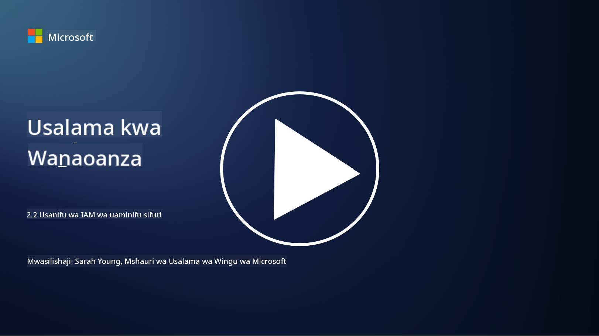

<!--
CO_OP_TRANSLATOR_METADATA:
{
  "original_hash": "4774a978af123f72ebb872199c4c4d4f",
  "translation_date": "2025-09-03T23:42:54+00:00",
  "source_file": "2.2 IAM zero trust architecture.md",
  "language_code": "sw"
}
-->
# IAM zero trust architecture

Utambulisho ni sehemu muhimu ya kutekeleza usanifu wa zero trust na kujenga mipaka kwa mazingira yoyote ya IT. Katika sehemu hii tutachunguza kwa nini ni muhimu kutumia udhibiti wa utambulisho kutekeleza zero trust.

## Utangulizi

Katika somo hili, tutajadili:

 - Kwa nini tunahitaji kutumia utambulisho kama mipaka yetu katika mazingira ya kisasa ya IT?
   
 - Je, hili linatofautianaje na usanifu wa jadi wa IT?

 - Jinsi gani utambulisho unavyotumika kutekeleza usanifu wa zero trust?

## Kwa nini tunahitaji kutumia utambulisho kama mipaka yetu katika mazingira ya kisasa ya IT?

Katika mazingira ya kisasa ya IT, dhana ya jadi ya mipaka ya kimwili (kutumia zana kama firewalls na mipaka ya mtandao) kama njia kuu ya kujilinda dhidi ya vitisho vya mtandao inazidi kuwa na ufanisi mdogo kutokana na ongezeko la ugumu wa teknolojia, kuongezeka kwa kazi za mbali, na matumizi ya huduma za wingu. Badala yake, mashirika yanahamia kutumia utambulisho kama mipaka mpya. Hii inamaanisha kuwa usalama unazunguka kuthibitisha na kudhibiti utambulisho wa watumiaji, vifaa, na programu zinazojaribu kufikia rasilimali, bila kujali eneo lao la kimwili.

Hapa kuna sababu kwa nini kutumia utambulisho kama mipaka ni muhimu katika mazingira ya kisasa ya IT:

**Wafanyakazi wa Mbali**: Kwa kazi za mbali na vifaa vya mkononi kuwa kawaida, watumiaji wanaweza kufikia rasilimali kutoka maeneo na vifaa mbalimbali. Njia ya jadi ya mipaka haifanyi kazi wakati watumiaji hawako tena katika ofisi ya kimwili.

**Mazingira ya Wingu na Mseto**: Mashirika yanazidi kutumia huduma za wingu na mazingira ya mseto. Data na programu hazipo tena tu ndani ya majengo ya shirika, na kufanya ulinzi wa mipaka ya jadi kuwa na umuhimu mdogo.

**Usalama wa Zero Trust**: Dhana ya usalama wa zero trust inadhani kuwa hakuna chombo, iwe ndani au nje ya mtandao, kinapaswa kuaminika moja kwa moja. Utambulisho unakuwa msingi wa kuthibitisha maombi ya ufikiaji, bila kujali yanatoka wapi.

**Mandhari ya Vitisho**: Vitisho vya mtandao vinabadilika, na wavamizi wanapata njia za kupita ulinzi wa mipaka ya jadi. Udukuzi, uhandisi wa kijamii, na vitisho vya ndani mara nyingi hutumia udhaifu wa binadamu badala ya kujaribu kuvunja mipaka ya mtandao.

**Njia ya Kuelekea Data**: Kulinda data nyeti ni muhimu. Kwa kuzingatia utambulisho, mashirika yanaweza kudhibiti nani anapata data gani, kupunguza hatari ya uvunjaji wa data.

## Je, hili linatofautianaje na usanifu wa jadi wa IT?

Usanifu wa jadi wa IT ulitegemea sana mifumo ya usalama inayozingatia mipaka, ambapo firewalls na mipaka ya mtandao zilikuwa na jukumu kubwa la kuzuia vitisho. Tofauti kuu kati ya njia za jadi na zinazozingatia utambulisho ni:

|      Kipengele              |      Usanifu wa Jadi wa IT                                                                       |      Njia Inayozingatia Utambulisho                                                                      |
|-----------------------------|----------------------------------------------------------------------------------------------------|------------------------------------------------------------------------------------------------------------|
|     Mtazamo                 |     Mtazamo wa Mipaka: Ulitegemea ulinzi wa mipaka kama firewalls na   udhibiti wa ufikiaji.       |     Mtazamo wa Uthibitisho wa Utambulisho: Kuhama kutoka mipaka ya mtandao hadi   kuthibitisha utambulisho wa mtumiaji/kifaa. |
|     Eneo                   |     Utegemezi wa Eneo: Usalama ulifungamana na maeneo ya ofisi ya kimwili na   mipaka ya mtandao.  |     Uhuru wa Eneo: Usalama hauhusiani na maeneo maalum; ufikiaji kutoka popote.                           |
|     Dhana ya Uaminifu       |     Uaminifu Uliochukuliwa: Uaminifu ulidhaniwa ndani ya mipaka ya mtandao kwa   watumiaji/vifaa. |     Njia ya Zero Trust: Uaminifu hauchukuliwi; ufikiaji unathibitishwa kulingana   na utambulisho na muktadha. |
|     Uzingatiaji wa Vifaa     |     Utofauti wa Vifaa: Ilidhaniwa kuwa vifaa ndani ya mipaka ya mtandao vilikuwa   salama.       |     Uzingatiaji wa Vifaa: Kuzingatia afya na hali ya usalama ya kifaa,   bila kujali eneo.                 |
|     Ulinzi wa Data          |     Ulinzi wa Data: Ulilenga kulinda mipaka ya mtandao kwa ajili ya ulinzi wa   data.             |     Ulinzi Unaolenga Data: Kuzingatia kudhibiti ufikiaji wa data kulingana na   utambulisho na unyeti wa data. |

## Jinsi gani utambulisho unavyotumika kutekeleza usanifu wa zero trust?

Katika usanifu wa zero trust, kanuni ya msingi ni kutokuwahi kuamini chombo chochote moja kwa moja, bila kujali kama kiko ndani au nje ya mipaka ya mtandao. Utambulisho unachukua jukumu kuu katika kutekeleza mbinu ya zero trust kwa kuwezesha uthibitisho endelevu wa vyombo vinavyotaka kufikia rasilimali. Udhibiti wa kisasa wa usalama wa utambulisho unaruhusu kila mtumiaji, kifaa, programu, na huduma inayotafuta ufikiaji wa rasilimali kutambuliwa na kuthibitishwa kikamilifu kabla ya ufikiaji kuruhusiwa. Hii inahusisha kuthibitisha utambulisho wao wa kidijitali kupitia mbinu kama mchanganyiko wa jina la mtumiaji/nenosiri, uthibitisho wa vipengele vingi (MFA), biometriki, na mbinu nyingine za uthibitisho thabiti.

## Kusoma zaidi

- [Securing identity with Zero Trust | Microsoft Learn](https://learn.microsoft.com/security/zero-trust/deploy/identity?WT.mc_id=academic-96948-sayoung)
- [Zero Trust Principles and Guidance for Identity and Access | CSA (cloudsecurityalliance.org)](https://cloudsecurityalliance.org/artifacts/zero-trust-principles-and-guidance-for-iam/)
- [Zero Trust Identity Controls - Essentials Series - Episode 2 - YouTube](https://www.youtube.com/watch?v=fQZQznIKcGM&list=PLXtHYVsvn_b_gtX1-NB62wNervQx1Fhp4&index=13)

---

**Kanusho**:  
Hati hii imetafsiriwa kwa kutumia huduma ya tafsiri ya AI [Co-op Translator](https://github.com/Azure/co-op-translator). Ingawa tunajitahidi kwa usahihi, tafadhali fahamu kuwa tafsiri za kiotomatiki zinaweza kuwa na makosa au kutokuwa sahihi. Hati ya asili katika lugha yake ya awali inapaswa kuzingatiwa kama chanzo cha mamlaka. Kwa taarifa muhimu, inashauriwa kutumia huduma ya tafsiri ya kitaalamu ya binadamu. Hatutawajibika kwa maelewano mabaya au tafsiri zisizo sahihi zinazotokana na matumizi ya tafsiri hii.