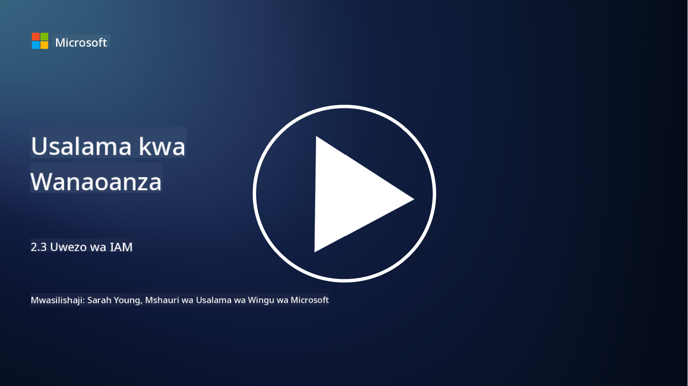

<!--
CO_OP_TRANSLATOR_METADATA:
{
  "original_hash": "bf0b8a54f2c69951744df5a94bc923f7",
  "translation_date": "2025-09-04T01:57:59+00:00",
  "source_file": "2.3 IAM capabilities.md",
  "language_code": "sw"
}
-->
# Uwezo wa IAM

Katika sehemu hii, tutajadili kwa undani zaidi kuhusu zana na uwezo wa msingi unaotumika katika usalama wa utambulisho.

## Utangulizi

Katika somo hili, tutajadili:

 - Huduma ya saraka ni nini?
      
     
    
 - Ni uwezo gani unaweza kutumika kulinda utambulisho?
>
>        Uthibitishaji wa Vipengele Vingi (MFA)
> 
>        Kuingia Mara Moja (SSO)
> 
>        Udhibiti wa Ufikiaji wa Kulingana na Majukumu (RBAC)
> 
>        Uthibitishaji wa Kirekebishi
> 
>        Uthibitishaji wa Kibayometriki
> 
>        Usimamizi wa Ufikiaji wa Kipekee (PAM)
> 
>        Utawala na Usimamizi wa Utambulisho (IGA)
> 
>        Uchambuzi wa Tabia

## Huduma ya saraka ni nini?

Huduma ya saraka ni hifadhidata maalum inayohifadhi na kusimamia taarifa kuhusu rasilimali za mtandao, ikiwa ni pamoja na watumiaji, vikundi, vifaa, programu, na vitu vingine. Inatumika kama hifadhi kuu ya data inayohusiana na utambulisho na ufikiaji, ikiruhusu mashirika kusimamia na kudhibiti uthibitishaji wa watumiaji, ruhusa, na kazi nyingine za usalama kwa ufanisi.

Huduma za saraka zina jukumu muhimu katika mazingira ya kisasa ya IT kwa kutoa msingi wa suluhisho za usimamizi wa utambulisho na ufikiaji (IAM). Zinasaidia kufanikisha ufikiaji salama wa rasilimali, kutekeleza sera za ufikiaji, na kurahisisha kazi za kiutawala. Mojawapo ya huduma za saraka zinazojulikana zaidi ni Microsoft Active Directory, lakini kuna suluhisho zingine kama saraka za LDAP (Lightweight Directory Access Protocol) zinazofanya kazi sawa.

Kazi na vipengele muhimu vya huduma ya saraka katika muktadha wa usalama wa mtandao ni pamoja na:

 - **Uthibitishaji wa Watumiaji**: Huduma za saraka zinathibitisha sifa za watumiaji (kama majina ya watumiaji na nywila) ili kuhakikisha kuwa ni watumiaji waliothibitishwa pekee wanaoweza kufikia mtandao na rasilimali zake.
 - **Ruhusa za Watumiaji**: Zinabainisha kiwango cha ufikiaji ambacho kila mtumiaji anacho kulingana na jukumu lake, uanachama wa kikundi, na sifa nyingine. Hii inahakikisha kuwa watumiaji wanaweza kufikia tu rasilimali walizoidhinishwa.
 - **Usimamizi wa Vikundi**: Huduma za saraka zinawaruhusu wasimamizi kupanga watumiaji katika vikundi vya kimantiki, kurahisisha usimamizi wa udhibiti wa ufikiaji. Ruhusa zinaweza kutolewa kwa vikundi badala ya watumiaji binafsi.
 - **Sera za Nywila**: Zinadhibiti ugumu wa nywila na sheria za muda wa kuisha, kuboresha usalama wa akaunti za watumiaji.
 - **Kuingia Mara Moja (SSO)**: Huduma zingine za saraka zinaunga mkono SSO, kuruhusu watumiaji kufikia programu na huduma nyingi kwa kutumia sifa moja.
 - **Usimamizi wa Watumiaji wa Kati**: Huduma za saraka zinahifadhi taarifa za watumiaji kwa njia ya kati, kurahisisha usimamizi wa akaunti za watumiaji, wasifu, na sifa kutoka eneo moja.
 - **Ukaguzi na Kumbukumbu**: Zinaweza kurekodi shughuli za uthibitishaji wa watumiaji na ufikiaji, kusaidia katika ukaguzi wa usalama na juhudi za kufuata sheria.

## Ni uwezo gani unaweza kutumika kulinda utambulisho?

**Uthibitishaji wa Vipengele Vingi (MFA)**

MFA inahitaji watumiaji kutoa aina nyingi za uthibitisho kabla ya kuruhusiwa kufikia. Hii kwa kawaida inajumuisha kitu ambacho mtumiaji anajua (nywila), kitu ambacho mtumiaji anacho (simu mahiri au tokeni ya usalama), na kitu ambacho mtumiaji ni (data ya kibayometriki kama alama za vidole au utambuzi wa uso).

**Kuingia Mara Moja (SSO)**

SSO inaruhusu watumiaji kufikia programu na mifumo mingi kwa kutumia sifa moja. Hii inaboresha uzoefu wa mtumiaji na kupunguza hatari zinazohusiana na kusimamia nywila nyingi.

**Udhibiti wa Ufikiaji wa Kulingana na Majukumu (RBAC)**

RBAC hugawa ruhusa kulingana na majukumu yaliyotanguliwa. Watumiaji wanapewa ufikiaji kulingana na majukumu yao ndani ya shirika.

**Uthibitishaji wa Kirekebishi**

Uthibitishaji wa kirekebishi hutathmini viashiria vya hatari kama eneo, kifaa, muda wa ufikiaji, na tabia ya mtumiaji ili kurekebisha kiwango cha uthibitishaji kinachohitajika. Ikiwa ombi linaonekana kuwa la kutiliwa shaka, hatua za ziada za uthibitishaji zinaweza kuchochewa.

**Uthibitishaji wa Kibayometriki**

Uthibitishaji wa kibayometriki hutumia sifa za kipekee za kibayolojia kama alama za vidole, sifa za uso, mifumo ya sauti, na hata tabia kama kasi ya kuchapa kwa ajili ya uthibitishaji wa utambulisho.

**Usimamizi wa Ufikiaji wa Kipekee (PAM)**

PAM inazingatia kulinda ufikiaji wa mifumo na data muhimu kwa kutekeleza udhibiti mkali wa akaunti za kipekee. Inajumuisha vipengele kama ufikiaji wa muda mfupi na ufuatiliaji wa vikao.

**Utawala na Usimamizi wa Utambulisho (IGA)**

Suluhisho za IGA zinasimamia utambulisho wa watumiaji na ufikiaji wao wa rasilimali katika mzunguko wao wote wa maisha. Hii inajumuisha kuandikisha, kutoa ruhusa, udhibiti wa ufikiaji wa kulingana na majukumu, na kuondoa ruhusa.

**Uchambuzi wa Tabia**

Uchambuzi wa tabia hufuatilia tabia za watumiaji na kuanzisha mifumo ya msingi. Mabadiliko kutoka kwa hali ya kawaida yanaweza kuchochea tahadhari kwa uchunguzi zaidi.

# Kusoma zaidi
- [Azure Active Directory fundamentals documentation - Microsoft Entra | Microsoft Learn](https://learn.microsoft.com/azure/active-directory/fundamentals/?WT.mc_id=academic-96948-sayoung)
- [What is Azure Active Directory? - Microsoft Entra | Microsoft Learn](https://learn.microsoft.com/azure/active-directory/fundamentals/whatis?WT.mc_id=academic-96948-sayoung)
- [Manage your multi-cloud identity infrastructure with Microsoft Entra - YouTube](https://www.youtube.com/watch?v=9qQiq3wTS2Y&list=PLXtHYVsvn_b_gtX1-NB62wNervQx1Fhp4&index=18)

---

**Kanusho**:  
Hati hii imetafsiriwa kwa kutumia huduma ya tafsiri ya AI [Co-op Translator](https://github.com/Azure/co-op-translator). Ingawa tunajitahidi kwa usahihi, tafadhali fahamu kuwa tafsiri za kiotomatiki zinaweza kuwa na makosa au kutokuwa sahihi. Hati ya asili katika lugha yake ya awali inapaswa kuzingatiwa kama chanzo cha mamlaka. Kwa taarifa muhimu, inashauriwa kutumia huduma ya tafsiri ya kitaalamu ya binadamu. Hatutawajibika kwa maelewano mabaya au tafsiri zisizo sahihi zinazotokana na matumizi ya tafsiri hii.