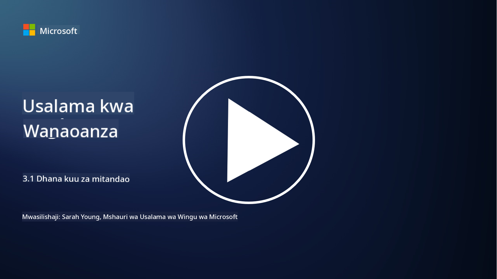
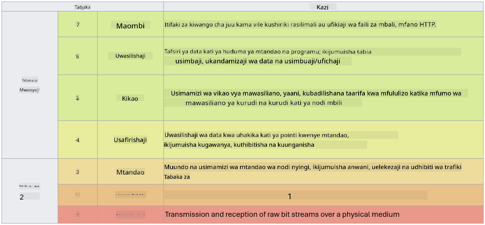

<!--
CO_OP_TRANSLATOR_METADATA:
{
  "original_hash": "252724eceeb183fb9018f88c5e1a3f0c",
  "translation_date": "2025-09-04T01:49:13+00:00",
  "source_file": "3.1 Networking key concepts.md",
  "language_code": "sw"
}
-->
# Misingi Muhimu ya Mitandao

Ikiwa umewahi kufanya kazi yoyote katika IT, kuna uwezekano mkubwa kwamba umekutana na dhana za mitandao. Ingawa tunatumia utambulisho kama udhibiti wetu wa msingi wa mipaka katika mazingira ya kisasa, hii haimaanishi kwamba udhibiti wa mtandao hauna umuhimu. Ingawa hili ni somo pana, katika somo hili tutajadili baadhi ya dhana muhimu za mitandao.

Katika somo hili, tutajadili:

- IP Addressing ni nini?

- Mfano wa OSI ni nini?

- TCP/UDP ni nini?

- Namba za Port ni nini?

- Usimbaji fiche wa data iliyohifadhiwa na inayosafirishwa ni nini?

## IP Addressing ni nini?

IP Addressing, au anwani ya Itifaki ya Mtandao, ni lebo ya nambari inayotolewa kwa kila kifaa kilichounganishwa kwenye mtandao wa kompyuta unaotumia Itifaki ya Mtandao kwa mawasiliano. Inatumika kama kitambulisho cha kipekee kwa vifaa ndani ya mtandao, ikiruhusu kutuma na kupokea data kupitia mtandao au mitandao mingine iliyounganishwa. Kuna matoleo mawili makuu ya IP Addressing: IPv4 (Internet Protocol version 4) na IPv6 (Internet Protocol version 6). Anwani ya IP kawaida huwakilishwa katika muundo wa IPv4 (mfano, 192.168.1.1) au muundo wa IPv6 (mfano, 2001:0db8:85a3:0000:0000:8a2e:0370:7334).

## Mfano wa OSI ni nini?

Mfano wa OSI (Open Systems Interconnection) ni mfumo wa dhana unaosanifisha kazi za mfumo wa mawasiliano katika tabaka saba tofauti. Kila tabaka hufanya kazi maalum na huwasiliana na tabaka jirani ili kuhakikisha mawasiliano ya data yenye ufanisi na ya kuaminika kati ya vifaa kwenye mtandao. Tabaka hizo, kutoka chini kwenda juu, ni kama ifuatavyo:

1. Tabaka la Kimwili (Physical Layer)

2. Tabaka la Kiungo cha Data (Data Link Layer)

3. Tabaka la Mtandao (Network Layer)

4. Tabaka la Usafirishaji (Transport Layer)

5. Tabaka la Kikao (Session Layer)

6. Tabaka la Uwasilishaji (Presentation Layer)

7. Tabaka la Maombi (Application Layer)

Mfano wa OSI hutoa rejeleo la kawaida la kuelewa jinsi itifaki na teknolojia za mitandao zinavyoshirikiana, bila kujali vifaa au programu maalum zinazotumika.

  
_ref: https://en.wikipedia.org/wiki/OSI_model_

## TCP/UDP ni nini?

TCP (Transmission Control Protocol) na UDP (User Datagram Protocol) ni itifaki mbili za msingi za tabaka la usafirishaji zinazotumika katika mitandao ya kompyuta kuwezesha mawasiliano kati ya vifaa kupitia mtandao au ndani ya mtandao wa ndani. Zinahusika na kugawanya data katika pakiti kwa ajili ya usafirishaji na kisha kuziunganisha tena katika data ya awali upande wa mpokeaji. Hata hivyo, zinatofautiana katika sifa na matumizi yao.

**TCP (Transmission Control Protocol):**

TCP ni itifaki inayotegemea muunganisho ambayo hutoa utoaji wa data wa kuaminika na uliopangwa kati ya vifaa. Inaanzisha muunganisho kati ya mtumaji na mpokeaji kabla ya kubadilishana data kuanza. TCP huhakikisha kwamba pakiti za data zinafika kwa mpangilio sahihi na inaweza kushughulikia utumaji upya wa pakiti zilizopotea ili kuhakikisha uadilifu na ukamilifu wa data. Hii inafanya TCP kufaa kwa programu zinazohitaji utoaji wa data wa kuaminika, kama vile kuvinjari wavuti, barua pepe, uhamishaji wa faili (FTP), na mawasiliano ya hifadhidata.

**UDP (User Datagram Protocol):**

UDP ni itifaki isiyotegemea muunganisho ambayo hutoa usafirishaji wa data wa haraka lakini haina kiwango sawa cha uaminifu kama TCP. Haianzishi muunganisho rasmi kabla ya kutuma data na haina mifumo ya kuthibitisha au kutuma upya pakiti zilizopotea. UDP inafaa kwa programu ambapo kasi na ufanisi ni muhimu zaidi kuliko utoaji wa uhakika, kama vile mawasiliano ya wakati halisi, utiririshaji wa media, michezo ya mtandaoni, na maswali ya DNS.

Kwa muhtasari, TCP inazingatia uaminifu na utoaji uliopangwa, na kuifanya kufaa kwa programu zinazohitaji usahihi wa data, wakati UDP inasisitiza kasi na ufanisi, na kuifanya kufaa kwa programu ambapo upotevu mdogo wa data au mpangilio usio sahihi unakubalika kwa kubadilishana na ucheleweshaji mdogo. Uchaguzi kati ya TCP na UDP hutegemea mahitaji maalum ya programu au huduma inayotumika.

## Namba za Port ni nini?

Katika mitandao, namba ya port ni kitambulisho cha nambari kinachotumika kutofautisha kati ya huduma au programu tofauti zinazofanya kazi kwenye kifaa kimoja ndani ya mtandao. Port husaidia kuelekeza data inayoingia kwa programu inayofaa. Namba za port ni nambari zisizo na ishara za biti 16, ambayo inamaanisha zinaanzia 0 hadi 65535. Zinagawanywa katika makundi matatu:

- **Well-Known Ports (0-1023):** Zimehifadhiwa kwa huduma za kawaida kama HTTP (port 80) na FTP (port 21).

- **Registered Ports (1024-49151):** Zinatumika kwa programu na huduma ambazo si sehemu ya kundi la well-known lakini zimesajiliwa rasmi.

- **Dynamic/Private Ports (49152-65535):** Zinapatikana kwa matumizi ya muda au binafsi na programu.

## Usimbaji fiche wa data iliyohifadhiwa na inayosafirishwa ni nini?

Usimbaji fiche ni mchakato wa kubadilisha data kuwa muundo salama ili kuilinda dhidi ya ufikiaji usioidhinishwa au uharibifu. Usimbaji fiche unaweza kutumika kwa data "iliyohifadhiwa" (wakati imehifadhiwa kwenye kifaa au seva) na "inayosafirishwa" (wakati inasafirishwa kati ya vifaa au kupitia mitandao).

**Usimbaji fiche wa Data Iliyohifadhiwa:** Hii inahusisha kusimba data iliyohifadhiwa kwenye vifaa, seva, au mifumo ya hifadhi. Hata kama mshambuliaji atapata ufikiaji wa kimwili wa vyombo vya hifadhi, hawezi kufikia data bila funguo za usimbaji. Hii ni muhimu kwa kulinda data nyeti dhidi ya wizi wa vifaa, uvunjaji wa data, au ufikiaji usioidhinishwa.

**Usimbaji fiche wa Data Inayosafirishwa:** Hii inahusisha kusimba data inaposafiri kati ya vifaa au kupitia mitandao. Hii huzuia kusikiliza kwa siri na uingiliaji usioidhinishwa wa data wakati wa usafirishaji. Itifaki za kawaida za usimbaji fiche wa data inaposafirishwa ni pamoja na HTTPS kwa mawasiliano ya wavuti na TLS/SSL kwa kulinda aina mbalimbali za trafiki ya mtandao.

## Kusoma Zaidi
- [How Do IP Addresses Work? (howtogeek.com)](https://www.howtogeek.com/341307/how-do-ip-addresses-work/)  
- [Understanding IP Address: An Introductory Guide (geekflare.com)](https://geekflare.com/understanding-ip-address/)  
- [What is the OSI model? The 7 layers of OSI explained (techtarget.com)](https://www.techtarget.com/searchnetworking/definition/OSI)  
- [The OSI Model – The 7 Layers of Networking Explained in Plain English (freecodecamp.org)](https://www.freecodecamp.org/news/osi-model-networking-layers-explained-in-plain-english/)  
- [TCP/IP protocols - IBM Documentation](https://www.ibm.com/docs/en/aix/7.3?topic=protocol-tcpip-protocols)  
- [Common Ports Cheat Sheet: The Ultimate Ports & Protocols List (stationx.net)](https://www.stationx.net/common-ports-cheat-sheet/)  
- [Azure Data Encryption-at-Rest - Azure Security | Microsoft Learn](https://learn.microsoft.com/azure/security/fundamentals/encryption-atrest?WT.mc_id=academic-96948-sayoung)  

---

**Kanusho**:  
Hati hii imetafsiriwa kwa kutumia huduma ya tafsiri ya AI [Co-op Translator](https://github.com/Azure/co-op-translator). Ingawa tunajitahidi kwa usahihi, tafadhali fahamu kuwa tafsiri za kiotomatiki zinaweza kuwa na makosa au kutokuwa sahihi. Hati ya asili katika lugha yake ya awali inapaswa kuzingatiwa kama chanzo cha mamlaka. Kwa taarifa muhimu, inashauriwa kutumia huduma ya tafsiri ya kitaalamu ya binadamu. Hatutawajibika kwa maelewano mabaya au tafsiri zisizo sahihi zinazotokana na matumizi ya tafsiri hii.