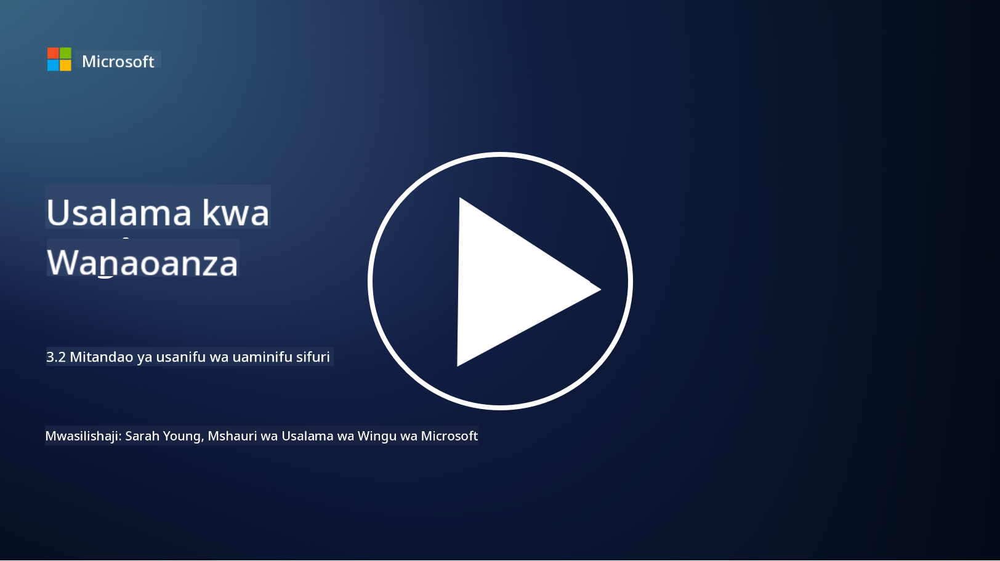

<!--
CO_OP_TRANSLATOR_METADATA:
{
  "original_hash": "680d6e14d9d33fc471c22f44679713f8",
  "translation_date": "2025-09-04T00:40:28+00:00",
  "source_file": "3.2 Networking zero trust architecture.md",
  "language_code": "sw"
}
-->
# Miundombinu ya mtandao ya Zero Trust

Mtandao hutoa safu muhimu katika udhibiti wa Zero Trust, katika somo hili tutajifunza zaidi kuhusu:

 - Je, ugawaji wa mtandao ni nini?  
 - Ugawaji wa mtandao unasaidiaje kutekeleza Zero Trust?  
 - Je, usimbaji wa mwisho hadi mwisho ni nini?  

## Ugawaji wa mtandao ni nini?

Ugawaji wa mtandao ni utaratibu wa kugawa mtandao kuwa sehemu ndogo, zilizotengwa au mitandao midogo. Kila sehemu inatengwa na nyingine, na ufikiaji kati ya sehemu hizo unadhibitiwa na kupunguzwa kulingana na sera maalum za usalama. Ugawaji wa mtandao hutumika kuboresha usalama kwa kuzuia athari za uvunjaji wa usalama na kupunguza harakati za wavamizi ndani ya mtandao.

Kwa kutekeleza ugawaji wa mtandao, shirika linaweza kuunda "maeneo" yanayozitenganisha aina tofauti za watumiaji, programu, na data. Hii inapunguza eneo la shambulio na kupunguza madhara yanayoweza kusababishwa na tukio la usalama. Ugawaji wa mtandao unaweza kufanikishwa kupitia teknolojia kama vile LAN za virtual (VLANs), firewalls, na udhibiti wa ufikiaji.

## Ugawaji wa mtandao unasaidiaje kutekeleza Zero Trust?

Ugawaji wa mtandao unalingana kwa karibu na kanuni za muundo wa Zero Trust. Katika miundombinu ya Zero Trust, ugawaji wa mtandao husaidia kutekeleza kanuni ya "ufikiaji wa kiwango cha chini" kwa kuhakikisha kuwa watumiaji na vifaa vina ufikiaji wa rasilimali na huduma maalum tu zinazohitajika kutekeleza majukumu yao. Kwa kugawa mtandao kuwa maeneo madogo, mashirika yanaweza kutekeleza udhibiti mkali wa ufikiaji, kutenga mali muhimu, na kuzuia harakati za wavamizi.

Ugawaji wa mtandao pia husaidia kutekeleza udhibiti wa ufikiaji unaotegemea utambulisho, ambapo watumiaji na vifaa vinathibitishwa na kuidhinishwa kikamilifu kabla ya kufikia sehemu maalum. Hii inazuia ufikiaji usioidhinishwa wa rasilimali nyeti na kupunguza athari zinazoweza kusababishwa na nywila zilizovunjwa.

## Usimbaji wa mwisho hadi mwisho ni nini?

Usimbaji wa mwisho hadi mwisho (E2E) ni hatua ya usalama inayohakikisha kuwa data inabaki kusimbwa katika safari yake yote kutoka kwa mtumaji hadi mpokeaji. Katika mchakato huu, data inasimbwa kwenye upande wa mtumaji, na ni mpokeaji pekee anayemiliki funguo ya kusimbua ili kufungua na kusoma data. Mchakato wa usimbaji na usimbuaji hufanyika kwenye ncha za mtumaji na mpokeaji, na kufanya iwe vigumu sana kwa wahusika wasioidhinishwa, ikiwa ni pamoja na watoa huduma na wapatanishi, kufikia data halisi.

Usimbaji wa mwisho hadi mwisho hutoa kiwango cha juu cha usiri na usalama kwa mawasiliano ya data, hata kama data inapita kupitia mifumo au mitandao ya wapatanishi mbalimbali. Hutumika sana katika programu za ujumbe salama, huduma za barua pepe, na majukwaa mengine ya mawasiliano ili kulinda taarifa nyeti dhidi ya kuingiliwa na ufikiaji usioidhinishwa.

Njia hii ya usimbaji inahakikisha kuwa hata kama wavamizi wanapata data inayosafirishwa, wataona tu maudhui yaliyosimbwa ambayo hayana maana bila funguo ya kusimbua. Usimbaji wa mwisho hadi mwisho unachukua jukumu muhimu katika kulinda faragha ya mtumiaji na kulinda taarifa nyeti dhidi ya kufichuliwa kwa wahusika wasioidhinishwa.

## SASE ni nini?

SASE inasimama kwa "Secure Access Service Edge," na ni mfumo wa usalama wa mtandao na muundo unaounganisha usalama wa mtandao na uwezo wa mtandao wa eneo pana (WAN) katika huduma moja inayotegemea wingu. SASE imeundwa kutoa ufikiaji salama na unaoweza kupanuka wa rasilimali za mtandao, programu, na data kwa watumiaji wa mbali na wa simu huku ikirahisisha usimamizi wa mtandao na kupunguza ugumu wa miundombinu ya mtandao na usalama ya jadi.

Sifa kuu na vipengele vya SASE ni pamoja na:

1. **Inayotegemea Wingu:** SASE hutolewa kama huduma ya wingu, ambayo ina maana kwamba kazi za usalama na mtandao zinatolewa kutoka kwa wingu badala ya kutegemea vifaa vya jadi vya ndani na vifaa.
   
2. **Muunganiko wa Usalama na Mtandao:** SASE inaunganisha huduma mbalimbali za usalama kama vile lango la wavuti salama (SWG), firewall kama huduma (FWaaS), kuzuia upotevu wa data (DLP), ufikiaji wa mtandao wa Zero Trust (ZTNA), na uboreshaji wa WAN na uwezo wa mtandao wa eneo pana. Muunganiko huu husaidia kurahisisha operesheni za usalama na mtandao.
   
3. **Zero Trust:** SASE inafanya kazi kwa kanuni ya Zero Trust, ambayo ina maana kwamba inatekeleza udhibiti mkali wa ufikiaji na sera za ufikiaji wa kiwango cha chini. Watumiaji na vifaa haviaminiki kwa chaguo-msingi, na lazima vithibitishwe na kuidhinishwa kabla ya kufikia rasilimali.
   
4. **Inayozingatia Utambulisho:** SASE inazingatia utambulisho wa watumiaji na vifaa kama msingi wa udhibiti wa ufikiaji. Sera zinazotegemea utambulisho na muktadha hutumika kuamua ruhusa za ufikiaji, na sera hizi hubadilika kwa nguvu kulingana na tabia ya mtumiaji na muktadha.
   
5. **Uwezo wa Kupanuka na Kubadilika:** SASE inaweza kupanuka kwa urahisi ili kukidhi idadi kubwa ya watumiaji na vifaa, na kuifanya iweze kufaa kwa mashirika yenye mahitaji tofauti na yanayobadilika ya mtandao na usalama.

SASE ni muhimu hasa katika enzi ya kisasa ya kazi ya mbali na matumizi ya wingu, kwani inatoa mbinu kamili na inayoweza kubadilika ya kulinda na kusimamia ufikiaji wa mtandao. Inasaidia mashirika kuendana na mahitaji yanayobadilika ya usalama na mtandao huku yakizingatia kwa nguvu mifano ya usalama inayozingatia mtumiaji na Zero Trust.

## Kusoma zaidi

- [What Is Network Segmentation? - Cisco](https://www.cisco.com/c/en/us/products/security/what-is-network-segmentation.html#~benefits)  
- [What Is Micro-Segmentation? - Cisco](https://www.cisco.com/c/en/us/products/security/what-is-microsegmentation.html)  
- [Implementing Network Segmentation and Segregation | Cyber.gov.au](https://www.cyber.gov.au/resources-business-and-government/maintaining-devices-and-systems/system-hardening-and-administration/network-hardening/implementing-network-segmentation-and-segregation)  
- [What Is Network Segmentation and Why It Matters | CompTIA](https://www.comptia.org/blog/security-awareness-training-network-segmentation)  
- [Network Segmentation: Concepts and Practices (cmu.edu)](https://insights.sei.cmu.edu/blog/network-segmentation-concepts-and-practices/)  
- [Secure networks with Zero Trust | Microsoft Learn](https://learn.microsoft.com/security/zero-trust/deploy/networks?WT.mc_id=academic-96948-sayoung)  
- [What is end-to-end encryption? | IBM](https://www.ibm.com/topics/end-to-end-encryption)  
- [What Is End-to-End Encryption, and Why Does It Matter? (howtogeek.com)](https://www.howtogeek.com/711656/what-is-end-to-end-encryption-and-why-does-it-matter/)  
- [Definition of Secure Access Service Edge (SASE) - Gartner Information Technology Glossary](https://www.gartner.com/en/information-technology/glossary/secure-access-service-edge-sase)  
- [What Is Secure Access Service Edge (SASE)? | Microsoft Security](https://www.microsoft.com/security/business/security-101/what-is-sase?WT.mc_id=academic-96948-sayoung)  

---

**Kanusho**:  
Hati hii imetafsiriwa kwa kutumia huduma ya tafsiri ya AI [Co-op Translator](https://github.com/Azure/co-op-translator). Ingawa tunajitahidi kwa usahihi, tafadhali fahamu kuwa tafsiri za kiotomatiki zinaweza kuwa na makosa au kutokuwa sahihi. Hati ya asili katika lugha yake ya awali inapaswa kuzingatiwa kama chanzo cha mamlaka. Kwa taarifa muhimu, inashauriwa kutumia huduma ya tafsiri ya kitaalamu ya binadamu. Hatutawajibika kwa maelewano mabaya au tafsiri zisizo sahihi zinazotokana na matumizi ya tafsiri hii.