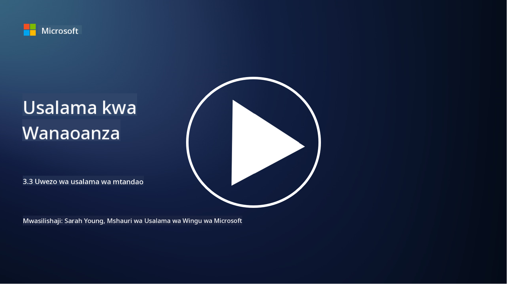

<!--
CO_OP_TRANSLATOR_METADATA:
{
  "original_hash": "c3aba077bb98eebc925dd58d870229ab",
  "translation_date": "2025-09-03T23:35:24+00:00",
  "source_file": "3.3 Network security capabilities.md",
  "language_code": "sw"
}
-->
# Uwezo wa Usalama wa Mtandao

Katika somo hili tutajifunza kuhusu uwezo ufuatao ambao unaweza kutumika kulinda mtandao:

 - Firewalls za jadi
 - Firewalls za programu za wavuti
 - Vikundi vya usalama vya wingu
 - CDN
 - Mizani ya mzigo
 - Seva za Bastion
 - VPNs
 - Ulinzi dhidi ya mashambulizi ya DDoS

## Firewalls za Jadi

Firewalls za jadi ni vifaa vya usalama vinavyodhibiti na kufuatilia trafiki ya mtandao inayoingia na kutoka kulingana na sheria za usalama zilizowekwa awali. Zinatumika kama kizuizi kati ya mtandao wa ndani unaoaminika na mitandao ya nje isiyoaminika, zikichuja trafiki ili kuzuia ufikiaji usioidhinishwa na vitisho vinavyoweza kutokea.

## Firewalls za Programu za Wavuti

Firewalls za Programu za Wavuti (WAFs) ni firewalls maalum zilizoundwa kulinda programu za wavuti dhidi ya mashambulizi mbalimbali, kama vile sindano za SQL, scripting ya tovuti ya msalaba, na udhaifu mwingine. Zinachambua maombi ya HTTP na majibu ili kutambua na kuzuia trafiki mbaya inayolenga programu za wavuti.

## Vikundi vya Usalama vya Wingu

Vikundi vya usalama ni kipengele cha msingi cha usalama wa mtandao kinachotolewa na watoa huduma wa wingu. Vinatumika kama firewalls za mtandao za kawaida zinazodhibiti trafiki inayoingia na kutoka kwa rasilimali za wingu, kama mashine za kawaida (VMs) na mifano. Vikundi vya usalama huruhusu mashirika kufafanua sheria zinazoamua aina gani za trafiki zinazoruhusiwa na zinazokataliwa, na kuongeza safu ya ziada ya ulinzi kwa usanidi wa wingu.

## Mtandao wa Usambazaji wa Maudhui (CDN)

Mtandao wa Usambazaji wa Maudhui ni mtandao uliosambazwa wa seva zilizoko katika maeneo mbalimbali ya kijiografia. CDN husaidia kuboresha utendaji na upatikanaji wa tovuti kwa kuhifadhi maudhui na kuyahudumia kutoka kwa seva zilizo karibu na mtumiaji. Pia hutoa kiwango fulani cha ulinzi dhidi ya mashambulizi ya DDoS kwa kusambaza trafiki kwenye maeneo mengi ya seva.

## Mizani ya Mzigo

Mizani ya mzigo husambaza trafiki ya mtandao inayoingia kwenye seva nyingi ili kuboresha matumizi ya rasilimali, kuhakikisha upatikanaji wa juu, na kuboresha utendaji wa programu. Zinasaidia kuzuia mzigo kupita kiasi kwenye seva na kudumisha nyakati za majibu bora, na hivyo kuongeza uimara wa mtandao.

## Seva za Bastion

Seva za Bastion ni seva zilizo salama sana na zimetengwa ambazo hutoa ufikiaji uliodhibitiwa kwa mtandao kutoka kwa mtandao wa nje usioaminika (kama vile mtandao wa intaneti). Zinatumika kama sehemu za kuingilia kwa wasimamizi kufikia mifumo ya ndani kwa usalama. Seva za Bastion kwa kawaida huwekwa na hatua kali za usalama ili kupunguza eneo la mashambulizi.

## Mitandao ya Kibinafsi ya Kijijini (VPNs)

VPNs huunda njia zilizofichwa kati ya kifaa cha mtumiaji na seva ya mbali, kuhakikisha mawasiliano salama na ya faragha juu ya mitandao inayoweza kuwa salama kama intaneti. VPNs hutumika sana kutoa ufikiaji wa mbali kwa mitandao ya ndani, kuruhusu watumiaji kufikia rasilimali kana kwamba wako kimwili kwenye mtandao huo.

## Zana za Ulinzi dhidi ya Mashambulizi ya DDoS

Zana na huduma za ulinzi dhidi ya mashambulizi ya DDoS (Distributed Denial of Service) zimetengenezwa kupunguza athari za mashambulizi ya DDoS, ambapo vifaa vingi vilivyodukuliwa vinajaza mtandao au huduma ili kuizidi uwezo. Suluhisho za ulinzi dhidi ya DDoS hutambua na kuchuja trafiki mbaya, kuhakikisha kwamba trafiki halali bado inaweza kufikia lengo lake.

## Kusoma Zaidi

- [What Is a Firewall? - Cisco](https://www.cisco.com/c/en/us/products/security/firewalls/what-is-a-firewall.html#~types-of-firewalls)
- [What Does a Firewall Actually Do? (howtogeek.com)](https://www.howtogeek.com/144269/htg-explains-what-firewalls-actually-do/)
- [What is a Firewall? How Firewalls Work & Types of Firewalls (kaspersky.com)](https://www.kaspersky.com/resource-center/definitions/firewall)
- [Network security group - how it works | Microsoft Learn](https://learn.microsoft.com/azure/virtual-network/network-security-group-how-it-works)
- [Introduction to Azure Content Delivery Network (CDN) - Training | Microsoft Learn](https://learn.microsoft.com/training/modules/intro-to-azure-content-delivery-network/?WT.mc_id=academic-96948-sayoung)
- [What is a content delivery network (CDN)? - Azure | Microsoft Learn](https://learn.microsoft.com/azure/cdn/cdn-overview?WT.mc_id=academic-96948-sayoung)
- [What Is Load Balancing? How Load Balancers Work (nginx.com)](https://www.nginx.com/resources/glossary/load-balancing/)
- [Bastion hosts vs. VPNs · Tailscale](https://tailscale.com/learn/bastion-hosts-vs-vpns/)
- [What is VPN? How It Works, Types of VPN (kaspersky.com)](https://www.kaspersky.com/resource-center/definitions/what-is-a-vpn)
- [Introduction to Azure DDoS Protection - Training | Microsoft Learn](https://learn.microsoft.com/training/modules/introduction-azure-ddos-protection/?WT.mc_id=academic-96948-sayoung)
- [What Is a DDoS Attack? | Microsoft Security](https://www.microsoft.com/security/business/security-101/what-is-a-ddos-attack?WT.mc_id=academic-96948-sayoung)

---

**Kanusho**:  
Hati hii imetafsiriwa kwa kutumia huduma ya kutafsiri ya AI [Co-op Translator](https://github.com/Azure/co-op-translator). Ingawa tunajitahidi kuhakikisha usahihi, tafadhali fahamu kuwa tafsiri za kiotomatiki zinaweza kuwa na makosa au kutokuwa sahihi. Hati ya asili katika lugha yake ya awali inapaswa kuzingatiwa kama chanzo cha mamlaka. Kwa taarifa muhimu, tafsiri ya kitaalamu ya binadamu inapendekezwa. Hatutawajibika kwa kutoelewana au tafsiri zisizo sahihi zinazotokana na matumizi ya tafsiri hii.