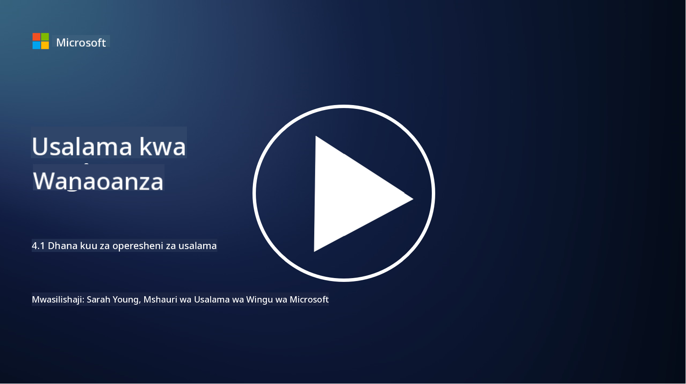

<!--
CO_OP_TRANSLATOR_METADATA:
{
  "original_hash": "6a55b31df9eebf550d040cef0ef7dff3",
  "translation_date": "2025-09-04T02:04:42+00:00",
  "source_file": "4.1 SecOps key concepts.md",
  "language_code": "sw"
}
-->
# Dhana Muhimu za Uendeshaji wa Usalama

Uendeshaji wa usalama ni sehemu muhimu ya kazi ya jumla ya usalama wa shirika. Katika somo hili, tutajifunza zaidi kuhusu haya:

- Je, kazi ya uendeshaji wa usalama ni nini ndani ya biashara?

- Uendeshaji wa usalama unaweza kuchukua umbo gani?

- Uendeshaji wa usalama unatofautianaje na uendeshaji wa kawaida wa IT?

## Je, kazi ya uendeshaji wa usalama ni nini ndani ya biashara?

Kazi ya uendeshaji wa usalama ndani ya biashara inahusu timu au idara maalum inayohusika na kufuatilia, kugundua, kuchunguza, na kujibu vitisho na matukio ya usalama wa mtandao. Lengo kuu la kazi ya uendeshaji wa usalama ni kuhakikisha usiri, uadilifu, na upatikanaji wa mali za kidijitali za shirika kwa kutambua na kupunguza hatari za usalama kwa njia ya haraka na kujibu matukio ya usalama kwa ufanisi.

## Uendeshaji wa usalama unaweza kuchukua umbo gani?

Uendeshaji wa usalama unaweza kuchukua maumbo mbalimbali kulingana na ukubwa na ugumu wa shirika. Baadhi ya maumbo ya kawaida ni:

**Kituo cha Uendeshaji wa Usalama (SOC):** Timu ya kati inayohusika na ufuatiliaji, uchambuzi, na majibu ya matukio ya usalama saa 24/7. SOC mara nyingi hutumia zana na teknolojia za hali ya juu kutambua na kujibu vitisho kwa wakati halisi.

**Timu ya Kujibu Matukio:** Timu maalum inayolenga kujibu matukio na uvunjaji wa usalama. Wanachunguza, kuratibu juhudi za majibu, na kuwezesha urejeshaji.

**Timu ya Kuwinda Vitisho:** Timu inayotafuta kwa makusudi ishara za vitisho vya hali ya juu na udhaifu uliofichika ambao huenda haujatambuliwa na zana za usalama za kawaida.

**Timu Nyekundu/Timu ya Bluu:** Timu nyekundu huiga mashambulizi ili kutambua udhaifu, wakati timu ya bluu inatetea dhidi ya mashambulizi hayo. Timu zote mbili hufanya kazi pamoja kuboresha hatua za usalama.

**Mtoa Huduma za Usalama Zinazosimamiwa (MSSP):** Mashirika mengine huachia uendeshaji wao wa usalama kwa watoa huduma wa nje wanaobobea katika ufuatiliaji wa usalama na majibu ya matukio.

## Uendeshaji wa usalama unatofautianaje na uendeshaji wa kawaida wa IT?

Uendeshaji wa usalama na uendeshaji wa kawaida wa IT ni kazi zinazohusiana lakini tofauti:

**Mtazamo:** Uendeshaji wa IT unalenga kusimamia na kudumisha miundombinu ya IT ya shirika, kuhakikisha utendaji kazi na upatikanaji wake. Uendeshaji wa usalama, kwa upande mwingine, unalenga kutambua na kupunguza hatari za usalama na kujibu matukio.

**Majukumu:** Uendeshaji wa IT hushughulikia kazi kama matengenezo ya mifumo, masasisho ya programu, na msaada wa watumiaji. Uendeshaji wa usalama hushughulikia utambuzi wa vitisho, majibu ya matukio, usimamizi wa udhaifu, na ufuatiliaji wa usalama.

**Uharaka:** Uendeshaji wa IT unasisitiza upatikanaji wa haraka wa mifumo na utendaji wake. Uendeshaji wa usalama unalenga kutambua na kurekebisha vitisho, ambavyo huenda havilingani kila wakati na upatikanaji wa haraka.

**Ujuzi:** Uendeshaji wa usalama unahitaji ujuzi maalum katika uchambuzi wa vitisho, majibu ya matukio, na zana za usalama wa mtandao. Uendeshaji wa IT unahitaji utaalamu katika usimamizi wa mifumo, usimamizi wa mitandao, na msaada wa programu.

## Mtiririko wa kazi wa kujibu matukio

Muundo wa Kazi za Msingi wa Mfumo wa Usalama wa Mtandao wa NIST unataja kazi tano kuu ambazo zinapaswa kufanywa kwa mfululizo kama sehemu ya mazingira ya uendeshaji wa shirika ili kupunguza hatari za usalama wa mtandao.

Ni muhimu kuelewa kwamba shughuli hizi zinapaswa kuwepo kama sehemu ya mzunguko mkubwa unaounganisha na kuendana na michakato ya usalama wa mtandao ya shirika kwa ujumla.

**Note:** Unaweza kusoma zaidi kuhusu Mfumo wa Usalama wa Mtandao wa NIST kwenye [https://www.nist.gov/cybersecurity](https://www.nist.gov/cybersecurity)

## Kusoma zaidi

- [Security operations | Microsoft Learn](https://learn.microsoft.com/security/operations/overview?WT.mc_id=academic-96948-sayoung)  
- [Implementing security operations processes | Microsoft Learn](https://learn.microsoft.com/security/operations/?WT.mc_id=academic-96948-sayoung)  
- [What is a security operations center (SOC)? | Microsoft Security](https://www.microsoft.com/security/business/security-101/what-is-a-security-operations-center-soc?WT.mc_id=academic-96948-sayoung)  
- [What Is a Security Operations Center | Cybersecurity | CompTIA](https://www.comptia.org/content/articles/what-is-a-security-operations-center)  

---

**Kanusho**:  
Hati hii imetafsiriwa kwa kutumia huduma ya tafsiri ya AI [Co-op Translator](https://github.com/Azure/co-op-translator). Ingawa tunajitahidi kwa usahihi, tafadhali fahamu kuwa tafsiri za kiotomatiki zinaweza kuwa na makosa au kutokuwa sahihi. Hati ya asili katika lugha yake ya awali inapaswa kuzingatiwa kama chanzo cha mamlaka. Kwa taarifa muhimu, inashauriwa kutumia huduma ya tafsiri ya kitaalamu ya binadamu. Hatutawajibika kwa maelewano mabaya au tafsiri zisizo sahihi zinazotokana na matumizi ya tafsiri hii.