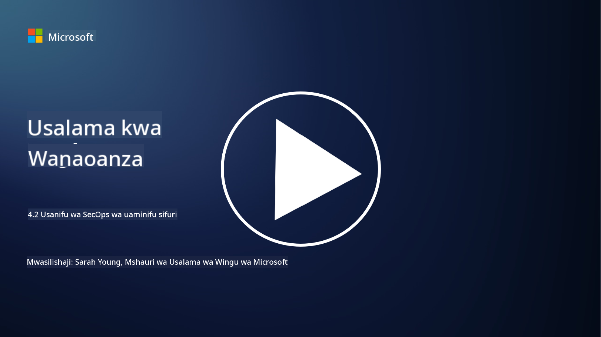

<!--
CO_OP_TRANSLATOR_METADATA:
{
  "original_hash": "45bbdc114e70936816b0b3e7c40189cf",
  "translation_date": "2025-09-04T00:46:41+00:00",
  "source_file": "4.2 SecOps zero trust architecture.md",
  "language_code": "sw"
}
-->
# Usanifu wa zero trust wa SecOps

Operesheni za usalama zinajumuisha sehemu mbili za usanifu wa zero trust, na katika somo hili tutajifunza kuhusu zote:

- Jinsi usanifu wa IT unavyopaswa kujengwa ili kuruhusu ukusanyaji wa kumbukumbu kwa njia ya kati?

- Ni mbinu bora zipi za operesheni za usalama katika mazingira ya kisasa ya IT?

## Jinsi usanifu wa IT unavyopaswa kujengwa ili kuruhusu ukusanyaji wa kumbukumbu kwa njia ya kati?

Ukusanyaji wa kumbukumbu kwa njia ya kati ni sehemu muhimu ya operesheni za usalama za kisasa. Inaruhusu mashirika kukusanya kumbukumbu na data kutoka vyanzo mbalimbali, kama vile seva, programu, vifaa vya mtandao, na zana za usalama, katika hifadhi ya kati kwa uchambuzi, ufuatiliaji, na majibu ya matukio. Hapa kuna mbinu bora za kujenga usanifu wa IT ili kusaidia ukusanyaji wa kumbukumbu kwa njia ya kati:

1. **Ujumuishaji wa Vyanzo vya Kumbukumbu**:

- Hakikisha kuwa vifaa na mifumo yote inayohusika imewekwa ili kuzalisha kumbukumbu. Hii inajumuisha seva, firewalls, routers, switches, programu, na vifaa vya usalama.

- Sanidi vyanzo vya kumbukumbu ili kupeleka kumbukumbu kwa mkusanyaji wa kumbukumbu au mfumo wa usimamizi wa kati.

2. **Chagua zana sahihi ya SIEM (Security Information and Event Management)**:

- Chagua suluhisho la SIEM (Security Information and Event Management) linaloendana na mahitaji na ukubwa wa shirika lako.

- Hakikisha suluhisho lililochaguliwa linaunga mkono ukusanyaji wa kumbukumbu, ujumuishaji, uchambuzi, na utoaji wa ripoti.

3. **Uwezo wa Kuongezeka na Redundancy**:

- Sanifu usanifu kwa uwezo wa kuongezeka ili kukidhi idadi inayoongezeka ya vyanzo vya kumbukumbu na wingi wa kumbukumbu.

- Tekeleza redundancy kwa upatikanaji wa juu ili kuzuia usumbufu kutokana na hitilafu za vifaa au mtandao.

4. **Usafirishaji salama wa kumbukumbu**:

- Tumia itifaki salama kama TLS/SSL au IPsec kwa kusafirisha kumbukumbu kutoka vyanzo hadi hifadhi ya kati.

- Tekeleza uthibitishaji na udhibiti wa ufikiaji ili kuhakikisha kuwa ni vifaa vilivyoidhinishwa pekee vinavyoweza kutuma kumbukumbu.

5. **Urekebishaji**:

- Sanifisha miundo ya kumbukumbu na rekebisha data ili kuhakikisha uthabiti na urahisi wa uchambuzi.

6. **Uhifadhi na Muda wa Kuhifadhi**:

- Amua muda sahihi wa kuhifadhi kumbukumbu kulingana na mahitaji ya kufuata sheria na usalama.

- Hifadhi kumbukumbu kwa usalama, ukilinda dhidi ya ufikiaji usioidhinishwa na uharibifu.

## Ni mbinu bora zipi za operesheni za usalama katika mazingira ya kisasa ya IT?

Mbali na ukusanyaji wa kumbukumbu kwa njia ya kati, hapa kuna mbinu bora za operesheni za usalama katika mazingira ya kisasa ya IT:

1. **Ufuatiliaji Endelevu**: Tekeleza ufuatiliaji endelevu wa shughuli za mtandao na mfumo ili kugundua na kujibu vitisho kwa wakati halisi.

2. **Ujasusi wa Vitisho**: Kuwa na taarifa kuhusu vitisho na udhaifu vinavyoibuka kwa kutumia huduma na vyanzo vya ujasusi wa vitisho.

3. **Mafunzo ya Watumiaji**: Fanya mafunzo ya mara kwa mara ya uelewa wa usalama kwa wafanyakazi ili kupunguza hatari zinazohusiana na uhandisi wa kijamii na mashambulizi ya hadaa.

4. **Mpango wa Majibu ya Matukio**: Tengeneza na jaribu mpango wa majibu ya matukio ili kuhakikisha majibu ya haraka na yenye ufanisi kwa matukio ya usalama.

5. **Uendeshaji wa Usalama**: Tumia zana za uendeshaji na uratibu wa usalama ili kurahisisha majibu ya matukio na kazi za kurudia.

6. **Hifadhi Nakala na Urejeshaji**: Tekeleza suluhisho madhubuti za hifadhi nakala na urejeshaji wa maafa ili kuhakikisha upatikanaji wa data endapo kutatokea upotevu wa data au mashambulizi ya ransomware.

## Kusoma zaidi

- [Microsoft Security Best Practices module: Security operations | Microsoft Learn](https://learn.microsoft.com/security/operations/security-operations-videos-and-decks?WT.mc_id=academic-96948-sayoung)
- [Security operations - Cloud Adoption Framework | Microsoft Learn](https://learn.microsoft.com/azure/cloud-adoption-framework/secure/security-operations?WT.mc_id=academic-96948-sayoung)
- [What is Security Operations and Analytics Platform Architecture? A Definition of SOAPA, How It Works, Benefits, and More (digitalguardian.com)](https://www.digitalguardian.com/blog/what-security-operations-and-analytics-platform-architecture-definition-soapa-how-it-works#:~:text=All%20in%20all%2C%20security%20operations%20and%20analytics%20platform,become%20more%20efficient%20and%20operative%20with%20your%20security.)

---

**Kanusho**:  
Hati hii imetafsiriwa kwa kutumia huduma ya tafsiri ya AI [Co-op Translator](https://github.com/Azure/co-op-translator). Ingawa tunajitahidi kuhakikisha usahihi, tafadhali fahamu kuwa tafsiri za kiotomatiki zinaweza kuwa na makosa au kutokuwa sahihi. Hati ya asili katika lugha yake ya awali inapaswa kuzingatiwa kama chanzo cha mamlaka. Kwa taarifa muhimu, inashauriwa kutumia huduma ya tafsiri ya kitaalamu ya binadamu. Hatutawajibika kwa maelewano mabaya au tafsiri zisizo sahihi zinazotokana na matumizi ya tafsiri hii.