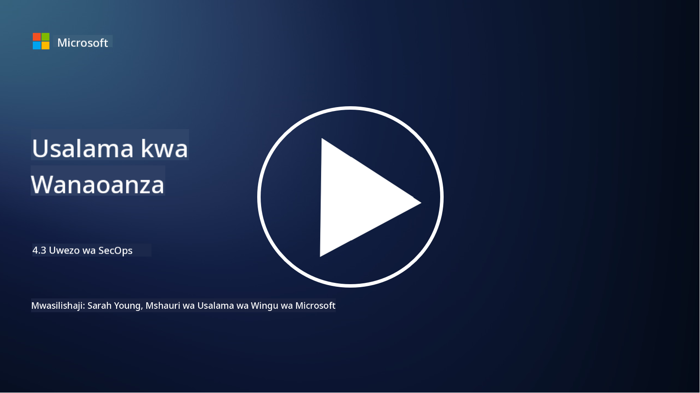

<!--
CO_OP_TRANSLATOR_METADATA:
{
  "original_hash": "553eb694c89f1caca0694e8d8ab89e0e",
  "translation_date": "2025-09-04T01:21:53+00:00",
  "source_file": "4.3 SecOps capabilities.md",
  "language_code": "sw"
}
-->
# Uwezo wa SecOps

Katika sehemu hii, tutajadili kwa undani zaidi kuhusu zana na uwezo wa msingi unaoweza kutumika katika operesheni za usalama.

Katika somo hili, tutajadili:

- Nini maana ya chombo cha usimamizi wa taarifa za usalama na matukio (SIEM)?

- XDR ni nini?

- Ni aina gani ya uwezo unaoweza kutumika kuboresha operesheni za usalama?

## Nini maana ya chombo cha usimamizi wa taarifa za usalama na matukio (SIEM)?

Chombo cha Usimamizi wa Taarifa za Usalama na Matukio (SIEM) hutumika kutoa uchambuzi wa tahadhari za usalama zinazozalishwa katika mazingira ya IT ya shirika. Huchukua, kukusanya, kuunganisha, na kuchambua data ya kumbukumbu na matukio ya usalama kutoka vyanzo mbalimbali, kama vile vifaa vya mtandao, seva, programu, na mifumo ya usalama.

Kazi na uwezo muhimu wa zana za SIEM ni pamoja na:

1. **Ukusanyaji wa Kumbukumbu**: Zana za SIEM hukusanya kumbukumbu na data ya matukio ya usalama kutoka kwa vifaa, mifumo, na programu mbalimbali, ikiwa ni pamoja na firewalls, mifumo ya kugundua uvamizi, programu za antivirus, na zaidi.

2. **Urekebishaji wa Data**: Hurekebisha data ya kumbukumbu kuwa muundo wa kawaida ili kurahisisha uchambuzi na uunganishaji.

3. **Uunganishaji wa Matukio**: Zana za SIEM huunganisha matukio ili kutambua mifumo na hali zisizo za kawaida ambazo zinaweza kuashiria matukio au vitisho vya usalama.

4. **Tahadhari na Arifa**: Zana za SIEM huzalisha tahadhari na arifa kwa wakati halisi pale shughuli za kutiliwa shaka au ukiukaji wa usalama unapogunduliwa, kuruhusu hatua za haraka.

5. **Ugunduzi wa Matukio**: Huwezesha ugunduzi wa matukio ya usalama, ikiwa ni pamoja na ufikiaji usioidhinishwa, uvunjaji wa data, maambukizi ya programu hasidi, na vitisho vya ndani.

6. **Uchambuzi wa Tabia za Watumiaji na Viumbe (UEBA)**: Baadhi ya zana za SIEM zinajumuisha uwezo wa UEBA kutambua tabia zisizo za kawaida za watumiaji na viumbe ambazo zinaweza kuashiria akaunti zilizovurugwa au vitisho vya ndani.

7. **Ujumuishaji wa Ujasusi wa Vitisho**: Zana za SIEM zinaweza kuunganishwa na vyanzo vya ujasusi wa vitisho ili kuboresha ugunduzi wa vitisho kwa kulinganisha viashiria vya hatari vinavyojulikana (IOCs) na shughuli za mtandao.

8. **Uendeshaji na Uratibu**: Vipengele vya kiotomatiki huruhusu SIEM kuendesha majibu kwa matukio ya kawaida ya usalama, kupunguza muda wa majibu na juhudi za mikono.

9. **Dashibodi na Uonyeshaji**: Zinatoa dashibodi na zana za uonyeshaji kwa ufuatiliaji wa data ya usalama na kuunda ripoti maalum.

10. **Ujumuishaji na Zana Nyingine za Usalama**: Zana za SIEM mara nyingi huunganishwa na zana na teknolojia nyingine za usalama, kama suluhisho za kugundua na kujibu kwenye vifaa (EDR), ili kutoa mtazamo wa jumla wa hali ya usalama ya shirika.

## XDR ni nini?

XDR (Extended Detection and Response) ni teknolojia inayopanua uwezo wa kugundua na kujibu kwenye vifaa (EDR) na kuunganisha na telemetry pana ya usalama kutoka vyanzo mbalimbali ili kutoa mtazamo wa kina zaidi wa hali ya usalama ya shirika. XDR inalenga kuboresha ugunduzi wa vitisho, majibu ya matukio, na usalama wa jumla kwa kushughulikia mapungufu ya kutegemea EDR, SIEM au zana nyingine za usalama pekee.

Sifa na vipengele muhimu vya XDR ni pamoja na:

1. **Ujumuishaji wa Data**: XDR hujumuisha data kutoka vyanzo mbalimbali, ikiwa ni pamoja na vifaa, trafiki ya mtandao, huduma za wingu, barua pepe, na zaidi. Ukusanyaji huu wa data kwa kina hutoa muktadha mpana wa ugunduzi wa vitisho na uchambuzi.

2. **Uchambuzi wa Juu**: XDR hutumia uchambuzi wa hali ya juu, ujifunzaji wa mashine, na uchambuzi wa tabia kutambua na kuweka kipaumbele kwa vitisho vya usalama. Hutafuta mifumo na hali zisizo za kawaida katika data iliyojumuishwa ili kugundua vitisho vinavyojulikana na visivyojulikana.

3. **Ugunduzi wa Vitisho Kiotomatiki**: XDR huendesha ugunduzi wa vitisho vya usalama na hali zisizo za kawaida kwa kuunganisha taarifa kutoka vyanzo mbalimbali. Inaweza kutambua minyororo ya mashambulizi tata inayoweza kuhusisha njia nyingi.

4. **Uchunguzi na Majibu ya Matukio**: XDR hutoa zana za uchunguzi na majibu ya matukio, kusaidia timu za usalama kutathmini haraka upeo na athari za matukio na kuchukua hatua stahiki za kurekebisha.

5. **Ujumuishaji wa Ujasusi wa Vitisho**: Inajumuisha vyanzo vya ujasusi wa vitisho na data ili kuboresha ugunduzi wa vitisho kwa kulinganisha viashiria vya hatari vinavyojulikana (IOCs) na shughuli za mtandao na vifaa vya shirika.

6. **Dashibodi ya Pamoja**: XDR kwa kawaida hutoa dashibodi ya pamoja ambapo timu za usalama zinaweza kutazama na kudhibiti tahadhari na matukio ya usalama kutoka vyanzo tofauti kwa njia ya kati.

7. **Ufunikaji wa Mifumo Mbalimbali**: Suluhisho za XDR hufunika mifumo mbalimbali, ikiwa ni pamoja na vifaa, seva, mazingira ya wingu, na vifaa vya mkononi, na kuifanya iweze kutumika kwa mazingira ya IT ya kisasa yenye mifumo mingi.

## Ni aina gani ya uwezo unaoweza kutumika kuboresha operesheni za usalama?

Ili kuboresha operesheni za usalama, mashirika yanaweza kutumia uwezo kadhaa pamoja na zana za SIEM:

1. **Ujifunzaji wa Mashine na Akili Bandia**: Tekeleza uchambuzi wa hali ya juu, ujifunzaji wa mashine, na AI ili kugundua vitisho vinavyoendelea kubadilika na kuendesha uwindaji wa vitisho kiotomatiki.

2. **Uchambuzi wa Tabia za Watumiaji na Viumbe (UEBA)**: Changanua tabia za watumiaji na viumbe ili kugundua hali zisizo za kawaida na vitisho vya ndani.

3. **Vyanzo vya Ujasusi wa Vitisho**: Jumuisha vyanzo vya ujasusi wa vitisho ili kusasisha kuhusu vitisho vya hivi karibuni na viashiria vya hatari.

4. **Uratibu, Uendeshaji, na Majibu ya Usalama (SOAR)**: Tekeleza majukwaa ya SOAR ili kuendesha majibu ya matukio na kurahisisha mtiririko wa kazi za operesheni za usalama.

5. **Teknolojia za Udanganyifu**: Tumia teknolojia za udanganyifu ili kupotosha na kugundua wavamizi ndani ya mtandao.

## Kusoma zaidi

- [What is SIEM? | Microsoft Security](https://www.microsoft.com/security/business/security-101/what-is-siem?WT.mc_id=academic-96948-sayoung)  
- [What Is SIEM? - Security Information and Event Management - Cisco](https://www.cisco.com/c/en/us/products/security/what-is-siem.html)  
- [Security information and event management - Wikipedia](https://en.wikipedia.org/wiki/Security_information_and_event_management)  
- [What Is XDR? | Microsoft Security](https://www.microsoft.com/security/business/security-101/what-is-xdr?WT.mc_id=academic-96948-sayoung)  
- [XDR & XDR Security (kaspersky.com.au)](https://www.kaspersky.com.au/resource-center/definitions/what-is-xdr)  
- [The Power of SecOps: Redefining Core Security Capabilities - The New Stack](https://thenewstack.io/the-power-of-secops-redefining-core-security-capabilities/)  
- [Seven Steps to Improve Your Security Operations and Response (securityintelligence.com)](https://securityintelligence.com/seven-steps-to-improve-your-security-operations-and-response/)  

---

**Kanusho**:  
Hati hii imetafsiriwa kwa kutumia huduma ya tafsiri ya AI [Co-op Translator](https://github.com/Azure/co-op-translator). Ingawa tunajitahidi kwa usahihi, tafadhali fahamu kuwa tafsiri za kiotomatiki zinaweza kuwa na makosa au kutokuwa sahihi. Hati ya asili katika lugha yake ya awali inapaswa kuzingatiwa kama chanzo cha mamlaka. Kwa taarifa muhimu, inashauriwa kutumia huduma ya tafsiri ya kitaalamu ya binadamu. Hatutawajibika kwa maelewano mabaya au tafsiri zisizo sahihi zinazotokana na matumizi ya tafsiri hii.