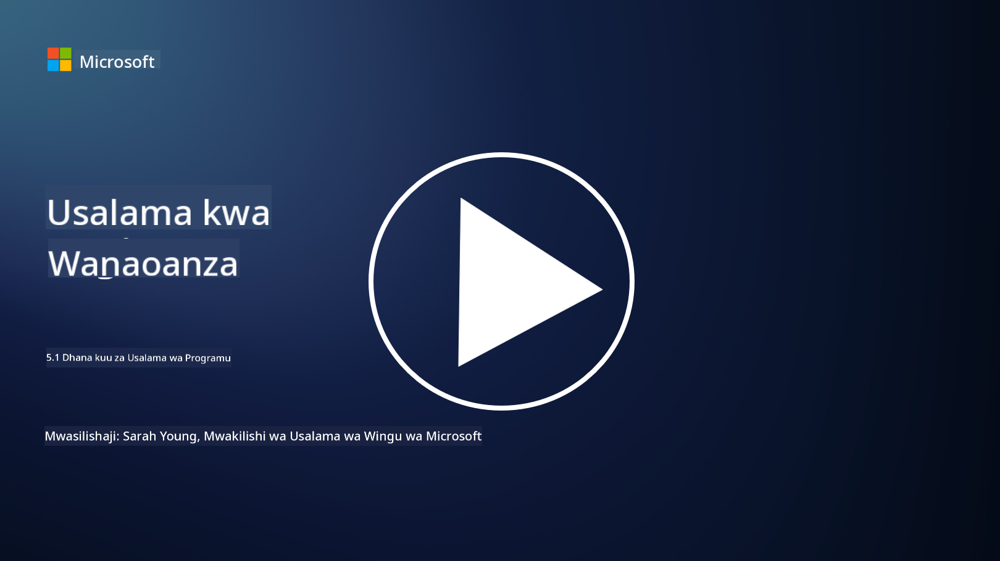

<!--
CO_OP_TRANSLATOR_METADATA:
{
  "original_hash": "e4b56bb23078d3ffb7ad407d280b0c36",
  "translation_date": "2025-09-04T00:33:40+00:00",
  "source_file": "5.1 AppSec key concepts.md",
  "language_code": "sw"
}
-->
# Dhana kuu za Usalama wa Programu

Usalama wa programu ni utaalamu wa kiusalama kwa haki yake. Katika sehemu hii ya kozi, tutachunguza zaidi kuhusu usalama wa programu.

## Utangulizi

Katika somo hili, tutajadili:

- Usalama wa programu ni nini?

- Dhana kuu/misingi ya usalama wa programu ni ipi?

## Usalama wa programu ni nini?

Usalama wa programu, mara nyingi hujulikana kama "AppSec," ni mazoea ya kulinda programu za kompyuta dhidi ya vitisho vya kiusalama, udhaifu, na mashambulizi. Inajumuisha michakato, mbinu, na zana zinazotumika kutambua, kupunguza, na kuzuia hatari za kiusalama katika mzunguko mzima wa maendeleo, utekelezaji, na matengenezo ya programu.

Usalama wa programu ni muhimu kwa sababu programu ni malengo ya kawaida ya mashambulizi ya mtandao. Wahusika wa uhalifu hutumia udhaifu na mapungufu katika programu kupata ufikiaji usioidhinishwa, kuiba data, kuvuruga huduma, au kutekeleza shughuli nyingine za uhalifu. Usalama wa programu unaofaa husaidia kuhakikisha usiri, uadilifu, na upatikanaji wa programu na data inayohusiana.

## Dhana kuu/misingi ya usalama wa programu ni ipi?

Dhana kuu na misingi inayosimamia usalama wa programu ni pamoja na:

1. **Salama kwa Muundo**:

- Usalama unapaswa kuingizwa katika muundo na usanifu wa programu tangu mwanzo, badala ya kuongezwa baadaye.

2. **Uthibitishaji wa Ingizo**:

- Ingizo zote za watumiaji zinapaswa kuthibitishwa ili kuhakikisha zinakidhi muundo unaotarajiwa na hazina msimbo au data hatarishi.

3. **Usimbaji wa Matokeo**:

- Data inayotumwa kwa mteja inapaswa kusimbwa ipasavyo ili kuzuia udhaifu kama vile uandishi wa tovuti (XSS).

4. **Uthibitishaji na Uidhinishaji**:

- Thibitisha watumiaji na uidhinishe ufikiaji wao wa rasilimali kulingana na majukumu na ruhusa zao.

5. **Ulinzi wa Data**:

- Data nyeti inapaswa kusimbwa wakati inahifadhiwa, inasafirishwa, na inachakatwa ili kuzuia ufikiaji usioidhinishwa.

6. **Usimamizi wa Vikao**:

- Usimamizi salama wa vikao unahakikisha vikao vya watumiaji vinalindwa dhidi ya utekaji na ufikiaji usioidhinishwa.

7. **Utegemezi Salama**:

- Hakikisha utegemezi wote wa programu zinasasishwa na viraka vya kiusalama ili kuzuia udhaifu.

8. **Ushughulikiaji wa Makosa na Kumbukumbu**:

- Tekeleza ushughulikiaji salama wa makosa ili kuepuka kufichua taarifa nyeti na hakikisha mazoea salama ya kumbukumbu.

9. **Upimaji wa Usalama**:

- Pima programu mara kwa mara kwa udhaifu kwa kutumia mbinu kama upimaji wa kupenya, ukaguzi wa msimbo, na zana za skanning otomatiki.

10. **Mzunguko Salama wa Maendeleo ya Programu (SDLC)**:

- Ingiza mazoea ya kiusalama katika kila awamu ya mzunguko wa maendeleo ya programu, kuanzia mahitaji hadi utekelezaji na matengenezo.

## Usomaji wa ziada

- [SheHacksPurple: Usalama wa Programu ni Nini? - YouTube](https://www.youtube.com/watch?v=eNmccQNzSSY)
- [Usalama wa Programu ni Nini? - Cisco](https://www.cisco.com/c/en/us/solutions/security/application-first-security/what-is-application-security.html#~how-does-it-work)
- [Usalama wa programu ni nini? Mchakato na zana za kulinda programu | CSO Online](https://www.csoonline.com/article/566471/what-is-application-security-a-process-and-tools-for-securing-software.html)
- [OWASP Cheat Sheet Series | OWASP Foundation](https://owasp.org/www-project-cheat-sheets/)

---

**Kanusho**:  
Hati hii imetafsiriwa kwa kutumia huduma ya tafsiri ya AI [Co-op Translator](https://github.com/Azure/co-op-translator). Ingawa tunajitahidi kwa usahihi, tafadhali fahamu kuwa tafsiri za kiotomatiki zinaweza kuwa na makosa au kutokuwa sahihi. Hati ya asili katika lugha yake ya awali inapaswa kuzingatiwa kama chanzo cha mamlaka. Kwa taarifa muhimu, inashauriwa kutumia huduma ya tafsiri ya kitaalamu ya binadamu. Hatutawajibika kwa maelewano mabaya au tafsiri zisizo sahihi zinazotokana na matumizi ya tafsiri hii.