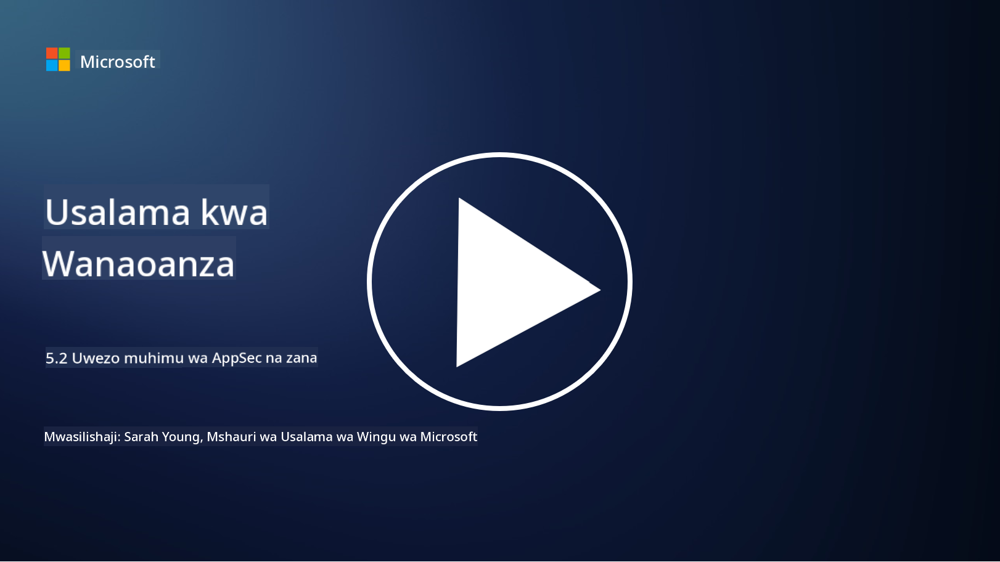

<!--
CO_OP_TRANSLATOR_METADATA:
{
  "original_hash": "790a3fa7e535ec60bb51bde13e759781",
  "translation_date": "2025-09-04T00:52:08+00:00",
  "source_file": "5.2 AppSec key capabilities.md",
  "language_code": "sw"
}
-->
## Utangulizi

Katika somo hili, tutajadili uwezo muhimu na zana zinazotumika katika usalama wa programu.

## Uwezo na Zana Muhimu za AppSec

Uwezo na zana muhimu zinazotumika katika usalama wa programu ni muhimu kwa kutambua, kupunguza, na kuzuia udhaifu wa usalama na vitisho katika programu za kompyuta. Hapa kuna baadhi ya zana na uwezo muhimu zaidi:

**1. Upimaji wa Usalama wa Programu wa Kawaida (SAST)**:

- **Uwezo**: Huchanganua msimbo wa chanzo, bytecode, au msimbo wa binary ili kutambua udhaifu wa usalama katika msimbo wa programu.

- **Zana**: Mifano ni pamoja na Fortify, Checkmarx, na Veracode.

**2. Upimaji wa Usalama wa Programu wa Muda Halisi (DAST)**:

- **Uwezo**: Huchanganua programu inayofanya kazi ili kutambua udhaifu kwa kutuma maombi ya pembejeo na kuchanganua majibu.

- **Zana**: Mifano ni pamoja na ZAP, Burp Suite, na Qualys Web Application Scanning.

**3. Upimaji wa Usalama wa Programu wa Kuingiliana (IAST)**:

- **Uwezo**: Huchanganya vipengele vya SAST na DAST kuchanganua msimbo wakati wa utekelezaji, ikitoa matokeo sahihi zaidi na kupunguza taarifa za uongo.

- **Zana**: Mifano ni pamoja na Contrast Security na HCL AppScan.

**4. Ulinzi wa Programu Wakati wa Utekelezaji (RASP)**:

- **Uwezo**: Hufuatilia na kulinda programu kwa muda halisi, kutambua na kujibu vitisho vya usalama vinavyotokea.

- **Zana**: Mifano ni pamoja na Veracode Runtime Protection na F5 Advanced WAF with RASP.

**5. Firewalls za Programu za Wavuti (WAFs)**:

- **Uwezo**: Hutoa safu ya ulinzi kati ya programu na mtandao, kuchuja trafiki inayoingia na kuzuia maombi yenye nia mbaya.

- **Zana**: Mifano ni pamoja na ModSecurity, AWS WAF, na Akamai Kona Site Defender.

**6. Uchunguzi wa Maktaba za Nje**:

- **Uwezo**: Hutambua udhaifu katika maktaba na vipengele vya wahusika wa tatu vinavyotumika katika programu.

- **Zana**: Mifano ni pamoja na OWASP Dependency-Check na Snyk.

**7. Upimaji wa Kupenya (Pen Testing)**:

- **Uwezo**: Hufanya mashambulizi ya mfano wa ulimwengu halisi ili kugundua udhaifu na kutathmini usalama wa programu.

- **Zana**: Hufanywa na wahandisi wa usalama walioidhinishwa wakitumia zana mbalimbali kama Metasploit na Nmap.

**8. Uchunguzi na Uchambuzi wa Usalama**:

- **Uwezo**: Huchanganua udhaifu unaojulikana, makosa ya usanidi, na mipangilio isiyo salama ya usalama.

- **Zana**: Mifano ni pamoja na Nessus, Qualys Vulnerability Management, na OpenVAS.

**9. Zana za Usalama wa Kontena**:

- **Uwezo**: Hulenga kulinda programu zilizowekwa kwenye kontena na mazingira yao.

- **Zana**: Mifano ni pamoja na Docker Security Scanning na Aqua Security.

**10. Mafunzo ya Maendeleo Salama**:

- **Uwezo**: Hutoa mafunzo na programu za uhamasishaji kwa timu za maendeleo ili kukuza mazoea ya uandishi wa msimbo salama.

- **Zana**: Programu na majukwaa ya mafunzo yaliyobinafsishwa.

**11. Mifumo ya Upimaji wa Usalama**:

- **Uwezo**: Hutoa mifumo ya kina ya upimaji kwa mahitaji tofauti ya upimaji wa usalama wa programu.

- **Zana**: OWASP Amass, OWASP OWTF na FrAppSec.

**12. Zana za Mapitio ya Msimbo Salama**:

- **Uwezo**: Hupitia msimbo wa chanzo kwa udhaifu wa usalama na mazoea bora ya uandishi wa msimbo.

- **Zana**: Mifano ni pamoja na SonarQube na Checkmarx.

**13. Zana za Usalama wa APIs na Huduma Ndogo**:

- **Uwezo**: Hulenga kulinda APIs na huduma ndogo, ikiwa ni pamoja na uthibitishaji, idhini, na ulinzi wa data.

- **Zana**: Mifano ni pamoja na Apigee, AWS API Gateway, na Istio.

## Kusoma Zaidi

- [What Is Application Security? Concepts, Tools & Best Practices | HackerOne](https://www.hackerone.com/knowledge-center/what-application-security-concepts-tools-best-practices)  
- [What is IAST? (Interactive Application Security Testing) (comparitech.com)](https://www.comparitech.com/net-admin/what-is-iast/)  
- [10 Types of Application Security Testing Tools: When and How to Use Them (cmu.edu)](https://insights.sei.cmu.edu/blog/10-types-of-application-security-testing-tools-when-and-how-to-use-them/)  
- [Shifting the Balance of Cybersecurity Risk: Principles and Approaches for Security-by-Design and Default | Cyber.gov.au](https://www.cyber.gov.au/about-us/view-all-content/publications/principles-and-approaches-for-security-by-design-and-default)  

---

**Kanusho**:  
Hati hii imetafsiriwa kwa kutumia huduma ya tafsiri ya AI [Co-op Translator](https://github.com/Azure/co-op-translator). Ingawa tunajitahidi kwa usahihi, tafadhali fahamu kuwa tafsiri za kiotomatiki zinaweza kuwa na makosa au kutokuwa sahihi. Hati ya asili katika lugha yake ya awali inapaswa kuzingatiwa kama chanzo cha mamlaka. Kwa taarifa muhimu, inashauriwa kutumia tafsiri ya kitaalamu ya binadamu. Hatutawajibika kwa maelewano mabaya au tafsiri zisizo sahihi zinazotokana na matumizi ya tafsiri hii.