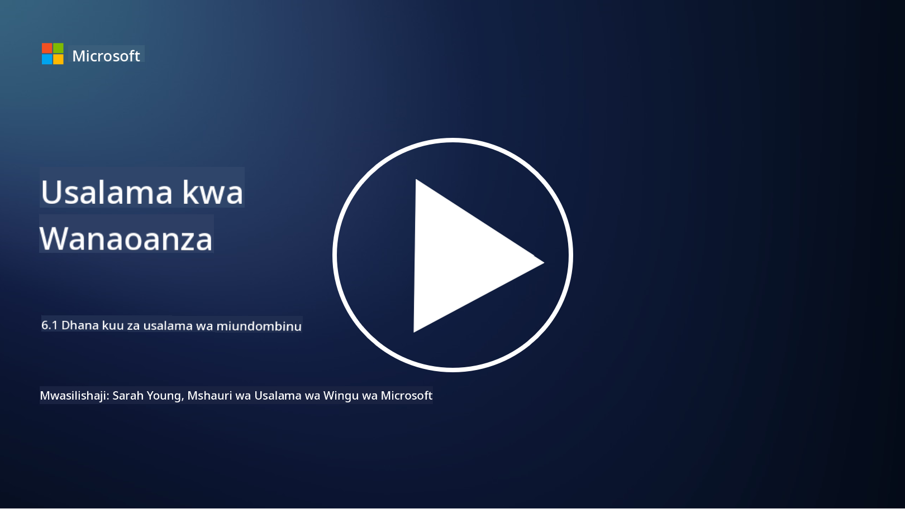

<!--
CO_OP_TRANSLATOR_METADATA:
{
  "original_hash": "882ebf66a648f419bcbf680ed6aefa00",
  "translation_date": "2025-09-03T23:16:24+00:00",
  "source_file": "6.1 Infrastructure security key concepts.md",
  "language_code": "sw"
}
-->
# Dhana Muhimu za Usalama wa Miundombinu

"Miundombinu" inahusu vipengele vya msingi vya mazingira yoyote ya IT, ikiwa ni pamoja na seva, huduma za wingu, na kontena – teknolojia mbalimbali sana. Programu zilizojadiliwa katika sehemu iliyopita zinafanya kazi kwenye miundombinu, hivyo inaweza pia kulengwa na washambuliaji.

Katika somo hili, tutajadili:

- Usafi wa usalama ni nini na kwa nini ni muhimu?

- Usimamizi wa mwelekeo wa usalama ni nini?

- Kusasisha programu ni nini na kwa nini ni muhimu?

- Kontena ni nini na kuna tofauti gani kuhusu usalama wake?

## Usafi wa usalama ni nini na kwa nini ni muhimu?

**Usafi wa usalama** unahusu seti ya mazoea na tabia ambazo watu binafsi na mashirika hufuata ili kudumisha tabia nzuri za usalama wa mtandao. Inahusisha kuchukua hatua za kulinda mifumo, data, na mitandao dhidi ya vitisho na udhaifu. Usafi mzuri wa usalama ni muhimu kwa sababu kadhaa:

- **Kuzuia Mashambulizi**: Kufuatilia mazoea bora kunaweza kuzuia mashambulizi ya kawaida ya mtandao, kama vile ulaghai, maambukizi ya programu hasidi, na ufikiaji usioidhinishwa.

- **Kulinda Data**: Usafi sahihi wa usalama hulinda data nyeti na ya siri dhidi ya wizi au kufichuliwa.

- **Kudumisha Uaminifu**: Mashirika yanayoonyesha usafi mzuri wa usalama hujenga uaminifu na wateja na washirika.

- **Kufuata Sheria**: Kanuni na viwango vingi vinahitaji mashirika kufuata mazoea ya usafi wa usalama.

- **Kupunguza Hatari**: Usafi wa usalama wa mara kwa mara hupunguza hatari ya matukio ya usalama na uvunjaji.

Usafi wa usalama unajumuisha mazoea kama kusasisha programu mara kwa mara, kutumia nywila zenye nguvu na uthibitishaji wa vipengele vingi, kuhifadhi nakala za data mara kwa mara, mafunzo ya wafanyakazi, na kufuatilia shughuli za kutiliwa shaka. Ni msingi wa mwelekeo thabiti wa usalama wa mtandao.

## Usimamizi wa mwelekeo wa usalama ni nini?

Usimamizi wa Mwelekeo wa Usalama unahusu mazoea ya kutathmini, kufuatilia, na kusimamia mwelekeo wa jumla wa usalama wa mtandao wa shirika. Mwelekeo wa usalama wa mtandao unahusu mbinu ya jumla ya shirika na utayari wake wa kulinda mifumo yake ya teknolojia ya habari (IT), mitandao, data, na mali dhidi ya vitisho na mashambulizi ya mtandao. Inajumuisha mikakati, sera, mazoea, na teknolojia ambazo shirika linatumia kulinda mali zake za kidijitali na kudumisha usiri, uadilifu, na upatikanaji wa taarifa zake. Inahusisha kutathmini na kudumisha usalama wa mifumo, mitandao, programu, na data ili kuhakikisha zinaendana na sera za usalama, mazoea bora, na mahitaji ya kufuata sheria. SPM inalenga kutoa mtazamo wa kina wa hali ya usalama wa shirika, kutambua udhaifu na mapungufu, na kuweka kipaumbele katika juhudi za kurekebisha.

## Kusasisha programu ni nini na kwa nini ni muhimu?

**Kusasisha programu** kunahusu mchakato wa kutumia masasisho ya programu, yanayojulikana pia kama viraka au marekebisho, kwenye programu, mifumo ya uendeshaji, na programu. Masasisho haya kwa kawaida hushughulikia udhaifu wa usalama, hitilafu, na masuala mengine ambayo yanaweza kutumiwa na washambuliaji. Vifaa vya maunzi pia vinahitaji kusasishwa: inaweza kuwa firmware yao au OS iliyojengwa ndani. Kusasisha vifaa vya maunzi kunaweza kuwa ngumu zaidi kuliko kusasisha programu.

Kusasisha programu ni muhimu kwa sababu kadhaa:

- **Usalama**: Masasisho hurekebisha udhaifu unaojulikana ambao washambuliaji wanaweza kutumia kuathiri mifumo na kuiba data.

- **Utulivu**: Masasisho mara nyingi hujumuisha maboresho ya utulivu na utendaji, kupunguza hatari ya mifumo kuanguka au kushindwa.

- **Kufuata Sheria**: Kanuni na viwango vingi vya kufuata vinahitaji mashirika kutumia masasisho ya usalama kwa haraka.

- **Kudumisha Uaminifu**: Kusasisha mara kwa mara husaidia kudumisha uaminifu wa wateja na wadau kwa kuonyesha kujitolea kwa usalama.

- **Kupunguza Hatari**: Kusasisha programu hupunguza eneo la mashambulizi na uwezekano wa mashambulizi ya mtandao kufanikiwa.

Kutokufanya masasisho kwa wakati kunaweza kuacha mifumo ikiwa na udhaifu unaojulikana, na hivyo kuongeza hatari ya uvunjaji wa usalama na upotevu wa data.

## Kontena ni nini na kuna tofauti gani kuhusu usalama wake?

Kontena ni aina ya vifurushi vya programu vyepesi, vinavyojitegemea, na vinavyoweza kutekelezwa ambavyo vina kila kitu kinachohitajika kuendesha kipande cha programu, ikiwa ni pamoja na msimbo, mazingira ya utekelezaji, maktaba, na zana za mfumo. Kontena hutoa mazingira thabiti na ya pekee kwa programu, na hivyo kurahisisha kuendeleza, kufunga, na kupeleka programu katika mazingira na majukwaa tofauti. Teknolojia maarufu za kontena ni pamoja na Docker na Kubernetes.

Usalama wa Kontena unahusu mazoea na teknolojia zinazotumika kulinda kontena na programu zinazoendesha ndani yake dhidi ya vitisho na udhaifu mbalimbali. Usalama wa kontena ni muhimu kwa sababu, ingawa kontena hutoa faida nyingi katika suala la kubebeka na kupanuka, pia huleta changamoto za kiusalama:

1. **Usalama wa Picha:** Picha za kontena zinaweza kuwa na udhaifu, na ikiwa picha hizi hazitasasishwa mara kwa mara na kurekebishwa, zinaweza kutumiwa na washambuliaji. Usalama wa kontena unahusisha kuchanganua picha kwa udhaifu unaojulikana na kuhakikisha kuwa picha zinazotumika ni za kuaminika.

2. **Usalama wa Wakati wa Utekelezaji:** Kontena zinazoendesha lazima zitenganishwe kutoka kwa kila moja na mfumo wa mwenyeji ili kuzuia ufikiaji usioidhinishwa na mashambulizi yanayoweza kutokea. Mbinu za usalama wa wakati wa utekelezaji ni pamoja na teknolojia za kutenganisha kontena kama namespaces na cgroups, pamoja na zana za kufuatilia na kuchunguza tabia ya kontena.

3. **Usalama wa Mtandao:** Kontena huwasiliana na kila moja na mifumo ya nje kupitia mitandao. Ugawaji sahihi wa mtandao na sheria za ukuta wa moto ni muhimu kudhibiti trafiki kati ya kontena na kuzuia ufikiaji usioidhinishwa.

4. **Udhibiti wa Ufikiaji:** Kuhakikisha kuwa ni watumiaji na michakato iliyoidhinishwa pekee inayoweza kufikia na kurekebisha kontena ni muhimu. Udhibiti wa ufikiaji kulingana na majukumu (RBAC) na zana za usimamizi wa utambulisho mara nyingi hutumika kwa udhibiti wa ufikiaji.

5. **Kumbukumbu na Ufuatiliaji:** Usalama wa kontena unahusisha ukusanyaji na uchambuzi wa kumbukumbu na data ya ufuatiliaji ili kugundua na kujibu matukio ya usalama na hali zisizo za kawaida kwa wakati halisi.

6. **Usalama wa Uratibu:** Wakati wa kutumia majukwaa ya uratibu wa kontena kama Kubernetes, kulinda safu ya uratibu ni muhimu pia. Hii inajumuisha kulinda seva ya API ya Kubernetes, kuhakikisha sera sahihi za RBAC, na kuchunguza shughuli za klasta.

7. **Usimamizi wa Siri:** Kushughulikia taarifa nyeti, kama funguo za API na nywila, ndani ya kontena kunahitaji suluhisho za uhifadhi na usimamizi salama ili kuzuia kufichuliwa.

Suluhisho za usalama wa kontena mara nyingi zinahusisha mchanganyiko wa mazoea bora ya usalama, zana za kuchanganua udhaifu, mbinu za ulinzi wa wakati wa utekelezaji, usanidi wa usalama wa mtandao, na vipengele vya usalama wa uratibu wa kontena. Ufuatiliaji wa mara kwa mara na otomatiki ni sehemu muhimu za usalama wa kontena ili kugundua na kujibu vitisho haraka kadri programu za kontena zinavyobadilika na kupanuka.

## Kusoma Zaidi

- [The importance of security hygiene | Security Magazine](https://www.securitymagazine.com/articles/99510-the-importance-of-security-hygiene)
- [What is CSPM? | Microsoft Security](https://www.microsoft.com/security/business/security-101/what-is-cspm?WT.mc_id=academic-96948-sayoung)
- [What is Cloud Security Posture Management (CSPM)? | HackerOne](https://www.hackerone.com/knowledge-center/what-cloud-security-posture-management)
- [Function of cloud security posture management - Cloud Adoption Framework | Microsoft Learn](https://learn.microsoft.com/azure/cloud-adoption-framework/organize/cloud-security-posture-management?WT.mc_id=academic-96948-sayoung)
- [What Is a CNAPP? | Microsoft Security](https://www.microsoft.com/security/business/security-101/what-is-cnapp)
- [Why Everyone Is Talking About CNAPP (forbes.com)](https://www.forbes.com/sites/forbestechcouncil/2021/12/10/why-everyone-is-talking-about-cnapp/?sh=567275ca1549)
- [Why is patching important to cybersecurity? - CyberSmart](https://cybersmart.co.uk/blog/why-is-patching-important-to-cybersecurity/)
- [What Is Container Security? Complete Guide [2023] (aquasec.com)](https://www.aquasec.com/cloud-native-academy/container-security/container-security/)

---

**Kanusho**:  
Hati hii imetafsiriwa kwa kutumia huduma ya tafsiri ya AI [Co-op Translator](https://github.com/Azure/co-op-translator). Ingawa tunajitahidi kwa usahihi, tafadhali fahamu kuwa tafsiri za kiotomatiki zinaweza kuwa na makosa au kutokuwa sahihi. Hati ya asili katika lugha yake ya awali inapaswa kuzingatiwa kama chanzo cha mamlaka. Kwa taarifa muhimu, inashauriwa kutumia huduma ya tafsiri ya kitaalamu ya binadamu. Hatutawajibika kwa maelewano mabaya au tafsiri zisizo sahihi zinazotokana na matumizi ya tafsiri hii.