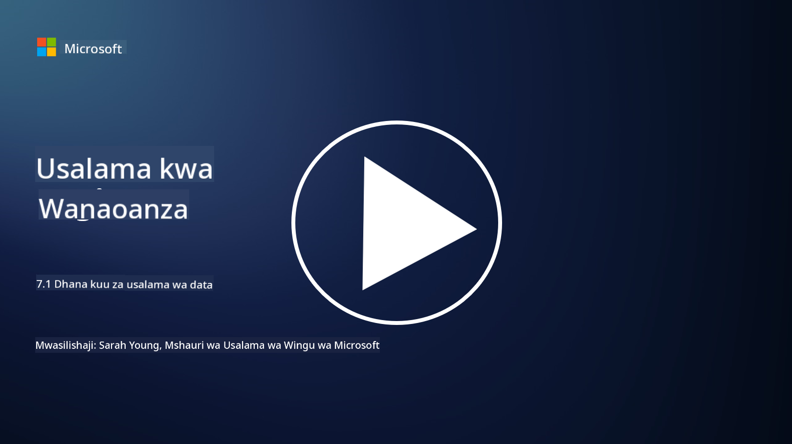

<!--
CO_OP_TRANSLATOR_METADATA:
{
  "original_hash": "9703868f41dcddd5a98dea9ea6fcd94d",
  "translation_date": "2025-09-03T23:59:01+00:00",
  "source_file": "7.1 Data security key concepts.md",
  "language_code": "sw"
}
-->
# Dhana Muhimu Kuhusu Usalama wa Data

Tumegusia usalama wa data mara kadhaa katika kozi hii. Sasa, hebu tuzame kwa undani zaidi katika mada hii. Katika somo hili utajifunza:

- Usalama wa data ni nini?

- Uainishaji wa data ni nini?

- Usimamizi wa mzunguko wa maisha ya data ni nini?

- Kuzuia upotevu wa data (DLP) ni nini?

- Kwa nini usalama wa data ni muhimu kwa shirika?

## Usalama wa data ni nini?

**Usalama wa data** unahusu mazoea ya kulinda data ya kidijitali, kama vile hifadhidata, faili, na taarifa nyeti, dhidi ya ufikiaji usioidhinishwa, ufichuzi, mabadiliko, au uharibifu. Lengo kuu la usalama wa data ni kuhakikisha usiri, uadilifu, na upatikanaji wa data. Hii inahusisha utekelezaji wa mchanganyiko wa hatua za kiufundi, kiutawala, na kimwili ili kulinda data dhidi ya vitisho na udhaifu mbalimbali, ikiwa ni pamoja na mashambulizi ya mtandaoni, vitisho vya ndani, na uvunjaji wa data. Hatua za usalama wa data zinaweza kujumuisha usimbaji fiche, udhibiti wa ufikiaji, uthibitishaji, rekodi za ukaguzi, na sera za usalama.

## Uainishaji wa data ni nini?

**Uainishaji wa data** ni mchakato wa kugawa data kulingana na usikivu wake, thamani yake, na umuhimu wake kwa shirika. Madhumuni ya uainishaji wa data ni kusaidia mashirika kutambua na kuweka kipaumbele katika ulinzi na usimamizi wa aina tofauti za data. Makundi ya kawaida ya uainishaji wa data ni pamoja na "ya umma," "ya ndani," "ya siri," na "iliyowekewa vikwazo" au "siri sana." Mara data inapowekwa katika makundi, mashirika yanaweza kutumia udhibiti wa usalama na vizuizi vya ufikiaji vinavyofaa ili kuhakikisha kuwa data nyeti inalindwa ipasavyo na kwamba inazingatia mahitaji ya kisheria.

## Usimamizi wa mzunguko wa maisha ya data ni nini?

**Usimamizi wa mzunguko wa maisha ya data** ni mbinu iliyopangwa ya kusimamia data katika mzunguko wake wote wa maisha, kuanzia uundaji au upatikanaji hadi kuhifadhiwa au kufutwa. Mzunguko wa maisha ya data kwa kawaida unajumuisha hatua kama vile uundaji, uhifadhi, usindikaji, usafirishaji, uhifadhi wa muda mrefu, na uondoaji. Usimamizi wa mzunguko wa maisha ya data unahusisha kufafanua sera na taratibu kwa kila hatua ya mzunguko wa maisha ya data, ikiwa ni pamoja na uhifadhi wa data, udhibiti wa ufikiaji, nakala za data, na usafishaji wa data. Usimamizi mzuri wa mzunguko wa maisha ya data husaidia mashirika kuboresha uhifadhi wa data, kuboresha ubora wa data, na kuhakikisha uzingatiaji wa kanuni za ulinzi wa data.

## Kuzuia upotevu wa data (DLP) ni nini?

**Kuzuia Upotevu wa Data (DLP)** inahusu seti ya teknolojia, sera, na mazoea yaliyoundwa ili kuzuia ufikiaji, ushiriki, au uvujaji usioidhinishwa wa data nyeti au ya siri. Suluhisho za DLP hutumia ukaguzi wa maudhui na uchambuzi wa muktadha ili kufuatilia na kudhibiti data inayosafirishwa (mfano, barua pepe, trafiki ya wavuti), data iliyohifadhiwa (mfano, faili zilizohifadhiwa na hifadhidata), na data inayotumika (mfano, data inayofikiwa au kushughulikiwa na watumiaji). DLP inalenga kutambua na kuzuia au kusimba data nyeti ili kuzuia uvunjaji wa data, kuzingatia kanuni za ulinzi wa data, na kulinda sifa ya shirika.

## Kwa nini usalama wa data ni muhimu kwa shirika?

Usalama wa data ni muhimu sana kwa mashirika kwa sababu kadhaa:

- **Ulinzi wa Taarifa Nyeti**: Mashirika mara nyingi huhifadhi data nyeti, kama vile rekodi za wateja, mali miliki, data za kifedha, na taarifa za wafanyakazi. Usalama wa data hulinda taarifa hizi nyeti dhidi ya ufikiaji au wizi usioidhinishwa.

- **Uzingatiaji wa Sheria**: Sekta nyingi na mamlaka zina kanuni kali za ulinzi wa data na faragha. Usalama wa data husaidia mashirika kuzingatia sheria hizi, kuepuka adhabu za kisheria na uharibifu wa sifa.

- **Kuzuia Uvunjaji wa Data**: Uvunjaji wa data unaweza kusababisha hasara za kifedha, uharibifu wa sifa, na athari za kisheria. Hatua madhubuti za usalama wa data husaidia kuzuia uvunjaji wa data au kupunguza athari zake.

- **Kulinda Uaminifu**: Wateja na wadau huweka imani kwa mashirika wanaposhirikisha data zao. Uvunjaji wa usalama wa data huharibu uaminifu. Kudumisha usalama wa data wenye nguvu husaidia kuhifadhi uaminifu na imani ya wateja.

- **Faida ya Ushindani**: Kuonyesha kujitolea kwa usalama wa data kunaweza kuwa faida ya ushindani. Wateja na washirika wana uwezekano mkubwa wa kufanya kazi na mashirika yanayochukua usalama wa data kwa uzito.

- **Mwendelezo wa Uendeshaji**: Hatua za usalama wa data, ikiwa ni pamoja na nakala za data na mipango ya kurejesha maafa, husaidia kuhakikisha upatikanaji wa data muhimu na mwendelezo wa biashara wakati wa upotevu wa data au maafa.

- **Ulinzi Dhidi ya Vitisho vya Ndani**: Hatua za usalama wa data pia zinashughulikia vitisho kutoka ndani ya shirika, ikiwa ni pamoja na ufichuzi wa data kwa bahati mbaya na wafanyakazi na vitendo vya uharibifu kutoka kwa watu wa ndani.

Kwa muhtasari, usalama wa data ni muhimu kwa kulinda taarifa nyeti, kuzingatia kanuni, kuzuia uvunjaji wa data, kuhifadhi uaminifu, na kuhakikisha mafanikio endelevu na sifa ya shirika.

## Kusoma zaidi

- [What Is Data Security? | Microsoft Security](https://www.microsoft.com/en-au/security/business/security-101/what-is-data-security?WT.mc_id=academic-96948-sayoung)  
- [Automatically Classify & Protect Documents & Data | Microsoft Purview Information Protection](https://youtu.be/v8LqmzBUaOo)  
- [Example data classification policy](https://www.cmu.edu/data/guidelines/data-classification.html)  
- [What is Data Security? Data Security Definition and Overview | IBM](https://www.ibm.com/topics/data-security)  
- [Data Lifecycle Management: A 2023 Guide for Your Business (cloudwards.net)](https://www.cloudwards.net/data-lifecycle-management/)  
- [What is data loss prevention (DLP)? | Microsoft Security](https://www.microsoft.com/security/business/security-101/what-is-data-loss-prevention-dlp?WT.mc_id=academic-96948-sayoung)  
- [What is DLP? How data loss prevention software works and why you need it | CSO Online](https://www.csoonline.com/article/569559/what-is-dlp-how-data-loss-prevention-software-works-and-why-you-need-it.html)  

---

**Kanusho**:  
Hati hii imetafsiriwa kwa kutumia huduma ya tafsiri ya AI [Co-op Translator](https://github.com/Azure/co-op-translator). Ingawa tunajitahidi kwa usahihi, tafadhali fahamu kuwa tafsiri za kiotomatiki zinaweza kuwa na makosa au kutokuwa sahihi. Hati ya asili katika lugha yake ya awali inapaswa kuzingatiwa kama chanzo cha mamlaka. Kwa taarifa muhimu, inashauriwa kutumia huduma ya tafsiri ya kitaalamu ya binadamu. Hatutawajibika kwa maelewano mabaya au tafsiri zisizo sahihi zinazotokana na matumizi ya tafsiri hii.