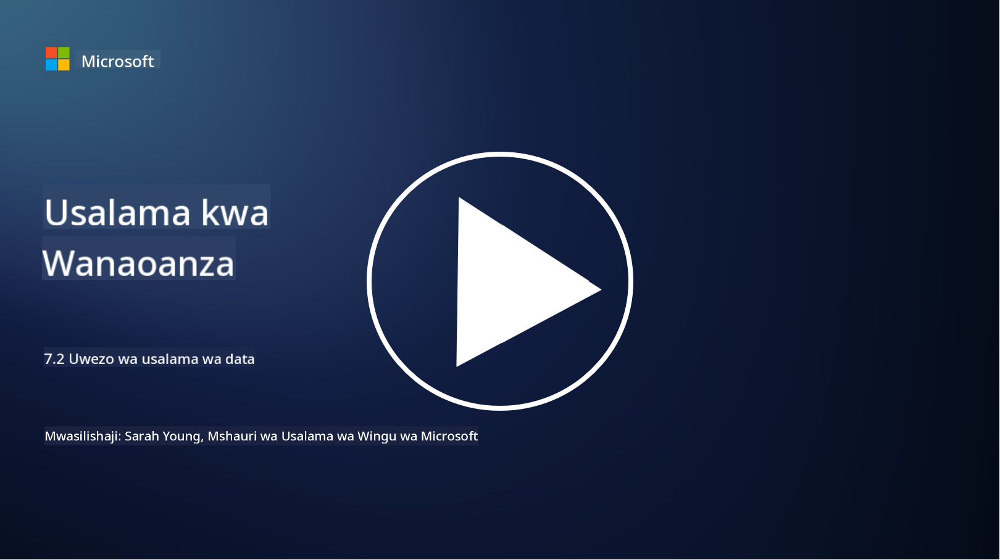

<!--
CO_OP_TRANSLATOR_METADATA:
{
  "original_hash": "50697add9758e54693442d502d2d5f8a",
  "translation_date": "2025-09-04T00:57:37+00:00",
  "source_file": "7.2 Data security capabilities.md",
  "language_code": "sw"
}
-->
# Uwezo wa Usalama wa Data

Katika sehemu hii, tutajadili kwa undani zaidi kuhusu zana na uwezo wa msingi unaotumika katika usalama wa data:

**Utangulizi**

Katika somo hili, tutajadili:

- Zana za kuzuia upotevu wa data ni nini?

- Zana za usimamizi wa hatari za ndani ni nini?

- Zana za uhifadhi wa data zinazopatikana ni zipi?

## Zana za kuzuia upotevu wa data ni nini?

Zana za Kuzuia Upotevu wa Data (DLP) zinahusu seti ya suluhisho za programu na teknolojia zilizoundwa kuzuia ufikiaji usioidhinishwa, usambazaji, au uvujaji wa data nyeti au ya siri ndani ya shirika. Zana hizi hutumia ukaguzi wa maudhui, utekelezaji wa sera, na ufuatiliaji ili kutambua na kulinda data nyeti dhidi ya kufichuliwa au kutumiwa vibaya. Mifano ya bidhaa za DLP ni pamoja na: Symantec Data Loss Prevention, McAfee Total Protection for Data Loss Prevention, Microsoft 365 DLP**: Inajumuika na programu za Microsoft 365 kusaidia mashirika kutambua na kulinda data nyeti ndani ya barua pepe, nyaraka, na ujumbe.

## Zana za usimamizi wa hatari za ndani ni nini?

Zana za Usimamizi wa Hatari za Ndani husaidia mashirika kutambua na kupunguza hatari zinazotokana na wafanyakazi, wakandarasi, au washirika ambao wanaweza kwa makusudi au bila kukusudia kuhatarisha usalama wa data. Zana hizi hufuatilia tabia za watumiaji, mifumo ya ufikiaji, na matumizi ya data ili kugundua shughuli za kutiliwa shaka na vitisho vya ndani vinavyowezekana. Mifano ya bidhaa za usimamizi wa hatari za ndani ni pamoja na: Microsoft Insider Risk Management (sehemu ya Microsoft 365), Forcepoint Insider Threat Data Protection, Varonis Insider Threat Detection.

## Zana za uhifadhi wa data zinazopatikana ni zipi?

Zana za uhifadhi wa data zinajumuisha programu na suluhisho zilizoundwa kusimamia uhifadhi na ufutaji wa data kulingana na sera za uhifadhi wa data za shirika na mahitaji ya kisheria. Zana hizi husaidia kuendesha mchakato wa kuhifadhi data kwa muda maalum na kuifuta kwa usalama inapokuwa haitahitajika tena. Mifano ya bidhaa za uhifadhi wa data ni pamoja na: Veritas Enterprise Vault, Commvault Complete Data Protection, Microsoft data lifecycle management. Suluhisho hizi za zana husaidia mashirika kudhibiti uhifadhi na uondoaji wa data, kuhakikisha kufuata kanuni za ulinzi wa data huku yakisimamia data kwa ufanisi katika mzunguko wake wa maisha.

## Kusoma zaidi

- [Guide to Data Security Posture Management (DSPM) | CSA (cloudsecurityalliance.org)](https://cloudsecurityalliance.org/blog/2023/03/31/the-big-guide-to-data-security-posture-management-dspm/)
- [Data Loss Prevention across endpoints, apps, & services | Microsoft Purview](https://youtu.be/hvqq8L_0kgI)
- [18 Best Data Loss Prevention Software Tools 2023 (Free + Paid) (comparitech.com)](https://www.comparitech.com/data-privacy-management/data-loss-prevention-tools-software/)
- [Data Loss Prevention (nist.gov)](https://tsapps.nist.gov/publication/get_pdf.cfm?pub_id=904672)
- [Learn about insider risk management | Microsoft Learn](https://learn.microsoft.com/purview/insider-risk-management?WT.mc_id=academic-96948-sayoung)
- [Data Lifecycle Management | IBM](https://www.ibm.com/topics/data-lifecycle-management)
- [What Is Data Lifecycle Management (DLM)? | 2023 Best Practices (selecthub.com)](https://www.selecthub.com/big-data-analytics/data-lifecycle-management/)

---

**Kanusho**:  
Hati hii imetafsiriwa kwa kutumia huduma ya tafsiri ya AI [Co-op Translator](https://github.com/Azure/co-op-translator). Ingawa tunajitahidi kwa usahihi, tafadhali fahamu kuwa tafsiri za kiotomatiki zinaweza kuwa na makosa au kutokuwa sahihi. Hati ya asili katika lugha yake ya awali inapaswa kuzingatiwa kama chanzo cha mamlaka. Kwa taarifa muhimu, inashauriwa kutumia huduma ya tafsiri ya kitaalamu ya binadamu. Hatutawajibika kwa maelewano mabaya au tafsiri zisizo sahihi zinazotokana na matumizi ya tafsiri hii.