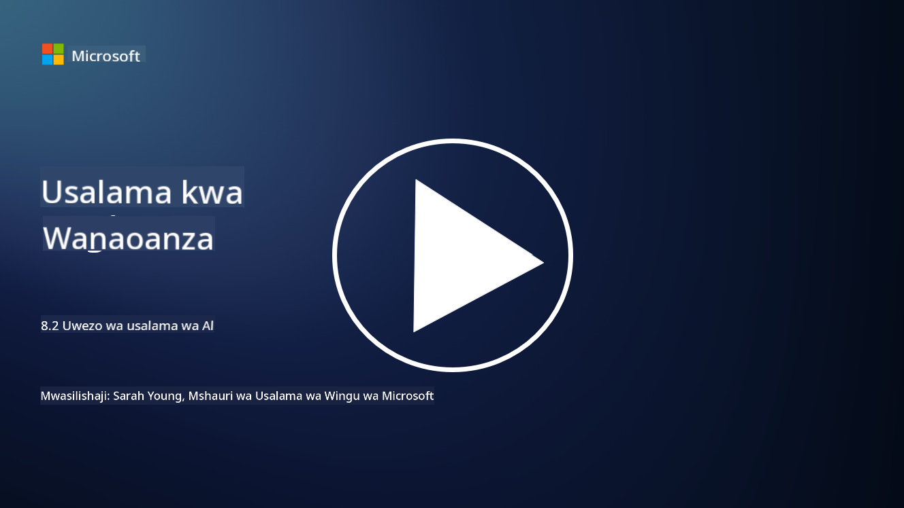

<!--
CO_OP_TRANSLATOR_METADATA:
{
  "original_hash": "b6bb7175672298d1e2f73ba7e0006f95",
  "translation_date": "2025-09-04T01:06:40+00:00",
  "source_file": "8.2 AI security capabilities.md",
  "language_code": "sw"
}
-->
# Uwezo wa Usalama wa AI

## Tuna zana na uwezo gani wa kulinda mifumo ya AI kwa sasa?

Kwa sasa, kuna zana na uwezo kadhaa wa kulinda mifumo ya AI:

-   **Counterfit**: Zana ya chanzo huria ya kiotomatiki kwa ajili ya kupima usalama wa mifumo ya AI, iliyoundwa kusaidia mashirika kufanya tathmini ya hatari za usalama wa AI na kuhakikisha uimara wa algoriti zao.
-   **Zana za Kujifunza Mashine Dhidi ya Mashambulizi**: Zana hizi zinatathmini uimara wa mifano ya kujifunza mashine dhidi ya mashambulizi ya kiadui, zikisaidia kutambua na kupunguza udhaifu.
-   **Vifurushi vya Usalama wa AI**: Kuna vifurushi vya chanzo huria vinavyotoa rasilimali za kulinda mifumo ya AI, ikiwa ni pamoja na maktaba na mifumo ya kutekeleza hatua za usalama.
-   **Majukwaa ya Ushirikiano**: Ushirikiano kati ya kampuni na jamii za AI ili kuunda skana maalum za usalama wa AI na zana nyingine za kulinda mnyororo wa usambazaji wa AI.

Zana na uwezo huu ni sehemu ya uwanja unaokua wa kuboresha usalama wa mifumo ya AI dhidi ya vitisho mbalimbali. Zinawakilisha mchanganyiko wa utafiti, zana za vitendo, na ushirikiano wa sekta unaolenga kushughulikia changamoto za kipekee zinazotokana na teknolojia za AI.

## Je, vipi kuhusu AI red teaming? Inatofautianaje na red teaming ya usalama wa jadi?

AI red teaming inatofautiana na red teaming ya usalama wa jadi kwa vipengele kadhaa muhimu:

-   **Kuzingatia Mifumo ya AI**: AI red teaming inalenga udhaifu wa kipekee wa mifumo ya AI, kama vile mifano ya kujifunza mashine na njia za data, badala ya miundombinu ya IT ya jadi.
-   **Kupima Tabia ya AI**: Inahusisha kupima jinsi mifumo ya AI inavyoitikia pembejeo zisizo za kawaida au zisizotarajiwa, ambazo zinaweza kufichua udhaifu unaoweza kutumiwa na washambuliaji.
-   **Kuchunguza Kushindwa kwa AI**: AI red teaming inachunguza kushindwa kwa mifumo kwa nia mbaya na zisizo na nia mbaya, ikizingatia seti pana ya tabia na kushindwa kwa mifumo zaidi ya uvunjaji wa usalama pekee.
-   **Uchunguzi wa Uingizaji wa Maagizo na Uzalishaji wa Maudhui**: AI red teaming pia inajumuisha kuchunguza kushindwa kama vile uingizaji wa maagizo, ambapo washambuliaji wanadhibiti mifumo ya AI kuzalisha maudhui hatari au yasiyo sahihi.
-   **AI ya Kimaadili na Uwajibikaji**: Ni sehemu ya kuhakikisha AI inayowajibika kwa muundo, kuhakikisha mifumo ya AI ni imara dhidi ya majaribio ya kuifanya itende kwa njia zisizotarajiwa.

Kwa ujumla, AI red teaming ni mazoezi yaliyopanuliwa ambayo si tu yanahusisha kuchunguza udhaifu wa usalama bali pia kupima aina nyingine za kushindwa kwa mifumo maalum kwa teknolojia za AI. Ni sehemu muhimu ya kuunda mifumo salama ya AI kwa kuelewa na kupunguza hatari mpya zinazohusiana na matumizi ya AI.

## Usomaji wa ziada

 - [Microsoft AI Red Team building future of safer AI | Microsoft Security Blog](https://www.microsoft.com/en-us/security/blog/2023/08/07/microsoft-ai-red-team-building-future-of-safer-ai/?WT.mc_id=academic-96948-sayoung)
 - [Announcing Microsoft’s open automation framework to red team generative AI Systems | Microsoft Security Blog](https://www.microsoft.com/en-us/security/blog/2024/02/22/announcing-microsofts-open-automation-framework-to-red-team-generative-ai-systems/?WT.mc_id=academic-96948-sayoung)
 - [AI Security Tools: The Open-Source Toolkit | Wiz](https://www.wiz.io/academy/ai-security-tools)

---

**Kanusho**:  
Hati hii imetafsiriwa kwa kutumia huduma ya tafsiri ya AI [Co-op Translator](https://github.com/Azure/co-op-translator). Ingawa tunajitahidi kwa usahihi, tafadhali fahamu kuwa tafsiri za kiotomatiki zinaweza kuwa na makosa au kutokuwa sahihi. Hati ya asili katika lugha yake ya awali inapaswa kuzingatiwa kama chanzo cha mamlaka. Kwa taarifa muhimu, inashauriwa kutumia huduma ya tafsiri ya kitaalamu ya binadamu. Hatutawajibika kwa maelewano mabaya au tafsiri zisizo sahihi zinazotokana na matumizi ya tafsiri hii.