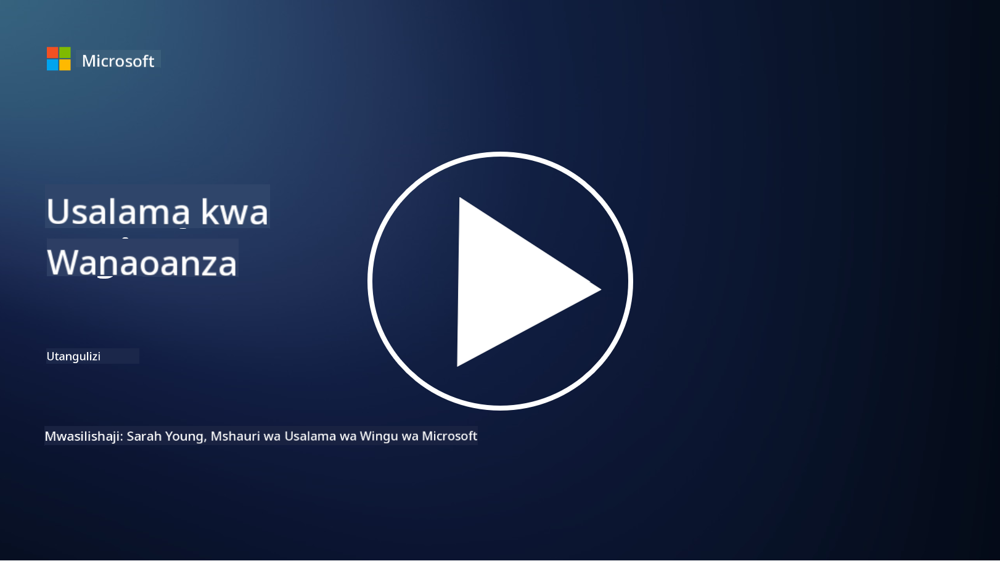

<!--
CO_OP_TRANSLATOR_METADATA:
{
  "original_hash": "0f9381fb23638f9341416474ce3c1563",
  "translation_date": "2025-09-03T23:01:51+00:00",
  "source_file": "README.md",
  "language_code": "sw"
}
-->
  
  
  
  
  
  

# 🚀 Usalama wa Mtandao kwa Anayeanza – mtaala

Katika enzi hii ya mabadiliko ya haraka ya teknolojia ya AI, ni muhimu zaidi kuelewa jinsi ya kulinda mifumo ya IT. Kozi hii imeundwa kukufundisha dhana za msingi za usalama wa mtandao ili kuanza safari yako ya kujifunza usalama. Kozi hii haina upendeleo wa muuzaji na imegawanywa katika masomo madogo yanayochukua takriban dakika 30-60 kukamilika. Kila somo lina jaribio dogo na viungo vya kusoma zaidi ikiwa unataka kuchimba zaidi mada hiyo.

Mambo yanayofunikwa na kozi hii 📚

- 🔐 Dhana za msingi za usalama wa mtandao kama vile dhana ya CIA triad, tofauti kati ya hatari, vitisho, n.k.
- 🛡️ Kuelewa udhibiti wa usalama ni nini na aina zake.
- 🌐 Kuelewa dhana ya zero trust na umuhimu wake katika usalama wa mtandao wa kisasa.
- 🔑 Kuelewa dhana kuu na mada katika utambulisho, mitandao, operesheni za usalama, miundombinu, na usalama wa data.
- 🔧 Kutoa mifano ya zana zinazotumika kutekeleza udhibiti wa usalama.

Mambo ambayo kozi hii haifundishi 🙅‍♂️

- 🚫 Jinsi ya kutumia zana maalum za usalama.
- 🚫 Jinsi ya "kuhack" au kufanya red teaming/offensive security.
- 🚫 Kujifunza kuhusu viwango maalum vya kufuata sheria.

Baada ya kumaliza kozi hii, unaweza kuendelea na baadhi ya moduli zetu za Microsoft Learn. Tunapendekeza uendelee kujifunza na [Microsoft Security, Compliance, and Identity Fundamentals.](https://learn.microsoft.com/training/paths/describe-concepts-of-security-compliance-identity/?WT.mc_id=academic-96948-sayoung)  

Hatimaye, unaweza kufikiria kufanya [Mtihani SC-900: Microsoft Security, Compliance, and Identity Fundamentals.](https://learn.microsoft.com/credentials/certifications/exams/sc-900/?WT.mc_id=academic-96948-sayoung)  

> 💁 Ikiwa una maoni au mapendekezo kuhusu kozi hii na maudhui yoyote ambayo hayapo, tungependa kusikia kutoka kwako!

## Muhtasari wa Moduli 📝  
| **Nambari ya Moduli** | **Jina la Moduli**                     | **Dhana Zinazofundishwa**            | **Malengo ya Kujifunza**                                                                                         |
|-----------------------|---------------------------------------|--------------------------------------|-----------------------------------------------------------------------------------------------------------------|
| **1.1**               | Dhana za msingi za usalama            | [The CIA triad](https://github.com/microsoft/Security-101/blob/main/1.1%20The%20CIA%20triad%20and%20other%20key%20concepts.md)                        | Jifunze kuhusu usiri, upatikanaji, na uadilifu. Pia uhalali, kutokataa, na faragha.                              |
| **1.2**               | Dhana za msingi za usalama            | [Vitisho vya kawaida vya usalama wa mtandao](https://github.com/microsoft/Security-101/blob/main/1.2%20Common%20cybersecurity%20threats.md)        | Jifunze kuhusu vitisho vya kawaida vya usalama wa mtandao vinavyokumba watu binafsi na mashirika.                |
| **1.3**               | Dhana za msingi za usalama            | [Kuelewa usimamizi wa hatari](https://github.com/microsoft/Security-101/blob/main/1.3%20Understanding%20risk%20management.md)       | Jifunze kuhusu kutathmini na kuelewa hatari – athari/uwezekano na kutekeleza udhibiti.                          |
| **1.4**               | Dhana za msingi za usalama            | [Mazoea ya usalama na nyaraka](https://github.com/microsoft/Security-101/blob/main/1.4%20Security%20practices%20and%20documentation.md) | Jifunze tofauti kati ya sera, taratibu, viwango, na sheria/kanuni.                                               |
| **1.5**               | Dhana za msingi za usalama            | [Zero trust](https://github.com/microsoft/Security-101/blob/main/1.5%20Zero%20trust.md)                           | Jifunze kuhusu zero trust ni nini na jinsi inavyoathiri usanifu. Je, ni nini kinga kwa kina?                     |
| **1.6**               | Dhana za msingi za usalama            | [Mfano wa uwajibikaji wa pamoja](https://github.com/microsoft/Security-101/blob/main/1.6%20Shared%20responsibility%20model.md)                           | Mfano wa uwajibikaji wa pamoja ni nini na jinsi unavyoathiri usalama wa mtandao?                                 |
| **1.7**               | [Jaribio la mwisho wa moduli](https://github.com/microsoft/Security-101/blob/main/1.7%20End%20of%20module%20quiz.md)                        |                                      |                                                                                                                 |
| **2.1**               | Misingi ya usimamizi wa utambulisho na ufikiaji | [Misingi ya IAM](https://github.com/microsoft/Security-101/blob/main/2.1%20IAM%20key%20concepts.md)                     | Jifunze kuhusu kanuni ya upendeleo wa chini kabisa, mgawanyo wa majukumu, jinsi IAM inavyounga mkono zero trust. |
| **2.2**               | Misingi ya usimamizi wa utambulisho na ufikiaji | [Usanifu wa zero trust wa IAM](https://github.com/microsoft/Security-101/blob/main/2.2%20IAM%20zero%20trust%20architecture.md)          | Jifunze jinsi utambulisho ulivyo mpaka mpya kwa mazingira ya kisasa ya IT na vitisho inavyopunguza.              |
| **2.3**               | Misingi ya usimamizi wa utambulisho na ufikiaji | [Uwezo wa IAM](https://github.com/microsoft/Security-101/blob/main/2.3%20IAM%20capabilities.md)                     | Jifunze kuhusu uwezo wa IAM na udhibiti wa kulinda utambulisho.                                                  |
| **2.4**               | [Jaribio la mwisho wa moduli](https://github.com/microsoft/Security-101/blob/main/2.4%20End%20of%20module%20quiz.md)                        |                                      |                                                                                                                 |
| **3.1**               | Misingi ya usalama wa mtandao         | [Misingi ya mitandao](https://github.com/microsoft/Security-101/blob/main/3.1%20Networking%20key%20concepts.md)              | Jifunze kuhusu dhana za mitandao (anwani za IP, nambari za bandari, usimbaji fiche, n.k.)                        |
| **3.2**               | Misingi ya usalama wa mtandao         | [Usanifu wa zero trust wa mitandao](https://github.com/microsoft/Security-101/blob/main/3.2%20Networking%20zero%20trust%20architecture.md)   | Jifunze jinsi mitandao inavyosaidia usanifu wa E2E ZT na vitisho inavyopunguza.                                  |
| **3.3**               | Misingi ya usalama wa mtandao         | [Uwezo wa usalama wa mtandao](https://github.com/microsoft/Security-101/blob/main/3.3%20Network%20security%20capabilities.md)        | Jifunze kuhusu zana za usalama wa mtandao – firewalls, WAF, ulinzi wa DDoS, n.k.                                 |
| **3.4**               | [Jaribio la mwisho wa moduli](https://github.com/microsoft/Security-101/blob/main/3.4%20End%20of%20module%20quiz.md)                        |                                      |                                                                                                                 |
| **4.1**               | Misingi ya operesheni za usalama      | [Misingi ya SecOps](https://github.com/microsoft/Security-101/blob/main/4.1%20SecOps%20key%20concepts.md)                  | Jifunze kwa nini operesheni za usalama ni muhimu na jinsi zinavyotofautiana na timu za kawaida za IT ops.        |
| **4.2**               | Misingi ya operesheni za usalama      | [Usanifu wa zero trust wa SecOps](https://github.com/microsoft/Security-101/blob/main/4.2%20SecOps%20zero%20trust%20architecture.md)       | Jifunze jinsi SecOps inavyosaidia usanifu wa E2E ZT na vitisho inavyopunguza.                                    |
| **4.3**               | Misingi ya operesheni za usalama      | [Uwezo wa SecOps](https://github.com/microsoft/Security-101/blob/main/4.3%20SecOps%20capabilities.md)                  | Jifunze kuhusu zana za SecOps – SIEM, XDR, n.k.                                                                  |
| **4.4**               | [Jaribio la mwisho wa moduli](https://github.com/microsoft/Security-101/blob/main/4.4%20End%20of%20module%20quiz.md)                        |                                      |                                                                                                                 |
| **5.1**               | Misingi ya usalama wa programu        | [Misingi ya AppSec](https://github.com/microsoft/Security-101/blob/main/5.1%20AppSec%20key%20concepts.md)                  | Jifunze kuhusu dhana za AppSec kama vile usalama kwa muundo, uthibitishaji wa pembejeo, n.k.                     |
| **5.2**               | Misingi ya usalama wa programu        | [Uwezo wa AppSec](https://github.com/microsoft/Security-101/blob/main/5.2%20AppSec%20key%20capabilities.md)                  | Jifunze kuhusu zana za AppSec: zana za usalama wa bomba la programu, uchanganuzi wa msimbo, uchanganuzi wa siri, n.k. |
| **5.3**               | [Jaribio la mwisho wa moduli](https://github.com/microsoft/Security-101/blob/main/5.3%20End%20of%20module%20quiz.md)                        |                                      |                                                                                                                 |
| **6.1**               | Misingi ya usalama wa miundombinu     | [Misingi ya usalama wa miundombinu](https://github.com/microsoft/Security-101/blob/main/6.1%20Infrastructure%20security%20key%20concepts.md) | Jifunze kuhusu kuimarisha mifumo, kusasisha, usafi wa usalama, usalama wa kontena.                               |
| **6.2**               | Misingi ya usalama wa miundombinu     | [Uwezo wa usalama wa miundombinu](https://github.com/microsoft/Security-101/blob/main/6.2%20Infrastructure%20security%20capabilities.md) | Jifunze kuhusu zana zinazoweza kusaidia usalama wa miundombinu kama vile CSPM, usalama wa kontena, n.k.          |
| **6.3**               | [Jaribio la mwisho wa moduli](https://github.com/microsoft/Security-101/blob/main/6.3%20End%20of%20module%20quiz.md)                        |                                      |                                                                                                                 |
| **7.1**               | Misingi ya usalama wa data            | [Misingi ya usalama wa data](https://github.com/microsoft/Security-101/blob/main/7.1%20Data%20security%20key%20concepts.md)           | Jifunze kuhusu uainishaji wa data na uhifadhi na kwa nini ni muhimu kwa shirika.                                 |
| **7.2**               | Misingi ya usalama wa data            | [Uwezo wa usalama wa data](https://github.com/microsoft/Security-101/blob/main/7.2%20Data%20security%20capabilities.md)           | Jifunze kuhusu zana za usalama wa data – DLP, usimamizi wa hatari ya ndani, utawala wa data, n.k.                |
| **7.3**               | [Jaribio la mwisho wa moduli](https://github.com/microsoft/Security-101/blob/main/7.3%20End%20of%20module%20quiz.md)                        |                                      |                                                                                                                 |
| **8.1**               | Misingi ya usalama wa AI              | [Misingi ya usalama wa AI](https://github.com/microsoft/Security-101/blob/main/8.1%20AI%20security%20key%20concepts.md)          | Jifunze kuhusu tofauti na kufanana kati ya usalama wa jadi na usalama wa AI.                                    |
| **8.2**               | Misingi ya usalama wa AI              | [Uwezo wa usalama wa AI](https://github.com/microsoft/Security-101/blob/main/8.2%20AI%20security%20capabilities.md)           | Jifunze kuhusu zana za usalama wa AI na udhibiti unaoweza kutumika kulinda AI.                                   |
| **8.3**               | Misingi ya usalama wa AI              | [AI inayowajibika](https://github.com/microsoft/Security-101/blob/main/8.3%20Responsible%20AI.md)          | Jifunze kuhusu AI inayowajibika ni nini na madhara maalum ya AI ambayo wataalamu wa usalama wanapaswa kufahamu.  |
| **8.4**               | [Jaribio la mwisho wa moduli](https://github.com/microsoft/Security-101/blob/main/8.4%20End%20of%20module%20quiz.md)                        |                                      |                                                                                                                 |

## 🎒 Kozi Nyingine  

Timu yetu inazalisha kozi nyingine! Angalia:  

- [Generative AI for Beginners](https://aka.ms/genai-beginners)  
- [Generative AI for Beginners .NET](https://github.com/microsoft/Generative-AI-for-beginners-dotnet)  
- [Generative AI with JavaScript](https://github.com/microsoft/generative-ai-with-javascript)  
- [Generative AI with Java](https://github.com/microsoft/Generative-AI-for-beginners-java)  
- [AI kwa Kompyuta](https://aka.ms/ai-beginners)  
- [Sayansi ya Takwimu kwa Kompyuta](https://aka.ms/datascience-beginners)  
- [ML kwa Kompyuta](https://aka.ms/ml-beginners)  
- [Usalama wa Mtandao kwa Kompyuta](https://github.com/microsoft/Security-101)  
- [Uendelezaji wa Wavuti kwa Kompyuta](https://aka.ms/webdev-beginners)  
- [IoT kwa Kompyuta](https://aka.ms/iot-beginners)  
- [Uendelezaji wa XR kwa Kompyuta](https://github.com/microsoft/xr-development-for-beginners)  
- [Kumiliki GitHub Copilot kwa Uprogramu wa Pamoja](https://github.com/microsoft/Mastering-GitHub-Copilot-for-Paired-Programming)  
- [Kumiliki GitHub Copilot kwa Waendelezaji wa C#/.NET](https://github.com/microsoft/mastering-github-copilot-for-dotnet-csharp-developers)  
- [Chagua Safari Yako ya Copilot](https://github.com/microsoft/CopilotAdventures)  

---

**Kanusho**:  
Hati hii imetafsiriwa kwa kutumia huduma ya tafsiri ya AI [Co-op Translator](https://github.com/Azure/co-op-translator). Ingawa tunajitahidi kwa usahihi, tafadhali fahamu kuwa tafsiri za kiotomatiki zinaweza kuwa na makosa au kutokuwa sahihi. Hati ya asili katika lugha yake ya awali inapaswa kuzingatiwa kama chanzo cha mamlaka. Kwa taarifa muhimu, inashauriwa kutumia tafsiri ya kitaalamu ya binadamu. Hatutawajibika kwa maelewano mabaya au tafsiri zisizo sahihi zinazotokana na matumizi ya tafsiri hii.