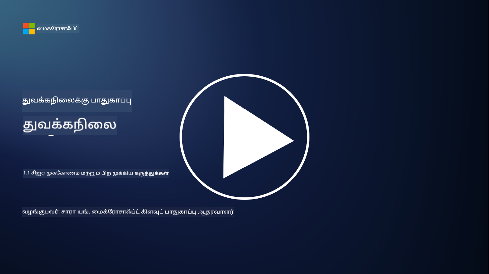
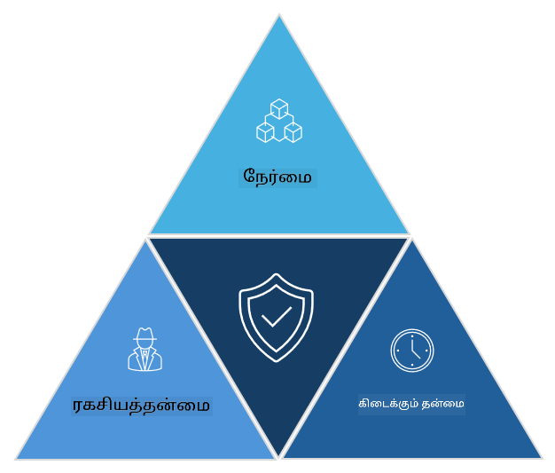

<!--
CO_OP_TRANSLATOR_METADATA:
{
  "original_hash": "16a76f9fa372fb63cffb6d76b855f023",
  "translation_date": "2025-10-11T11:20:25+00:00",
  "source_file": "1.1 The CIA triad and other key concepts.md",
  "language_code": "ta"
}
-->
# CIA முக்கோணம் மற்றும் பிற முக்கிய கருத்துகள்

## அறிமுகம்

இந்த பாடத்தில், நாம் கற்றுக்கொள்ளப் போகிறோம்:

 - சைபர் பாதுகாப்பு என்றால் என்ன?
   
 - சைபர் பாதுகாப்பு CIA முக்கோணம் என்றால் என்ன?

 - சைபர் பாதுகாப்பு சூழலில் உண்மைத்தன்மை, மறுப்பதற்கான சாத்தியமின்மை மற்றும் தனியுரிமை என்றால் என்ன?

## சைபர் பாதுகாப்பு என்றால் என்ன?

சைபர் பாதுகாப்பு, தகவல் பாதுகாப்பு என்றும் அழைக்கப்படுகிறது, இது கணினி அமைப்புகள், நெட்வொர்க்குகள், சாதனங்கள் மற்றும் தரவுகளை டிஜிட்டல் தாக்குதல்கள், அனுமதியற்ற அணுகல், சேதம் அல்லது திருட்டிலிருந்து பாதுகாக்கும் நடைமுறையாகும். சைபர் பாதுகாப்பின் முதன்மை நோக்கம் டிஜிட்டல் சொத்துகள் மற்றும் தகவலின் ரகசியத்தன்மை, முழுமைத்தன்மை மற்றும் கிடைக்கத்தக்க தன்மையை உறுதிப்படுத்துவதாகும். சைபர் பாதுகாப்பு நிபுணர்கள் சொத்துகள், தரவுகள் மற்றும் தகவல்களை பாதுகாக்க பாதுகாப்பு கட்டுப்பாடுகளை வடிவமைத்து செயல்படுத்துகிறார்கள். நம் வாழ்க்கையின் பெரும்பாலானவை டிஜிட்டல் மற்றும் ஆன்லைனில் மாறியுள்ளதால், தனிநபர்கள் மற்றும் நிறுவனங்களுக்கான முக்கிய கவலைகளில் ஒன்றாக சைபர் பாதுகாப்பு மாறியுள்ளது.

## சைபர் பாதுகாப்பு CIA முக்கோணம் என்றால் என்ன?

சைபர் பாதுகாப்பு முக்கோணம் என்பது எந்த சைபர் பாதுகாப்பு வேலை அல்லது அமைப்பு/சூழல் வடிவமைப்பிற்கான மூன்று முக்கிய பரிந்துரைகளை உள்ளடக்கிய மாதிரியாகும்:

### ரகசியத்தன்மை

இது "சைபர் பாதுகாப்பு" என்று நினைக்கும் போது பெரும்பாலானவர்கள் அறிந்திருக்கும் பரிந்துரை: ரகசியத்தன்மை என்பது தரவுகள் மற்றும் தகவல்களை அனுமதியற்ற அணுகல் முயற்சிகளிலிருந்து பாதுகாக்கும் செயல்முறையாகும், அதாவது தகவலை பார்க்க வேண்டியவர்கள் மட்டுமே அதை அணுக முடியும். அனைத்து தரவுகளும் ஒரே மாதிரியானவை அல்ல, மேலும் தரவுகள் தவறானவர்களால் அணுகப்பட்டால் ஏற்படும் சேதத்தின் அடிப்படையில் வகைப்படுத்தப்பட்டு பாதுகாக்கப்படும்.

### முழுமைத்தன்மை

சூழல்களில் உள்ள தரவின் துல்லியத்தையும் நம்பகத்தன்மையையும் பாதுகாக்கும் மற்றும் அனுமதியற்ற நபர்களால் தரவுகளை மாற்றவோ திருத்தவோ அனுமதிக்காத செயல்முறையை குறிக்கிறது. உதாரணமாக, ஒரு மாணவர் DMV-இல் தனது பிறந்த தேதியை மாற்றி, தனது பிறந்த தேதியை முன்கூட்டியே மாற்றி மது வாங்குவதற்காக தனது உரிமத்தை மறுபிரசுரம் செய்ய முயற்சிக்கிறார்.

### கிடைக்கத்தக்க தன்மை

இது செயல்பாட்டு IT முழுவதும் ஒரு பரிந்துரையாக உள்ளது, ஆனால் கிடைக்கத்தக்க தன்மை சைபர் பாதுகாப்பிற்கும் முக்கியமானது. கிடைக்கத்தக்க தன்மையை இலக்காகக் கொண்ட குறிப்பிட்ட வகையான தாக்குதல்கள் உள்ளன, அவற்றை பாதுகாப்பு நிபுணர்கள் தடுக்க வேண்டும் (உதாரணமாக, விநியோகிக்கப்பட்ட மறுப்பு சேவை – DDoS – தாக்குதல்கள்).

**சைபர் பாதுகாப்பு CIA முக்கோணம்**

## சைபர் பாதுகாப்பு சூழலில் உண்மைத்தன்மை, மறுப்பதற்கான சாத்தியமின்மை மற்றும் தனியுரிமை என்றால் என்ன?

சூழல்களின் பாதுகாப்பு மற்றும் நம்பகத்தன்மையை உறுதிப்படுத்த தொடர்புடைய கூடுதல் முக்கியமான கருத்துகள் இவை:

**உண்மைத்தன்மை** - நீங்கள் தொடர்பு கொள்ளும் தகவல், தொடர்பு அல்லது அமைப்பு உண்மையானது மற்றும் அனுமதியற்ற தரப்பால் மாற்றப்படவோ திருத்தப்படவோ செய்யப்படவில்லை என்பதை உறுதிப்படுத்தும் செயல்முறை.

**மறுப்பதற்கான சாத்தியமின்மை** - ஒரு தரப்பு தங்கள் தொடர்பு அல்லது பரிமாற்றத்தின் உண்மைத்தன்மையை மறுக்க முடியாததை உறுதிப்படுத்தும் கருத்து. இது ஒரு நபர் ஒரு செய்தியை அனுப்பவில்லை அல்லது ஒரு குறிப்பிட்ட நடவடிக்கையை மேற்கொள்ளவில்லை என்று கூறுவதை தடுக்கும், அதற்கு எதிராக ஆதாரம் உள்ளபோது.

**தனியுரிமை** - அனுமதியற்ற அணுகல், பயன்பாடு, வெளிப்படுத்தல் அல்லது மாற்றத்திலிருந்து நெகிழ்வான மற்றும் தனிப்பட்ட அடையாளத் தகவல்களைப் பாதுகாக்கும் செயல்முறை. இது தனிப்பட்ட தரவிற்கு யார் அணுக முடியும் மற்றும் அந்த தரவுகள் எவ்வாறு சேகரிக்கப்படுகின்றன, சேமிக்கப்படுகின்றன மற்றும் பகிரப்படுகின்றன என்பதை கட்டுப்படுத்துவதைக் குறிக்கிறது.

## கூடுதல் வாசிப்பு

[What Is Information Security (InfoSec)? | Microsoft Security](https://www.microsoft.com/security/business/security-101/what-is-information-security-infosec#:~:text=Three%20pillars%20of%20information%20security%3A%20the%20CIA%20triad,as%20guiding%20principles%20for%20implementing%20an%20InfoSec%20plan.)

---

**அறிவிப்பு**:  
இந்த ஆவணம் [Co-op Translator](https://github.com/Azure/co-op-translator) என்ற AI மொழிபெயர்ப்பு சேவையை பயன்படுத்தி மொழிபெயர்க்கப்பட்டுள்ளது. நாங்கள் துல்லியத்திற்காக முயற்சிக்கிறோம், ஆனால் தானியங்கி மொழிபெயர்ப்புகளில் பிழைகள் அல்லது தவறுகள் இருக்கக்கூடும் என்பதை கவனத்தில் கொள்ளவும். அதன் சொந்த மொழியில் உள்ள மூல ஆவணம் அதிகாரப்பூர்வ ஆதாரமாக கருதப்பட வேண்டும். முக்கியமான தகவல்களுக்கு, தொழில்முறை மனித மொழிபெயர்ப்பு பரிந்துரைக்கப்படுகிறது. இந்த மொழிபெயர்ப்பைப் பயன்படுத்துவதால் ஏற்படும் எந்த தவறான புரிதல்களுக்கும் அல்லது தவறான விளக்கங்களுக்கும் நாங்கள் பொறுப்பல்ல.