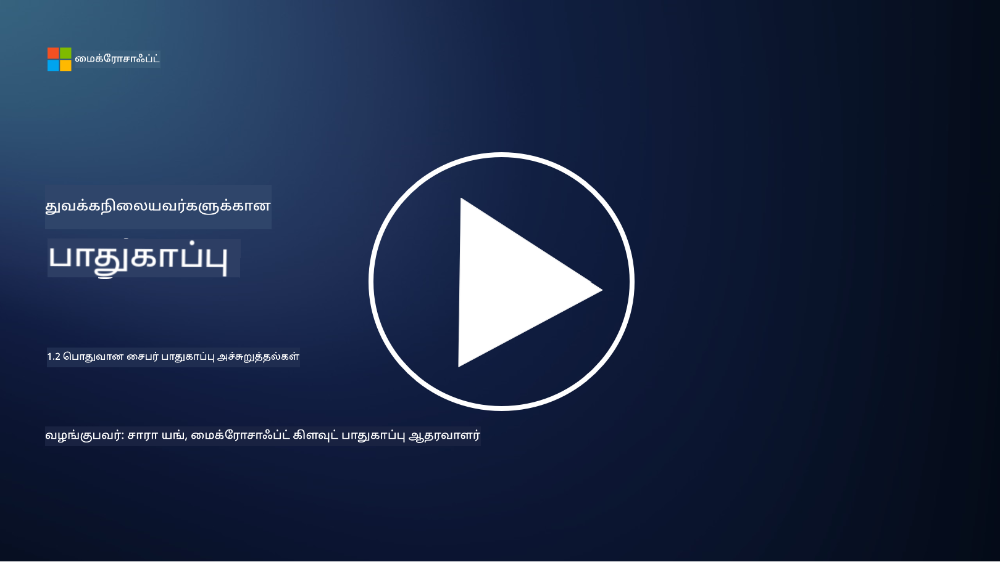

<!--
CO_OP_TRANSLATOR_METADATA:
{
  "original_hash": "6fc3030323139d7134a4ca9d03eccac9",
  "translation_date": "2025-10-11T11:31:37+00:00",
  "source_file": "1.2 Common cybersecurity threats.md",
  "language_code": "ta"
}
-->
# பொதுவான சைபர் பாதுகாப்பு மிரட்டல்கள்

## அறிமுகம்

இந்த பாடத்தில் நாம் கற்கப்போகிறோம்:

- சைபர் பாதுகாப்பு மிரட்டல் என்றால் என்ன?

- தீவிரமான நபர்கள் ஏன் தரவுகள் மற்றும் ஐடி அமைப்புகளை பாதிக்க விரும்புகிறார்கள்?

- பொதுவான சைபர் பாதுகாப்பு மிரட்டல்களின் வகைகள் என்ன?

- MITRE ATT&CK கட்டமைப்பு என்றால் என்ன?

- சைபர் பாதுகாப்பு மிரட்டல் நிலையைப் பற்றி புதுப்பித்துக் கொள்ள நான் எங்கு தகவல்களைப் பெறலாம்?

## சைபர் பாதுகாப்பு மிரட்டல் என்றால் என்ன?

சைபர் பாதுகாப்பு மிரட்டல் என்பது தரவுகள் அல்லது ஐடி அமைப்புகளின் ரகசியத்தன்மை, முழுமை அல்லது கிடைக்கும் தன்மையை பாதிக்கக்கூடிய எந்தவொரு அபாயம் அல்லது ஆபத்தையும் குறிக்கிறது. இந்த மிரட்டல்களை தீவிரமான நபர்கள் ஏற்படுத்துகிறார்கள், அவர்கள் அனுமதியில்லாமல் அணுகல் பெற, முக்கியமான தகவல்களை திருட, செயல்பாடுகளை பாதிக்க அல்லது தனிநபர்கள், நிறுவனங்கள் அல்லது நாடுகளுக்கு கூட தீங்கு விளைவிக்க முயற்சிக்கிறார்கள். சைபர் பாதுகாப்பு மிரட்டல்கள் பல்வேறு வடிவங்களில் இருக்கலாம் மற்றும் டிஜிட்டல் அமைப்புகள் மற்றும் தரவுகளின் பல்வேறு அம்சங்களை இலக்காகக் கொள்ளலாம்.

## தீவிரமான நபர்கள் ஏன் தரவுகள் மற்றும் ஐடி அமைப்புகளை பாதிக்க விரும்புகிறார்கள்?

தீவிரமான நபர்கள் பல்வேறு காரணங்களுக்காக தரவுகள் மற்றும் ஐடி அமைப்புகளை பாதிக்கிறார்கள், பெரும்பாலும் தனிப்பட்ட லாபம், கருத்தியல் நோக்கங்கள் அல்லது குழப்பத்தை ஏற்படுத்தும் விருப்பத்தால் தூண்டப்படுகிறார்கள். இந்த உந்துதல்களைப் புரிந்துகொள்வது, சைபர் மிரட்டல்களுக்கு எதிராக நிறுவனங்கள் மற்றும் தனிநபர்கள் சிறப்பாக பாதுகாப்பு ஏற்படுத்த உதவுகிறது. தீவிரமான நபர்கள் சைபர் தாக்குதல்களில் ஈடுபடுவதற்கான சில பொதுவான காரணங்கள்:

1. **நிதி லாபம்**: பல தாக்குதல்கள் நிதி லாபத்திற்காக நடத்தப்படுகின்றன. தீவிரமான நபர்கள் கடன் அட்டை எண்கள், வங்கி கணக்கு விவரங்கள் அல்லது தனிப்பட்ட அடையாள தகவல்களை திருடி மோசடி செய்ய, அடையாள திருட்டு செய்ய, ஒரு தனிநபர் அல்லது நிறுவனத்தை மிரட்டி பணம் கேட்க அல்லது திருடப்பட்ட தரவுகளை டார்க் வெபில் விற்க முயற்சிக்கிறார்கள்.

2. **மூலோபாயம்**: நாடுகள், போட்டியாளர்கள் அல்லது பிற அமைப்புகள் அரசாங்கம், நிறுவனங்கள் அல்லது ஆராய்ச்சி தரவுகளை அரசியல், பொருளாதார அல்லது இராணுவ முன்னிலை பெற திருட சைபர் உளவுத்தொழிலில் ஈடுபடலாம்.

3. **குழப்பம் மற்றும் சேதம்**: சில தாக்குதல்கள் முக்கியமான அடுக்குமாடி, சேவைகள் அல்லது செயல்பாடுகளை அரசியல் அல்லது கருத்தியல் காரணங்களுக்காக பாதிக்க முயற்சிக்கின்றன. இந்த தாக்குதல்கள் பரவலான குழப்பம், நிதி இழப்பு மற்றும் கண்ணியத்தை பாதிக்கக்கூடும்.

4. **கருத்தியல் நோக்கங்கள்**: ஹேக்டிவிஸ்ட்கள் மற்றும் கருத்தியல் அல்லது அரசியல் நோக்கங்களைக் கொண்ட குழுக்கள் சில பிரச்சினைகள் குறித்து விழிப்புணர்வை ஏற்படுத்த, தங்கள் நம்பிக்கைகளை ஊக்குவிக்க அல்லது குறிப்பிட்ட நடவடிக்கைகள் அல்லது நிறுவனங்களுக்கு எதிராக போராட அமைப்புகளை பாதிக்கலாம்.

5. **தவறான செயல்கள்**: அனைத்து தீவிரமான செயல்களும் நோக்கமுடையவை அல்ல; சில நபர்கள் சமூக பொறியியல் மூலம் அல்லது பாதிக்கப்பட்ட நெட்வொர்க்கின் ஒரு பகுதியாகத் தவறுதலாக சைபர் மிரட்டல்களுக்கு பங்களிக்கலாம்.

இறுதியில், தரவுகள் மற்றும் ஐடி அமைப்புகளை பாதிக்க தீவிரமான நபர்களின் உந்துதல்கள் பரவலாக மாறக்கூடும், மேலும் இந்த தாக்குதல்களின் தாக்கம் கடுமையாக இருக்கக்கூடும். தனிநபர்கள், நிறுவனங்கள் மற்றும் அரசாங்கங்கள் சைபர் பாதுகாப்பை முக்கியமாக எடுத்துக்கொண்டு இந்த மிரட்டல்களுக்கு எதிராக பாதுகாப்பு நடவடிக்கைகளை மேற்கொள்ள வேண்டும்.

## பொதுவான சைபர் பாதுகாப்பு மிரட்டல்களின் வகைகள் என்ன?

தீவிரமான நபர்கள் அமைப்புகளை பாதிக்க, தரவுகளை திருட மற்றும் குழப்பங்களை ஏற்படுத்த பல்வேறு பொதுவான சைபர் தாக்குதல்களைப் பயன்படுத்துகிறார்கள். இப்போது எழுதும் நேரத்தில் பரவலாக உள்ள சில முக்கியமான தாக்குதல்களின் வகைகள் இவை:

1. **பிஷிங்**:

பிஷிங் என்பது உண்மையான மூலங்களிலிருந்து வந்தது போல தோன்றும் மோசமான மின்னஞ்சல்கள் அல்லது செய்திகளை அனுப்பி, பெறுநர்களை கடவுச்சொற்கள், கடன் அட்டை எண்கள் அல்லது தனிப்பட்ட விவரங்களை வெளிப்படுத்த வலியுறுத்துவது. பிஷிங் பாதிக்கப்பட்டவர்களை மோசமான இணையதளங்களுக்கு அல்லது மால்வேரைப் பதிவிறக்க வழிவகுக்கலாம்.

2. **மால்வேர்**:

மால்வேர் (தீவிரமான மென்பொருள்) என்பது அமைப்புகளை பாதிக்க, தரவுகளை திருட அல்லது சேதம் விளைவிக்க வடிவமைக்கப்பட்ட பல்வேறு தீவிரமான மென்பொருட்களை உள்ளடக்கியது. மால்வேரின் வகைகள்:

- **ரான்சம்‌வேர்**: கோப்புகளை குறியாக்கி, அவற்றை மீண்டும் திறக்க பணம் கேட்கும்.

- **ட்ரோஜன்கள்**: உண்மையான மென்பொருளாக தோன்றும், ஆனால் தீவிரமான நபர்களுக்கு அனுமதியில்லாத அணுகலை வழங்கும்.

- **வைரஸ்கள்**: கோப்புகளில் இணைந்து பரவும் தானாகவே பிரதி உருவாக்கும் மென்பொருள்.

- **வார்ம்கள்**: நெட்வொர்க்குகளில் பரவும் தானாகவே பிரதி உருவாக்கும் மென்பொருள்.

3. **சேவை மறுப்பு (DoS) மற்றும் பகிர்ந்தளிக்கப்பட்ட சேவை மறுப்பு (DDoS)**:

DoS தாக்குதல்கள் இலக்கு அமைப்பை அதிகமாக சுமந்து, பயனர்களுக்கு கிடைக்காதவாறு செய்கின்றன. DDoS தாக்குதல்கள் பாதிக்கப்பட்ட சாதனங்களின் நெட்வொர்க்கைப் பயன்படுத்தி இலக்கை அதிகமான போக்குவரத்துடன் நிரப்புகின்றன, அமைப்பு சரியாக செயல்பட முடியாதவாறு அல்லது முற்றிலும் செயலிழக்கச் செய்யலாம்.

4. **SQL Injection**:

இந்த தாக்குதலில், தாக்குதலாளர்கள் ஒரு இணைய பயன்பாட்டின் உள்ளீட்டு புலங்களை மாற்றி தீவிரமான SQL கேள்விகளைச் சேர்க்கின்றனர், இது தரவுத்தொகுப்புகள் மற்றும் முக்கியமான தரவுகளுக்கு அனுமதியில்லாத அணுகலைப் பெற வழிவகுக்கலாம்.

5. **Cross-Site Scripting (XSS)**:

தாக்குதலாளர்கள் இணைய பயன்பாடுகளில் தீவிரமான ஸ்கிரிப்ட்களைச் சேர்க்கின்றனர், அவை பயனர்களின் உலாவிகளில் செயல்படுகின்றன. இது பயனர் தரவுகளை திருட அல்லது மால்வேரை பரப்ப வழிவகுக்கலாம்.

6. **சமூக பொறியியல்**:

சமூக பொறியியல் மனித மனோவியலின் பலவீனங்களைப் பயன்படுத்தி, நபர்களை ரகசியமான தகவல்களை வெளிப்படுத்த அல்லது பாதுகாப்பை பாதிக்கும் செயல்களைச் செய்ய வலியுறுத்துகிறது.

7. **சீரோ-டே (0day) Exploits**:

இந்த தாக்குதல்கள் மென்பொருள் அல்லது ஹார்ட்வேரில் உள்ள குறைபாடுகளை இலக்காகக் கொள்கின்றன, அவை விற்பனையாளருக்கு அல்லது பொதுமக்களுக்கு இன்னும் தெரியாதவை. பாதுகாப்பு திருத்தங்கள் உருவாக்கப்படும் முன் இந்த குறைபாடுகளை தாக்குதலாளர்கள் பயன்படுத்துகிறார்கள். பல நிறுவனங்கள் சீரோ-டே குறைபாடுகளைப் பற்றி கவலைப்படுகின்றன, ஆனால் அவை இந்த பட்டியலில் உள்ள மற்ற தாக்குதல்களை விட பொதுவாக இல்லை. ஒரு சீரோ-டே கண்டறியப்பட்டவுடன், பாதுகாப்பு ஆராய்ச்சியாளர்கள் விரைவாக திருத்தத்தை உருவாக்க முயற்சிப்பார்கள், எனவே சீரோ-டே குறைபாடுகள் பொதுவாக குறுகிய காலத்திற்கே இருக்கும்.

8. **கடவுச்சொல் தாக்குதல்கள்**:

இந்த தாக்குதல்களில் ப்ரூட் ஃபோர்ஸ் தாக்குதல்கள் அடங்கும், இதில் தாக்குதலாளர்கள் மீண்டும் மீண்டும் கடவுச்சொற்களை யூகிக்க முயற்சிக்கின்றனர், மற்றும் கடவுச்சொல் ஸ்டஃபிங் தாக்குதல்கள், இதில் ஒரு இணையதளத்தில் திருடப்பட்ட கடவுச்சொற்கள் மற்ற இணையதளங்களில் அணுக முயற்சிக்கின்றன.

## MITRE ATT&CK கட்டமைப்பு என்றால் என்ன?

[MITRE ATT&CK கட்டமைப்பு](https://attack.mitre.org/) (Adversarial Tactics, Techniques, and Common Knowledge) என்பது தாக்குதலாளர்கள் சைபர் தாக்குதல்களின் போது பயன்படுத்தும் உந்துதல்கள், தொழில்நுட்பங்கள் மற்றும் செயல்முறைகளை (TTPs) பட்டியலிடும் மற்றும் வகைப்படுத்தும் ஒரு கட்டமைப்பாகும். இந்த கட்டமைப்பு MITRE Corporation என்ற லாப நோக்கமற்ற அமைப்பால் உருவாக்கப்பட்டது, இது பல்வேறு அரசாங்க அமைப்புகளுக்கான ஆராய்ச்சி மற்றும் மேம்பாட்டு மையங்களை இயக்குகிறது.

MITRE ATT&CK கட்டமைப்பு சைபர் மிரட்டல்களை விவரிக்க மற்றும் பகுப்பாய்வு செய்ய ஒரு நிலையான முறையை வழங்குகிறது, இது சைபர் பாதுகாப்பு நிபுணர்களுக்கு பல்வேறு தாக்குதல் தொழில்நுட்பங்களைப் புரிந்துகொண்டு எதிர்க்க உதவுகிறது. இது பாதுகாப்பு குழுக்கள், மிரட்டல் வேட்டையாடிகள் மற்றும் சம்பவங்களுக்கு பதிலளிப்பவர்களால் பரவலாகப் பயன்படுத்தப்படுகிறது:

1. **தாக்குதலாளர்களின் நடத்தை புரிந்துகொள்வது**: இந்த கட்டமைப்பு உண்மையான உலக தாக்குதல் நடத்தைகளை ஆவணப்படுத்துகிறது, தாக்குதலாளர்கள் ஆரம்ப நுழைவு முதல் தங்கள் இலக்குகளை அடைவது வரை எடுக்கும் படிகளை விவரிக்கிறது. இது பல்வேறு மிரட்டல் குழுக்கள் பயன்படுத்தும் தாக்குதல் தொழில்நுட்பங்களை உள்ளடக்கியது.

2. **பாதுகாப்பு உத்திகளை திட்டமிடுதல் மற்றும் செயல்படுத்துதல்**: பாதுகாப்பு குழுக்கள் தாக்குதலாளர்கள் பயன்படுத்தக்கூடிய குறிப்பிட்ட உந்துதல்கள் மற்றும் தொழில்நுட்பங்களுக்கு இணங்க முன்னோடியாக பாதுகாப்பு உத்திகளை உருவாக்க இந்த கட்டமைப்பைப் பயன்படுத்தலாம்.

3. **சம்பவங்களுக்கு பதிலளிப்பு மற்றும் மிரட்டல் வேட்டையாடுதல்**: சம்பவங்களை ஆராய்வது அல்லது மிரட்டல் வேட்டையாடுதல் நடத்தும் போது, பாதுகாப்பு நிபுணர்கள் தாக்குதலாளர்கள் பயன்படுத்திய குறிப்பிட்ட தொழில்நுட்பங்களை அடையாளம் காண மற்றும் குறைக்க இந்த கட்டமைப்பைப் பார்க்கலாம்.

MITRE ATT&CK கட்டமைப்பு Windows, macOS, Linux மற்றும் கிளவுட் சேவைகள் போன்ற குறிப்பிட்ட தளங்கள் மற்றும் சூழல்களை அடிப்படையாகக் கொண்ட தொழில்நுட்பங்களை குழுவாகப் பிரிக்கும் மாட்ரிக்ஸ்களாக அமைக்கப்பட்டுள்ளது. ஒவ்வொரு மாட்ரிக்ஸும் உந்துதல்கள் (உயர்நிலை இலக்குகள்) மற்றும் தொழில்நுட்பங்கள் (அந்த இலக்குகளை அடைய பயன்படுத்தப்படும் குறிப்பிட்ட முறைகள்) என பிரிக்கப்பட்டுள்ளது. ஒவ்வொரு தொழில்நுட்பத்திற்கும், அது எப்படி செயல்படுகிறது, சாத்தியமான தடுப்பு நடவடிக்கைகள் மற்றும் அந்த தொழில்நுட்பத்தை பயன்படுத்திய உண்மையான உலக மிரட்டல் குழுக்களுக்கு தொடர்பான தகவல்களை வழங்குகிறது.

இந்த கட்டமைப்பு புதிய மிரட்டல் தகவ intelligenceகளைச் சேகரிக்கும் போது மற்றும் சைபர் பாதுகாப்பு நிலைமை வளர்ச்சியடையும் போது தொடர்ந்து புதுப்பிக்கப்படுகிறது மற்றும் விரிவாக்கப்படுகிறது. இது தாக்குதலாளர்கள் எப்படி செயல்படுகிறார்கள் மற்றும் அவர்களின் உந்துதல்களுக்கு எதிராக எப்படி பாதுகாப்பு ஏற்படுத்துவது என்பதை ஆழமாகப் புரிந்துகொள்ள ஒரு நிறுவனத்தின் சைபர் பாதுகாப்பு நிலையை மேம்படுத்த ஒரு மதிப்புமிக்க வளமாகும்.

## சைபர் பாதுகாப்பு மிரட்டல் நிலையைப் பற்றி புதுப்பித்துக் கொள்ள நான் எங்கு தகவல்களைப் பெறலாம்?

சைபர் பாதுகாப்பு மிரட்டல்களைப் பற்றி புதுப்பித்துக் கொள்ள பல மூலங்கள் உள்ளன, இங்கே சில தேர்வுகள்:

- [Open Web Application Security Project (OWASP) top 10 vulnerabilities](https://owasp.org/Top10/)
- [Common Vulnerabilities and Exposures (CVEs)](https://www.bing.com/ck/a?!&&p=53df6007f017bca2JmltdHM9MTY5MjU3NjAwMCZpZ3VpZD0zYmY4N2RiYS1jYWI1LTYwMDgtMWY1YS02ZmYyY2JjNjYxZWUmaW5zaWQ9NTc2OQ&ptn=3&hsh=3&fclid=3bf87dba-cab5-6008-1f5a-6ff2cbc661ee&psq=cve&u=a1aHR0cHM6Ly9iaW5nLmNvbS9hbGluay9saW5rP3VybD1odHRwcyUzYSUyZiUyZmN2ZS5taXRyZS5vcmclMmYmc291cmNlPXNlcnAtcnImaD1BZXN4S0VBWTNnbGhNZEFpd3daMlNSZkZQNTlrODhIUnYxRUtlSkY1RTk0JTNkJnA9a2NvZmZjaWFsd2Vic2l0ZQ&ntb=1 "Common Vulnerabilities and Exposures")
- [Microsoft Security Response Center blogs](https://msrc.microsoft.com/blog/)
- [National Institute of Standards and Technology (NIST)](https://www.dhs.gov/topics/cybersecurity): NIST சைபர் பாதுகாப்பு மிரட்டல்களுக்கான வளங்கள், எச்சரிக்கைகள் மற்றும் சமீபத்திய புதுப்பிப்புகளை வழங்குகிறது.
- [Cybersecurity and Infrastructure Security Agency (CISA)](https://www.cisa.gov/resources-tools/resources/free-cybersecurity-services-and-tools): CISA நிறுவனங்கள், அரசாங்க அமைப்புகள் மற்றும் பிற அமைப்புகளுக்கு சைபர் பாதுகாப்பு வளங்கள் மற்றும் சிறந்த நடைமுறைகளை வழங்குகிறது. CISA சமுதாயத்தைப் பாதிக்கும் உயர் தாக்கம் கொண்ட பாதுகாப்பு செயல்பாடுகள் மற்றும் புதிய மற்றும் வளர்ந்து வரும் சைபர் மிரட்டல்களுக்கான ஆழமான பகுப்பாய்வுகளைப் பகிர்கிறது.
- [National Cybersecurity Center of Excellence (NCCoE)](https://www.dhs.gov/topics/cybersecurity): NCCoE உண்மையான உலக சூழல்களில் பயன்படுத்தக்கூடிய நடைமுறை சைபர் பாதுகாப்பு தீர்வுகளை வழங்கும் ஒரு மையமாகும்.
- [US-CERT](https://www.cisa.gov/resources-tools/resources/free-cybersecurity-services-and-tools): அமெரிக்க கணினி அவசர தயார்நிலை குழு (US-CERT) பல்வேறு சைபர் பாதுகாப்பு வளங்களை, எச்சரிக்கைகள், குறிப்புகள் மற்றும் பலவற்றை வழங்குகிறது.
- உங்கள் நாட்டின் சைபர் அவசர தயார்நிலை குழு (CERT)

---

**குறிப்பு**:  
இந்த ஆவணம் [Co-op Translator](https://github.com/Azure/co-op-translator) என்ற AI மொழிபெயர்ப்பு சேவையைப் பயன்படுத்தி மொழிபெயர்க்கப்பட்டுள்ளது. நாங்கள் துல்லியத்திற்காக முயற்சிக்கின்றோம், ஆனால் தானியங்கி மொழிபெயர்ப்புகளில் பிழைகள் அல்லது தவறான தகவல்கள் இருக்கக்கூடும் என்பதை கவனத்தில் கொள்ளவும். அதன் தாய்மொழியில் உள்ள மூல ஆவணம் அதிகாரப்பூர்வ ஆதாரமாக கருதப்பட வேண்டும். முக்கியமான தகவல்களுக்கு, தொழில்முறை மனித மொழிபெயர்ப்பு பரிந்துரைக்கப்படுகிறது. இந்த மொழிபெயர்ப்பைப் பயன்படுத்துவதால் ஏற்படும் எந்த தவறான புரிதல்கள் அல்லது தவறான விளக்கங்களுக்கு நாங்கள் பொறுப்பல்ல.