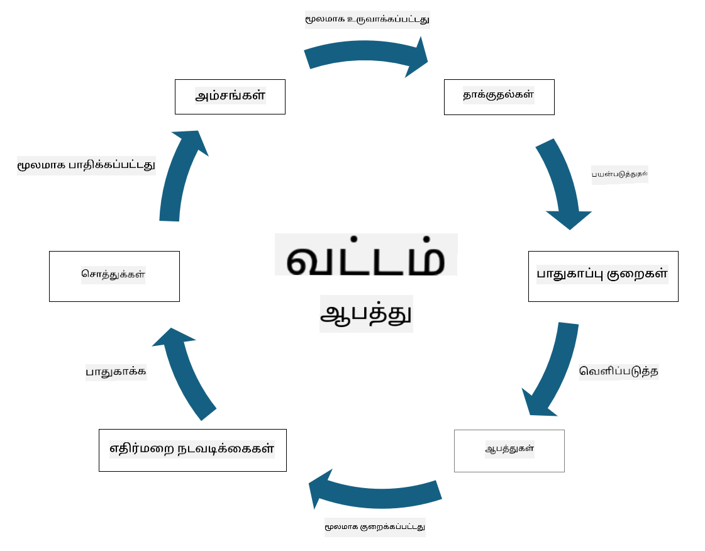

<!--
CO_OP_TRANSLATOR_METADATA:
{
  "original_hash": "fcca304f072cabf206388199e8e2e578",
  "translation_date": "2025-10-11T11:28:11+00:00",
  "source_file": "1.3 Understanding risk management.md",
  "language_code": "ta"
}
-->
# அபாய மேலாண்மையைப் புரிந்துகொள்வது

## அறிமுகம்

இந்த பாடத்தில், நாம் கவரப்போகிறோம்:

 - பொதுவாகப் பயன்படுத்தப்படும் பாதுகாப்பு சொற்களின் வரையறைகள்
   
 - பாதுகாப்பு கட்டுப்பாடுகளின் வகைகள்

 - பாதுகாப்பு அபாயங்களை மதிப்பீடு செய்வது

## பொதுவாகப் பயன்படுத்தப்படும் பாதுகாப்பு சொற்களின் வரையறைகள்

இந்த சொற்கள் சைபர் பாதுகாப்பு மற்றும் அபாய மேலாண்மையின் அடிப்படை கருத்துக்களாகும். ஒவ்வொரு சொற்றொடரையும் அதன் தொடர்புகளைப் புரிந்துகொள்ளலாம்:

1. **மிரட்டல் முகவர்**:

மிரட்டல் முகவர் என்பது ஒரு தனிநபர், குழு, அமைப்பு அல்லது தானியங்கி அமைப்பு ஆகும், இது ஒரு அமைப்பு அல்லது நெட்வொர்க்கில் உள்ள பலவீனங்களைப் பயன்படுத்தி சேதம் அல்லது பாதிப்பை ஏற்படுத்தும் திறன் கொண்டது. மிரட்டல் முகவர்களில் ஹேக்கர்கள், மால்வேர் உருவாக்குநர்கள், அதிருப்தியடைந்த ஊழியர்கள் அல்லது தகவல் மற்றும் தொழில்நுட்ப அமைப்புகளுக்கு அபாயத்தை ஏற்படுத்தும் எந்தவொரு அமைப்பும் இருக்கலாம்.

2. **மிரட்டல்**:

மிரட்டல் என்பது ஒரு அமைப்பின் சொத்துகளுக்கு சேதத்தை ஏற்படுத்த பலவீனங்களைப் பயன்படுத்தக்கூடிய நிகழ்வு அல்லது நடவடிக்கை ஆகும். ஹேக்கிங், தரவுகள் கசிவு, சேவை மறுப்பு தாக்குதல் போன்றவை மிரட்டல்களில் அடங்கும். மிரட்டல்கள் என்பது ஒரு அமைப்பின் சொத்துகளுக்கு ஏற்படும் பாதிப்பின் "என்ன" ஆகும்.

3. **பலவீனம்**:

பலவீனம் என்பது ஒரு அமைப்பின் வடிவமைப்பு, செயல்பாடு அல்லது கட்டமைப்பில் உள்ள குறைபாடாகும், இது மிரட்டல் முகவரால் அமைப்பின் பாதுகாப்பை பாதிக்க பயன்படுத்தப்படலாம். பலவீனங்கள் மென்பொருள், வன்பொருள், செயல்முறைகள் அல்லது மனித நடத்தை ஆகியவற்றில் இருக்கலாம். பலவீனங்களை அடையாளம் காண்பதும் சரிசெய்வதும் வெற்றிகரமான தாக்குதல்களின் அபாயத்தை குறைக்க முக்கியமானது.

4. **அபாயம்**:

அபாயம் என்பது மிரட்டல் மற்றும் பலவீனத்தின் தொடர்பு மூலம் ஏற்படும் இழப்பு, சேதம் அல்லது பாதிப்பு ஏற்படும் சாத்தியம் ஆகும். இது ஒரு மிரட்டல் முகவர் பலவீனத்தைப் பயன்படுத்தி எதிர்மறை விளைவுகளை ஏற்படுத்தும் சாத்தியத்தை குறிக்கிறது. அபாயங்கள் பொதுவாக அதன் தாக்கம் மற்றும் நிகழும் சாத்தியத்தின் அடிப்படையில் மதிப்பீடு செய்யப்படுகின்றன.

5. **சொத்து**:

சொத்து என்பது ஒரு அமைப்பு பாதுகாக்க விரும்பும் எந்தவொரு மதிப்புமிக்க பொருளாகும். சொத்துகளில் கணினிகள் மற்றும் சர்வர்கள் போன்ற உடல் பொருட்கள், தரவுகள் (வாடிக்கையாளர் தகவல், நிதி பதிவுகள்), அறிவுசார் சொத்து (வணிக ரகங்கள், காப்புரிமைகள்) மற்றும் மனித வளம் (ஊழியர்களின் திறன்கள் மற்றும் அறிவு) அடங்கும். சொத்துகளைப் பாதுகாப்பது சைபர் பாதுகாப்பின் முக்கிய நோக்கமாகும்.

6. **வெளிப்பாடு**:

வெளிப்பாடு என்பது மிரட்டல்களுக்கு பாதிக்கப்படக்கூடிய நிலையை குறிக்கிறது. இது மிரட்டல் முகவரால் பயன்படுத்தக்கூடிய பலவீனம் இருக்கும்போது ஏற்படுகிறது. வெளிப்பாடு ஒரு அமைப்பு அல்லது நெட்வொர்க்கில் பலவீனங்கள் இருப்பதன் காரணமாக ஏற்படும் அபாயத்தை வெளிப்படுத்துகிறது.

7. **கட்டுப்பாடு**:

கட்டுப்பாடு என்பது பலவீனங்கள் மற்றும் மிரட்டல்களுடன் தொடர்புடைய அபாயத்தை குறைக்க அமைக்கப்பட்ட ஒரு நடவடிக்கையாகும். கட்டுப்பாடுகள் தொழில்நுட்ப, நடைமுறை அல்லது நிர்வாக ரீதியாக இருக்கலாம். அவை மிரட்டல்களைத் தடுக்க, கண்டறிய அல்லது குறைக்க வடிவமைக்கப்பட்டவை. உதாரணமாக, ஃபயர்வால்கள், அணுகல் கட்டுப்பாடுகள், குறியாக்கம், பாதுகாப்பு கொள்கைகள் மற்றும் ஊழியர் பயிற்சி ஆகியவை அடங்கும்.

இந்த சொற்களின் தொடர்பை சுருக்கமாகக் கூறினால்: மிரட்டல் முகவர்கள் பலவீனங்களைப் பயன்படுத்தி மிரட்டல்களைச் செயல்படுத்துகிறார்கள், இது மதிப்புமிக்க சொத்துகளுக்கு சேதத்தை ஏற்படுத்தும் அபாயங்களை உருவாக்குகிறது. பலவீனங்கள் இருக்கும்போது வெளிப்பாடு ஏற்படுகிறது, மேலும் கட்டுப்பாடுகள் மிரட்டல்களின் தாக்கத்தைத் தடுக்க அல்லது குறைக்க சொத்துகளின் மீது ஏற்படும் அபாயத்தை குறைக்க அமைக்கப்படுகின்றன. இந்த அமைப்பு சைபர் பாதுகாப்பு அபாய மேலாண்மையின் அடிப்படையாக அமைக்கிறது, அமைப்புகள் தங்கள் தகவல் அமைப்புகள் மற்றும் சொத்துகளுக்கு ஏற்படும் சாத்தியமான அபாயங்களை அடையாளம் காண, மதிப்பீடு செய்ய மற்றும் சரிசெய்ய வழிகாட்டுகிறது.

## பாதுகாப்பு கட்டுப்பாடுகளின் வகைகள்

பாதுகாப்பு கட்டுப்பாடுகள் என்பது தகவல் அமைப்புகள் மற்றும் சொத்துகளை பலவீனங்கள் மற்றும் மிரட்டல்களிலிருந்து பாதுகாக்க அமல்படுத்தப்படும் நடவடிக்கைகள் அல்லது பாதுகாப்பு முறைகள் ஆகும். அவை தங்கள் கவனம் மற்றும் நோக்கத்தின் அடிப்படையில் பல வகைகளாக வகைப்படுத்தப்படலாம். இங்கே சில பொதுவான பாதுகாப்பு கட்டுப்பாடுகள் உள்ளன:

1. **நிர்வாக கட்டுப்பாடுகள்**:

இந்த கட்டுப்பாடுகள் அமைப்பின் பாதுகாப்பு நடைமுறைகள் மற்றும் பயனர் நடத்தை தொடர்பான கொள்கைகள், செயல்முறைகள் மற்றும் வழிகாட்டுதல்களுடன் தொடர்புடையவை.

- பாதுகாப்பு கொள்கைகள் மற்றும் செயல்முறைகள்: ஒரு அமைப்பில் பாதுகாப்பு எப்படி பராமரிக்கப்படுகிறது என்பதை வரையறுக்கும் ஆவணப்படுத்தப்பட்ட வழிகாட்டுதல்கள்.

- பாதுகாப்பு விழிப்புணர்வு மற்றும் பயிற்சி: ஊழியர்களுக்கு பாதுகாப்பு சிறந்த நடைமுறைகள் மற்றும் சாத்தியமான மிரட்டல்களைப் பற்றி கல்வி அளிக்கும் திட்டங்கள்.

- சம்பவங்களுக்கு பதிலளிப்பு மற்றும் மேலாண்மை: பாதுகாப்பு சம்பவங்களுக்கு பதிலளிக்க மற்றும் குறைக்க திட்டங்கள்.

2. **தொழில்நுட்ப கட்டுப்பாடுகள்**:

தொழில்நுட்ப கட்டுப்பாடுகள் அமைப்புகள் மற்றும் தரவுகளைப் பாதுகாக்க பாதுகாப்பு நடவடிக்கைகளை அமல்படுத்த தொழில்நுட்பத்தைப் பயன்படுத்துவதுடன் தொடர்புடையவை. தொழில்நுட்ப கட்டுப்பாடுகளின் உதாரணங்கள்:

- அணுகல் கட்டுப்பாடுகள்: பயனர் பங்கு மற்றும் அனுமதிகளின் அடிப்படையில் வளங்களுக்கு அணுகலைக் கட்டுப்படுத்தும் நடவடிக்கைகள்.

- குறியாக்கம்: அனுமதியற்ற அணுகலைத் தடுக்க தரவுகளை ஒரு பாதுகாப்பான வடிவமாக மாற்றுதல்.

- ஃபயர்வால்கள்: வருவாய் மற்றும் வெளியேறும் போக்குவரத்தை வடிகட்டும் மற்றும் கட்டுப்படுத்தும் நெட்வொர்க் பாதுகாப்பு சாதனங்கள்.

- உளறல் கண்டறிதல் மற்றும் தடுப்பு அமைப்புகள் (IDPS): சந்தேகத்திற்கிடமான செயல்பாட்டிற்காக நெட்வொர்க் போக்குவரத்தை கண்காணிக்கும் கருவிகள்.

- வைரஸ் மற்றும் மால்வேர் எதிர்ப்பு மென்பொருள்: தீங்கு விளைவிக்கும் மென்பொருளை கண்டறிந்து அகற்றும் திட்டங்கள்.

- அங்கீகார механизмங்கள்: பயனர்களின் அடையாளத்தை சரிபார்க்கும் முறைகள், உதாரணமாக கடவுச்சொற்கள், உயிரியல் அடையாளங்கள் மற்றும் பல காரணி அங்கீகாரம்.

- பாச்சு மேலாண்மை: அறியப்பட்ட பலவீனங்களைத் தீர்க்க மென்பொருளை முறையாகப் புதுப்பித்தல்.

3. **உடல் கட்டுப்பாடுகள்**:

உடல் கட்டுப்பாடுகள் உடல் சொத்துகள் மற்றும் வசதிகளைப் பாதுகாக்கும் நடவடிக்கைகள்.

- பாதுகாப்பு காவலர்கள் மற்றும் அணுகல் கட்டுப்பாட்டு பணியாளர்கள்: உடல் வளாகங்களுக்கு அணுகலை கண்காணித்து கட்டுப்படுத்தும் பணியாளர்கள்.

- கண்காணிப்பு கேமராக்கள்: செயல்பாடுகளை கண்காணித்து பதிவு செய்யும் வீடியோ கண்காணிப்பு அமைப்புகள்.

- பூட்டுகள் மற்றும் உடல் தடைகள்: உணர்வான பகுதிகளுக்கு அணுகலைக் கட்டுப்படுத்த உடல் நடவடிக்கைகள்.

- சுற்றுச்சூழல் கட்டுப்பாடுகள்: உபகரணங்கள் மற்றும் தரவுக் கூடங்களுக்கு பாதிப்பை ஏற்படுத்தும் வெப்பநிலை, ஈரப்பதம் மற்றும் பிற சுற்றுச்சூழல் காரகங்களை ஒழுங்குபடுத்தும் நடவடிக்கைகள்.

4. **செயல்பாட்டு கட்டுப்பாடுகள்**:

இந்த கட்டுப்பாடுகள் அமைப்பின் தினசரி செயல்பாடுகள் மற்றும் அமைப்புகளின் தொடர்ச்சியான பாதுகாப்பை உறுதிசெய்யும் நடவடிக்கைகளுடன் தொடர்புடையவை.

- மாற்ற மேலாண்மை: அமைப்புகள் மற்றும் கட்டமைப்புகளில் மாற்றங்களைப் பதிவுசெய்து ஒப்புதல் பெறும் செயல்முறைகள்.

- காப்புப்பிரதி மற்றும் பேரழிவு மீட்பு: அமைப்பின் தோல்விகள் அல்லது பேரழிவுகளின் போது தரவுகளை காப்புப்பிரதி எடுத்து மீட்கும் திட்டங்கள்.

- பதிவு மற்றும் தணிக்கை: பாதுகாப்பு மற்றும் இணக்கத்திற்காக அமைப்பு செயல்பாடுகளை கண்காணித்து பதிவு செய்தல்.

- பாதுகாப்பான குறியீட்டு நடைமுறைகள்: பலவீனங்களை குறைக்க மென்பொருள் எழுதுவதற்கான வழிகாட்டுதல்கள்.

5. **சட்ட மற்றும் ஒழுங்குமுறை கட்டுப்பாடுகள்**:

இந்த கட்டுப்பாடுகள் தொடர்புடைய சட்டங்கள், ஒழுங்குமுறைகள் மற்றும் தொழில்துறை தரநிலைகளுடன் இணக்கமாக இருப்பதை உறுதிசெய்கின்றன. ஒரு அமைப்பு இணக்கமாக இருக்க வேண்டிய தரநிலைகள் அதன் சட்டப்பூர்வம், தொழில்துறை செங்குத்து மற்றும் பிற காரணிகளின் அடிப்படையில் மாறுபடும்.

- தரவுகள் பாதுகாப்பு ஒழுங்குமுறைகள்: GDPR, HIPAA மற்றும் CCPA போன்ற சட்டங்களுடன் இணக்கமாக இருப்பது.

- தொழில்துறை-குறிப்பிட்ட தரநிலைகள்: PCI DSS போன்ற தரநிலைகளுடன் இணக்கமாக இருப்பது.

இந்த பாதுகாப்பு கட்டுப்பாடுகளின் வகைகள் அமைப்புகளுக்கு விரிவான பாதுகாப்பு நிலையை உருவாக்க உதவுகின்றன, அவற்றின் அமைப்புகள், தரவுகள் மற்றும் சொத்துகளை பலவீனங்கள் மற்றும் மிரட்டல்களின் பரந்த அளவிலிருந்து பாதுகாக்க உதவுகின்றன.

## பாதுகாப்பு அபாயங்களை மதிப்பீடு செய்வது

சில பாதுகாப்பு நிபுணர்கள் அபாய மேலாண்மை அபாய நிபுணர்களுக்கு விட்டுவிடப்படுகிறது என்று நினைக்கிறார்கள், ஆனால் பாதுகாப்பு அபாயத்தை நிர்வகிக்கும் செயல்முறையைப் புரிந்துகொள்வது எந்த பாதுகாப்பு நிபுணருக்கும் முக்கியமானது, ஏனெனில் அமைப்பின் மற்ற பகுதிகள் புரிந்து கொண்டு நடவடிக்கை எடுக்கக்கூடிய மொழியில் பாதுகாப்பு அபாயத்தை வெளிப்படுத்த உதவுகிறது.

அமைப்புகள் தொடர்ந்து பாதுகாப்பு அபாயங்களை மதிப்பீடு செய்ய வேண்டும் மற்றும் வணிகத்திற்கு எதிரான அபாயங்களுக்கு என்ன நடவடிக்கை (அல்லது எதுவும் இல்லை) எடுக்க வேண்டும் என்பதை முடிவு செய்ய வேண்டும். கீழே இது பொதுவாக எப்படி செய்யப்படுகிறது என்பதற்கான ஒரு கண்ணோட்டம் உள்ளது. இந்த செயல்முறை பொதுவாக ஒரு அமைப்பின் பல்வேறு குழுக்களால் மேற்கொள்ளப்படுகிறது, அபாயத்தின் முடிவுக்கு முழுமையான மேலாண்மைக்கு ஒரு குழு பொறுப்பாக இருப்பது அரிது.

1. **சொத்துகள் மற்றும் மிரட்டல்களை அடையாளம் காண்க**:

அமைப்பு பாதுகாக்க விரும்பும் சொத்துகளை அடையாளம் காண்கிறது. இதில் தரவுகள், அமைப்புகள், வன்பொருள், மென்பொருள், அறிவுசார் சொத்து மற்றும் பலவற்றை உள்ளடக்கலாம். அதன் பிறகு, இந்த சொத்துகளை இலக்காகக் கொண்ட சாத்தியமான மிரட்டல்களை அடையாளம் காண்கிறது.

2. **பலவீனங்களை மதிப்பீடு செய்யுங்கள்**:

அமைப்புகள் மிரட்டல்களால் பயன்படுத்தப்படக்கூடிய அமைப்புகள் அல்லது செயல்முறைகளில் பலவீனங்கள் அல்லது குறைபாடுகளை அடையாளம் காணும். இந்த பலவீனங்கள் மென்பொருள் குறைபாடுகள், தவறான கட்டமைப்புகள், பாதுகாப்பு கட்டுப்பாடுகள் இல்லாமை மற்றும் மனித தவறுகளிலிருந்து தோன்றலாம்.

3. **சாத்தியத்தின் மதிப்பீடு**:

அமைப்பு ஒவ்வொரு மிரட்டலின் நிகழும் சாத்தியத்தை மதிப்பீடு செய்யும். இது வரலாற்று தரவுகள், மிரட்டல் நுண்ணறிவு, தொழில்துறை போக்குகள் மற்றும் உள்நாட்டு காரணிகளைப் பரிசீலிப்பதை உள்ளடக்கியது. சாத்தியம் குறைந்தது, நடுத்தர அல்லது அதிகம் என வகைப்படுத்தப்படலாம்.

4. **தாக்கத்தின் மதிப்பீடு**:

அடுத்து, அமைப்பு ஒரு பலவீனத்தைப் பயன்படுத்தும் போது ஒவ்வொரு மிரட்டலின் சாத்தியமான தாக்கத்தை நிர்ணயிக்கிறது. தாக்கம் நிதி இழப்புகள், செயல்பாட்டு இடர்ப்பாடுகள், புகழ் சேதம், சட்ட விளைவுகள் மற்றும் பலவற்றை உள்ளடக்கலாம். தாக்கம் குறைந்தது, நடுத்தர அல்லது அதிகம் என வகைப்படுத்தப்படலாம்.

5. **அபாய கணக்கீடு**:

சாத்தியம் மற்றும் தாக்க மதிப்பீடுகள் இணைக்கப்பட்டு ஒவ்வொரு மிரட்டலுக்கான மொத்த அபாய நிலையை கணக்கிடுகிறது. இது பொதுவாக சாத்தியம் மற்றும் தாக்க நிலைகளுக்கு எண் மதிப்புகள் அல்லது தரவுரைகள் ஒதுக்கும் அபாய அட்டவணையைப் பயன்படுத்தி செய்யப்படுகிறது. பெறப்பட்ட அபாய நிலை எந்த அபாயங்களுக்கு உடனடி கவனம் தேவை என்பதை முன்னுரிமை அளிக்க உதவுகிறது.

6. **முன்னுரிமை மற்றும் முடிவெடுப்பது**:

அமைப்பு சாத்தியம் மற்றும் தாக்க மதிப்புகளின் அடிப்படையில் அதிகமான அபாயங்களை முன்னுரிமை அளிக்கிறது. இது வளங்களை ஒதுக்க மற்றும் கட்டுப்பாடுகளை செயல்படுத்த அதிக திறமையாக உதவுகிறது. அதிக அபாய மிரட்டல்களுக்கு உடனடி கவனம் தேவை, ஆனால் குறைந்த அபாய மிரட்டல்கள் நீண்ட காலத்திற்குள் தீர்க்கப்படலாம்.

7. **அபாய சிகிச்சை**:

அபாய மதிப்பீட்டின் அடிப்படையில், அமைப்பு ஒவ்வொரு அபாயத்தை எவ்வாறு குறைக்க அல்லது நிர்வகிக்க முடியும் என்பதை நிர்ணயிக்கிறது. இது பாதுகாப்பு கட்டுப்பாடுகளை செயல்படுத்துதல், காப்பீட்டின் மூலம் அபாயத்தை மாற்றுதல் அல்லது நிர்வகிக்கக்கூடிய/மிகவும் செலவாகும்/மற்றவற்றை சரிசெய்ய முடியாத நிலுவை அபாயங்களை ஏற்குதல் ஆகியவற்றை உள்ளடக்கலாம்.

8. **தொடர்ச்சியான கண்காணிப்பு மற்றும் மதிப்பீடு**:

அபாய மதிப்பீடு ஒரு முறை செய்யப்படும் செயல்முறை அல்ல. அமைப்பின் சூழலில் முக்கியமான மாற்றங்கள் ஏற்பட்டால் அல்லது அவ்வப்போது இது நடத்தப்பட வேண்டும். தொடர்ச்சியான கண்காணிப்பு புதிய மிரட்டல்கள், பலவீனங்கள் அல்லது வணிக சூழலில் மாற்றங்கள் கணக்கில் எடுத்துக்கொள்ளப்படுவதை உறுதிசெய்கிறது.

இந்த அமைப்பான முறையில் பாதுகாப்பு அபாயங்களை மதிப்பீடு செய்வதன் மூலம், அமைப்புகள் வள ஒதுக்கீடு, பாதுகாப்பு கட்டுப்பாடுகள் மற்றும் மொத்த அபாய மேலாண்மை உத்திகளின் மீது தகவல்தரப்பட்ட முடிவுகளை எடுக்க முடியும். அமைப்பின் மொத்த அபாய வெளிப்பாட்டை குறைப்பதுடன், அமைப்பின் வணிக இலக்குகள் மற்றும் நோக்கங்களுடன் பாதுகாப்பு முயற்சிகளை இணைப்பதே நோக்கம்.

---

**அறிவிப்பு**:  
இந்த ஆவணம் [Co-op Translator](https://github.com/Azure/co-op-translator) என்ற AI மொழிபெயர்ப்பு சேவையை பயன்படுத்தி மொழிபெயர்க்கப்பட்டுள்ளது. நாங்கள் துல்லியத்திற்காக முயற்சிக்கிறோம், ஆனால் தானியங்கி மொழிபெயர்ப்புகளில் பிழைகள் அல்லது தவறுகள் இருக்கக்கூடும் என்பதை கவனத்தில் கொள்ளவும். அதன் சொந்த மொழியில் உள்ள மூல ஆவணம் அதிகாரப்பூர்வ ஆதாரமாக கருதப்பட வேண்டும். முக்கியமான தகவல்களுக்கு, தொழில்முறை மனித மொழிபெயர்ப்பு பரிந்துரைக்கப்படுகிறது. இந்த மொழிபெயர்ப்பைப் பயன்படுத்துவதால் ஏற்படும் எந்த தவறான புரிதல்கள் அல்லது தவறான விளக்கங்களுக்கும் நாங்கள் பொறுப்பல்ல.