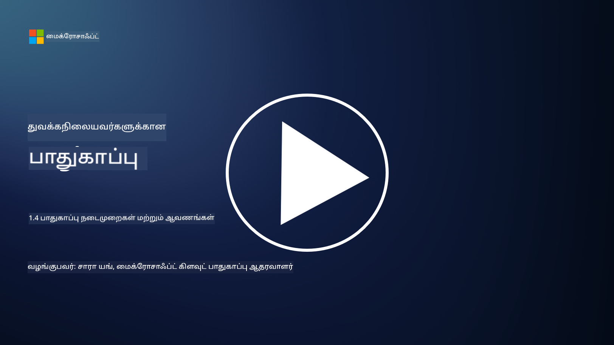

<!--
CO_OP_TRANSLATOR_METADATA:
{
  "original_hash": "d33500902124e52870935bdce4546fcc",
  "translation_date": "2025-10-11T11:17:15+00:00",
  "source_file": "1.4 Security practices and documentation.md",
  "language_code": "ta"
}
-->
# பாதுகாப்பு நடைமுறைகள் மற்றும் ஆவணங்கள்

“பாதுகாப்பு கொள்கை”, “பாதுகாப்பு தரநிலைகள்” போன்ற சொற்களை நீங்கள் முன்பு கேட்டிருக்கலாம், ஆனால் உண்மையில் பல சைபர் பாதுகாப்பு நிபுணர்கள் அவற்றைப் சரியாகப் பயன்படுத்துவதில்லை. எனவே, இந்த பகுதியில், இந்த சொற்கள் ஒவ்வொன்றும் என்ன அர்த்தம் என்பதையும், ஏன் ஒரு நிறுவனம் இவற்றைப் பயன்படுத்த வேண்டும் என்பதையும் விளக்குகிறோம்.

## அறிமுகம்

இந்த பாடத்தில் நாம் கற்கப்போகிறோம்:

- பாதுகாப்பு கொள்கை என்றால் என்ன?
- பாதுகாப்பு தரநிலை என்றால் என்ன?
- பாதுகாப்பு அடிப்படை அளவுகோல் என்றால் என்ன?
- பாதுகாப்பு வழிகாட்டி என்றால் என்ன?
- பாதுகாப்பு நடைமுறை என்றால் என்ன?
- சைபர் பாதுகாப்பு தொடர்பான சட்டங்கள் மற்றும் விதிமுறைகள் என்றால் என்ன?

இந்த சொற்கள் பெரும்பாலும் சைபர் பாதுகாப்பு சூழலில், ஒரு நிறுவனத்தின் பாதுகாப்பு ஆவணங்கள் மற்றும் நடைமுறைகளின் வெவ்வேறு நிலைகளை வரையறுக்க பயன்படுத்தப்படுகின்றன. ஒவ்வொரு சொற்களையும் தெளிவுபடுத்துவோம்:

## பாதுகாப்பு கொள்கை என்றால் என்ன?

பாதுகாப்பு கொள்கை என்பது ஒரு நிறுவனத்தின் மொத்த பாதுகாப்பு இலக்குகள், கொள்கைகள் மற்றும் வழிகாட்டுதல்களை சுட்டிக்காட்டும் உயர் நிலை ஆவணமாகும். இது பாதுகாப்பு தொடர்பான முடிவுகளை எடுக்க ஒரு கட்டமைப்பை வழங்குகிறது மற்றும் நிறுவனத்தின் பாதுகாப்பு நிலையை அமைக்கிறது. பாதுகாப்பு கொள்கைகள் பொதுவாக வளங்களை ஏற்றுக்கொள்ளக்கூடிய முறையில் பயன்படுத்துதல், தரவுப் பாதுகாப்பு, அணுகல் கட்டுப்பாடு, சம்பவங்களுக்கு பதிலளித்தல் போன்ற தலைப்புகளை உள்ளடக்கியதாக இருக்கும். கொள்கை என்பது தீர்வு மற்றும் தொழில்நுட்பம் சார்ந்ததல்ல. பலருக்கும் பரிச்சயமான ஒரு பாதுகாப்பு கொள்கை உதாரணமாக, ஒரு நிறுவனத்தின் "ஏற்றுக்கொள்ளக்கூடிய பயன்பாட்டு கொள்கை" இருக்கும்.

## பாதுகாப்பு தரநிலை என்றால் என்ன?

பாதுகாப்பு தரநிலை என்பது ஒரு நிறுவனத்தில் பாதுகாப்பு கட்டுப்பாடுகள் மற்றும் நடவடிக்கைகளை செயல்படுத்த வழிகாட்டுதல்கள் மற்றும் தேவைகளை வழங்கும் மேலும் விரிவான மற்றும் குறிப்பிட்ட ஆவணமாகும். தரநிலைகள் கொள்கைகளைவிட தெளிவான மற்றும் தொழில்நுட்ப ரீதியாக இருக்கும், குறிப்பிட்ட அமைப்புகள், நெட்வொர்க்குகள் மற்றும் செயல்முறைகளை பாதுகாப்பு இலக்குகளை அடைய அமைப்பதற்கும் பராமரிப்பதற்கும் குறிப்பிட்ட வழிகாட்டுதல்கள் மற்றும் பரிந்துரைகளை வழங்கும். உதாரணமாக, _“அனைத்து உள்துறை தரவுகளும் இடத்தில் மற்றும் பரிமாற்றத்தில் குறியாக்கம் செய்யப்பட வேண்டும்”_ என்பது ஒரு பாதுகாப்பு தரநிலையாக இருக்கும்.

## பாதுகாப்பு அடிப்படை அளவுகோல் என்றால் என்ன?

பாதுகாப்பு அடிப்படை அளவுகோல் என்பது ஒரு குறிப்பிட்ட அமைப்பு, பயன்பாடு அல்லது சூழலுக்கான குறைந்தபட்ச பாதுகாப்பு அமைப்புகளை வரையறுக்கும் ஒரு தொகுப்பாகும். இது அனைத்து தொடர்புடைய நிகழ்வுகளிலும் செயல்படுத்தப்பட வேண்டிய ஒரு தொடக்க நிலையை வரையறுக்கிறது. பாதுகாப்பு அடிப்படை அளவுகோல்கள் ஒரு நிறுவனத்தின் ஐடி உள்கட்டமைப்பில் ஒரே மாதிரியான மற்றும் ஒரு குறிப்பிட்ட அளவிலான பாதுகாப்பை உறுதிசெய்ய உதவுகின்றன. உதாரணமாக, _“Azure VMs நேரடி இணைய அணுகலைக் கொண்டிருக்கக்கூடாது”_ என்பது ஒரு பாதுகாப்பு அடிப்படை அளவுகோலாக இருக்கும்.

## பாதுகாப்பு வழிகாட்டி என்றால் என்ன?

பாதுகாப்பு வழிகாட்டி என்பது ஒரு குறிப்பிட்ட பாதுகாப்பு தரநிலை பொருந்தாத போது பரிந்துரைகள் மற்றும் வழிகாட்டுதல்களை வழங்கும் ஆவணமாகும். வழிகாட்டிகள் ஒரு தரநிலை ஒரு விஷயத்தை முழுமையாக அல்லது பகுதியளவில் மட்டுமே கையாளும் போது ஏற்படும் “சாம்பல் பகுதிகளை” கையாள முயற்சிக்கின்றன.

## பாதுகாப்பு நடைமுறை என்றால் என்ன?

பாதுகாப்பு நடைமுறை என்பது ஒரு பாதுகாப்பு தொடர்பான செயல்முறை அல்லது பணியை செயல்படுத்த தேவையான குறிப்பிட்ட நடவடிக்கைகள் மற்றும் பணிகளை விளக்கி கூறும் விரிவான படி படியாக வழிகாட்டும் ஆவணமாகும். நடைமுறைகள் நடைமுறை மற்றும் செயல்படுத்தக்கூடிய ஆவணங்களாகும், அவை சம்பவங்களுக்கு பதிலளித்தல், அமைப்பு பராமரிப்பு, பயனர் சேர்க்கை மற்றும் பிற பாதுகாப்பு தொடர்பான செயல்பாடுகளின் போது பின்பற்ற ஒரு தெளிவான நடவடிக்கை வரிசையை வழங்குகின்றன. உதாரணமாக, _“Microsoft Sentinel மூலம் ஒரு P1 பாதுகாப்பு சம்பவம் உருவாக்கப்பட்டால், பாதுகாப்பு செயல்பாட்டு மையம் (SOC) உடனடியாக பாதுகாப்பு மேலாளரைத் தொடர்பு கொண்டு சம்பவ விவரங்களை அவர்களுக்கு அனுப்ப வேண்டும்”_ என்பது ஒரு பாதுகாப்பு நடைமுறையாக இருக்கும்.

முடிவில், இந்த சொற்கள் ஒரு நிறுவனத்தின் சைபர் பாதுகாப்பு கட்டமைப்பில் உள்ள ஆவணங்கள் மற்றும் வழிகாட்டுதலின் வெவ்வேறு நிலைகளை பிரதிநிதித்துவப்படுத்துகின்றன. பாதுகாப்பு கொள்கைகள் உயர் நிலை இலக்குகளை அமைக்கின்றன, தரநிலைகள் விரிவான தேவைகளை வழங்குகின்றன, அடிப்படை அளவுகோல்கள் குறைந்தபட்ச பாதுகாப்பு அமைப்புகளை நிறுவுகின்றன, வழிகாட்டிகள் சிறந்த நடைமுறைகளை வழங்குகின்றன, மற்றும் நடைமுறைகள் பாதுகாப்பு செயல்முறைகளுக்கான செயல்படுத்தக்கூடிய படிகளை வழங்குகின்றன.

## சைபர் பாதுகாப்பு தொடர்பான சட்டங்கள்/விதிமுறைகள் என்றால் என்ன?

சட்டங்கள் மற்றும் விதிமுறைகள் என்பது டிஜிட்டல் அமைப்புகள், தரவுகள் மற்றும் தகவல்களைப் பாதுகாக்கும் விதிகளை, தரநிலைகளை மற்றும் தேவைகளை வரையறுத்து அமல்படுத்த அரசாங்கங்கள் மற்றும் ஒழுங்குமுறை அமைப்புகள் உருவாக்கிய சட்ட கட்டமைப்புகளைக் குறிக்கின்றன. இந்த சட்டங்கள் மற்றும் விதிமுறைகள் மண்டலத்துக்கு மாறுபடுகின்றன மற்றும் தரவுப் பாதுகாப்பு, தனியுரிமை, சம்பவ அறிக்கை மற்றும் முக்கிய உள்கட்டமைப்பின் பாதுகாப்பு உள்ளிட்ட சைபர் பாதுகாப்பின் வெவ்வேறு அம்சங்களை மையமாகக் கொண்டுள்ளன. சைபர் பாதுகாப்பு தொடர்பான சில சட்டங்கள் மற்றும் விதிமுறைகளின் உதாரணங்கள்: General Data Protection Regulation (GDPR), Health Insurance Portability and Accountability Act (HIPAA), California Consumer Privacy Act (CCPA), Payment Card Industry Data Security Standard (PCI DSS).

## மேலும் வாசிக்க

[தகவல் பாதுகாப்பு கொள்கை மாதிரிகள் | SANS நிறுவனம்](https://www.sans.org/information-security-policy/)

[சைபர் பாதுகாப்பு மற்றும் தனியுரிமை சட்டங்கள் மற்றும் விதிமுறைகளுடன் இணக்கம் | NIST](https://www.nist.gov/mep/cybersecurity-resources-manufacturers/compliance-cybersecurity-and-privacy-laws-and-regulations)

---

**அறிவிப்பு**:  
இந்த ஆவணம் [Co-op Translator](https://github.com/Azure/co-op-translator) என்ற AI மொழிபெயர்ப்பு சேவையை பயன்படுத்தி மொழிபெயர்க்கப்பட்டுள்ளது. நாங்கள் துல்லியத்திற்காக முயற்சிக்கிறோம், ஆனால் தானியங்கி மொழிபெயர்ப்புகளில் பிழைகள் அல்லது தவறுகள் இருக்கக்கூடும் என்பதை கவனத்தில் கொள்ளவும். அதன் சொந்த மொழியில் உள்ள மூல ஆவணம் அதிகாரப்பூர்வ ஆதாரமாக கருதப்பட வேண்டும். முக்கியமான தகவல்களுக்கு, தொழில்முறை மனித மொழிபெயர்ப்பை பரிந்துரைக்கிறோம். இந்த மொழிபெயர்ப்பைப் பயன்படுத்துவதால் ஏற்படும் எந்த தவறான புரிதல்களுக்கும் அல்லது தவறான விளக்கங்களுக்கும் நாங்கள் பொறுப்பல்ல.