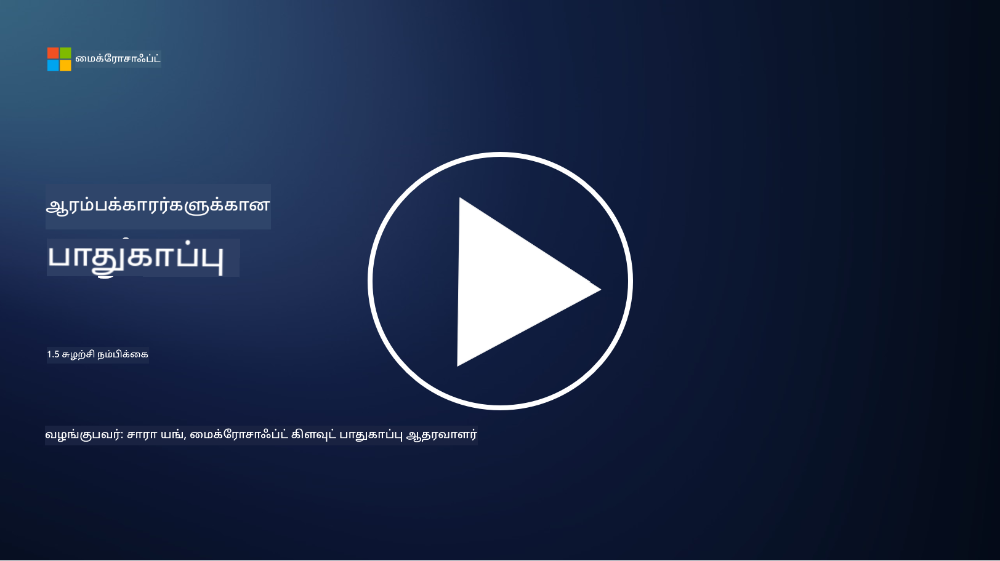
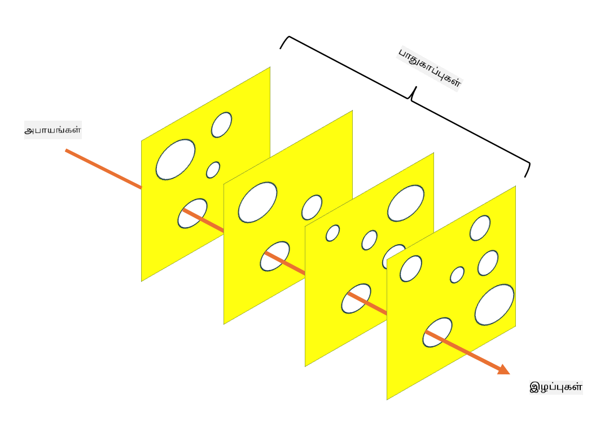

<!--
CO_OP_TRANSLATOR_METADATA:
{
  "original_hash": "75f77f972d2233c584f87c1eb96c983b",
  "translation_date": "2025-10-11T11:25:55+00:00",
  "source_file": "1.5 Zero trust.md",
  "language_code": "ta"
}
-->
# Zero Trust

“Zero trust” என்பது தற்போது பாதுகாப்பு வட்டாரங்களில் அதிகமாக பயன்படுத்தப்படும் ஒரு சொற்றொடராகும். ஆனால் இதன் பொருள் என்ன, இது வெறும் பேச்சுக்குரிய சொல் மட்டுமா? இந்த பாடத்தில், Zero Trust என்ன என்பதை விரிவாகப் பார்ப்போம்.

## அறிமுகம்

 - இந்த பாடத்தில் நாம் கற்கப்போகிறவை:
   
   
 - Zero Trust என்றால் என்ன?

   
  

 - Zero Trust எப்படி பாரம்பரிய பாதுகாப்பு கட்டமைப்புகளிலிருந்து மாறுபடுகிறது?

   
   

 - Defense in Depth என்றால் என்ன?

## Zero Trust

Zero Trust என்பது "நம்பி, பின்னர் சரிபார்க்கவும்" என்ற பாரம்பரிய கருத்தை சவால் செய்யும் ஒரு சைபர் பாதுகாப்பு அணுகுமுறை ஆகும். இது ஒரு நிறுவனத்தின் நெட்வொர்க்கிற்குள் அல்லது வெளியே உள்ள எந்த ஒரு அமைப்பையும் இயல்பாக நம்பக்கூடாது என்று கருதுகிறது. மாறாக, Zero Trust, எந்த இடத்திலிருந்தும் வளங்களை அணுக முயற்சிக்கும் ஒவ்வொரு பயனர், சாதனம் மற்றும் பயன்பாட்டையும் சரிபார்க்க வேண்டும் என்று வலியுறுத்துகிறது. Zero Trust இன் முக்கியக் கொள்கை "தாக்குதல் மேற்பரப்பை" குறைத்து, பாதுகாப்பு மீறல்களின் தாக்கத்தை குறைப்பதாகும்.

Zero Trust மாடலில், பின்வரும் கொள்கைகள் முக்கியமாக வலியுறுத்தப்படுகின்றன:

1. **அடையாளத்தை சரிபார்க்கவும்**: பயனர்கள் மற்றும் சாதனங்களுக்கு, அவர்கள் எங்கு இருந்தாலும், உறுதியாக அங்கீகாரம் மற்றும் அனுமதி வழங்கப்படுகிறது. ஒரு அடையாளம் மனிதராக இருக்க வேண்டிய அவசியமில்லை: அது ஒரு சாதனம், பயன்பாடு போன்றவையாக இருக்கலாம்.

2. **குறைந்த அனுமதி**: பயனர்கள் மற்றும் சாதனங்களுக்கு, அவர்கள் பணிகளைச் செய்ய தேவையான குறைந்த அளவிலான அணுகல் மட்டுமே வழங்கப்படுகிறது, இது மீறப்பட்டால் ஏற்படும் பாதிப்பை குறைக்கிறது.

3. **மைக்ரோ-செக்மென்டேஷன்**: நெட்வொர்க் வளங்கள் சிறிய பகுதிகளாகப் பிரிக்கப்படுகின்றன, இது மீறல் ஏற்பட்டால் நெட்வொர்க்கில் பக்கவாட்டு நகர்வை வரையறுக்கிறது.

4. **தொடர்ந்த கண்காணிப்பு**: பயனர் மற்றும் சாதனத்தின் நடத்தை தொடர்ந்து கண்காணிக்கப்பட்டு, சீர்கேடுகள் மற்றும் சாத்தியமான அச்சுறுத்தல்களை கண்டறியப்படுகிறது. நவீன கண்காணிப்பு தொழில்நுட்பங்கள் இயந்திர கற்றல், AI மற்றும் அச்சுறுத்தல் நுண்ணறிவு ஆகியவற்றை பயன்படுத்தி கூடுதல் விவரங்கள் மற்றும் சூழல்களை வழங்குகின்றன.

5. **தரவை குறியாக்கம்**: தரவுகள் அனுப்பும் போது மற்றும் சேமிக்கும் போது குறியாக்கம் செய்யப்படுகிறது, இது அனுமதியில்லாத அணுகலைத் தடுக்கிறது.

6. **கடுமையான அணுகல் கட்டுப்பாடு**: பயனர் பங்கு, சாதனத்தின் நிலை மற்றும் நெட்வொர்க் இடம் போன்ற சூழலின் அடிப்படையில் அணுகல் கட்டுப்பாடுகள் அமல்படுத்தப்படுகின்றன.

Microsoft, Zero Trust ஐ ஐந்து தூண்களாகப் பிரிக்கிறது, இதைப் பற்றி நாம் பின்னர் ஒரு பாடத்தில் விவாதிக்கப் போகிறோம்.

## பாரம்பரிய பாதுகாப்பு கட்டமைப்புகளிலிருந்து வேறுபாடு

Zero Trust, பாரம்பரிய பாதுகாப்பு கட்டமைப்புகளிலிருந்து, குறிப்பாக பரிமாண அடிப்படையிலான மாடல்களிலிருந்து, பல வழிகளில் மாறுபடுகிறது:

1. **பரிமாணம் vs. அடையாள மையம்**: பாரம்பரிய மாடல்கள் நெட்வொர்க்கின் பரிமாணத்தை பாதுகாக்க கவனம் செலுத்துகின்றன மற்றும் உள்ள பயனர்கள் மற்றும் சாதனங்களை நெட்வொர்க்கிற்குள் நம்பகமாக கருதுகின்றன. Zero Trust, மாறாக, அச்சுறுத்தல்கள் நெட்வொர்க்கிற்குள் மற்றும் வெளியே இருந்து வரலாம் என்று கருதுகிறது மற்றும் கடுமையான அடையாள அடிப்படையிலான கட்டுப்பாடுகளை அமல்படுத்துகிறது.

2. **மறைமுக vs. வெளிப்படையான நம்பிக்கை**: பாரம்பரிய மாடல்கள், நெட்வொர்க்கிற்குள் உள்ள சாதனங்கள் மற்றும் பயனர்களை மறைமுகமாக நம்புகின்றன. Zero Trust, அடையாளங்களை வெளிப்படையாகச் சரிபார்க்கிறது மற்றும் சீர்கேடுகளை தொடர்ந்து கண்காணிக்கிறது.

3. **சமமான vs. பிரிக்கப்பட்ட நெட்வொர்க்**: பாரம்பரிய கட்டமைப்புகள் பெரும்பாலும் சமமான நெட்வொர்க்குகளை உள்ளடக்கியவை, இதில் உள்ள பயனர்களுக்கு பரந்த அளவிலான அணுகல் உள்ளது. Zero Trust, நெட்வொர்க்கை சிறிய, தனித்துவமான பகுதிகளாகப் பிரிக்க வலியுறுத்துகிறது, இது சாத்தியமான மீறல்களை அடக்குகிறது.

4. **பின்தொடர்பு vs. முன்னோடித் திட்டம்**: பாரம்பரிய பாதுகாப்பு பெரும்பாலும் பரிமாண ஃபயர்வால்கள் மற்றும் ஊடுருவல் கண்டறிதல் போன்ற பின்தொடர்பு நடவடிக்கைகளில் நம்புகிறது. Zero Trust, மீறல்கள் சாத்தியமானவை என்று கருதி, அவற்றின் தாக்கத்தை குறைக்கும் முன்னோடித் திட்டத்தை எடுத்துக்கொள்கிறது.

## Defense in Depth

Defense in Depth, அல்லது அடுக்கப்பட்ட பாதுகாப்பு, என்பது ஒரு நிறுவனத்தின் வளங்களைப் பாதுகாக்க பல அடுக்கப்பட்ட பாதுகாப்பு கட்டுப்பாடுகள் மற்றும் நடவடிக்கைகளைப் பயன்படுத்தும் ஒரு சைபர் பாதுகாப்பு உத்தியாகும். நோக்கம், ஒரு அடுக்கு மீறப்பட்டால் கூட, மற்றவை பாதுகாப்பை வழங்க முடியும் என்று உறுதிப்படுத்தும் ஒட்டுமொத்த பாதுகாப்பு நிலையை உருவாக்குவது ஆகும். ஒவ்வொரு அடுக்கும் பாதுகாப்பின் ஒரு தனித்துவமான அம்சத்தை கவனிக்கிறது மற்றும் ஒரு நிறுவனத்தின் பாதுகாப்பு நிலையை அதிகரிக்கிறது.

Defense in Depth, தொழில்நுட்ப, நடைமுறை மற்றும் உடல் பாதுகாப்பு நடவடிக்கைகளின் கலவையை உள்ளடக்கியது. இதில் ஃபயர்வால்கள், ஊடுருவல் கண்டறிதல் அமைப்புகள், அணுகல் கட்டுப்பாடுகள், குறியாக்கம், பயனர் பயிற்சி, பாதுகாப்பு கொள்கைகள் மற்றும் பலவற்றை உள்ளடக்கலாம். நோக்கம், பல தடைகளை உருவாக்குவது, இது ஒரு நிறுவனத்தின் அமைப்புகள் மற்றும் நெட்வொர்க்குகளை ஊடுருவல் செய்ய முயற்சிக்கும் தாக்குதலாளர்களுக்கு கடினமாக்குகிறது. இது "சுவிஸ் சீஸ்" மாடல் என்றும் அழைக்கப்படுகிறது, இது மற்ற தொழில்களில் (எ.கா., போக்குவரத்து) விபத்து தடுப்பில் பயன்படுத்தப்படுகிறது.

## மேலும் படிக்க

[Zero Trust என்றால் என்ன?](https://learn.microsoft.com/security/zero-trust/zero-trust-overview?WT.mc_id=academic-96948-sayoung)

[Zero Trust இன் மேம்பாடு – Microsoft நிலைப்பாட்டு ஆவணம்](https://query.prod.cms.rt.microsoft.com/cms/api/am/binary/RWJJdT?WT.mc_id=academic-96948-sayoung)

[Zero Trust மற்றும் BeyondCorp Google Cloud | Google Cloud Blog](https://cloud.google.com/blog/topics/developers-practitioners/zero-trust-and-beyondcorp-google-cloud)

---

**குறிப்பு**:  
இந்த ஆவணம் [Co-op Translator](https://github.com/Azure/co-op-translator) என்ற AI மொழிபெயர்ப்பு சேவையைப் பயன்படுத்தி மொழிபெயர்க்கப்பட்டுள்ளது. எங்கள் தரச்செயல்முறையை உறுதிப்படுத்த முயற்சிக்கிறோம், ஆனால் தானியக்க மொழிபெயர்ப்புகளில் பிழைகள் அல்லது தவறான தகவல்கள் இருக்கக்கூடும் என்பதை தயவுசெய்து கவனத்தில் கொள்ளவும். அதன் தாய்மொழியில் உள்ள மூல ஆவணம் அதிகாரப்பூர்வ ஆதாரமாக கருதப்பட வேண்டும். முக்கியமான தகவல்களுக்கு, தொழில்முறை மனித மொழிபெயர்ப்பு பரிந்துரைக்கப்படுகிறது. இந்த மொழிபெயர்ப்பைப் பயன்படுத்துவதில் ஏற்படும் எந்த தவறான புரிதல்கள் அல்லது தவறான விளக்கங்களுக்கு நாங்கள் பொறுப்பல்ல.