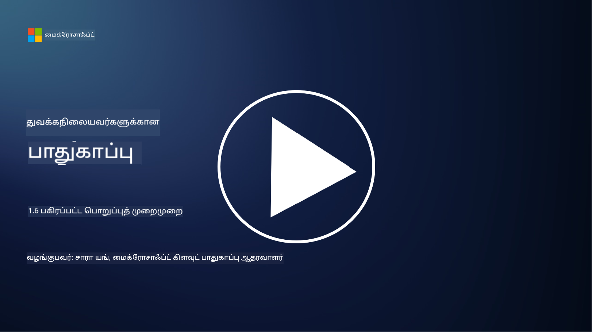

<!--
CO_OP_TRANSLATOR_METADATA:
{
  "original_hash": "a48db640d80c786b928ca178c414f084",
  "translation_date": "2025-10-11T11:24:41+00:00",
  "source_file": "1.6 Shared responsibility model.md",
  "language_code": "ta"
}
-->
# பகிரப்பட்ட பொறுப்புத் முறை

பகிரப்பட்ட பொறுப்பு என்பது IT துறையில் புதிய கருத்தாகும், இது மேக கணினி (cloud computing) வருகையுடன் உருவானது. சைபர் பாதுகாப்பு கோணத்தில், எந்த பாதுகாப்பு கட்டுப்பாடுகளை யார் வழங்குகிறார்கள் என்பதை புரிந்துகொள்வது முக்கியம், பாதுகாப்பில் இடைவெளிகள் இருக்காமல் இருக்க.

## அறிமுகம்

இந்த பாடத்தில் நாம் கற்கப்போகிறோம்:

 - சைபர் பாதுகாப்பு சூழலில் பகிரப்பட்ட பொறுப்பு என்றால் என்ன?
   
 - IaaS, PaaS மற்றும் SaaS இடையே பாதுகாப்பு கட்டுப்பாடுகளுக்கான 
   பகிரப்பட்ட பொறுப்பில் என்ன வேறுபாடு உள்ளது?

   

 - உங்கள் மேக தளம் எந்த பாதுகாப்பு கட்டுப்பாடுகளை வழங்குகிறது என்பதை 
   எங்கு கண்டறியலாம்?

   
 

 - “நம்புங்கள் ஆனால் சரிபாருங்கள்” என்றால் என்ன?

## சைபர் பாதுகாப்பு சூழலில் பகிரப்பட்ட பொறுப்பு என்றால் என்ன?

சைபர் பாதுகாப்பில் பகிரப்பட்ட பொறுப்பு என்பது மேக சேவை வழங்குநர் (CSP) மற்றும் அதன் வாடிக்கையாளர்களுக்கு இடையிலான பாதுகாப்பு பொறுப்புகளைப் பகிர்வதை குறிக்கிறது. மேக கணினி சூழல்களில், Infrastructure as a Service (IaaS), Platform as a Service (PaaS), மற்றும் Software as a Service (SaaS) போன்றவற்றில், CSP மற்றும் வாடிக்கையாளர் இருவரும் தரவுகள், பயன்பாடுகள் மற்றும் அமைப்புகளின் பாதுகாப்பை உறுதிப்படுத்த முக்கிய பங்கு வகிக்கிறார்கள்.

## IaaS, PaaS மற்றும் SaaS இடையே பாதுகாப்பு கட்டுப்பாடுகளுக்கான பகிரப்பட்ட பொறுப்பில் என்ன வேறுபாடு உள்ளது?

பொறுப்புகளின் பிரிவு பொதுவாக பயன்படுத்தப்படும் மேக சேவையின் வகையைப் பொறுத்து மாறுபடும்:

 - **IaaS (Infrastructure as a Service)**: CSP அடிப்படை உள்கட்டமைப்பை (சர்வர்கள், நெட்வொர்க், சேமிப்பு) வழங்குகிறது, ஆனால் வாடிக்கையாளர் அந்த உள்கட்டமைப்பில் இயங்கும் செயல்பாடுகள், பயன்பாடுகள் மற்றும் பாதுகாப்பு அமைப்புகளை நிர்வகிக்க வேண்டும்.
   
   
 - **PaaS (Platform as a Service):** CSP ஒரு தளத்தை வழங்குகிறது, அதில் வாடிக்கையாளர்கள் பயன்பாடுகளை உருவாக்கி வெளியிடலாம். CSP அடிப்படை உள்கட்டமைப்பை நிர்வகிக்கிறது, வாடிக்கையாளர் பயன்பாடுகள் மற்றும் தரவின் பாதுகாப்பில் கவனம் செலுத்த வேண்டும்.

   

 - **SaaS (Software as a Service)**: CSP முழுமையான செயல்பாட்டு பயன்பாடுகளை இணையத்தின் மூலம் வழங்குகிறது. இந்த நிலையில், பயன்பாட்டின் பாதுகாப்பு மற்றும் உள்கட்டமைப்பை CSP நிர்வகிக்கிறது, வாடிக்கையாளர் பயனர் அணுகல் மற்றும் தரவின் பயன்பாட்டை நிர்வகிக்க வேண்டும்.

பகிரப்பட்ட பொறுப்பை புரிந்துகொள்வது முக்கியம், ஏனெனில் CSP எந்த பாதுகாப்பு அம்சங்களை கவனிக்கிறது, வாடிக்கையாளர் எந்த அம்சங்களை கவனிக்க வேண்டும் என்பதை தெளிவுபடுத்துகிறது. இது தவறான புரிதல்களைத் தவிர்க்க உதவுகிறது மற்றும் பாதுகாப்பு நடவடிக்கைகள் முழுமையாக செயல்படுத்தப்படுவதை உறுதிப்படுத்துகிறது.

## உங்கள் மேக தளம் எந்த பாதுகாப்பு கட்டுப்பாடுகளை வழங்குகிறது என்பதை எங்கு கண்டறியலாம்?

உங்கள் மேக தளம் எந்த பாதுகாப்பு கட்டுப்பாடுகளை வழங்குகிறது என்பதை அறிய, மேக சேவை வழங்குநரின் ஆவணங்கள் மற்றும் வளங்களைப் பார்க்க வேண்டும். இதில் அடங்கும்:

 - **CSP-இன் இணையதளம் மற்றும் ஆவணங்கள்**: CSP-இன் இணையதளத்தில், அவர்கள் வழங்கும் பாதுகாப்பு அம்சங்கள் மற்றும் கட்டுப்பாடுகள் பற்றிய தகவல்கள் இருக்கும். CSP-கள் பொதுவாக பாதுகாப்பு நடைமுறைகள், கட்டுப்பாடுகள் மற்றும் பரிந்துரைகளை விளக்கும் விரிவான ஆவணங்களை வழங்குகிறார்கள். இது வெள்ளை ஆவணங்கள், பாதுகாப்பு வழிகாட்டிகள் மற்றும் தொழில்நுட்ப ஆவணங்களை உள்ளடக்கலாம்.
   
 - **பாதுகாப்பு மதிப்பீடுகள் மற்றும் தணிக்கைகள்**: பெரும்பாலான CSP-கள் தங்களது பாதுகாப்பு கட்டுப்பாடுகளை சுயாதீன பாதுகாப்பு நிபுணர்கள் மற்றும் அமைப்புகள் மூலம் மதிப்பீடு செய்யவிடுகிறார்கள். இந்த மதிப்பீடுகள் CSP-இன் பாதுகாப்பு நடவடிக்கைகளின் தரத்தைப் பற்றிய தகவல்களை வழங்கலாம். சில நேரங்களில் இது CSP-க்கு பாதுகாப்பு соответствம் சான்றிதழ் கிடைக்க வழிவகுக்கிறது (அடுத்த புள்ளியைப் பார்க்கவும்).
 - **பாதுகாப்பு соответствம் சான்றிதழ்கள்**: பெரும்பாலான CSP-கள் ISO:27001, SOC 2, மற்றும் FedRAMP போன்ற சான்றிதழ்களைப் பெறுகிறார்கள். இந்த சான்றிதழ்கள் வழங்குநர் குறிப்பிட்ட பாதுகாப்பு மற்றும் соответствம் தரங்களை பூர்த்தி செய்கிறார் என்பதை காட்டுகிறது.

மேக வழங்குநர்களுக்கு இடையே தகவலின் அளவு மற்றும் கிடைக்கும் தன்மை மாறுபடலாம் என்பதை நினைவில் கொள்ளுங்கள். உங்கள் மேக அடிப்படையிலான சொத்துகளின் பாதுகாப்பு குறித்து அறிவார்ந்த முடிவுகளை எடுக்க, மேக சேவை வழங்குநர் வழங்கும் அதிகாரப்பூர்வ மற்றும் தற்போதைய வளங்களைப் பயன்படுத்துவது அவசியம்.

## “நம்புங்கள் ஆனால் சரிபாருங்கள்” என்றால் என்ன?

CSP, மூன்றாம் தரப்பு மென்பொருள் அல்லது பிற IT பாதுகாப்பு சேவையைப் பயன்படுத்தும் சூழலில், ஒரு அமைப்பு முதலில் வழங்குநரின் பாதுகாப்பு நடவடிக்கைகள் பற்றிய கூற்றுகளை நம்பலாம். ஆனால், தங்களது தரவுகள் மற்றும் அமைப்புகளின் பாதுகாப்பை உண்மையாக உறுதிப்படுத்த, அவர்கள் இந்த கூற்றுகளை பாதுகாப்பு மதிப்பீடுகள், ஊடுருவல் சோதனை மற்றும் வெளிப்புற தரப்பின் பாதுகாப்பு கட்டுப்பாடுகளை மதிப்பீடு செய்வதன் மூலம் சரிபாரிக்க வேண்டும். தாங்கள் பொறுப்பேற்காத பாதுகாப்பு கட்டுப்பாடுகளை நம்புங்கள் ஆனால் சரிபாரிக்க வேண்டும்.

## ஒரு அமைப்புக்குள் பகிரப்பட்ட பொறுப்பு
ஒரு அமைப்புக்குள் பாதுகாப்புக்கான பொறுப்பை பல குழுக்களுக்கிடையே பகிர்ந்துகொள்வது முக்கியம். பாதுகாப்பு குழு அனைத்து கட்டுப்பாடுகளையும் தனியாக செயல்படுத்துவது அரிது, மேலும் அமைப்பை பாதுகாப்பாக வைத்திருக்க தேவையான அனைத்து பாதுகாப்பு கட்டுப்பாடுகளையும் செயல்படுத்த, செயல்பாட்டு குழுக்கள், டெவலப்பர்கள் மற்றும் வணிகத்தின் பிற பகுதிகளுடன் ஒத்துழைக்க வேண்டும்.

## மேலும் வாசிக்க
- [மேகத்தில் பகிரப்பட்ட பொறுப்பு - Microsoft Azure | Microsoft Learn](https://learn.microsoft.com/azure/security/fundamentals/shared-responsibility?WT.mc_id=academic-96948-sayoung)
- [பகிரப்பட்ட பொறுப்பு முறைமையா? – TechTarget.com-இன் வரையறை](https://www.techtarget.com/searchcloudcomputing/definition/shared-responsibility-model)
- [பகிரப்பட்ட பொறுப்பு முறைமையை விளக்குவது மற்றும் மேக பாதுகாப்புக்கு இது என்ன அர்த்தம்? | CSO Online](https://www.csoonline.com/article/570779/the-shared-responsibility-model-explained-and-what-it-means-for-cloud-security.html)
- [மேக பாதுகாப்புக்கான பகிரப்பட்ட பொறுப்பு: நீங்கள் அறிய வேண்டியது (cisecurity.org)](https://www.cisecurity.org/insights/blog/shared-responsibility-cloud-security-what-you-need-to-know)

---

**குறிப்பு**:  
இந்த ஆவணம் [Co-op Translator](https://github.com/Azure/co-op-translator) என்ற AI மொழிபெயர்ப்பு சேவையைப் பயன்படுத்தி மொழிபெயர்க்கப்பட்டுள்ளது. நாங்கள் துல்லியத்திற்காக முயற்சிக்கின்றோம், ஆனால் தானியங்கி மொழிபெயர்ப்புகளில் பிழைகள் அல்லது தவறான தகவல்கள் இருக்கக்கூடும் என்பதை கவனத்தில் கொள்ளவும். அதன் தாய்மொழியில் உள்ள மூல ஆவணம் அதிகாரப்பூர்வ ஆதாரமாகக் கருதப்பட வேண்டும். முக்கியமான தகவல்களுக்கு, தொழில்முறை மனித மொழிபெயர்ப்பு பரிந்துரைக்கப்படுகிறது. இந்த மொழிபெயர்ப்பைப் பயன்படுத்துவதால் ஏற்படும் எந்த தவறான புரிதல்கள் அல்லது தவறான விளக்கங்களுக்கு நாங்கள் பொறுப்பல்ல.