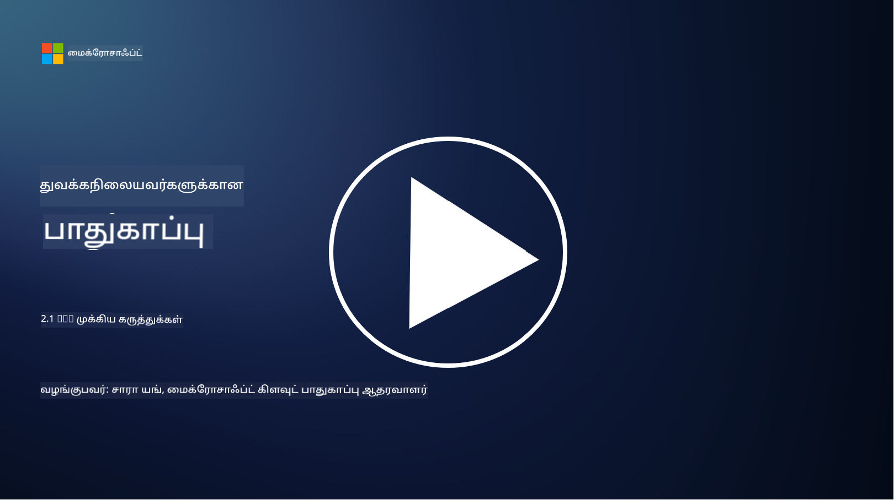

<!--
CO_OP_TRANSLATOR_METADATA:
{
  "original_hash": "2e3864e3d579f0dbb4ac2ec8c5f82acf",
  "translation_date": "2025-10-11T11:29:14+00:00",
  "source_file": "2.1 IAM key concepts.md",
  "language_code": "ta"
}
-->
# IAM முக்கிய கருத்துக்கள்

நீங்கள் ஒருபோதும் கணினி அல்லது இணையதளத்தில் உள்நுழைந்ததுண்டா? கண்டிப்பாக உள்நுழைந்திருப்பீர்கள்! அதனால், உங்கள் தினசரி வாழ்க்கையில் நீங்கள் ஏற்கனவே அடையாளக் கட்டுப்பாடுகளைப் பயன்படுத்தியுள்ளீர்கள். அடையாளம் மற்றும் அணுகல் மேலாண்மை (IAM) என்பது பாதுகாப்பின் முக்கியமான தூணாகும், இதைப் பற்றிய மேலும் தகவல்களை அடுத்த பாடங்களில் கற்றுக்கொள்வோம்.

**அறிமுகம்**

இந்த பாடத்தில், நாம் கற்றுக்கொள்ளப் போவது:

- சைபர் பாதுகாப்பு சூழலில் அடையாளம் மற்றும் அணுகல் மேலாண்மை (IAM) என்றால் என்ன?  
- குறைந்த உரிமையின் கொள்கை என்றால் என்ன?  
- கடமைகளின் பிரிவென்பது என்ன?  
- அங்கீகாரம் மற்றும் அனுமதி என்றால் என்ன?

## சைபர் பாதுகாப்பு சூழலில் அடையாளம் மற்றும் அணுகல் மேலாண்மை (IAM) என்றால் என்ன?

அடையாளம் மற்றும் அணுகல் மேலாண்மை (IAM) என்பது ஒரு நிறுவனத்தின் டிஜிட்டல் சூழலில் சரியான நபர்களுக்கு சரியான வளங்களை அணுக அனுமதிக்க, செயல்முறைகள், தொழில்நுட்பங்கள் மற்றும் கொள்கைகளை செயல்படுத்தும் ஒரு அமைப்பாகும். IAM என்பது டிஜிட்டல் அடையாளங்களை (பயனர்கள், ஊழியர்கள், கூட்டாளிகள்) மற்றும் அவற்றின் அணுகலை நிர்வகிப்பதைக் குறிக்கிறது, இது அமைப்பின் அமைப்புகள், பயன்பாடுகள், தரவுகள் மற்றும் நெட்வொர்க்குகளுக்கு தொடர்புடையது. IAM இன் முதன்மை நோக்கம் பாதுகாப்பை மேம்படுத்துவது, பயனர் அணுகலை எளிதாக்குவது மற்றும் அமைப்பின் கொள்கைகள் மற்றும் விதிமுறைகளுடன் இணக்கமாக இருப்பதை உறுதிப்படுத்துவது ஆகும். IAM தீர்வுகள் பொதுவாக பயனர் அங்கீகாரம், அனுமதி, அடையாள வழங்கல், அணுகல் கட்டுப்பாடு மற்றும் பயனர் வாழ்க்கைச் சுழற்சி மேலாண்மை (கணக்குகள் பயன்படுத்தப்படாதபோது நீக்கப்படுவதை உறுதிப்படுத்துதல்) ஆகியவற்றை உள்ளடக்கியவை.

## குறைந்த உரிமையின் கொள்கை என்றால் என்ன?

குறைந்த உரிமையின் கொள்கை என்பது பயனர்கள் மற்றும் அமைப்புகளுக்கு அவர்களின் பணிகள் அல்லது பங்குகளைச் செய்ய தேவையான குறைந்தபட்ச உரிமைகளை மட்டுமே வழங்க வேண்டும் என்று வலியுறுத்தும் அடிப்படை கருத்தாகும். இந்த கொள்கை பாதுகாப்பு மீறல் அல்லது உள்ளக அச்சுறுத்தல் ஏற்பட்டால் ஏற்படும் சாத்தியமான சேதத்தை வரையறுக்க உதவுகிறது. குறைந்த உரிமையின் கொள்கையை பின்பற்றுவதன் மூலம், அமைப்புகள் தாக்குதல் பரப்பை குறைத்து, அனுமதியில்லாத அணுகல், தரவின் மீறல் மற்றும் உரிமைகளின் தவறான பயன்பாட்டின் அபாயத்தை குறைக்கின்றன. நடைமுறையில், இது பயனர்களுக்கு அவர்களின் வேலை பங்குகளுக்கு தேவையான குறிப்பிட்ட வளங்கள் மற்றும் செயல்பாடுகளுக்கு மட்டுமே அணுகலை வழங்குகிறது, அதற்கு மேல் அல்ல. உதாரணமாக, நீங்கள் ஒரு ஆவணத்தைப் படிக்கவேண்டுமென்றால், அந்த ஆவணத்திற்கு முழு நிர்வாக உரிமைகளை வழங்குவது தேவையற்றது.

## கடமைகளின் பிரிவென்பது என்ன?

கடமைகளின் பிரிவு என்பது சண்டைகள் அல்லது மோசடிகளைத் தவிர்க்கவும், முக்கியமான பணிகள் மற்றும் பொறுப்புகளை அமைப்பின் பல்வேறு நபர்களுக்கு பகிர்ந்தளிக்கவும் நோக்கமுடைய கொள்கையாகும். சைபர் பாதுகாப்பு சூழலில், கடமைகளின் பிரிவு என்பது ஒரு முக்கிய செயல்முறை அல்லது அமைப்பின் அனைத்து அம்சங்களையும் ஒரே நபர் கட்டுப்படுத்துவதைத் தவிர்க்கும் நோக்கத்துடன் செயல்படுகிறது. இதன் நோக்கம், ஒரு செயல்முறையின் அமைப்பு மற்றும் அனுமதி நிலைகளை ஒரே நபர் செய்ய முடியாத வகையில் சோதனை மற்றும் சமநிலையை உருவாக்குவதாகும். உதாரணமாக, நிதி அமைப்புகளில், பரிவர்த்தனைகளை அமைப்பில் உள்ளிடும் நபர், அந்த பரிவர்த்தனைகளை அங்கீகரிக்கும் நபராக இருக்கக்கூடாது. இது அனுமதியில்லாத அல்லது மோசடி நடவடிக்கைகள் கண்டறியப்படாமல் போகும் அபாயத்தை குறைக்கிறது.

## அங்கீகாரம் மற்றும் அனுமதி என்றால் என்ன?

அங்கீகாரம் மற்றும் அனுமதி என்பது கணினி அமைப்புகள் மற்றும் தரவின் பாதுகாப்பு மற்றும் ஒருமைப்பாட்டை உறுதிப்படுத்த முக்கியமான இரண்டு அடிப்படை கருத்துக்களாகும். இவை வளங்களை அணுகவும், நுணுக்கமான தகவல்களைப் பாதுகாக்கவும் கட்டுப்படுத்துவதில் முக்கிய பங்கு வகிக்கின்றன.

**1. அங்கீகாரம்**:  
அங்கீகாரம் என்பது கணினி அமைப்பு அல்லது குறிப்பிட்ட வளத்தை அணுக முயற்சிக்கும் பயனர், அமைப்பு அல்லது அலகின் அடையாளத்தை சரிபார்க்கும் செயல்முறையாகும். இது கூறப்பட்ட அடையாளம் உண்மையானது மற்றும் துல்லியமானது என்பதை உறுதிப்படுத்துகிறது. அங்கீகார முறைகள் பொதுவாக பின்வரும் காரகங்களில் ஒன்றையாவது அல்லது ஒன்றுக்கு மேற்பட்டவற்றை உள்ளடக்கியவை:  
   
   a. நீங்கள் அறிந்தது: இது கடவுச்சொற்கள், PINகள் அல்லது அங்கீகரிக்கப்பட்ட பயனர் மட்டுமே வைத்திருக்கும் ரகசிய அறிவு போன்றவற்றை உள்ளடக்கியது.  
   
   b. நீங்கள் வைத்திருப்பது: இது சான்றிதழ் கார்டுகள், பாதுகாப்பு டோக்கன்கள் அல்லது பயனரின் அடையாளத்தை உறுதிப்படுத்த பயன்படுத்தப்படும் மொபைல் போன்கள் போன்ற உடல் டோக்கன்கள் அல்லது சாதனங்களை உள்ளடக்கியது.  
   
   c. நீங்கள் யார்: இது விரல் சுட்டுகள், முகம் அடையாளம் காணுதல் அல்லது கண் மடிப்பு ஸ்கேன் போன்ற பயனருக்கு தனித்துவமான உயிரியல் காரகங்களை குறிக்கிறது.  
   
அங்கீகார முறைகள் ஒரு பயனர் அவர்கள் கூறும் அடையாளம் உண்மையானது என்பதை உறுதிப்படுத்த, ஒரு அமைப்பு அல்லது வளத்தை அணுக அனுமதிக்கும் முன் பயன்படுத்தப்படுகின்றன. இது அனுமதியில்லாத அணுகலைத் தடுக்க உதவுகிறது மற்றும் சட்டபூர்வமான பயனர்கள் மட்டுமே ஒரு அமைப்பில் செயல்களைச் செய்ய முடியும் என்பதை உறுதிப்படுத்துகிறது.

**2. அனுமதி**:  
அனுமதி என்பது அங்கீகரிக்கப்பட்ட பயனர்கள் அல்லது அலகுகளுக்கு குறிப்பிட்ட அனுமதிகள் மற்றும் உரிமைகளை வழங்குவதற்கும் மறுப்பதற்கும் பயன்படும் செயல்முறையாகும். இது ஒரு பயனர் ஒரு அமைப்பில் அல்லது குறிப்பிட்ட வளங்களில் எந்த நடவடிக்கைகள் அல்லது செயல்பாடுகளைச் செய்ய அனுமதிக்கப்படுகிறது என்பதைத் தீர்மானிக்கிறது. அனுமதி பொதுவாக முன்கூட்டியே வரையறுக்கப்பட்ட கொள்கைகள், அணுகல் கட்டுப்பாட்டு விதிகள் மற்றும் பயனர்களுக்கு வழங்கப்பட்ட பங்குகளின் அடிப்படையில் இருக்கும்.

அனுமதி என்பது "அங்கீகரிக்கப்பட்ட பயனர் என்ன செய்ய முடியும்?" என்ற கேள்விக்கு பதிலளிப்பதாகக் கருதலாம். இது நுணுக்கமான தரவுகள் மற்றும் வளங்களை அனுமதியில்லாத அணுகல் அல்லது மாற்றத்திலிருந்து பாதுகாக்க அணுகல் கட்டுப்பாட்டு கொள்கைகளை வரையறுத்து அமல்படுத்துவதைக் குறிக்கிறது.

**சுருக்கமாக:**

- அங்கீகாரம் பயனர்கள் அல்லது அலகுகளின் அடையாளத்தை நிறுவுகிறது.  
- அனுமதி என்பது அங்கீகரிக்கப்பட்ட பயனர்கள் எந்த நடவடிக்கைகள் மற்றும் வளங்களை அணுக அல்லது மாற்ற அனுமதிக்கப்படுகிறார்கள் என்பதை தீர்மானிக்கிறது.  

## மேலும் வாசிக்க

- [Describe identity concepts - Training | Microsoft Learn](https://learn.microsoft.com/training/modules/describe-identity-principles-concepts/?WT.mc_id=academic-96948-sayoung)  
- [Introduction to identity - Microsoft Entra | Microsoft Learn](https://learn.microsoft.com/azure/active-directory/fundamentals/identity-fundamental-concepts?WT.mc_id=academic-96948-sayoung)  
- [What is Identity Access Management (IAM)? | Microsoft Security](https://www.microsoft.com/security/business/security-101/what-is-identity-access-management-iam?WT.mc_id=academic-96948-sayoung)  
- [What is IAM? Identity and access management explained | CSO Online](https://www.csoonline.com/article/518296/what-is-iam-identity-and-access-management-explained.html)  
- [What is IAM? (auth0.com)](https://auth0.com/blog/what-is-iam/)  
- [Security+: implementing Identity and Access Management (IAM) controls [updated 2021] | Infosec (infosecinstitute.com)](https://resources.infosecinstitute.com/certifications/securityplus/security-implementing-identity-and-access-management-iam-controls/)  
- [least privilege - Glossary | CSRC (nist.gov)](https://csrc.nist.gov/glossary/term/least_privilege)  
- [Security: The Principle of Least Privilege (POLP) - Microsoft Community Hub](https://techcommunity.microsoft.com/t5/azure-sql-blog/security-the-principle-of-least-privilege-polp/ba-p/2067390?WT.mc_id=academic-96948-sayoung)  
- [Principle of least privilege | CERT NZ](https://www.cert.govt.nz/it-specialists/critical-controls/principle-of-least-privilege/)  
- [Why is separation of duties required by NIST 800-171 and CMMC? - (totem.tech)](https://www.totem.tech/cmmc-separation-of-duties/)  

---

**குறிப்பு**:  
இந்த ஆவணம் [Co-op Translator](https://github.com/Azure/co-op-translator) என்ற AI மொழிபெயர்ப்பு சேவையைப் பயன்படுத்தி மொழிபெயர்க்கப்பட்டுள்ளது. நாங்கள் துல்லியத்திற்காக முயற்சிக்கின்றோம், ஆனால் தானியங்கி மொழிபெயர்ப்புகளில் பிழைகள் அல்லது தவறான தகவல்கள் இருக்கக்கூடும் என்பதை கவனத்தில் கொள்ளவும். அதன் தாய்மொழியில் உள்ள மூல ஆவணம் அதிகாரப்பூர்வ ஆதாரமாக கருதப்பட வேண்டும். முக்கியமான தகவல்களுக்கு, தொழில்முறை மனித மொழிபெயர்ப்பு பரிந்துரைக்கப்படுகிறது. இந்த மொழிபெயர்ப்பைப் பயன்படுத்துவதால் ஏற்படும் எந்த தவறான புரிதல்கள் அல்லது தவறான விளக்கங்களுக்கு நாங்கள் பொறுப்பல்ல.