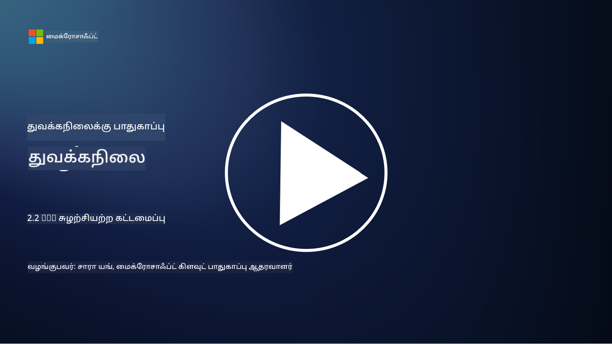

<!--
CO_OP_TRANSLATOR_METADATA:
{
  "original_hash": "4774a978af123f72ebb872199c4c4d4f",
  "translation_date": "2025-10-11T11:25:20+00:00",
  "source_file": "2.2 IAM zero trust architecture.md",
  "language_code": "ta"
}
-->
# IAM சீரோ டிரஸ்ட் கட்டமைப்பு

அடையாளம் என்பது சீரோ டிரஸ்ட் கட்டமைப்பை செயல்படுத்துவதற்கும் எந்த IT சூழலுக்கும் ஒரு எல்லையை உருவாக்குவதற்கும் முக்கியமான பகுதி ஆகும். இந்த பிரிவில், சீரோ டிரஸ்ட் செயல்படுத்த அடையாளக் கட்டுப்பாடுகளை பயன்படுத்துவது ஏன் முக்கியம் என்பதை ஆராய்வோம்.

## அறிமுகம்

இந்த பாடத்தில், நாம் கவரப்போகிறோம்:

 - நவீன IT சூழல்களில் ஏன் அடையாளத்தை எங்கள் எல்லையாக பயன்படுத்த வேண்டும்?
   
 - இது பாரம்பரிய IT கட்டமைப்புகளிலிருந்து எப்படி மாறுபடுகிறது?

 - சீரோ டிரஸ்ட் கட்டமைப்பை செயல்படுத்த அடையாளம் எப்படி பயன்படுத்தப்படுகிறது?

## நவீன IT சூழல்களில் ஏன் அடையாளத்தை எங்கள் எல்லையாக பயன்படுத்த வேண்டும்?

நவீன IT சூழல்களில், சைபர் மிரட்டல்களுக்கு எதிரான முதன்மை பாதுகாப்பு வரியாக உடல் எல்லையின் பாரம்பரிய கருத்து (firewalls மற்றும் நெட்வொர்க் எல்லைகளைப் பயன்படுத்துதல்) தொழில்நுட்பத்தின் அதிகப்படியான சிக்கல்களால், தொலைதூர வேலை அதிகரிப்பால் மற்றும் மேக சேவைகளை ஏற்றுக்கொள்வதன் காரணமாக குறைவாக செயல்படுகிறது. இதற்கு பதிலாக, நிறுவனங்கள் அடையாளத்தை புதிய எல்லையாக பயன்படுத்துவதற்கு மாறுகின்றன. இது பாதுகாப்பு, பயனர்கள், சாதனங்கள் மற்றும் பயன்பாடுகளின் அடையாளத்தை சரிபார்த்து நிர்வகிப்பதை மையமாகக் கொண்டது, அவர்கள் எந்த உடல் இடத்திலிருந்தும் வளங்களை அணுக முயற்சிக்கின்றனர்.

நவீன IT சூழல்களில் அடையாளத்தை எல்லையாக பயன்படுத்துவது ஏன் முக்கியம் என்பதை இங்கே காணலாம்:

**தொலைதூர பணியாளர்கள்**: தொலைதூர வேலை மற்றும் மொபைல் சாதனங்கள் வழக்கமாக மாறியுள்ளதால், பயனர்கள் பல இடங்கள் மற்றும் சாதனங்களில் இருந்து வளங்களை அணுக முடியும். பாரம்பரிய எல்லை அணுகுமுறை பயனர்கள் உடல் அலுவலகத்தில் மட்டுமே இருக்கும்போது வேலை செய்யாது.

**மேகம் மற்றும் கலப்பு சூழல்கள்**: நிறுவனங்கள் மேக சேவைகள் மற்றும் கலப்பு சூழல்களை அதிகமாக ஏற்றுக்கொள்கின்றன. தரவுகள் மற்றும் பயன்பாடுகள் இனி நிறுவனத்தின் வளாகத்திற்குள் மட்டுமே இல்லை, இதனால் பாரம்பரிய எல்லை பாதுகாப்புகள் குறைவாக பொருத்தமாகின்றன.

**சீரோ டிரஸ்ட் பாதுகாப்பு**: சீரோ டிரஸ்ட் பாதுகாப்பின் கருத்து எந்த அமைப்பையும், whether network உள்ளே அல்லது வெளியே, தானாகவே நம்பக்கூடாது என்று கருதுகிறது. அடையாளம் அணுகல் கோரிக்கைகளை சரிபார்க்க அடிப்படையாக மாறுகிறது, அவை எங்கு இருந்து வந்தாலும்.

**மிரட்டல் சூழல்**: சைபர் மிரட்டல்கள் மேம்படுகின்றன, மற்றும் தாக்குதலாளர்கள் பாரம்பரிய எல்லை பாதுகாப்புகளை தவிர்க்க வழிகளை கண்டுபிடிக்கின்றனர். Phishing, சமூக பொறியியல் மற்றும் உள்ளக மிரட்டல்கள் பெரும்பாலும் நெட்வொர்க் எல்லைகளை உடைக்க முயற்சிக்காமல் மனித பலவீனங்களை பயன்படுத்துகின்றன.

**தரவு மையமான அணுகுமுறை**: முக்கியமான தரவுகளைப் பாதுகாப்பது மிக முக்கியம். அடையாளத்தை மையமாகக் கொண்டு, நிறுவனங்கள் எந்த தரவுகளை யார் அணுகுகிறார்கள் என்பதை கட்டுப்படுத்த முடியும், தரவின் கசிவின் அபாயத்தை குறைக்க முடியும்.

## இது பாரம்பரிய IT கட்டமைப்புகளிலிருந்து எப்படி மாறுபடுகிறது?

பாரம்பரிய IT கட்டமைப்புகள் எல்லை அடிப்படையிலான பாதுகாப்பு மாடல்களை மிகவும் நம்பியிருந்தன, அங்கு firewalls மற்றும் நெட்வொர்க் எல்லைகள் மிரட்டல்களை வெளியே வைக்க முக்கிய பங்கு வகித்தன. பாரம்பரிய மற்றும் அடையாள மையமான அணுகுமுறைகளுக்கு இடையிலான முக்கிய வித்தியாசங்கள்:

|      அம்சம்                 |      பாரம்பரிய IT கட்டமைப்புகள்                                                                  |      அடையாள மையமான அணுகுமுறை                                                                             |
|-----------------------------|----------------------------------------------------------------------------------------------------|------------------------------------------------------------------------------------------------------------|
|     மையம்                   |     எல்லை மையம்: firewalls மற்றும் அணுகல் கட்டுப்பாடுகள் போன்ற எல்லை பாதுகாப்புகளை நம்பியது.             |     அடையாள சரிபார்ப்பு மையம்: நெட்வொர்க் எல்லைகளிலிருந்து பயனர்/சாதனத்தின் அடையாளத்தை சரிபார்ப்பதற்கு மாறியது.     |
|     இடம்                    |     இடம் சார்ந்தது: - பாதுகாப்பு உடல் அலுவலக இடங்கள் மற்றும் நெட்வொர்க் எல்லைகளுடன் இணைக்கப்பட்டது.    |     இடம் சார்ந்தது அல்ல: பாதுகாப்பு குறிப்பிட்ட இடங்களுடன் இணைக்கப்படவில்லை; எங்கிருந்தும் அணுகல்.                |
|     நம்பிக்கை கருதுகோள்     |     நம்பிக்கை கருதப்பட்டது: நெட்வொர்க் எல்லைக்குள் பயனர்கள்/சாதனங்களுக்கு நம்பிக்கை கருதப்பட்டது.                 |     சீரோ டிரஸ்ட் அணுகுமுறை: நம்பிக்கை ஒருபோதும் கருதப்படாது; அடையாளம் மற்றும் சூழ்நிலையின் அடிப்படையில் அணுகல் சரிபார்க்கப்படுகிறது.       |
|     சாதன கவனம்             |     சாதன பல்வகைமை: நெட்வொர்க் எல்லைக்குள் உள்ள சாதனங்கள் பாதுகாப்பானவை என்று கருதப்பட்டது.                  |     சாதன விழிப்புணர்வு: இடத்தைப் பொருட்படுத்தாமல் சாதனத்தின் ஆரோக்கியம் மற்றும் பாதுகாப்பு நிலையைப் பரிசீலிக்கிறது.               |
|     தரவுப் பாதுகாப்பு       |     தரவுப் பாதுகாப்பு: தரவுப் பாதுகாப்புக்காக நெட்வொர்க் எல்லைகளை பாதுகாப்பது மையமாக இருந்தது.                 |     தரவு மையமான பாதுகாப்பு: அடையாளம் மற்றும் தரவின் நெறிமுறையின் அடிப்படையில் தரவின் அணுகலை கட்டுப்படுத்த மையமாக உள்ளது.    |
|                             |                                                                                                    |                                                                                                            |

## சீரோ டிரஸ்ட் கட்டமைப்பை செயல்படுத்த அடையாளம் எப்படி பயன்படுத்தப்படுகிறது?

சீரோ டிரஸ்ட் கட்டமைப்பில், அடிப்படை கொள்கை எந்த அமைப்பையும் தானாகவே நம்பக்கூடாது, அது நெட்வொர்க் எல்லைக்குள் அல்லது வெளியே இருந்தாலும். சீரோ டிரஸ்ட் அணுகுமுறையை செயல்படுத்த அடையாளம் மையமாக செயல்படுகிறது, இது வளங்களை அணுக முயற்சிக்கும் அமைப்புகளை தொடர்ந்து சரிபார்க்க அனுமதிக்கிறது. நவீன அடையாள பாதுகாப்பு கட்டுப்பாடுகள் மூலம், ஒவ்வொரு பயனர், சாதனம், பயன்பாடு மற்றும் சேவையும் வளங்களை அணுக முயற்சிக்கும் போது முழுமையாக அடையாளம் காணப்பட்டு, அங்கீகரிக்கப்பட வேண்டும். இது username/password சேர்க்கைகள், multi-factor authentication (MFA), biometrics மற்றும் பிற வலுவான அங்கீகார முறைகள் போன்ற முறைகளின் மூலம் அவர்களின் டிஜிட்டல் அடையாளத்தை சரிபார்ப்பதை உள்ளடக்கியது.

## மேலும் வாசிக்க

- [Securing identity with Zero Trust | Microsoft Learn](https://learn.microsoft.com/security/zero-trust/deploy/identity?WT.mc_id=academic-96948-sayoung)
- [Zero Trust Principles and Guidance for Identity and Access | CSA (cloudsecurityalliance.org)](https://cloudsecurityalliance.org/artifacts/zero-trust-principles-and-guidance-for-iam/)
- [Zero Trust Identity Controls - Essentials Series - Episode 2 - YouTube](https://www.youtube.com/watch?v=fQZQznIKcGM&list=PLXtHYVsvn_b_gtX1-NB62wNervQx1Fhp4&index=13)

---

**குறிப்பு**:  
இந்த ஆவணம் [Co-op Translator](https://github.com/Azure/co-op-translator) என்ற AI மொழிபெயர்ப்பு சேவையைப் பயன்படுத்தி மொழிபெயர்க்கப்பட்டுள்ளது. நாங்கள் துல்லியத்திற்காக முயற்சிக்கின்றோம், ஆனால் தானியங்கி மொழிபெயர்ப்புகளில் பிழைகள் அல்லது தவறான தகவல்கள் இருக்கக்கூடும் என்பதை தயவுசெய்து கவனத்தில் கொள்ளுங்கள். அதன் தாய்மொழியில் உள்ள மூல ஆவணம் அதிகாரப்பூர்வ ஆதாரமாக கருதப்பட வேண்டும். முக்கியமான தகவல்களுக்கு, தொழில்முறை மனித மொழிபெயர்ப்பு பரிந்துரைக்கப்படுகிறது. இந்த மொழிபெயர்ப்பைப் பயன்படுத்துவதால் ஏற்படும் எந்த தவறான புரிதல்கள் அல்லது தவறான விளக்கங்களுக்கு நாங்கள் பொறுப்பல்ல.