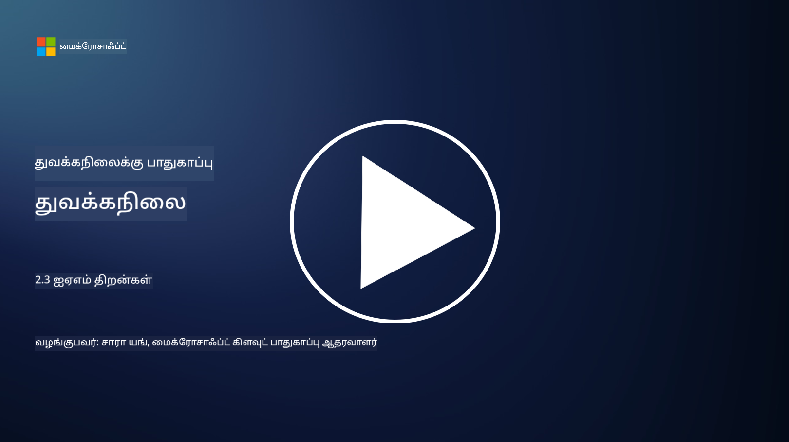

<!--
CO_OP_TRANSLATOR_METADATA:
{
  "original_hash": "bf0b8a54f2c69951744df5a94bc923f7",
  "translation_date": "2025-10-11T11:23:23+00:00",
  "source_file": "2.3 IAM capabilities.md",
  "language_code": "ta"
}
-->
# IAM திறன்கள்

இந்த பிரிவில், அடையாள பாதுகாப்பில் பயன்படுத்தப்படும் முக்கிய கருவிகள் மற்றும் திறன்கள் பற்றிய மேலும் விவரங்களை நாங்கள் கையாளுவோம்.

## அறிமுகம்

இந்த பாடத்தில், நாங்கள் கையாளவுள்ளவை:

 - டைரக்டரி சேவை என்றால் என்ன?
      
     
    
 - அடையாளங்களை பாதுகாக்க எந்தவகையான திறன்களை பயன்படுத்தலாம்?
>
>        மல்டி-ஃபாக்டர் அத்தாட்சிப்படுத்தல் (MFA)
> 
>        சிங்கிள் சைன்-ஆன் (SSO)
> 
>        ரோல் அடிப்படையிலான அணுகல் கட்டுப்பாடு (RBAC)
> 
>        அடாப்டிவ் அத்தாட்சிப்படுத்தல்
> 
>        பயோமெட்ரிக் அத்தாட்சிப்படுத்தல்
> 
>        பிரிவிலேஜ்டு அணுகல் மேலாண்மை (PAM)
> 
>        அடையாள ஆளுமை மற்றும் நிர்வாகம் (IGA)
> 
>        நடத்தை பகுப்பாய்வு

## டைரக்டரி சேவை என்றால் என்ன?

டைரக்டரி சேவை என்பது நெட்வொர்க் வளங்கள் பற்றிய தகவல்களை (பயனர்கள், குழுக்கள், சாதனங்கள், பயன்பாடுகள் மற்றும் பிற பொருட்கள்) சேமித்து நிர்வகிக்கும் ஒரு சிறப்பு தரவுத்தொகுப்பாகும். இது அடையாளம் மற்றும் அணுகல் தொடர்பான தரவுகளின் மையகமாக செயல்படுகிறது, நிறுவனங்களுக்கு பயனர் அத்தாட்சிப்படுத்தல், அனுமதி மற்றும் பிற பாதுகாப்பு தொடர்பான பணிகளை திறமையாக நிர்வகிக்க உதவுகிறது.

நவீன ஐடி சூழல்களில் டைரக்டரி சேவைகள் முக்கிய பங்கு வகிக்கின்றன, ஏனெனில் அவை அடையாளம் மற்றும் அணுகல் மேலாண்மை (IAM) தீர்வுகளுக்கு அடித்தளத்தை வழங்குகின்றன. அவை வளங்களுக்கு பாதுகாப்பான அணுகலை எளிதாக்குகின்றன, அணுகல் கொள்கைகளை அமல்படுத்துகின்றன மற்றும் நிர்வாக பணிகளை எளிமைப்படுத்துகின்றன. Microsoft Active Directory என்பது மிகவும் பிரபலமான டைரக்டரி சேவையாகும், ஆனால் LDAP (Lightweight Directory Access Protocol) போன்ற பிற தீர்வுகளும் இதே போன்ற நோக்கங்களுக்காக பயன்படுகின்றன.

சைபர் பாதுகாப்பு சூழலில் டைரக்டரி சேவையின் முக்கிய செயல்பாடுகள் மற்றும் அம்சங்கள்:

 - **பயனர் அத்தாட்சிப்படுத்தல்**: டைரக்டரி சேவைகள் பயனர் சான்றுகளை (பயனர் பெயர்கள் மற்றும் கடவுச்சொற்கள் போன்றவை) சரிபார்க்கின்றன, அத்துடன் அங்கீகரிக்கப்பட்ட பயனர்கள் மட்டுமே நெட்வொர்க்கிற்கும் அதன் வளங்களுக்கும் அணுக முடியும்.
 - **பயனர் அனுமதி**: பயனர் பங்கு, குழு உறுப்பினர் மற்றும் பிற பண்புகள் அடிப்படையில் ஒவ்வொரு பயனருக்கும் அணுகல் அளவை தீர்மானிக்கின்றன. இது பயனர்கள் தகுதியான வளங்களை மட்டுமே அணுக முடியும் என்பதை உறுதிப்படுத்துகிறது.
 - **குழு மேலாண்மை**: டைரக்டரி சேவைகள் நிர்வாகிகளுக்கு பயனர்களை தர்க்கரீதியான குழுக்களாக ஒழுங்கமைக்க அனுமதிக்கின்றன, இதனால் அணுகல் கட்டுப்பாட்டு மேலாண்மை எளிதாகிறது. அனுமதிகள் தனிப்பட்ட பயனர்களுக்கு பதிலாக குழுக்களுக்கு வழங்கப்படலாம்.
 - **கடவுச்சொல் கொள்கைகள்**: கடவுச்சொல் சிக்கலான விதிமுறைகள் மற்றும் காலாவதி விதிகளை அமல்படுத்துகின்றன, இதனால் பயனர் கணக்குகளின் பாதுகாப்பு மேம்படுகிறது.
 - **சிங்கிள் சைன்-ஆன் (SSO)**: சில டைரக்டரி சேவைகள் SSO-ஐ ஆதரிக்கின்றன, இதனால் பயனர்கள் பல பயன்பாடுகள் மற்றும் சேவைகளை ஒரே சான்றுகளுடன் அணுக முடியும்.
 - **மையக பயனர் மேலாண்மை**: டைரக்டரி சேவைகள் பயனர் தகவல்களை மையமாக்குகின்றன, இதனால் ஒரு இடத்திலிருந்து பயனர் கணக்குகள், சுயவிவரங்கள் மற்றும் பண்புகளை நிர்வகிக்க எளிதாகிறது.
 - **ஆடிட்டிங் மற்றும் பதிவு**: பயனர் அத்தாட்சிப்படுத்தல் மற்றும் அணுகல் செயல்பாடுகளை பதிவு செய்ய முடியும், இது பாதுகாப்பு ஆடிட்டுகள் மற்றும் இணக்கத்திற்கான முயற்சிகளில் உதவுகிறது.

## அடையாளங்களை பாதுகாக்க எந்தவகையான திறன்களை பயன்படுத்தலாம்?

**மல்டி-ஃபாக்டர் அத்தாட்சிப்படுத்தல் (MFA)**

MFA பயனர்களுக்கு அணுகலை வழங்குவதற்கு முன் பல்வேறு சான்றுகளை வழங்குமாறு கேட்கிறது. இது பொதுவாக பயனர் அறிந்திருக்கும் ஒன்று (கடவுச்சொல்), பயனர் வைத்திருக்கும் ஒன்று (ஸ்மார்ட்போன் அல்லது பாதுகாப்பு டோக்கன்), மற்றும் பயனர் யார் என்பதை (கைரேகை அல்லது முகம் போன்ற பயோமெட்ரிக் தரவுகள்) உள்ளடக்கியது.

**சிங்கிள் சைன்-ஆன் (SSO)**

SSO பயனர்களுக்கு ஒரே சான்றுகளுடன் பல பயன்பாடுகள் மற்றும் அமைப்புகளை அணுக அனுமதிக்கிறது. இது பயனர் அனுபவத்தை மேம்படுத்துகிறது மற்றும் பல கடவுச்சொற்களை நிர்வகிக்க வேண்டிய சிக்கல்களை குறைக்கிறது.

**ரோல் அடிப்படையிலான அணுகல் கட்டுப்பாடு (RBAC)**

RBAC முன்கூட்டியே வரையறுக்கப்பட்ட பங்குகளின் அடிப்படையில் அனுமதிகளை வழங்குகிறது. பயனர்கள் நிறுவனத்தில் உள்ள தங்கள் பங்குகளின் அடிப்படையில் அணுகல் பெறுகிறார்கள்.

**அடாப்டிவ் அத்தாட்சிப்படுத்தல்**

அடாப்டிவ் அத்தாட்சிப்படுத்தல் இடம், சாதனம், அணுகல் நேரம் மற்றும் பயனர் நடத்தை போன்ற அபாய காரகங்களை மதிப்பீடு செய்து, தேவைப்படும் அத்தாட்சிப்படுத்தல் அளவை தன்னிச்சையாக சரிசெய்கிறது. ஒரு கோரிக்கை சந்தேகமாக தோன்றினால், கூடுதல் அத்தாட்சிப்படுத்தல் நடவடிக்கைகள் தொடங்கப்படலாம்.

**பயோமெட்ரிக் அத்தாட்சிப்படுத்தல்**

பயோமெட்ரிக் அத்தாட்சிப்படுத்தல் கைரேகைகள், முக அம்சங்கள், குரல் முறை, மற்றும் டைப் செய்யும் வேகம் போன்ற தனித்துவமான உயிரியல் பண்புகளை அடையாளம் காண பயன்படுத்துகிறது.

**பிரிவிலேஜ்டு அணுகல் மேலாண்மை (PAM)**

PAM முக்கியமான அமைப்புகள் மற்றும் தரவுகளுக்கான அணுகலை பாதுகாக்க கவனம் செலுத்துகிறது, இது பிரிவிலேஜ்டு கணக்குகளில் கடுமையான கட்டுப்பாடுகளை அமல்படுத்துகிறது. இது நேரத்திற்கேற்ப அணுகல் மற்றும் அமர்வு கண்காணிப்பு போன்ற அம்சங்களை உள்ளடக்கியது.

**அடையாள ஆளுமை மற்றும் நிர்வாகம் (IGA)**

IGA தீர்வுகள் பயனர் அடையாளங்களை மற்றும் அவர்களின் வளங்களுக்கான அணுகலை அவர்களின் வாழ்க்கைச்சுழற்சியில் நிர்வகிக்கின்றன. இதில் சேர்க்கை, வழங்கல், ரோல் அடிப்படையிலான அணுகல் கட்டுப்பாடு மற்றும் நீக்குதல் ஆகியவை அடங்கும்.

**நடத்தை பகுப்பாய்வு**

நடத்தை பகுப்பாய்வு பயனர் நடத்தை மற்றும் அடிப்படை முறைமைகளை கண்காணிக்கிறது. வழக்கத்திலிருந்து மாறுபாடுகள் மேலும் விசாரணைக்கு எச்சரிக்கைகளை உருவாக்கலாம்.

# மேலும் படிக்க
- [Azure Active Directory அடிப்படை ஆவணங்கள் - Microsoft Entra | Microsoft Learn](https://learn.microsoft.com/azure/active-directory/fundamentals/?WT.mc_id=academic-96948-sayoung)
- [Azure Active Directory என்றால் என்ன? - Microsoft Entra | Microsoft Learn](https://learn.microsoft.com/azure/active-directory/fundamentals/whatis?WT.mc_id=academic-96948-sayoung)
- [Microsoft Entra மூலம் உங்கள் மல்டி-கிளவுட் அடையாள உள்கட்டமைப்பை நிர்வகிக்கவும் - YouTube](https://www.youtube.com/watch?v=9qQiq3wTS2Y&list=PLXtHYVsvn_b_gtX1-NB62wNervQx1Fhp4&index=18)

---

**குறிப்பு**:  
இந்த ஆவணம் [Co-op Translator](https://github.com/Azure/co-op-translator) என்ற AI மொழிபெயர்ப்பு சேவையைப் பயன்படுத்தி மொழிபெயர்க்கப்பட்டுள்ளது. நாங்கள் துல்லியத்திற்காக முயற்சிக்கிறோம், ஆனால் தானியங்கி மொழிபெயர்ப்புகளில் பிழைகள் அல்லது தவறான தகவல்கள் இருக்கக்கூடும் என்பதை தயவுசெய்து கவனத்தில் கொள்ளவும். அதன் தாய்மொழியில் உள்ள மூல ஆவணம் அதிகாரப்பூர்வ ஆதாரமாக கருதப்பட வேண்டும். முக்கியமான தகவல்களுக்கு, தொழில்முறை மனித மொழிபெயர்ப்பு பரிந்துரைக்கப்படுகிறது. இந்த மொழிபெயர்ப்பைப் பயன்படுத்துவதால் ஏற்படும் எந்த தவறான புரிதல்கள் அல்லது தவறான விளக்கங்களுக்கு நாங்கள் பொறுப்பல்ல.