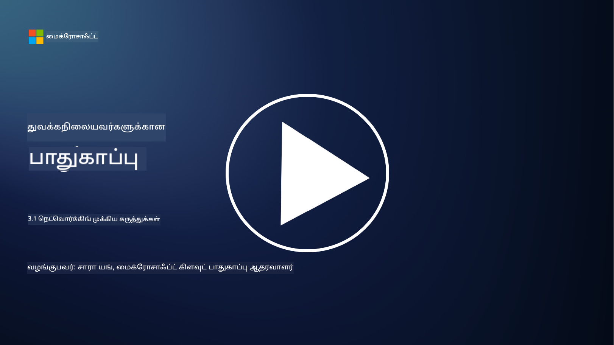
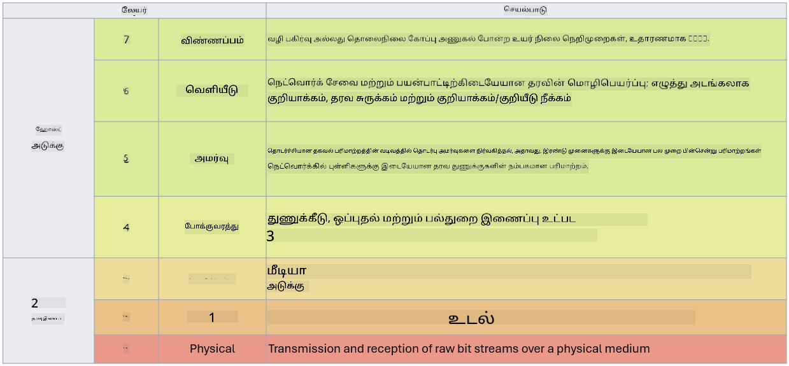

<!--
CO_OP_TRANSLATOR_METADATA:
{
  "original_hash": "252724eceeb183fb9018f88c5e1a3f0c",
  "translation_date": "2025-10-11T11:19:41+00:00",
  "source_file": "3.1 Networking key concepts.md",
  "language_code": "ta"
}
-->
# நெட்வொர்கிங் முக்கிய கருத்துக்கள்

நீங்கள் ஐ.டி. துறையில் ஏதேனும் வேலை செய்திருந்தால், நெட்வொர்கிங் தொடர்பான கருத்துகளை சந்தித்திருக்க வாய்ப்பு உள்ளது. நவீன சூழல்களில் அடிப்படை பாதுகாப்பு கட்டுப்பாடாக அடையாளத்தைப் பயன்படுத்தினாலும், நெட்வொர்க் கட்டுப்பாடுகள் தேவையற்றவை என்று அர்த்தமில்லை. இது ஒரு பெரிய தலைப்பாக இருந்தாலும், இந்த பாடத்தில் சில முக்கிய நெட்வொர்கிங் கருத்துகளை நாம் கற்கப்போகிறோம்.

இந்த பாடத்தில் நாம் கற்கப்போகிறோம்:

- IP முகவரிகள் என்றால் என்ன?

- OSI மாடல் என்றால் என்ன?

- TCP/UDP என்றால் என்ன?

- போர்ட் எண்கள் என்றால் என்ன?

- "அடக்கம்" மற்றும் "கடத்தல்" குறித்த குறியாக்கம் என்றால் என்ன?

## IP முகவரிகள் என்றால் என்ன?

IP முகவரிகள், அல்லது இன்டர்நெட் புரோட்டோகோல் முகவரிகள், இன்டர்நெட் புரோட்டோகோல் மூலம் தொடர்பு கொள்ளும் கணினி நெட்வொர்க்கில் இணைக்கப்பட்ட ஒவ்வொரு சாதனத்திற்கும் ஒதுக்கப்பட்ட எண் அடையாளமாகும். இது ஒரு நெட்வொர்க்கில் சாதனங்களை தனித்துவமாக அடையாளம் காண உதவுகிறது, அவற்றை இன்டர்நெட் அல்லது பிற இணைக்கப்பட்ட நெட்வொர்க்குகளுக்கு தரவுகளை அனுப்பவும் பெறவும் அனுமதிக்கிறது. IP முகவரிகளின் இரண்டு முக்கிய பதிப்புகள் உள்ளன: IPv4 (Internet Protocol version 4) மற்றும் IPv6 (Internet Protocol version 6). IP முகவரி பொதுவாக IPv4 வடிவத்தில் (எ.கா., 192.168.1.1) அல்லது IPv6 வடிவத்தில் (எ.கா., 2001:0db8:85a3:0000:0000:8a2e:0370:7334) பிரதிநிதித்துவம் செய்யப்படுகிறது.

## OSI மாடல் என்றால் என்ன?

OSI (Open Systems Interconnection) மாடல் என்பது ஒரு கருத்து வடிவமைப்பு ஆகும், இது தொடர்பு அமைப்பின் செயல்பாடுகளை ஏழு தனித்துவமான அடுக்குகளாக மையப்படுத்துகிறது. ஒவ்வொரு அடுக்கும் குறிப்பிட்ட பணிகளைச் செய்கிறது மற்றும் சாதனங்களுக்கு இடையிலான தரவுத் தொடர்பை திறம்படவும் நம்பகமாகவும் உறுதிப்படுத்த அடுத்தடுத்த அடுக்குகளுடன் தொடர்பு கொள்ளுகிறது. அடுக்குகள் கீழிருந்து மேல்வரை பின்வருமாறு உள்ளன:

1. பிசிகல் அடுக்கு

2. டேட்டா லிங்க் அடுக்கு

3. நெட்வொர்க் அடுக்கு

4. டிரான்ஸ்போர்ட் அடுக்கு

5. செஷன் அடுக்கு

6. பிரெசென்டேஷன் அடுக்கு

7. அப்ளிகேஷன் அடுக்கு

OSI மாடல், குறிப்பிட்ட ஹார்ட்வேரின் அல்லது மென்பொருள் செயல்பாடுகளின் அடிப்படையில், நெட்வொர்கிங் புரோட்டோகோல்கள் மற்றும் தொழில்நுட்பங்கள் எப்படி தொடர்பு கொள்ளுகின்றன என்பதைப் புரிந்துகொள்ள பொதுவான குறிப்பு அளிக்கிறது.

_ref: https://en.wikipedia.org/wiki/OSI_model_

## TCP/UDP என்றால் என்ன?

TCP (Transmission Control Protocol) மற்றும் UDP (User Datagram Protocol) ஆகியவை கணினி நெட்வொர்க்குகளில் சாதனங்களுக்கு இடையிலான தொடர்பை எளிதாக்குவதற்காக பயன்படுத்தப்படும் இரண்டு அடிப்படை டிரான்ஸ்போர்ட் அடுக்கு புரோட்டோகோல்கள் ஆகும். இவை தரவுகளை பாக்கெட்களாக பிரித்து அனுப்புவதற்கும், பெறும் முனையில் அந்த பாக்கெட்களை மீண்டும் ஒருங்கிணைத்து அசல் தரவாக மாற்றுவதற்கும் பொறுப்பாக உள்ளன. ஆனால், இவை தங்களது பண்புகள் மற்றும் பயன்பாடுகளில் வேறுபடுகின்றன.

**TCP (Transmission Control Protocol)**:

TCP என்பது ஒரு இணைப்பு-அடிப்படையிலான புரோட்டோகோல் ஆகும், இது சாதனங்களுக்கு இடையிலான தரவுகளை நம்பகமாகவும் ஒழுங்காகவும் வழங்குகிறது. தரவுகளை பரிமாற்றம் செய்யும் முன் அனுப்புநரும் பெறுநரும் இடையே ஒரு இணைப்பு ஏற்படுத்துகிறது. TCP தரவுப் பாக்கெட்கள் சரியான வரிசையில் வருவதை உறுதிப்படுத்துகிறது மற்றும் தரவின் முழுமையையும் நம்பகத்தன்மையையும் உறுதிப்படுத்த பாக்கெட்களை மீண்டும் அனுப்பும் திறனை கொண்டுள்ளது. இது வலை உலாவல், மின்னஞ்சல், கோப்பு பரிமாற்றம் (FTP), மற்றும் தரவுத்தொகுப்பு தொடர்பு போன்ற பயன்பாடுகளுக்கு ஏற்றது.

**UDP (User Datagram Protocol)**:

UDP என்பது ஒரு இணைப்பு-இல்லாத புரோட்டோகோல் ஆகும், இது வேகமான தரவுப் பரிமாற்றத்தை வழங்குகிறது, ஆனால் TCP போன்ற நம்பகத்தன்மையை வழங்காது. இது தரவுகளை அனுப்புவதற்கு முன் ஒரு முறையான இணைப்பை ஏற்படுத்தாது மற்றும் இழந்த பாக்கெட்களை மீண்டும் அனுப்புவதற்கான முறைமைகள் இல்லை. UDP வேகத்தையும் திறமையையும் முக்கியமாகக் கருதும் பயன்பாடுகளுக்கு ஏற்றது, உதாரணமாக நேரடி தொடர்பு, ஸ்ட்ரீமிங் மீடியா, ஆன்லைன் கேமிங், மற்றும் DNS கேள்விகள்.

சுருக்கமாக, TCP தரவின் நம்பகத்தன்மை மற்றும் ஒழுங்கான விநியோகத்தை முன்னுரிமை செய்கிறது, இது தரவின் துல்லியத்தை தேவைப்படும் பயன்பாடுகளுக்கு ஏற்றது, ஆனால் UDP வேகத்தையும் திறமையையும் முன்னுரிமை செய்கிறது, இது குறைந்த தாமதத்திற்காக சிறிய தரவ இழப்பு அல்லது வரிசை மாற்றத்தை ஏற்றுக்கொள்ளும் பயன்பாடுகளுக்கு ஏற்றது. TCP மற்றும் UDP இடையிலான தேர்வு பயன்பாடு அல்லது சேவையின் குறிப்பிட்ட தேவைகளின் அடிப்படையில் இருக்கும்.

## போர்ட் எண்கள் என்றால் என்ன?

நெட்வொர்க்கில், போர்ட் எண் என்பது ஒரு சாதனத்தில் இயங்கும் பல சேவைகள் அல்லது பயன்பாடுகளை வேறுபடுத்த பயன்படுத்தப்படும் எண் அடையாளமாகும். போர்ட்கள் வரும் தரவுகளை சரியான பயன்பாட்டிற்கு வழிநடத்த உதவுகின்றன. போர்ட் எண்கள் 16-பிட் சைன்ட் செய்யாத முழு எண்கள் ஆகும், எனவே அவை 0 முதல் 65535 வரை இருக்கும். அவை மூன்று வரம்புகளாகப் பிரிக்கப்படுகின்றன:

- நன்கு அறியப்பட்ட போர்ட்கள் (0-1023): HTTP (போர்ட் 80) மற்றும் FTP (போர்ட் 21) போன்ற நிலையான சேவைகளுக்கு ஒதுக்கப்பட்டவை.

- பதிவு செய்யப்பட்ட போர்ட்கள் (1024-49151): நன்கு அறியப்பட்ட வரம்பில் இல்லாத, ஆனால் அதிகாரப்பூர்வமாக பதிவு செய்யப்பட்ட பயன்பாடுகள் மற்றும் சேவைகளுக்கு பயன்படுத்தப்படும்.

- டைனமிக்/பிரைவேட் போர்ட்கள் (49152-65535): தற்காலிக அல்லது தனிப்பட்ட பயன்பாடுகளுக்கு பயன்பாடுகளால் பயன்படுத்தப்படக்கூடியவை.

## "அடக்கம்" மற்றும் "கடத்தல்" குறித்த குறியாக்கம் என்றால் என்ன?

குறியாக்கம் என்பது தரவுகளை பாதுகாப்பான வடிவமாக மாற்றும் செயல்முறையாகும், இது அனுமதியற்ற அணுகல் அல்லது மாற்றத்திலிருந்து அதை பாதுகாக்க உதவுகிறது. குறியாக்கம் "அடக்கம்" (சாதனத்தில் அல்லது சர்வரில் சேமிக்கப்பட்ட போது) மற்றும் "கடத்தல்" (சாதனங்களுக்கு இடையிலோ அல்லது நெட்வொர்க்குகளுக்கு இடையிலோ பரிமாற்றப்படும் போது) ஆகியவற்றில் பயன்படுத்தப்படலாம்.

**அடக்கத்தில் குறியாக்கம்**: இது சாதனங்கள், சர்வர்கள் அல்லது சேமிப்பு அமைப்புகளில் சேமிக்கப்பட்ட தரவுகளை குறியாக்கம் செய்வதை உள்ளடக்கியது. ஒரு தாக்குதலாளர் சேமிப்பு ஊடகத்தை உட்கார்ந்தாலும், குறியாக்க விசைகள் இல்லாமல் தரவுகளை அணுக முடியாது. சாதனத் திருட்டு, தரவின் மீறல், அல்லது அனுமதியற்ற அணுகல் போன்ற சூழல்களில் நுண்ணறிவான தரவுகளை பாதுகாக்க இது முக்கியமானது.

**கடத்தலில் குறியாக்கம்**: இது சாதனங்களுக்கு இடையிலோ அல்லது நெட்வொர்க்குகளுக்கு இடையிலோ பயணிக்கும் தரவுகளை குறியாக்கம் செய்வதை உள்ளடக்கியது. இது தரவின் பரிமாற்றத்தின் போது கேள்விப்படுதல் மற்றும் அனுமதியற்ற தடைசெய்தல் ஆகியவற்றைத் தடுக்கிறது. HTTPS வலை தொடர்புக்கு மற்றும் TLS/SSL பல்வேறு வகையான நெட்வொர்க் போக்குவரத்தை பாதுகாக்க பொதுவான புரோட்டோகோல்கள் ஆகும்.

## மேலும் வாசிக்க
- [IP முகவரிகள் எப்படி வேலை செய்கின்றன? (howtogeek.com)](https://www.howtogeek.com/341307/how-do-ip-addresses-work/)
- [IP முகவரியைப் புரிந்துகொள்ளுதல்: ஒரு அறிமுக வழிகாட்டி (geekflare.com)](https://geekflare.com/understanding-ip-address/)
- [OSI மாடல் என்றால் என்ன? OSI-யின் 7 அடுக்குகள் விளக்கம் (techtarget.com)](https://www.techtarget.com/searchnetworking/definition/OSI)
- [OSI மாடல் – நெட்வொர்க்கிங் அடுக்குகள் எளிய ஆங்கிலத்தில் விளக்கம் (freecodecamp.org)](https://www.freecodecamp.org/news/osi-model-networking-layers-explained-in-plain-english/)
- [TCP/IP புரோட்டோகோல்கள் - IBM ஆவணங்கள்](https://www.ibm.com/docs/en/aix/7.3?topic=protocol-tcpip-protocols)
- [பொதுவான போர்ட்கள் சிட் ஷீட்: இறுதி போர்ட்கள் & புரோட்டோகோல்கள் பட்டியல் (stationx.net)](https://www.stationx.net/common-ports-cheat-sheet/)
- [Azure Data Encryption-at-Rest - Azure Security | Microsoft Learn](https://learn.microsoft.com/azure/security/fundamentals/encryption-atrest?WT.mc_id=academic-96948-sayoung)

---

**குறிப்பு**:  
இந்த ஆவணம் [Co-op Translator](https://github.com/Azure/co-op-translator) என்ற AI மொழிபெயர்ப்பு சேவையைப் பயன்படுத்தி மொழிபெயர்க்கப்பட்டுள்ளது. நாங்கள் துல்லியத்திற்காக முயற்சிக்கின்றோம், ஆனால் தானியங்கி மொழிபெயர்ப்புகளில் பிழைகள் அல்லது தவறான தகவல்கள் இருக்கக்கூடும் என்பதை தயவுசெய்து கவனத்தில் கொள்ளவும். அதன் தாய்மொழியில் உள்ள மூல ஆவணம் அதிகாரப்பூர்வ ஆதாரமாக கருதப்பட வேண்டும். முக்கியமான தகவல்களுக்கு, தொழில்முறை மனித மொழிபெயர்ப்பு பரிந்துரைக்கப்படுகிறது. இந்த மொழிபெயர்ப்பைப் பயன்படுத்துவதால் ஏற்படும் எந்த தவறான புரிதல்கள் அல்லது தவறான விளக்கங்களுக்கு நாங்கள் பொறுப்பல்ல.