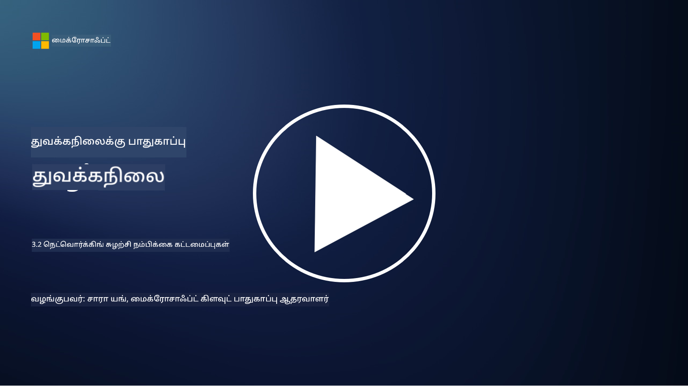

<!--
CO_OP_TRANSLATOR_METADATA:
{
  "original_hash": "680d6e14d9d33fc471c22f44679713f8",
  "translation_date": "2025-10-11T11:22:26+00:00",
  "source_file": "3.2 Networking zero trust architecture.md",
  "language_code": "ta"
}
-->
# நெட்வொர்க் சீரோ டிரஸ்ட் கட்டமைப்புகள்

நெட்வொர்க் சீரோ டிரஸ்ட் கட்டுப்பாடுகளில் முக்கியமான அடுக்கு ஒன்றை வழங்குகிறது. இந்த பாடத்தில் நாம் இதைப் பற்றி மேலும் அறிந்து கொள்வோம்:

 - நெட்வொர்க் பிரிவாக்கம் என்றால் என்ன?  
 - நெட்வொர்க் பிரிவாக்கம் சீரோ டிரஸ்ட் செயல்படுத்த உதவுவது எப்படி?  
 - எண்ட்-டு-எண்ட் குறியாக்கம் என்றால் என்ன?  

## நெட்வொர்க் பிரிவாக்கம் என்றால் என்ன?

நெட்வொர்க் பிரிவாக்கம் என்பது ஒரு நெட்வொர்க்கை சிறிய, தனித்துவமான பகுதிகள் அல்லது துணை நெட்வொர்க்குகளாகப் பிரிக்கும் நடைமுறையாகும். ஒவ்வொரு பகுதியும் மற்றவற்றிலிருந்து தனிமைப்படுத்தப்பட்டிருக்கும், மேலும் பகுதிகளுக்கு இடையேயான அணுகல் குறிப்பிட்ட பாதுகாப்பு கொள்கைகளின் அடிப்படையில் கட்டுப்படுத்தப்பட்டு வரையறுக்கப்படும். நெட்வொர்க் பிரிவாக்கம் பாதுகாப்பை மேம்படுத்த பயன்படுத்தப்படுகிறது, இது சாத்தியமான மீறல்களின் தாக்கத்தை கட்டுப்படுத்தவும், நெட்வொர்க்கில் தாக்குதலாளர்களின் பக்கவாட்டு நகர்வுகளை வரையறுக்கவும் உதவுகிறது.

நெட்வொர்க் பிரிவாக்கத்தை செயல்படுத்துவதன் மூலம், ஒரு அமைப்பு "மண்டலங்கள்" உருவாக்கி, வெவ்வேறு வகையான பயனர்கள், பயன்பாடுகள் மற்றும் தரவுகளைப் பிரிக்க முடியும். இது தாக்குதலின் மேற்பரப்பை குறைத்து, பாதுகாப்பு சம்பவத்தால் ஏற்படும் பாதிப்பை குறைக்கிறது. நெட்வொர்க் பிரிவாக்கம், வर्चுவல் லேன் (VLANs), ஃபயர்வால்கள் மற்றும் அணுகல் கட்டுப்பாடுகள் போன்ற தொழில்நுட்பங்களின் மூலம் அடைய முடியும்.

## நெட்வொர்க் பிரிவாக்கம் சீரோ டிரஸ்ட் செயல்படுத்த உதவுவது எப்படி?

நெட்வொர்க் பிரிவாக்கம் சீரோ டிரஸ்ட் மாடலின் கோட்பாடுகளுடன் நெருக்கமாக இணைக்கிறது. சீரோ டிரஸ்ட் கட்டமைப்பில், நெட்வொர்க் பிரிவாக்கம் "குறைந்த அனுமதி" கோட்பாட்டை அமல்படுத்த உதவுகிறது, இது பயனர்கள் மற்றும் சாதனங்கள் தங்கள் பணிகளைச் செய்ய தேவையான குறிப்பிட்ட வளங்கள் மற்றும் சேவைகளுக்கு மட்டுமே அணுகலை உறுதிசெய்கிறது. நெட்வொர்க்கை சிறிய மண்டலங்களாகப் பிரிப்பதன் மூலம், அமைப்புகள் கடுமையான அணுகல் கட்டுப்பாடுகளை செயல்படுத்த முடியும், முக்கியமான வளங்களை தனிமைப்படுத்தவும், தாக்குதலாளர்களின் பக்கவாட்டு நகர்வுகளைத் தடுக்கவும் முடியும்.

நெட்வொர்க் பிரிவாக்கம் அடையாள அடிப்படையிலான அணுகல் கட்டுப்பாடுகளை அமல்படுத்தவும் உதவுகிறது, இதில் பயனர்கள் மற்றும் சாதனங்கள் குறிப்பிட்ட பகுதிகளுக்கு அணுகுவதற்கு முன் முழுமையாக அங்கீகரிக்கப்பட்டு அனுமதிக்கப்படுகின்றன. இது அனுமதியற்ற அணுகலைத் தடுக்கிறது மற்றும் பாதிக்கப்பட்ட சான்றுகள் காரணமாக ஏற்படும் சாத்தியமான பாதிப்பை குறைக்கிறது.

## எண்ட்-டு-எண்ட் குறியாக்கம் என்றால் என்ன?

எண்ட்-டு-எண்ட் (E2E) குறியாக்கம் என்பது தரவின் முழு பயணத்தின் போது, அனுப்புநரிடமிருந்து பெறுநருக்கு வரை குறியாக்கம் செய்யப்பட்டு இருக்கும் பாதுகாப்பு நடவடிக்கையாகும். இந்த செயல்முறையில், தரவு அனுப்புநரின் முடிவில் குறியாக்கம் செய்யப்படுகிறது, மேலும் பெறுநரிடம் மட்டுமே குறியாக்கத்தை திறக்கவும், தரவைக் காணவும் தேவையான குறியாக்க விசை இருக்கும். குறியாக்கம் மற்றும் குறியாக்கத்தை நீக்கும் செயல்முறைகள் முடிவுகளில் நடைபெறுகின்றன, இது அனுமதியற்ற தரப்புகள், சேவை வழங்குநர்கள் மற்றும் இடைநிலை அமைப்புகள் உட்பட, தரவின் தெளிவான வடிவத்தை அணுகுவதற்கு மிகவும் கடினமாக்குகிறது.

E2E குறியாக்கம் தரவின் பரிமாற்றத்திற்கு மிக உயர்ந்த ரகசியத்தன்மை மற்றும் பாதுகாப்பை வழங்குகிறது, தரவு பல இடைநிலை அமைப்புகள் அல்லது நெட்வொர்க்குகள் வழியாகச் சென்றாலும். இது பாதுகாப்பான செய்தி பயன்பாடுகள், மின்னஞ்சல் சேவைகள் மற்றும் பிற தொடர்பு தளங்களில் பொதுவாக பயன்படுத்தப்படுகிறது, இது சென்சிடிவ் தகவல்களை மடக்குதல் மற்றும் அனுமதியற்ற அணுகலிலிருந்து பாதுகாக்க உதவுகிறது.

இந்த குறியாக்க முறை, தாக்குதலாளர்கள் பரிமாற்றத்தில் உள்ள தரவிற்கு அணுகல் பெறினும், குறியாக்க விசையின்றி அர்த்தமற்ற குறியாக்க உள்ளடக்கத்தை மட்டுமே காண முடியும் என்பதை உறுதிசெய்கிறது. எண்ட்-டு-எண்ட் குறியாக்கம் பயனர் தனியுரிமையை பாதுகாக்கவும், சென்சிடிவ் தகவல்கள் அனுமதியற்ற தரப்புகளுக்கு வெளிப்படாமல் இருக்கவும் முக்கிய பங்கு வகிக்கிறது.

## SASE என்றால் என்ன?

SASE என்பது "Secure Access Service Edge" என்பதற்கான சுருக்கமாகும், இது நெட்வொர்க் பாதுகாப்பு மற்றும் பரந்த பகுதி நெட்வொர்க்கிங் (WAN) திறன்களை ஒரே கிளவுட் அடிப்படையிலான சேவையாக இணைக்கும் சைபர் பாதுகாப்பு கட்டமைப்பு மற்றும் வடிவமைப்பாகும். SASE, தொலைதூர மற்றும் மொபைல் பயனர்களுக்கு நெட்வொர்க் வளங்கள், பயன்பாடுகள் மற்றும் தரவுகளுக்கு பாதுகாப்பான மற்றும் அளவளாவிய அணுகலை வழங்க வடிவமைக்கப்பட்டுள்ளது, அதே நேரத்தில் நெட்வொர்க் மேலாண்மையை எளிமைப்படுத்தி, பாரம்பரிய நெட்வொர்க் மற்றும் பாதுகாப்பு கட்டமைப்புகளின் சிக்கல்களை குறைக்கிறது.

SASE இன் முக்கிய அம்சங்கள் மற்றும் கூறுகள்:

1. **கிளவுட் அடிப்படையிலானது:** SASE கிளவுட் சேவையாக வழங்கப்படுகிறது, இது பாதுகாப்பு மற்றும் நெட்வொர்க்கிங் செயல்பாடுகள் பாரம்பரிய இடத்தில் உள்ள ஹார்ட்வேர்கள் மற்றும் சாதனங்களை நம்பாமல், கிளவுட் மூலம் வழங்கப்படுகின்றன.
    
2. **பாதுகாப்பு மற்றும் நெட்வொர்க்கிங் ஒருங்கிணைப்பு:** SASE பல பாதுகாப்பு சேவைகளை ஒருங்கிணைக்கிறது, உதாரணமாக, பாதுகாப்பான வலை நுழைவாயில்கள் (SWG), ஃபயர்வால் அசா சேவை (FWaaS), தரவ இழப்பு தடுப்பு (DLP), சீரோ டிரஸ்ட் நெட்வொர்க் அணுகல் (ZTNA), மற்றும் WAN மேம்பாடு பரந்த பகுதி நெட்வொர்க்கிங் திறன்களுடன். இந்த ஒருங்கிணைப்பு பாதுகாப்பு மற்றும் நெட்வொர்க்கிங் செயல்பாடுகளை எளிமைப்படுத்த உதவுகிறது.
    
3. **சீரோ டிரஸ்ட்:** SASE சீரோ டிரஸ்ட் கோட்பாட்டின் அடிப்படையில் செயல்படுகிறது, இது கடுமையான அணுகல் கட்டுப்பாடுகள் மற்றும் குறைந்த அனுமதி கொள்கைகளை அமல்படுத்துகிறது. பயனர்கள் மற்றும் சாதனங்கள் இயல்பாக நம்பப்படவில்லை, மேலும் வளங்களை அணுகுவதற்கு முன் அவை அங்கீகரிக்கப்பட்டு அனுமதிக்கப்பட வேண்டும்.
    
4. **அடையாள மையமாக:** SASE பயனர் மற்றும் சாதன அடையாளங்களை அணுகல் கட்டுப்பாட்டின் அடிப்படையாகக் கொண்டுள்ளது. அடையாளம் மற்றும் சூழல் அடிப்படையிலான கொள்கைகள் அணுகல் அனுமதிகளைத் தீர்மானிக்க பயன்படுத்தப்படுகின்றன, மேலும் இந்த கொள்கைகள் பயனர் நடத்தை மற்றும் சூழலின் அடிப்படையில் தன்னியல்பாக மாறுகின்றன.
    
5. **அளவளாவிய மற்றும் நெகிழ்வானது:** SASE பல பயனர்கள் மற்றும் சாதனங்களை ஏற்க எளிதாக அளவளாவக்கூடியது, இது பல்வேறு மற்றும் மாறும் நெட்வொர்க்கிங் மற்றும் பாதுகாப்பு தேவைகளுடன் அமைப்புகளுக்கு பொருத்தமாக உள்ளது.
    

தொலை வேலை மற்றும் கிளவுட் பயன்பாட்டின் நவீன காலத்தில் SASE மிகவும் பொருத்தமானது, இது நெட்வொர்க் அணுகலை பாதுகாக்கவும், மேலாண்மையை எளிமைப்படுத்தவும், பயனர் மைய மற்றும் சீரோ டிரஸ்ட் பாதுகாப்பு மாடல்களில் வலுவான கவனம் செலுத்தவும் ஒரு முழுமையான மற்றும் துரிதமான அணுகுமுறையை வழங்குகிறது.

## மேலும் வாசிக்க

- [What Is Network Segmentation? - Cisco](https://www.cisco.com/c/en/us/products/security/what-is-network-segmentation.html#~benefits)
- [What Is Micro-Segmentation? - Cisco](https://www.cisco.com/c/en/us/products/security/what-is-microsegmentation.html)
- [Implementing Network Segmentation and Segregation | Cyber.gov.au](https://www.cyber.gov.au/resources-business-and-government/maintaining-devices-and-systems/system-hardening-and-administration/network-hardening/implementing-network-segmentation-and-segregation)
- [What Is Network Segmentation and Why It Matters | CompTIA](https://www.comptia.org/blog/security-awareness-training-network-segmentation)
- [Network Segmentation: Concepts and Practices (cmu.edu)](https://insights.sei.cmu.edu/blog/network-segmentation-concepts-and-practices/)
- [Secure networks with Zero Trust | Microsoft Learn](https://learn.microsoft.com/security/zero-trust/deploy/networks?WT.mc_id=academic-96948-sayoung)
- [What is end-to-end encryption? | IBM](https://www.ibm.com/topics/end-to-end-encryption)
- [What Is End-to-End Encryption, and Why Does It Matter? (howtogeek.com)](https://www.howtogeek.com/711656/what-is-end-to-end-encryption-and-why-does-it-matter/)
- [Definition of Secure Access Service Edge (SASE) - Gartner Information Technology Glossary](https://www.gartner.com/en/information-technology/glossary/secure-access-service-edge-sase)
- [What Is Secure Access Service Edge (SASE)? | Microsoft Security](https://www.microsoft.com/security/business/security-101/what-is-sase?WT.mc_id=academic-96948-sayoung)

---

**குறிப்பு**:  
இந்த ஆவணம் [Co-op Translator](https://github.com/Azure/co-op-translator) என்ற AI மொழிபெயர்ப்பு சேவையை பயன்படுத்தி மொழிபெயர்க்கப்பட்டுள்ளது. நாங்கள் துல்லியத்திற்காக முயற்சிக்கின்றோம், ஆனால் தானியங்கி மொழிபெயர்ப்புகளில் பிழைகள் அல்லது தவறான தகவல்கள் இருக்கக்கூடும் என்பதை கவனத்தில் கொள்ளவும். அதன் இயல்பான மொழியில் உள்ள மூல ஆவணம் அதிகாரப்பூர்வ ஆதாரமாக கருதப்பட வேண்டும். முக்கியமான தகவல்களுக்கு, தொழில்முறை மனித மொழிபெயர்ப்பு பரிந்துரைக்கப்படுகிறது. இந்த மொழிபெயர்ப்பைப் பயன்படுத்துவதால் ஏற்படும் எந்த தவறான புரிதல்கள் அல்லது தவறான விளக்கங்களுக்கு நாங்கள் பொறுப்பல்ல.