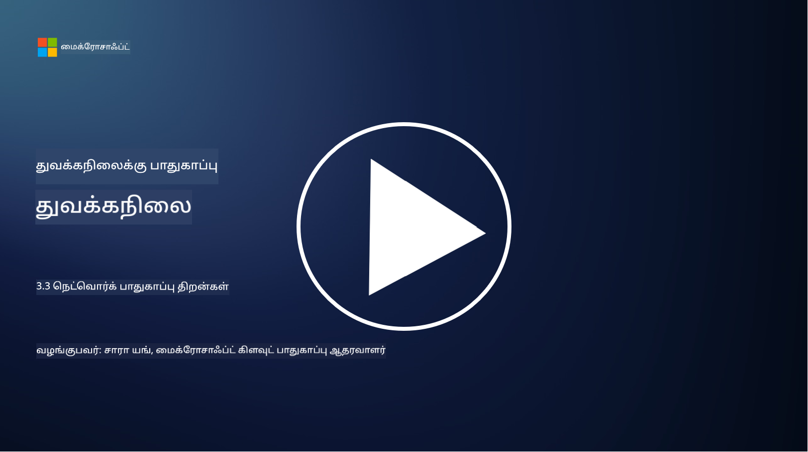

<!--
CO_OP_TRANSLATOR_METADATA:
{
  "original_hash": "c3aba077bb98eebc925dd58d870229ab",
  "translation_date": "2025-10-11T11:32:46+00:00",
  "source_file": "3.3 Network security capabilities.md",
  "language_code": "ta"
}
-->
# நெட்வொர்க் பாதுகாப்பு திறன்கள்

இந்த பாடத்தில் நெட்வொர்க் பாதுகாப்பை உறுதிப்படுத்த பயன்படுத்தக்கூடிய பின்வரும் திறன்களைப் பற்றி நாம் கற்றுக்கொள்வோம்:

 - பாரம்பரிய ஃபயர்வால்கள்
 - வலை பயன்பாட்டு ஃபயர்வால்கள்
 - கிளவுட் பாதுகாப்பு குழுக்கள்
 - CDN
 - சுமை சமநிலை அமைப்புகள்
 - பாஸ்டியன் ஹோஸ்ட்கள்
 - VPNகள்
 - DDoS பாதுகாப்பு

## பாரம்பரிய ஃபயர்வால்கள்

பாரம்பரிய ஃபயர்வால்கள் என்பது முன்கூட்டியே வரையறுக்கப்பட்ட பாதுகாப்பு விதிகளின் அடிப்படையில் நெட்வொர்க் போக்குவரத்தை கட்டுப்படுத்தும் மற்றும் கண்காணிக்கும் பாதுகாப்பு சாதனங்கள் ஆகும். அவை நம்பகமான உள் நெட்வொர்க்குக்கும் நம்பகமற்ற வெளி நெட்வொர்க்குகளுக்கும் இடையே தடையாக செயல்படுகின்றன, அனுமதியில்லாத அணுகல் மற்றும் சாத்தியமான அச்சுறுத்தல்களைத் தடுக்க போக்குவரத்தை வடிகட்டுகின்றன.

## வலை பயன்பாட்டு ஃபயர்வால்கள்

வலை பயன்பாட்டு ஃபயர்வால்கள் (WAFs) என்பது SQL இன்ஜெக்ஷன், குறுக்கு தள ஸ்கிரிப்டிங் மற்றும் பிற பாதிப்புகள் போன்ற தாக்குதல்களிலிருந்து வலை பயன்பாடுகளைப் பாதுகாக்க வடிவமைக்கப்பட்ட சிறப்பு ஃபயர்வால்கள் ஆகும். அவை HTTP கோரிக்கைகள் மற்றும் பதில்களை பகுப்பாய்வு செய்து, வலை பயன்பாடுகளை இலக்கு வைக்கும் தீய நோக்கமுள்ள போக்குவரத்தை அடையாளம் கண்டு தடுக்கின்றன.

## கிளவுட் பாதுகாப்பு குழுக்கள்

பாதுகாப்பு குழுக்கள் என்பது கிளவுட் சேவை வழங்குநர்களால் வழங்கப்படும் அடிப்படை நெட்வொர்க் பாதுகாப்பு அம்சமாகும். அவை மெய்நிகர் ஃபயர்வால்களாக செயல்பட்டு, மெய்நிகர் இயந்திரங்கள் (VMs) மற்றும் இன்ஸ்டன்ஸ்கள் போன்ற கிளவுட் வளங்களுக்குள் மற்றும் வெளியே செல்லும் போக்குவரத்தை கட்டுப்படுத்துகின்றன. பாதுகாப்பு குழுக்கள் எந்த வகையான போக்குவரத்துக்கு அனுமதி மற்றும் மறுப்பு என்பதை தீர்மானிக்கும் விதிகளை வரையறுக்க அமைப்புகளுக்கு அனுமதிக்கின்றன, இதன் மூலம் கிளவுட் அமைப்புகளுக்கு கூடுதல் பாதுகாப்பு அடுக்கு சேர்க்கப்படுகிறது.

## உள்ளடக்க விநியோக நெட்வொர்க் (CDN)

உள்ளடக்க விநியோக நெட்வொர்க் என்பது பல புவியியல் இடங்களில் அமைந்துள்ள பரவலான சர்வர் நெட்வொர்க் ஆகும். CDNs இணையதளங்களின் செயல்திறன் மற்றும் கிடைக்கும் தன்மையை மேம்படுத்த, உள்ளடக்கத்தை காட்சிப்படுத்தி, பயனர் அருகிலுள்ள சர்வர்களிலிருந்து சேவை செய்ய உதவுகின்றன. மேலும், பல சர்வர் இடங்களுக்குள் போக்குவரத்தைப் பகிர்ந்து, DDoS தாக்குதல்களிலிருந்து ஒரு அளவுக்கு பாதுகாப்பை வழங்குகின்றன.

## சுமை சமநிலை அமைப்புகள்

சுமை சமநிலை அமைப்புகள் பல சர்வர்களுக்கு உள்ளீட்டு நெட்வொர்க் போக்குவரத்தை விநியோகித்து, வளங்களின் பயன்பாட்டை மேம்படுத்தி, உயர் கிடைக்கும் தன்மையை உறுதிசெய்து, பயன்பாட்டு செயல்திறனை மேம்படுத்துகின்றன. அவை சர்வர் அதிக சுமையடையாமல் தடுக்கின்றன மற்றும் நெட்வொர்க் செயல்திறனை மேம்படுத்துகின்றன.

## பாஸ்டியன் ஹோஸ்ட்கள்

பாஸ்டியன் ஹோஸ்ட்கள் மிகவும் பாதுகாப்பான மற்றும் தனிமைப்படுத்தப்பட்ட சர்வர்களாகும், அவை வெளிப்புற, நம்பகமற்ற நெட்வொர்க்கிலிருந்து (இணையம் போன்ற) நெட்வொர்க்கிற்கு கட்டுப்படுத்தப்பட்ட அணுகலை வழங்குகின்றன. அவை நிர்வாகிகள் உள் அமைப்புகளை பாதுகாப்பாக அணுகும் நுழைவு புள்ளிகளாக செயல்படுகின்றன. பாஸ்டியன் ஹோஸ்ட்கள் பொதுவாக தாக்குதல்களை குறைக்க வலுவான பாதுகாப்பு நடவடிக்கைகளுடன் உள்ளமைக்கப்பட்டுள்ளன.

## மெய்நிகர் தனியார் நெட்வொர்க்குகள் (VPNகள்)

VPNகள் பயனர் சாதனத்திற்கும் தொலைதூர சர்வருக்கும் இடையே குறியாக்கப்பட்ட சுரங்கங்களை உருவாக்கி, இணையம் போன்ற பாதுகாப்பற்ற நெட்வொர்க்குகளில் பாதுகாப்பான மற்றும் தனியார் தொடர்பை உறுதிசெய்கின்றன. VPNகள் பொதுவாக உள் நெட்வொர்க்குகளுக்கு தொலைநிலை அணுகலை வழங்க பயன்படுத்தப்படுகின்றன, இதன் மூலம் பயனர்கள் ஒரே நெட்வொர்க்கில் உட்கார்ந்திருப்பது போல வளங்களை அணுக முடியும்.

## DDoS பாதுகாப்பு கருவிகள்

DDoS (Distributed Denial of Service) பாதுகாப்பு கருவிகள் மற்றும் சேவைகள் DDoS தாக்குதல்களின் தாக்கத்தை குறைக்க வடிவமைக்கப்பட்டுள்ளன, இதில் பல பாதிக்கப்பட்ட சாதனங்கள் ஒரு நெட்வொர்க் அல்லது சேவையை நிரம்பச் செய்யும் நோக்கத்துடன் தாக்குகின்றன. DDoS பாதுகாப்பு தீர்வுகள் தீய நோக்கமுள்ள போக்குவரத்தை அடையாளம் கண்டு வடிகட்டி, சட்டபூர்வமான போக்குவரத்து அதன் நோக்கமுள்ள இடத்தை அடைய உறுதிசெய்கின்றன.

## மேலும் படிக்க

- [ஃபயர்வால் என்றால் என்ன? - சிஸ்கோ](https://www.cisco.com/c/en/us/products/security/firewalls/what-is-a-firewall.html#~types-of-firewalls)
- [ஃபயர்வால் உண்மையில் என்ன செய்கிறது? (howtogeek.com)](https://www.howtogeek.com/144269/htg-explains-what-firewalls-actually-do/)
- [ஃபயர்வால் என்றால் என்ன? ஃபயர்வால்கள் எப்படி வேலை செய்கின்றன & ஃபயர்வால்களின் வகைகள் (kaspersky.com)](https://www.kaspersky.com/resource-center/definitions/firewall)
- [நெட்வொர்க் பாதுகாப்பு குழு - இது எப்படி வேலை செய்கிறது | Microsoft Learn](https://learn.microsoft.com/azure/virtual-network/network-security-group-how-it-works)
- [Azure உள்ளடக்க விநியோக நெட்வொர்க் (CDN) அறிமுகம் - பயிற்சி | Microsoft Learn](https://learn.microsoft.com/training/modules/intro-to-azure-content-delivery-network/?WT.mc_id=academic-96948-sayoung)
- [உள்ளடக்க விநியோக நெட்வொர்க் (CDN) என்றால் என்ன? - Azure | Microsoft Learn](https://learn.microsoft.com/azure/cdn/cdn-overview?WT.mc_id=academic-96948-sayoung)
- [சுமை சமநிலை என்றால் என்ன? சுமை சமநிலை அமைப்புகள் எப்படி வேலை செய்கின்றன (nginx.com)](https://www.nginx.com/resources/glossary/load-balancing/)
- [பாஸ்டியன் ஹோஸ்ட்கள் vs. VPNகள் · Tailscale](https://tailscale.com/learn/bastion-hosts-vs-vpns/)
- [VPN என்றால் என்ன? இது எப்படி வேலை செய்கிறது, VPN வகைகள் (kaspersky.com)](https://www.kaspersky.com/resource-center/definitions/what-is-a-vpn)
- [Azure DDoS பாதுகாப்பு அறிமுகம் - பயிற்சி | Microsoft Learn](https://learn.microsoft.com/training/modules/introduction-azure-ddos-protection/?WT.mc_id=academic-96948-sayoung)
- [DDoS தாக்குதல் என்றால் என்ன? | Microsoft Security](https://www.microsoft.com/security/business/security-101/what-is-a-ddos-attack?WT.mc_id=academic-96948-sayoung)

---

**குறிப்பு**:  
இந்த ஆவணம் [Co-op Translator](https://github.com/Azure/co-op-translator) என்ற AI மொழிபெயர்ப்பு சேவையை பயன்படுத்தி மொழிபெயர்க்கப்பட்டுள்ளது. எங்கள் தரச்சிறப்பிற்காக முயற்சி செய்தாலும், தானியங்கி மொழிபெயர்ப்புகளில் பிழைகள் அல்லது தவறுகள் இருக்கக்கூடும் என்பதை கவனத்தில் கொள்ளவும். அதன் தாய்மொழியில் உள்ள மூல ஆவணம் அதிகாரப்பூர்வ ஆதாரமாக கருதப்பட வேண்டும். முக்கியமான தகவல்களுக்கு, தொழில்முறை மனித மொழிபெயர்ப்பு பரிந்துரைக்கப்படுகிறது. இந்த மொழிபெயர்ப்பைப் பயன்படுத்துவதால் ஏற்படும் எந்த தவறான புரிதல்கள் அல்லது தவறான விளக்கங்களுக்கு நாங்கள் பொறுப்பல்ல.