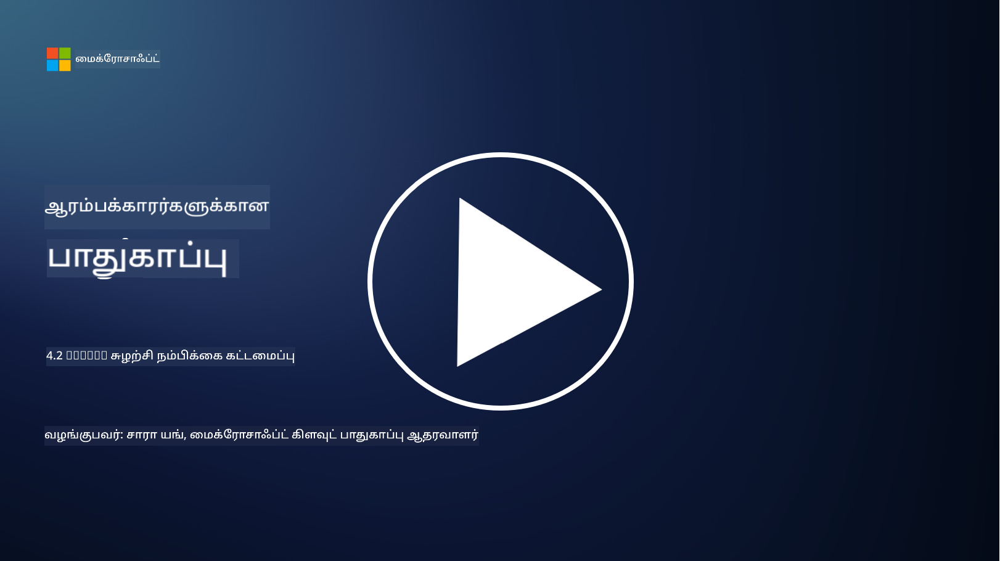

<!--
CO_OP_TRANSLATOR_METADATA:
{
  "original_hash": "45bbdc114e70936816b0b3e7c40189cf",
  "translation_date": "2025-10-11T11:31:08+00:00",
  "source_file": "4.2 SecOps zero trust architecture.md",
  "language_code": "ta"
}
-->
# SecOps சுழற்சி நம்பகமான கட்டமைப்பு

பாதுகாப்பு செயல்பாடுகள் சுழற்சி நம்பகமான கட்டமைப்பின் இரண்டு பகுதிகளை உருவாக்குகிறது, மேலும் இந்த பாடத்தில் நாம் இரண்டையும் பற்றி கற்றுக்கொள்வோம்:

- மையப்படுத்தப்பட்ட பதிவு சேகரிப்பை அனுமதிக்க IT கட்டமைப்புகள் எப்படி கட்டமைக்கப்பட வேண்டும்?

- நவீன IT சூழல்களில் பாதுகாப்பு செயல்பாடுகளுக்கான சிறந்த நடைமுறைகள் என்ன?

## மையப்படுத்தப்பட்ட பதிவு சேகரிப்பை அனுமதிக்க IT கட்டமைப்புகள் எப்படி கட்டமைக்கப்பட வேண்டும்?

மையப்படுத்தப்பட்ட பதிவு சேகரிப்பு என்பது நவீன பாதுகாப்பு செயல்பாடுகளின் முக்கிய கூறமாகும். இது நிறுவனங்களுக்கு சேவர்கள், பயன்பாடுகள், நெட்வொர்க் சாதனங்கள் மற்றும் பாதுகாப்பு கருவிகள் போன்ற பல்வேறு மூலங்களிலிருந்து பதிவுகள் மற்றும் தரவுகளை மைய சேமிப்பகத்தில் சேகரிக்க அனுமதிக்கிறது, அவற்றை பகுப்பாய்வு, கண்காணிப்பு மற்றும் சம்பவங்களுக்கு பதிலளிக்க பயன்படுத்துகிறது. மையப்படுத்தப்பட்ட பதிவு சேகரிப்பை ஆதரிக்க IT கட்டமைப்புகளை உருவாக்க சிறந்த நடைமுறைகள் இவை:

1. **பதிவு மூல ஒருங்கிணைப்பு**:

- அனைத்து தொடர்புடைய சாதனங்கள் மற்றும் அமைப்புகள் பதிவுகளை உருவாக்க உள்ளமைக்கப்பட்டுள்ளதை உறுதிப்படுத்தவும். இதில் சேவர்கள், ஃபயர்வால்கள், ரவுடர்கள், ஸ்விட்ச்கள், பயன்பாடுகள் மற்றும் பாதுகாப்பு கருவிகள் அடங்கும்.

- பதிவு மூலங்களை மையப்படுத்தப்பட்ட பதிவு சேகரிப்பாளர் அல்லது மேலாண்மை அமைப்புக்கு பதிவுகளை அனுப்ப உள்ளமைக்கவும்.

2. **சரியான SIEM கருவியை தேர்வு செய்யவும்**:

- உங்கள் நிறுவனத்தின் தேவைகள் மற்றும் அளவுக்கு பொருந்தும் SIEM (Security Information and Event Management) தீர்வை தேர்வு செய்யவும்.

- தேர்ந்தெடுக்கப்பட்ட தீர்வு பதிவு சேகரிப்பு, தொகுப்பு, பகுப்பாய்வு மற்றும் அறிக்கையிடலை ஆதரிக்க வேண்டும்.

3. **அளவீடு மற்றும் மீளமைப்பு**:

- அதிகமான பதிவு மூலங்கள் மற்றும் அதிகமான பதிவு அளவுக்கு இடமளிக்க கட்டமைப்பை அளவீடு செய்ய வடிவமைக்கவும்.

- சாதனங்கள் அல்லது நெட்வொர்க் தோல்விகளால் ஏற்படும் இடையூறுகளைத் தவிர்க்க உயர் கிடைக்கும் மீளமைப்பை செயல்படுத்தவும்.

4. **பதிவுகளை பாதுகாப்பாக அனுப்பவும்**:

- மூலங்களிலிருந்து மைய சேமிப்பகத்திற்கு TLS/SSL அல்லது IPsec போன்ற பாதுகாப்பான நெறிமுறைகளை பயன்படுத்தவும்.

- பதிவுகளை அனுப்ப அனுமதிக்கப்பட்ட சாதனங்கள் மட்டுமே அனுமதிக்க அங்கீகாரம் மற்றும் அணுகல் கட்டுப்பாடுகளை செயல்படுத்தவும்.

5. **சீரமைப்பு**:

- பதிவுகளின் வடிவங்களை சீரமைத்து தரவுகளை ஒரே மாதிரியானதாக மாற்றவும், இது பகுப்பாய்வுக்கு எளிதாக இருக்கும்.

6. **சேமிப்பு மற்றும் தக்கவைத்தல்**:

- இணக்கம் மற்றும் பாதுகாப்பு தேவைகளின் அடிப்படையில் பதிவுகளுக்கான சரியான தக்கவைத்தல் காலத்தை நிர்ணயிக்கவும்.

- பதிவுகளை பாதுகாப்பாக சேமிக்கவும், அவற்றை அனுமதிக்கப்படாத அணுகல் மற்றும் மாற்றத்திலிருந்து பாதுகாக்கவும்.

## நவீன IT சூழல்களில் பாதுகாப்பு செயல்பாடுகளுக்கான சிறந்த நடைமுறைகள் என்ன?

மையப்படுத்தப்பட்ட பதிவு சேகரிப்பை தவிர, நவீன IT சூழல்களில் பாதுகாப்பு செயல்பாடுகளுக்கான சிறந்த நடைமுறைகள் இவை:

1. **தொடர்ச்சியான கண்காணிப்பு**: நெட்வொர்க் மற்றும் அமைப்பு செயல்பாடுகளை தொடர்ச்சியாக கண்காணித்து, மெய்நிகர் நேரத்தில் மிரட்டல்களை கண்டறிந்து பதிலளிக்கவும்.

2. **மிரட்டல் நுண்ணறிவு**: மிரட்டல்கள் மற்றும் பாதிப்புகள் பற்றிய தகவல்களை மிரட்டல் நுண்ணறிவு ஊட்டங்கள் மற்றும் சேவைகளை பயன்படுத்தி அறிந்து கொள்ளவும்.

3. **பயனர் பயிற்சி**: சமூக பொறியியல் மற்றும் பிஷிங் தாக்குதல்களால் ஏற்படும் அபாயங்களை குறைக்க ஊழியர்களுக்கு முறைப்படி பாதுகாப்பு விழிப்புணர்வு பயிற்சியை நடத்தவும்.

4. **சம்பவ பதிலளிப்பு திட்டம்**: பாதுகாப்பு சம்பவங்களுக்கு விரைவான மற்றும் பயனுள்ள பதிலளிப்பை உறுதிப்படுத்த சம்பவ பதிலளிப்பு திட்டத்தை உருவாக்கி சோதிக்கவும்.

5. **பாதுகாப்பு தானியக்கமயமாக்கல்**: சம்பவ பதிலளிப்பு மற்றும் மீண்டும் மீண்டும் செய்யப்படும் பணிகளை எளிமைப்படுத்த பாதுகாப்பு தானியக்க மற்றும் ஒருங்கிணைப்பு கருவிகளை பயன்படுத்தவும்.

6. **காப்புப்பிரதி மற்றும் மீட்பு**: தரவிழப்பு அல்லது ரான்சம் வேர் தாக்குதல்களின் போது தரவின் கிடைப்பை உறுதிப்படுத்த வலுவான காப்புப்பிரதி மற்றும் பேரழிவு மீட்பு தீர்வுகளை செயல்படுத்தவும்.

## மேலும் படிக்க

- [Microsoft Security Best Practices module: Security operations | Microsoft Learn](https://learn.microsoft.com/security/operations/security-operations-videos-and-decks?WT.mc_id=academic-96948-sayoung)
- [Security operations - Cloud Adoption Framework | Microsoft Learn](https://learn.microsoft.com/azure/cloud-adoption-framework/secure/security-operations?WT.mc_id=academic-96948-sayoung)
- [What is Security Operations and Analytics Platform Architecture? A Definition of SOAPA, How It Works, Benefits, and More (digitalguardian.com)](https://www.digitalguardian.com/blog/what-security-operations-and-analytics-platform-architecture-definition-soapa-how-it-works#:~:text=All%20in%20all%2C%20security%20operations%20and%20analytics%20platform,become%20more%20efficient%20and%20operative%20with%20your%20security.)

---

**குறிப்பு**:  
இந்த ஆவணம் [Co-op Translator](https://github.com/Azure/co-op-translator) என்ற AI மொழிபெயர்ப்பு சேவையைப் பயன்படுத்தி மொழிபெயர்க்கப்பட்டுள்ளது. நாங்கள் துல்லியத்திற்காக முயற்சிக்கிறோம், ஆனால் தானியங்கி மொழிபெயர்ப்புகளில் பிழைகள் அல்லது துல்லியக்குறைவுகள் இருக்கக்கூடும் என்பதை தயவுசெய்து கவனத்தில் கொள்ளவும். அதன் தாய்மொழியில் உள்ள மூல ஆவணம் அதிகாரப்பூர்வ ஆதாரமாக கருதப்பட வேண்டும். முக்கியமான தகவல்களுக்கு, தொழில்முறை மனித மொழிபெயர்ப்பு பரிந்துரைக்கப்படுகிறது. இந்த மொழிபெயர்ப்பைப் பயன்படுத்துவதால் ஏற்படும் எந்த தவறான புரிதல்கள் அல்லது தவறான விளக்கங்களுக்கு நாங்கள் பொறுப்பல்ல.