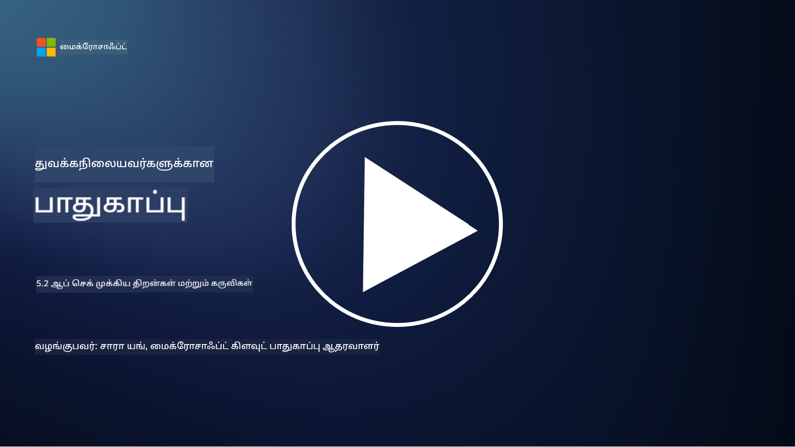

<!--
CO_OP_TRANSLATOR_METADATA:
{
  "original_hash": "790a3fa7e535ec60bb51bde13e759781",
  "translation_date": "2025-10-11T11:33:45+00:00",
  "source_file": "5.2 AppSec key capabilities.md",
  "language_code": "ta"
}
-->
இந்த பிரிவில், பயன்பாட்டு பாதுகாப்பில் பயன்படுத்தப்படும் முக்கிய கருவிகள் மற்றும் திறன்கள் பற்றிய மேலும் விவரங்களை நாம் காண்போம்:

## அறிமுகம்

இந்த பாடத்தில், பயன்பாட்டு பாதுகாப்பில் பயன்படுத்தப்படும் முக்கிய திறன்கள் மற்றும் கருவிகள் என்ன என்பதை நாம் காண்போம்.

## AppSec முக்கிய திறன்கள் மற்றும் கருவிகள்

பயன்பாட்டு பாதுகாப்பில் பயன்படுத்தப்படும் முக்கிய திறன்கள் மற்றும் கருவிகள் மென்பொருள் பயன்பாடுகளில் பாதுகாப்பு குறைபாடுகள் மற்றும் மிரட்டல்களை கண்டறிய, குறைக்க மற்றும் தடுப்பதற்கான அடிப்படை அம்சங்களாகும். இவை சில முக்கியமானவை:

**1. நிலையான பயன்பாட்டு பாதுகாப்பு சோதனை (SAST)**:

- **திறன்கள்**: பயன்பாட்டின் கோட்பகுதியின் மூலக் குறியீடு, பைட்கோடு அல்லது பைனரி கோடுகளை பகுப்பாய்வு செய்து பாதுகாப்பு குறைபாடுகளை கண்டறிதல்.

- **கருவிகள்**: உதாரணமாக Fortify, Checkmarx, மற்றும் Veracode.

**2. இயக்க பயன்பாட்டு பாதுகாப்பு சோதனை (DAST)**:

- **திறன்கள்**: இயங்கும் பயன்பாட்டை ஸ்கேன் செய்து, உள்ளீட்டு கோரிக்கைகளை அனுப்பி பதில்களை பகுப்பாய்வு செய்வதன் மூலம் குறைபாடுகளை கண்டறிதல்.

- **கருவிகள்**: உதாரணமாக ZAP, Burp Suite, மற்றும் Qualys Web Application Scanning.

**3. இடைநிலை பயன்பாட்டு பாதுகாப்பு சோதனை (IAST)**:

- **திறன்கள்**: SAST மற்றும் DAST அம்சங்களை இணைத்து, இயக்க நேரத்தில் கோடுகளை பகுப்பாய்வு செய்து, துல்லியமான முடிவுகளை வழங்குதல் மற்றும் தவறான நேர்மைகள் குறைதல்.

- **கருவிகள்**: உதாரணமாக Contrast Security மற்றும் HCL AppScan.

**4. இயக்க நேர பயன்பாட்டு சுய பாதுகாப்பு (RASP)**:

- **திறன்கள்**: பயன்பாடுகளை நேரடியாக கண்காணித்து, பாதுகாப்பு மிரட்டல்களை கண்டறிந்து, அவற்றுக்கு பதிலளித்தல்.

- **கருவிகள்**: உதாரணமாக Veracode Runtime Protection மற்றும் F5 Advanced WAF with RASP.

**5. வலை பயன்பாட்டு பாதுகாப்பு சுவர் (WAFs)**:

- **திறன்கள்**: பயன்பாட்டிற்கும் இணையத்திற்கும் இடையே பாதுகாப்பு அடுக்கு வழங்கி, வரும் போக்குகளை வடிகட்டி, தீங்கிழைக்கும் கோரிக்கைகளை தடுக்குதல்.

- **கருவிகள்**: உதாரணமாக ModSecurity, AWS WAF, மற்றும் Akamai Kona Site Defender.

**6. சார்பு ஸ்கேனிங்**:

- **திறன்கள்**: பயன்பாட்டில் பயன்படுத்தப்படும் மூன்றாம் தரப்பு நூலகங்கள் மற்றும் கூறுகளில் குறைபாடுகளை கண்டறிதல்.

- **கருவிகள்**: உதாரணமாக OWASP Dependency-Check மற்றும் Snyk.

**7. ஊடுருவல் சோதனை (Pen Testing)**:

- **திறன்கள்**: உண்மையான உலக தாக்குதல்களை ஒத்திசைத்து, குறைபாடுகளை கண்டறிந்து, பயன்பாட்டின் பாதுகாப்பை மதிப்பீடு செய்தல்.

- **கருவிகள்**: சான்றளிக்கப்பட்ட நெறிமுறை ஹேக்கர்கள் மற்றும் பாதுகாப்பு நிபுணர்களால் Metasploit மற்றும் Nmap போன்ற கருவிகளை பயன்படுத்தி செய்யப்படும்.

**8. பாதுகாப்பு ஸ்கேனிங் மற்றும் பகுப்பாய்வு**:

- **திறன்கள்**: அறியப்பட்ட குறைபாடுகள், கட்டமைப்பு பிழைகள் மற்றும் பாதுகாப்பு தவறுகளை ஸ்கேன் செய்தல்.

- **கருவிகள்**: உதாரணமாக Nessus, Qualys Vulnerability Management, மற்றும் OpenVAS.

**9. கன்டெய்னர் பாதுகாப்பு கருவிகள்**:

- **திறன்கள்**: கன்டெய்னர் பயன்பாடுகள் மற்றும் அவற்றின் சூழல்களை பாதுகாப்பதில் கவனம் செலுத்துதல்.

- **கருவிகள்**: உதாரணமாக Docker Security Scanning மற்றும் Aqua Security.

**10. பாதுகாப்பான மேம்பாட்டு பயிற்சி**:

- **திறன்கள்**: மேம்பாட்டு குழுக்களுக்கு பாதுகாப்பான குறியீட்டு நடைமுறைகளை ஊக்குவிக்கும் பயிற்சி மற்றும் விழிப்புணர்வு திட்டங்களை வழங்குதல்.

- **கருவிகள்**: தனிப்பயன் பயிற்சி திட்டங்கள் மற்றும் தளங்கள்.

**11. பாதுகாப்பு சோதனை கட்டமைப்புகள்**:

- **திறன்கள்**: பல்வேறு பயன்பாட்டு பாதுகாப்பு சோதனை தேவைகளுக்கு விரிவான சோதனை கட்டமைப்புகளை வழங்குதல்.

- **கருவிகள்**: OWASP Amass, OWASP OWTF மற்றும் FrAppSec.

**12. பாதுகாப்பான குறியீட்டு மதிப்பீடு கருவிகள்**:

- **திறன்கள்**: பாதுகாப்பு குறைபாடுகள் மற்றும் குறியீட்டு சிறந்த நடைமுறைகளுக்கான மூலக் குறியீட்டை மதிப்பீடு செய்தல்.

- **கருவிகள்**: உதாரணமாக SonarQube மற்றும் Checkmarx.

**13. பாதுகாப்பான APIகள் மற்றும் மைக்ரோசர்வீசுகள் கருவிகள்**:

- **திறன்கள்**: APIகள் மற்றும் மைக்ரோசர்வீசுகளை பாதுகாப்பதில் கவனம் செலுத்துதல், அதற்குள் அங்கீகாரம், அனுமதி மற்றும் தரவுப் பாதுகாப்பு.

- **கருவிகள்**: உதாரணமாக Apigee, AWS API Gateway, மற்றும் Istio.

## மேலும் வாசிக்க

- [What Is Application Security? Concepts, Tools & Best Practices | HackerOne](https://www.hackerone.com/knowledge-center/what-application-security-concepts-tools-best-practices)
- [What is IAST? (Interactive Application Security Testing) (comparitech.com)](https://www.comparitech.com/net-admin/what-is-iast/)
- [10 Types of Application Security Testing Tools: When and How to Use Them (cmu.edu)](https://insights.sei.cmu.edu/blog/10-types-of-application-security-testing-tools-when-and-how-to-use-them/)
- [Shifting the Balance of Cybersecurity Risk: Principles and Approaches for Security-by-Design and Default | Cyber.gov.au](https://www.cyber.gov.au/about-us/view-all-content/publications/principles-and-approaches-for-security-by-design-and-default)

---

**குறிப்பு**:  
இந்த ஆவணம் [Co-op Translator](https://github.com/Azure/co-op-translator) என்ற AI மொழிபெயர்ப்பு சேவையைப் பயன்படுத்தி மொழிபெயர்க்கப்பட்டுள்ளது. நாங்கள் துல்லியத்திற்காக முயற்சிக்கின்றோம், ஆனால் தானியங்கி மொழிபெயர்ப்புகளில் பிழைகள் அல்லது தவறான தகவல்கள் இருக்கக்கூடும் என்பதை தயவுசெய்து கவனத்தில் கொள்ளுங்கள். அதன் தாய்மொழியில் உள்ள மூல ஆவணம் அதிகாரப்பூர்வ ஆதாரமாக கருதப்பட வேண்டும். முக்கியமான தகவல்களுக்கு, தொழில்முறை மனித மொழிபெயர்ப்பு பரிந்துரைக்கப்படுகிறது. இந்த மொழிபெயர்ப்பைப் பயன்படுத்துவதால் ஏற்படும் எந்த தவறான புரிதல்கள் அல்லது தவறான விளக்கங்களுக்கு நாங்கள் பொறுப்பல்ல.