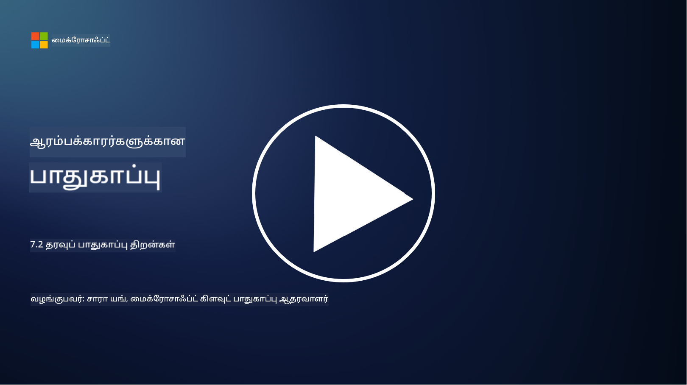

<!--
CO_OP_TRANSLATOR_METADATA:
{
  "original_hash": "50697add9758e54693442d502d2d5f8a",
  "translation_date": "2025-10-11T11:26:40+00:00",
  "source_file": "7.2 Data security capabilities.md",
  "language_code": "ta"
}
-->
# தரவின் பாதுகாப்பு திறன்கள்

இந்த பிரிவில், தரவின் பாதுகாப்புக்கான முக்கிய கருவிகள் மற்றும் திறன்கள் பற்றிய விரிவான தகவல்களை நாம் காண்போம்:

**அறிமுகம்**

இந்த பாடத்தில் நாம் கற்கப்போகிறோம்:

- தரவிழப்பு தடுப்பு கருவிகள் என்ன?

- உள்ளக ஆபத்து மேலாண்மை கருவிகள் என்ன?

- தரவின் காப்பக கருவிகள் என்ன?

## தரவிழப்பு தடுப்பு கருவிகள் என்ன?

தரவிழப்பு தடுப்பு (DLP) கருவிகள் என்பது ஒரு நிறுவனத்தின் முக்கியமான அல்லது ரகசியமான தரவுகளை அனுமதியின்றி அணுகுதல், பகிர்வு அல்லது கசியாமல் தடுக்க வடிவமைக்கப்பட்ட மென்பொருள் தீர்வுகள் மற்றும் தொழில்நுட்பங்களை குறிக்கிறது. இந்த கருவிகள் உள்ளடக்க ஆய்வு, கொள்கை அமலாக்கம் மற்றும் கண்காணிப்பு மூலம் முக்கியமான தரவுகளை அடையாளம் காணவும், பாதுகாக்கவும் உதவுகின்றன. உதாரணமாக DLP தயாரிப்புகள்: Symantec Data Loss Prevention, McAfee Total Protection for Data Loss Prevention, Microsoft 365 DLP**: Microsoft 365 பயன்பாடுகளுடன் ஒருங்கிணைந்து, மின்னஞ்சல்கள், ஆவணங்கள் மற்றும் செய்திகளில் உள்ள முக்கியமான தரவுகளை அடையாளம் காணவும், பாதுகாக்கவும் நிறுவனங்களுக்கு உதவுகிறது.

## உள்ளக ஆபத்து மேலாண்மை கருவிகள் என்ன?

உள்ளக ஆபத்து மேலாண்மை கருவிகள் என்பது ஊழியர்கள், ஒப்பந்ததாரர்கள் அல்லது கூட்டாளர்கள் மூலம் ஏற்படும் தரவின் பாதுகாப்பு ஆபத்துகளை அடையாளம் காணவும், குறைக்கவும் நிறுவனங்களுக்கு உதவுகிறது. இந்த கருவிகள் பயனர் நடத்தை, அணுகல் முறை மற்றும் தரவின் பயன்பாட்டை கண்காணித்து சந்தேகத்திற்குரிய செயல்பாடுகள் மற்றும் உள்ளக மிரட்டல்களை கண்டறிகின்றன. உதாரணமாக உள்ளக ஆபத்து மேலாண்மை தயாரிப்புகள்: Microsoft Insider Risk Management (Microsoft 365 இன் ஒரு பகுதி), Forcepoint Insider Threat Data Protection, Varonis Insider Threat Detection.

## தரவின் காப்பக கருவிகள் என்ன?

தரவின் காப்பக கருவிகள் என்பது ஒரு நிறுவனத்தின் தரவின் காப்பக கொள்கைகள் மற்றும் சட்ட தேவைகளுக்கு ஏற்ப தரவின் காப்பகத்தை நிர்வகிக்க வடிவமைக்கப்பட்ட மென்பொருள் மற்றும் தீர்வுகளை குறிக்கிறது. இந்த கருவிகள் குறிப்பிட்ட காலத்திற்கு தரவுகளை காப்பாற்றவும், தேவையற்ற தரவுகளை பாதுகாப்பாக நீக்கவும் செயல்முறையை தானியங்கி செய்ய உதவுகின்றன. உதாரணமாக தரவின் காப்பக தயாரிப்புகள்: Veritas Enterprise Vault, Commvault Complete Data Protection, Microsoft data lifecycle management. இந்த கருவிகள் தரவின் காப்பகத்தை மற்றும் அகற்றத்தை கட்டுப்படுத்த நிறுவனங்களுக்கு உதவுகின்றன, தரவின் வாழ்க்கைச்சுழற்சியில் திறமையாக நிர்வகிக்கவும், தரவின் பாதுகாப்பு விதிமுறைகளுக்கு இணங்கவும் உதவுகின்றன.

## மேலும் படிக்க

- [தரவின் பாதுகாப்பு நிலை மேலாண்மை வழிகாட்டி (DSPM) | CSA (cloudsecurityalliance.org)](https://cloudsecurityalliance.org/blog/2023/03/31/the-big-guide-to-data-security-posture-management-dspm/)
- [முடுக்கங்கள், பயன்பாடுகள் மற்றும் சேவைகளில் தரவிழப்பு தடுப்பு | Microsoft Purview](https://youtu.be/hvqq8L_0kgI)
- [18 சிறந்த தரவிழப்பு தடுப்பு மென்பொருள் கருவிகள் 2023 (இலவச + கட்டண) (comparitech.com)](https://www.comparitech.com/data-privacy-management/data-loss-prevention-tools-software/)
- [தரவிழப்பு தடுப்பு (nist.gov)](https://tsapps.nist.gov/publication/get_pdf.cfm?pub_id=904672)
- [உள்ளக ஆபத்து மேலாண்மை பற்றி கற்றுக்கொள்ளுங்கள் | Microsoft Learn](https://learn.microsoft.com/purview/insider-risk-management?WT.mc_id=academic-96948-sayoung)
- [தரவின் வாழ்க்கைச்சுழற்சி மேலாண்மை | IBM](https://www.ibm.com/topics/data-lifecycle-management)
- [தரவின் வாழ்க்கைச்சுழற்சி மேலாண்மை (DLM) என்ன? | 2023 சிறந்த நடைமுறைகள் (selecthub.com)](https://www.selecthub.com/big-data-analytics/data-lifecycle-management/)

---

**குறிப்பு**:  
இந்த ஆவணம் [Co-op Translator](https://github.com/Azure/co-op-translator) என்ற AI மொழிபெயர்ப்பு சேவையைப் பயன்படுத்தி மொழிபெயர்க்கப்பட்டுள்ளது. எங்கள் தரத்தை உறுதிப்படுத்த முயற்சிக்கிறோம், ஆனால் தானியங்கி மொழிபெயர்ப்புகளில் பிழைகள் அல்லது தவறுகள் இருக்கக்கூடும் என்பதை தயவுசெய்து கவனத்தில் கொள்ளுங்கள். அதன் தாய்மொழியில் உள்ள மூல ஆவணம் அதிகாரப்பூர்வ ஆதாரமாக கருதப்பட வேண்டும். முக்கியமான தகவல்களுக்கு, தொழில்முறை மனித மொழிபெயர்ப்பு பரிந்துரைக்கப்படுகிறது. இந்த மொழிபெயர்ப்பைப் பயன்படுத்துவதால் ஏற்படும் எந்த தவறான புரிதல்கள் அல்லது தவறான விளக்கங்களுக்கு நாங்கள் பொறுப்பல்ல.