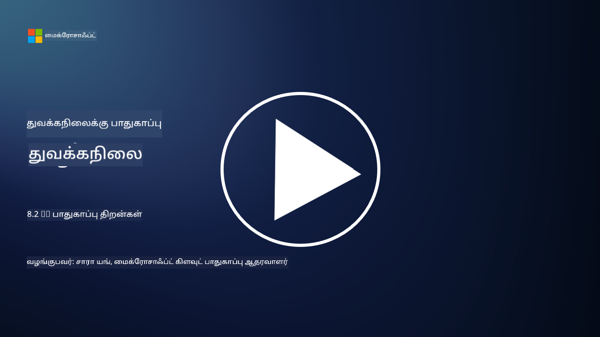

<!--
CO_OP_TRANSLATOR_METADATA:
{
  "original_hash": "b6bb7175672298d1e2f73ba7e0006f95",
  "translation_date": "2025-10-11T11:30:03+00:00",
  "source_file": "8.2 AI security capabilities.md",
  "language_code": "ta"
}
-->
# AI பாதுகாப்பு திறன்கள்

## தற்போதைய AI அமைப்புகளை பாதுகாக்க எவ்வளவு கருவிகள் மற்றும் திறன்கள் உள்ளன?

தற்போது, AI அமைப்புகளை பாதுகாக்க பல கருவிகள் மற்றும் திறன்கள் கிடைக்கின்றன:

-   **Counterfit**: AI அமைப்புகளின் பாதுகாப்பு சோதனைக்கான திறந்த மூல ஆட்டோமேஷன் கருவி. இது நிறுவனங்களுக்கு AI பாதுகாப்பு அபாய மதிப்பீடுகளை நடத்தவும், அவர்களின் அல்காரிதங்களின் வலிமையை உறுதிப்படுத்தவும் உதவுகிறது.
-   **Adversarial Machine Learning Tools**: இந்த கருவிகள் adversarial தாக்குதல்களுக்கு எதிராக இயந்திர கற்றல் மாதிரிகளின் வலிமையை மதிப்பீடு செய்கின்றன, பாதிப்புகளை கண்டறிந்து தடுக்க உதவுகின்றன.
-   **AI Security Toolkits**: AI அமைப்புகளை பாதுகாக்க திறந்த மூல கருவிகள் கிடைக்கின்றன, இதில் பாதுகாப்பு நடவடிக்கைகளை செயல்படுத்த நூலகங்கள் மற்றும் கட்டமைப்புகள் அடங்கும்.
-   **கூட்டு தளங்கள்**: நிறுவனங்கள் மற்றும் AI சமூகங்களுக்கிடையேயான கூட்டாண்மைகள், AI வழங்கல் சங்கிலியை பாதுகாக்க AI-க்கு தனிப்பட்ட பாதுகாப்பு ஸ்கேனர் மற்றும் பிற கருவிகளை உருவாக்க உதவுகின்றன.

இந்த கருவிகள் மற்றும் திறன்கள் பல்வேறு அச்சுறுத்தல்களுக்கு எதிராக AI அமைப்புகளின் பாதுகாப்பை மேம்படுத்துவதற்கான வளர்ந்து வரும் துறையின் ஒரு பகுதியாகும். இவை AI தொழில்நுட்பங்களால் ஏற்படும் தனித்துவமான சவால்களை எதிர்கொள்ள ஆராய்ச்சி, நடைமுறை கருவிகள் மற்றும் தொழில்துறை ஒத்துழைப்பின் கலவையை பிரதிநிதித்துவப்படுத்துகின்றன.

## AI Red Teaming பற்றி என்ன? இது பாரம்பரிய பாதுகாப்பு Red Teaming-இலிருந்து எப்படி மாறுபடுகிறது?

AI Red Teaming பாரம்பரிய பாதுகாப்பு Red Teaming-இலிருந்து சில முக்கிய அம்சங்களில் மாறுபடுகிறது:

-   **AI அமைப்புகளின் மீது கவனம்**: AI Red Teaming குறிப்பாக AI அமைப்புகளின் தனித்துவமான பாதிப்புகளை இலக்காகக் கொண்டுள்ளது, உதாரணமாக இயந்திர கற்றல் மாதிரிகள் மற்றும் தரவுப் குழாய்கள், பாரம்பரிய IT உள்கட்டமைப்பை விட.
-   **AI நடத்தை சோதனை**: இது AI அமைப்புகள் அசாதாரண அல்லது எதிர்பாராத உள்ளீடுகளுக்கு எப்படி பதிலளிக்கின்றன என்பதை சோதிக்கிறது, இது தாக்குதலாளர்களால் பயன்படுத்தக்கூடிய பாதிப்புகளை வெளிப்படுத்த முடியும்.
-   **AI தோல்விகளை ஆராய்தல்**: AI Red Teaming தீவிரமான மற்றும் நல்ல நோக்கத்துடன் ஏற்படும் தோல்விகளை ஆராய்கிறது, பாதுகாப்பு மீறல்களைத் தவிர்த்து, பரந்த அளவிலான பாத்திரங்கள் மற்றும் சாத்தியமான அமைப்பு தோல்விகளைப் பரிசீலிக்கிறது.
-   **Prompt Injection மற்றும் உள்ளடக்க உருவாக்கம்**: AI Red Teaming prompt injection போன்ற தோல்விகளை சோதிக்கவும், அதில் தாக்குதலாளர்கள் AI அமைப்புகளை தீங்கு விளைவிக்கும் அல்லது அடிப்படை இல்லாத உள்ளடக்கத்தை உருவாக்க வலியுறுத்துகின்றனர்.
-   **நெறிமுறை மற்றும் பொறுப்பான AI**: இது பொறுப்பான AI வடிவமைப்பின் ஒரு பகுதியாகும், AI அமைப்புகள் எதிர்பாராத முறையில் செயல்பட முயற்சிகளை எதிர்க்க வலிமையானவை என்பதை உறுதிப்படுத்துகிறது.

மொத்தத்தில், AI Red Teaming என்பது பாதுகாப்பு பாதிப்புகளை சோதிப்பதற்கான நடைமுறையை மட்டுமல்லாமல், AI தொழில்நுட்பங்களுக்கு தனித்துவமான பிற வகை அமைப்பு தோல்விகளை சோதிப்பதையும் உள்ளடக்கியது. AI அமைப்புகளை பாதுகாப்பாக உருவாக்குவதற்கான முக்கியமான ஒரு பகுதியாக இது செயல்படுகிறது, AI பயன்பாட்டுடன் தொடர்புடைய புதிய அபாயங்களைப் புரிந்து கொண்டு அவற்றைத் தடுக்க உதவுகிறது.

## மேலும் வாசிக்க

 - [Microsoft AI Red Team building future of safer AI | Microsoft Security Blog](https://www.microsoft.com/en-us/security/blog/2023/08/07/microsoft-ai-red-team-building-future-of-safer-ai/?WT.mc_id=academic-96948-sayoung)
 - [Announcing Microsoft’s open automation framework to red team generative AI Systems | Microsoft Security Blog](https://www.microsoft.com/en-us/security/blog/2024/02/22/announcing-microsofts-open-automation-framework-to-red-team-generative-ai-systems/?WT.mc_id=academic-96948-sayoung)
 - [AI Security Tools: The Open-Source Toolkit | Wiz](https://www.wiz.io/academy/ai-security-tools)

---

**குறிப்பு**:  
இந்த ஆவணம் [Co-op Translator](https://github.com/Azure/co-op-translator) என்ற AI மொழிபெயர்ப்பு சேவையைப் பயன்படுத்தி மொழிபெயர்க்கப்பட்டுள்ளது. நாங்கள் துல்லியத்திற்காக முயற்சிக்கின்றோம், ஆனால் தானியக்க மொழிபெயர்ப்புகளில் பிழைகள் அல்லது தவறான தகவல்கள் இருக்கக்கூடும் என்பதை கவனத்தில் கொள்ளவும். அதன் தாய்மொழியில் உள்ள மூல ஆவணம் அதிகாரப்பூர்வ ஆதாரமாக கருதப்பட வேண்டும். முக்கியமான தகவல்களுக்கு, தொழில்முறை மனித மொழிபெயர்ப்பு பரிந்துரைக்கப்படுகிறது. இந்த மொழிபெயர்ப்பைப் பயன்படுத்துவதால் ஏற்படும் எந்த தவறான புரிதல்கள் அல்லது தவறான விளக்கங்களுக்கு நாங்கள் பொறுப்பல்ல.