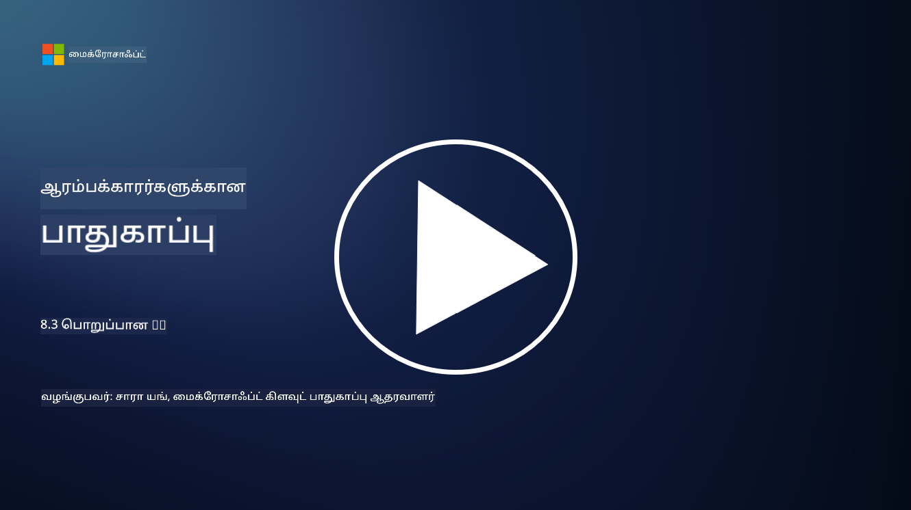

<!--
CO_OP_TRANSLATOR_METADATA:
{
  "original_hash": "5e9775ee91bde7d44577891d5f11c4c5",
  "translation_date": "2025-10-11T11:27:05+00:00",
  "source_file": "8.3 Responsible AI.md",
  "language_code": "ta"
}
-->
# பொறுப்பான AI

## பொறுப்பான AI என்றால் என்ன? அது AI பாதுகாப்புடன் எப்படி தொடர்புடையது?

பொறுப்பான AI என்பது செயற்கை நுண்ணறிவை நெறிமுறையுடன், வெளிப்படையாக, மற்றும் சமூகத்தின் மதிப்புகளுடன் ஒத்துப்போகும் வகையில் உருவாக்கி பயன்படுத்துவதை குறிக்கிறது. இது நியாயம், பொறுப்புணர்வு, மற்றும் வலிமை போன்ற கொள்கைகளை உள்ளடக்கியது, AI அமைப்புகள் தனிநபர்கள், சமூகங்கள், மற்றும் சமுதாயத்திற்கு பயனுள்ளதாக வடிவமைக்கப்பட்டு செயல்படுவதை உறுதிப்படுத்துகிறது.

பொறுப்பான AI மற்றும் AI பாதுகாப்பு இடையேயான தொடர்பு முக்கியமானது, ஏனெனில்:

- **நெறிமுறை கருத்துக்கள்**: பொறுப்பான AI, பாதுகாப்பை நேரடியாக பாதிக்கும் நெறிமுறை கருத்துக்களை உள்ளடக்கியது, உதாரணமாக தனியுரிமை மற்றும் தரவின் பாதுகாப்பு. AI அமைப்புகள் பயனர் தனியுரிமையை மதித்து, தனிப்பட்ட தரவுகளை பாதுகாப்பது பொறுப்பான AI-யின் முக்கிய அம்சமாகும்.
- **வலிமை மற்றும் நம்பகத்தன்மை**: AI அமைப்புகள் மாறுபாடுகள் மற்றும் தாக்குதல்களுக்கு எதிராக வலிமையாக இருக்க வேண்டும், இது பொறுப்பான AI மற்றும் AI பாதுகாப்பின் முக்கிய கொள்கையாகும். இதற்கு எதிர்மறை தாக்குதல்களைத் தடுக்கவும், AI முடிவெடுக்கும் செயல்முறைகளின் முழுமையை உறுதிப்படுத்தவும் உதவுகிறது.
- **வெளிப்படைத்தன்மை மற்றும் விளக்கத்தன்மை**: பொறுப்பான AI-யின் ஒரு பகுதியாக AI அமைப்புகள் வெளிப்படையாக இருக்க வேண்டும் மற்றும் அவற்றின் முடிவுகளை விளக்க முடியும். இது பாதுகாப்புக்கு முக்கியமானது, ஏனெனில் பங்குதாரர்கள் AI அமைப்புகள் எப்படி செயல்படுகின்றன என்பதைப் புரிந்து கொள்ள வேண்டும்.
- **பொறுப்புணர்வு**: AI அமைப்புகள் தங்கள் செயல்களுக்கு பொறுப்பாக இருக்க வேண்டும், அதாவது முடிவுகளை கண்காணிக்கவும், எந்த பிரச்சினைகளையும் சரிசெய்யவும் அமைப்புகள் இருக்க வேண்டும். இது பாதுகாப்பு நடைமுறைகளுடன் ஒத்துப்போகிறது, அமைப்பின் செயல்பாடுகளை கண்காணித்து, மீறல்களைத் தடுக்கவும், பதிலளிக்கவும்.

மொத்தத்தில், பொறுப்பான AI மற்றும் AI பாதுகாப்பு ஒன்றோடொன்று தொடர்புடையவை, பொறுப்பான AI நடைமுறைகள் AI அமைப்புகளின் பாதுகாப்பை மேம்படுத்த உதவுகிறது, அதேபோல் பாதுகாப்பு நடைமுறைகள் AI-யின் நெறிமுறைகளை உறுதிப்படுத்துகிறது.

## என் AI அமைப்பு பாதுகாப்பானதும் நெறிமுறையுடனும் இருக்க எப்படி உறுதிப்படுத்துவது?

உங்கள் AI அமைப்பு பாதுகாப்பானதும் நெறிமுறையுடனும் இருக்க பல்வேறு அணுகுமுறைகளை பின்பற்ற வேண்டும், அவை:

- **நெறிமுறை கொள்கைகளை பின்பற்றவும்**: மனிதன், சமுதாயம், மற்றும் சுற்றுச்சூழல் நலன்; நியாயம்; தனியுரிமை பாதுகாப்பு; நம்பகத்தன்மை; வெளிப்படைத்தன்மை; எதிர்ப்பு; மற்றும் பொறுப்புணர்வு ஆகியவற்றை வலியுறுத்தும் நிறுவப்பட்ட நெறிமுறை வழிகாட்டுதல்களை பின்பற்றவும்.

- **வலிமையான பாதுகாப்பு நடவடிக்கைகளை செயல்படுத்தவும்**: முந்தைய பாதுகாப்பு சோதனை மற்றும் AI நம்பிக்கை, அபாயம், பாதுகாப்பு மேலாண்மை திட்டங்களை பயன்படுத்தி மிரட்டல்களுக்கும் பாதிப்புகளுக்கும் எதிராக பாதுகாக்கவும்.

- **பல்வேறு பங்குதாரர்களை ஈர்க்கவும்**: AI உருவாக்க செயல்முறையில் பல்வேறு பங்கேற்பாளர்களை, உளவியல் நிபுணர்கள், சமூக விஞ்ஞானிகள், மற்றும் பாதிக்கப்பட்ட சமூகங்களின் பிரதிநிதிகளை உள்ளடக்கவும், பல்வேறு பார்வைகள் மற்றும் மதிப்புகள் கருத்தில் கொள்ளப்படுவதை உறுதிப்படுத்தவும்.

- **வெளிப்படைத்தன்மை மற்றும் விளக்கத்தன்மையை உறுதிப்படுத்தவும்**: AI-யின் முடிவெடுக்கும் செயல்முறைகள் வெளிப்படையாகவும் விளக்கமளிக்கக்கூடியதாகவும் இருக்க வேண்டும், இது அதிக நம்பிக்கையை உருவாக்கவும், சாத்தியமான பாகுபாடுகள் அல்லது பிழைகளை அடையாளம் காணவும் உதவுகிறது.

- **தரவு தனியுரிமையை பராமரிக்கவும்**: குறியாக்கம் மற்றும் பிற தரவுப் பாதுகாப்பு நடவடிக்கைகள் மூலம் தரவின் தனியுரிமை மற்றும் உண்மைத்தன்மையை பாதுகாக்கவும், பயனர்களின் தனியுரிமை உரிமைகளை மதிக்கவும்.

- **மனித மேற்பார்வையை செயல்படுத்தவும்**: AI அமைப்புகள் எடுத்த முடிவுகளை எதிர்க்கவும், பொறுப்புணர்வை உறுதிப்படுத்தவும் மனித மேற்பார்வைக்கு அமைப்புகளை செயல்படுத்தவும்.

- **AI பாதுகாப்பு பற்றிய தகவல்களைப் புதுப்பித்துக் கொள்ளவும்**: AI பாதுகாப்பு மற்றும் நெறிமுறைகள் பற்றிய புதிய ஆராய்ச்சிகள் மற்றும் விவாதங்களைப் பின்பற்றவும், AI பாதுகாப்பின் மாறும் சூழலையைப் புரிந்து கொள்ளவும்.

- **ஒழுங்குமுறைகளை பின்பற்றவும்**: உங்கள் AI அமைப்பு தொடர்புடைய அனைத்து சட்டங்கள் மற்றும் ஒழுங்குமுறைகளை பின்பற்றுவதை உறுதிப்படுத்தவும், இதில் தரவுப் பாதுகாப்பு சட்டங்கள், பாகுபாடு எதிர்ப்பு சட்டங்கள், மற்றும் தொழில்துறை-சிறப்பு வழிகாட்டுதல்கள் அடங்கும்.

## நெறிமுறை இல்லாத AI பயன்பாட்டால் ஏற்படும் பாதுகாப்பு பிரச்சினைகளுக்கான சில உதாரணங்களை தர முடியுமா?

நெறிமுறை இல்லாத AI பயன்பாட்டால் ஏற்படும் பாதுகாப்பு பிரச்சினைகளுக்கான சில உதாரணங்கள் இவை:

- **பாகுபாடான முடிவெடுப்பு**: AI அமைப்புகள் பாகுபாடான தரவுத்தொகுப்புகளில் பயிற்சி பெறும்போது, ஏற்கனவே உள்ள பாகுபாடுகளை தொடரவும், அதிகரிக்கவும் செய்யலாம். உதாரணமாக, ஒரு தேடல் இயந்திரம் சமூகக் கற்பனைகளை பிரதிபலிக்கும் தரவுகளில் பயிற்சி பெறுமானால், பாகுபாடான தேடல் முடிவுகளை காட்டும், இது அநியாயமான நடத்தையையும் பாகுபாடுகளையும் உருவாக்கலாம்.

- **AI நீதிமன்ற அமைப்புகளில்**: சட்ட முடிவெடுப்பில் AI-யை பயன்படுத்துவது, குறிப்பாக AI-யின் முடிவெடுக்கும் செயல்முறை வெளிப்படையாக இல்லாவிட்டால் அல்லது பாகுபாடான தரவால் பாதிக்கப்படுமானால், நெறிமுறை சிக்கல்களை உருவாக்கலாம். இது அநியாயமான சட்ட முடிவுகளை உருவாக்கி, தனிநபர்களின் உரிமைகளை மீறலாம்.

- **AI அமைப்புகளை மாற்றம் செய்யும் தாக்குதல்கள்**: AI அமைப்புகள் எதிர்மறை தாக்குதல்களுக்கு பாதிக்கப்படக்கூடியவை, இதில் உள்ளீட்டு தரவுகளில் சிறிய மாற்றங்கள் தவறான முடிவுகளை உருவாக்கலாம். உதாரணமாக, சுய இயக்க வாகனங்கள் போக்குவரத்து சின்னங்களை தவறாக புரிந்து கொள்ள வழிவகுக்கும், இது பாதுகாப்பு அபாயங்களை உருவாக்கும்.

- **AI மூலம் கண்காணிப்பு**: கண்காணிப்பு நோக்கங்களுக்காக AI-யை பயன்படுத்துவது, சரியான அனுமதி இல்லாமல் அல்லது தனிநபர் சுதந்திரங்களை மீறும் வகையில் பயன்படுத்தப்பட்டால், தனியுரிமை மீறல்களை உருவாக்கலாம். இது குறிப்பாக அதிகாரமிக்க ஆட்சியாளர்கள் AI-யை எதிர்ப்பு கருத்துகளை கண்காணிக்கவும், அடக்கவும் பயன்படுத்தும் சூழல்களில் பிரச்சினையாக இருக்கலாம்.

இந்த உதாரணங்கள் AI அமைப்புகளை உருவாக்கவும், பயன்படுத்தவும் நெறிமுறை கருத்துக்களின் முக்கியத்துவத்தை வலியுறுத்துகின்றன, பாதுகாப்பு பிரச்சினைகளைத் தவிர்க்கவும், தனிநபர்களின் உரிமைகள் மற்றும் தனியுரிமையை பாதுகாக்கவும்.

## மேலும் வாசிக்க

 - [Microsoft Responsible AI Standard v2 General Requirements](https://query.prod.cms.rt.microsoft.com/cms/api/am/binary/RE5cmFl?culture=en-us&country=us&WT.mc_id=academic-96948-sayoung)
 - [Responsible AI (mit.edu)](https://sloanreview.mit.edu/big-ideas/responsible-ai/)
 - [13 Principles for Using AI Responsibly (hbr.org)](https://hbr.org/2023/06/13-principles-for-using-ai-responsibly)

---

**குறிப்பு**:  
இந்த ஆவணம் [Co-op Translator](https://github.com/Azure/co-op-translator) என்ற AI மொழிபெயர்ப்பு சேவையைப் பயன்படுத்தி மொழிபெயர்க்கப்பட்டுள்ளது. எங்கள் தரச்சிறப்பிற்காக முயற்சிக்கிறோம், ஆனால் தானியக்க மொழிபெயர்ப்புகளில் பிழைகள் அல்லது தவறான தகவல்கள் இருக்கக்கூடும் என்பதை கவனத்தில் கொள்ளவும். அதன் தாய்மொழியில் உள்ள மூல ஆவணம் அதிகாரப்பூர்வ ஆதாரமாக கருதப்பட வேண்டும். முக்கியமான தகவல்களுக்கு, தொழில்முறை மனித மொழிபெயர்ப்பு பரிந்துரைக்கப்படுகிறது. இந்த மொழிபெயர்ப்பைப் பயன்படுத்துவதால் ஏற்படும் எந்த தவறான புரிதல்கள் அல்லது தவறான விளக்கங்களுக்கு நாங்கள் பொறுப்பல்ல.