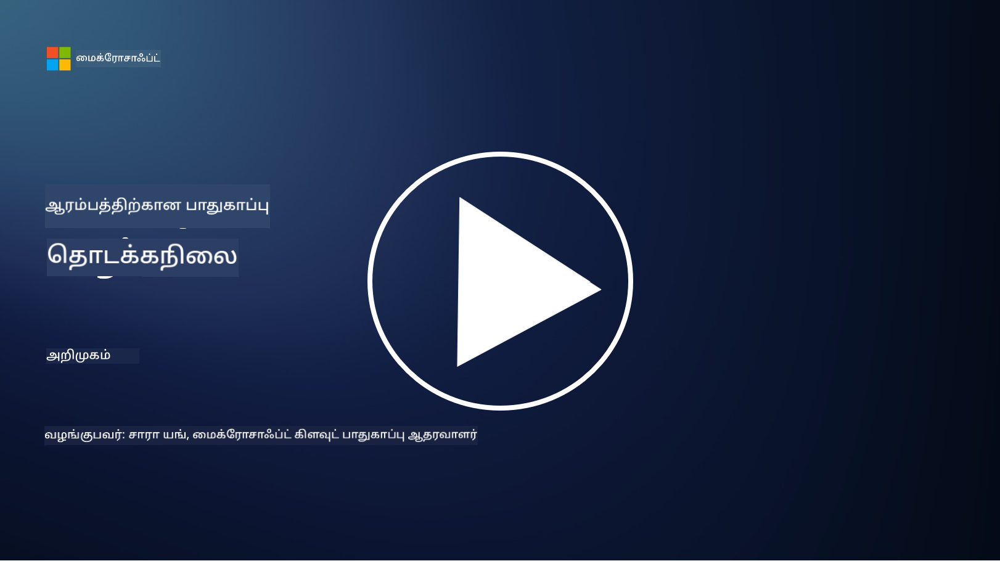

<!--
CO_OP_TRANSLATOR_METADATA:
{
  "original_hash": "5946c53720de84d57b17eafd98095d72",
  "translation_date": "2025-10-12T09:21:32+00:00",
  "source_file": "README.md",
  "language_code": "ta"
}
-->

### 🌐 பல மொழி ஆதரவு

#### GitHub செயல்பாடு மூலம் ஆதரவு (தானியங்கி மற்றும் எப்போதும் புதுப்பிக்கப்பட்டது)

<!-- CO-OP TRANSLATOR LANGUAGES TABLE START -->
[அரபு](../ar/README.md) | [பெங்காலி](../bn/README.md) | [பல்கேரியன்](../bg/README.md) | [பர்மீஸ் (மியான்மர்)](../my/README.md) | [சீனம் (எளிமைப்படுத்தப்பட்டது)](../zh/README.md) | [சீனம் (சம்பிரதாய, ஹாங்காங்)](../hk/README.md) | [சீனம் (சம்பிரதாய, மக்காவு)](../mo/README.md) | [சீனம் (சம்பிரதாய, தைவான்)](../tw/README.md) | [குரோஷியன்](../hr/README.md) | [செக்](../cs/README.md) | [டேனிஷ்](../da/README.md) | [டச்சு](../nl/README.md) | [எஸ்டோனியன்](../et/README.md) | [பின்னிஷ்](../fi/README.md) | [பிரெஞ்சு](../fr/README.md) | [ஜெர்மன்](../de/README.md) | [கிரேக்கம்](../el/README.md) | [ஹீப்ரு](../he/README.md) | [இந்தி](../hi/README.md) | [ஹங்கேரியன்](../hu/README.md) | [இந்தோனேஷியன்](../id/README.md) | [இத்தாலியன்](../it/README.md) | [ஜப்பானியன்](../ja/README.md) | [கொரியன்](../ko/README.md) | [லிதுவேனியன்](../lt/README.md) | [மலாய்](../ms/README.md) | [மராத்தி](../mr/README.md) | [நேபாளி](../ne/README.md) | [நார்வேஜியன்](../no/README.md) | [பெர்ஷியன் (பார்சி)](../fa/README.md) | [போலிஷ்](../pl/README.md) | [போர்ச்சுகீஸ் (பிரேசில்)](../br/README.md) | [போர்ச்சுகீஸ் (போர்ச்சுகல்)](../pt/README.md) | [பஞ்சாபி (குர்முகி)](../pa/README.md) | [ரோமானியன்](../ro/README.md) | [ரஷியன்](../ru/README.md) | [செர்பியன் (சிரிலிக்)](../sr/README.md) | [ஸ்லோவாக்](../sk/README.md) | [ஸ்லோவேனியன்](../sl/README.md) | [ஸ்பானிஷ்](../es/README.md) | [ஸ்வாஹிலி](../sw/README.md) | [ஸ்வீடிஷ்](../sv/README.md) | [டாகாலோக் (பிலிப்பினோ)](../tl/README.md) | [தமிழ்](./README.md) | [தாய்](../th/README.md) | [துருக்கியம்](../tr/README.md) | [உக்ரேனியன்](../uk/README.md) | [உருது](../ur/README.md) | [வியட்நாமீஸ்](../vi/README.md)
<!-- CO-OP TRANSLATOR LANGUAGES TABLE END -->

**கூடுதல் மொழிபெயர்ப்புகளை ஆதரிக்க விரும்பினால், [இங்கே](https://github.com/Azure/co-op-translator/blob/main/getting_started/supported-languages.md) பட்டியலிடப்பட்ட மொழிகள் உள்ளன**

#### எங்கள் சமூகத்தில் சேரவும் 

# 🚀 தொடக்கநிலை சைபர் பாதுகாப்பு – ஒரு பாடத்திட்டம்

AI தொழில்நுட்பத்தை விரைவாக ஏற்கும் இந்த காலத்தில், IT அமைப்புகளை பாதுகாப்பது எப்படி என்பதை புரிந்துகொள்வது மிகவும் முக்கியமாகிறது. இந்த பாடநெறி உங்கள் பாதுகாப்பு கற்றலைத் தொடங்க அடிப்படை சைபர் பாதுகாப்பு கருத்துகளை கற்பதற்காக வடிவமைக்கப்பட்டுள்ளது. இது எந்தவொரு விற்பனையாளருக்கும் சார்ந்தது அல்ல, மேலும் 30-60 நிமிடங்களில் முடிக்கக்கூடிய சிறிய பாடங்களாகப் பிரிக்கப்பட்டுள்ளது. ஒவ்வொரு பாடத்திலும் ஒரு சிறிய வினாடி வினா மற்றும் மேலும் ஆழமாக கற்க விரும்பினால் கூடுதல் வாசிப்புக்கான இணைப்புகள் உள்ளன.

இந்த பாடநெறி என்ன கற்பிக்கிறது 📚

- 🔐 CIA மூவகம் போன்ற அடிப்படை சைபர் பாதுகாப்பு கருத்துகள், அபாயங்கள், மிரட்டல்கள் ஆகியவற்றின் வேறுபாடுகள்.
- 🛡️ பாதுகாப்பு கட்டுப்பாடு என்றால் என்ன, அவை எந்த வடிவங்களில் உள்ளன என்பதைப் புரிந்துகொள்வது.
- 🌐 சீரோ டிரஸ்ட் என்றால் என்ன, இது நவீன சைபர் பாதுகாப்பில் ஏன் முக்கியம் என்பதைப் புரிந்துகொள்வது.
- 🔑 அடையாளம், நெட்வொர்க்கிங், பாதுகாப்பு செயல்பாடுகள், உள்கட்டமைப்பு மற்றும் தரவுப் பாதுகாப்பு ஆகியவற்றில் முக்கிய கருத்துகள் மற்றும் கருப்பொருள்களைப் புரிந்துகொள்வது.
- 🔧 பாதுகாப்பு கட்டுப்பாடுகளை செயல்படுத்த பயன்படுத்தப்படும் கருவிகளின் சில உதாரணங்களை வழங்குவது.

இந்த பாடநெறி என்ன கற்பிக்காது 🙅‍♂️

- 🚫 குறிப்பிட்ட பாதுகாப்பு கருவிகளை எப்படி பயன்படுத்துவது.
- 🚫 "ஹேக்" செய்வது அல்லது ரெட் டீமிங்/தாக்குதல் பாதுகாப்பு செய்வது.
- 🚫 குறிப்பிட்ட ஒழுங்குமுறை தரநிலைகள் பற்றி கற்றல்.

இந்த பாடநெறியை முடித்த பிறகு, Microsoft Learn மாட்யூல்கள் சிலவற்றில் தொடரலாம். [Microsoft Security, Compliance, and Identity Fundamentals](https://learn.microsoft.com/training/paths/describe-concepts-of-security-compliance-identity/?WT.mc_id=academic-96948-sayoung) மூலம் உங்கள் கற்றலைத் தொடர பரிந்துரைக்கிறோம்.

இறுதியில், [Exam SC-900: Microsoft Security, Compliance, and Identity Fundamentals exam](https://learn.microsoft.com/credentials/certifications/exams/sc-900/?WT.mc_id=academic-96948-sayoung) எழுதுவதைக் கருதலாம்.

> 💁 இந்த பாடநெறி மற்றும் எங்கள் உள்ளடக்கத்தில் நீங்கள் காணவில்லை என்று நினைக்கும் ஏதேனும் கருத்துகள் அல்லது பரிந்துரைகள் இருந்தால், எங்களுடன் பகிர விரும்புகிறோம்!

## மாட்யூல்கள் கண்ணோட்டம் 📝 
| **மாட்யூல் எண்** | **மாட்யூல் பெயர்**                           | **கற்றல் கருத்துகள்**                  | **கற்றல் நோக்கங்கள்**                                                                                          |
|-------------------|-------------------------------------------|--------------------------------------|-----------------------------------------------------------------------------------------------------------------|
| **1.1**           | அடிப்படை பாதுகாப்பு கருத்துகள்                   | [CIA மூவகம்](https://github.com/microsoft/Security-101/blob/main/1.1%20The%20CIA%20triad%20and%20other%20key%20concepts.md)                        | ரகசியத்தன்மை, கிடைக்கும் தன்மை மற்றும் முழுமை பற்றி கற்றுக்கொள்ளுங்கள். மேலும் உண்மைத்தன்மை, மறுப்பு மற்றும் தனியுரிமை. |
| **1.2**           | அடிப்படை பாதுகாப்பு கருத்துகள்                   | [சாதாரண சைபர் பாதுகாப்பு மிரட்டல்கள்](https://github.com/microsoft/Security-101/blob/main/1.2%20Common%20cybersecurity%20threats.md)        | தனிநபர்கள் மற்றும் நிறுவனங்களை எதிர்கொள்ளும் சாதாரண சைபர் பாதுகாப்பு மிரட்டல்களைப் பற்றி கற்றுக்கொள்ளுங்கள்.                             |
| **1.3**           | அடிப்படை பாதுகாப்பு கருத்துகள்                   | [அபாய மேலாண்மையைப் புரிந்துகொள்வது](https://github.com/microsoft/Security-101/blob/main/1.3%20Understanding%20risk%20management.md)       | அபாயத்தை மதிப்பீடு செய்து புரிந்துகொள்வது – தாக்கம்/சாத்தியக்கூறு மற்றும் கட்டுப்பாடுகளை செயல்படுத்துவது பற்றி கற்றுக்கொள்ளுங்கள்.                                                                                                               | |
| **1.4**           | அடிப்படை பாதுகாப்பு கருத்துகள்                   | [பாதுகாப்பு நடைமுறைகள் மற்றும் ஆவணங்கள்](https://github.com/microsoft/Security-101/blob/main/1.4%20Security%20practices%20and%20documentation.md) | கொள்கைகள், நடைமுறைகள், தரநிலைகள் மற்றும் ஒழுங்குமுறை/சட்டங்கள் ஆகியவற்றின் வேறுபாடுகளைப் பற்றி கற்றுக்கொள்ளுங்கள்.                         |
| **1.5**           | அடிப்படை பாதுகாப்பு கருத்துகள்                   | [சீரோ டிரஸ்ட்](https://github.com/microsoft/Security-101/blob/main/1.5%20Zero%20trust.md)                           | சீரோ டிரஸ்ட் என்றால் என்ன, இது கட்டமைப்பை எப்படி பாதிக்கிறது? ஆழமான பாதுகாப்பு என்றால் என்ன?                   |
| **1.6**           | அடிப்படை பாதுகாப்பு கருத்துகள்                   | [பகிரப்பட்ட பொறுப்புத் மாடல்](https://github.com/microsoft/Security-101/blob/main/1.6%20Shared%20responsibility%20model.md)                           | பகிரப்பட்ட பொறுப்புத் மாடல் என்றால் என்ன, இது சைபர் பாதுகாப்பை எப்படி பாதிக்கிறது?                  |
| **1.7**           | [மாட்யூல் முடிவின் வினாடி வினா](https://github.com/microsoft/Security-101/blob/main/1.7%20End%20of%20module%20quiz.md)                        |                                      |                                                                                                                 |
| **2.1**           | அடையாளம் மற்றும் அணுகல் மேலாண்மை அடிப்படைகள் | [IAM முக்கிய கருத்துகள்](https://github.com/microsoft/Security-101/blob/main/2.1%20IAM%20key%20concepts.md)                     | குறைந்த உரிமையின் கோட்பாடு, கடமைகளின் பிரிப்பு, IAM சீரோ டிரஸ்டை எப்படி ஆதரிக்கிறது என்பதைப் பற்றி கற்றுக்கொள்ளுங்கள்.               |
| **2.2**           | அடையாளம் மற்றும் அணுகல் மேலாண்மை அடிப்படைகள் | [IAM சீரோ டிரஸ்ட் கட்டமைப்பு](https://github.com/microsoft/Security-101/blob/main/2.2%20IAM%20zero%20trust%20architecture.md)          | நவீன IT சூழல்களுக்கு அடையாளம் புதிய எல்லையாக இருப்பது மற்றும் அது எதிர்க்கும் மிரட்டல்களைப் பற்றி கற்றுக்கொள்ளுங்கள்.          |
| **2.3**           | அடையாளம் மற்றும் அணுகல் மேலாண்மை அடிப்படைகள் | [IAM திறன்கள்](https://github.com/microsoft/Security-101/blob/main/2.3%20IAM%20capabilities.md)                     | அடையாளங்களை பாதுகாக்க IAM திறன்கள் மற்றும் கட்டுப்பாடுகளைப் பற்றி கற்றுக்கொள்ளுங்கள்                                                  |
| **2.4**           | [மாட்யூல் முடிவின் வினாடி வினா](https://github.com/microsoft/Security-101/blob/main/2.4%20End%20of%20module%20quiz.md)                        |                                      |                                                                                                                 |
| **3.1**           | நெட்வொர்க் பாதுகாப்பு அடிப்படைகள்             | [நெட்வொர்க்கிங் முக்கிய கருத்துகள்](https://github.com/microsoft/Security-101/blob/main/3.1%20Networking%20key%20concepts.md)              | நெட்வொர்க்கிங் கருத்துகள் (IP முகவரிகள், போர்ட் எண்கள், குறியாக்கம், போன்றவை) பற்றி கற்றுக்கொள்ளுங்கள்.                                 |
| **3.2**           | நெட்வொர்க் பாதுகாப்பு அடிப்படைகள்             | [நெட்வொர்க்கிங் சீரோ டிரஸ்ட் கட்டமைப்பு](https://github.com/microsoft/Security-101/blob/main/3.2%20Networking%20zero%20trust%20architecture.md)   | நெட்வொர்க்கிங் E2E ZT கட்டமைப்பிற்கு எப்படி பங்களிக்கிறது மற்றும் அது எதிர்க்கும் மிரட்டல்களைப் பற்றி கற்றுக்கொள்ளுங்கள்.                  |
| **3.3**           | நெட்வொர்க் பாதுகாப்பு அடிப்படைகள்             | [நெட்வொர்க் பாதுகாப்பு திறன்கள்](https://github.com/microsoft/Security-101/blob/main/3.3%20Network%20security%20capabilities.md)        | நெட்வொர்க் பாதுகாப்பு கருவிகள் – ஃபயர்வால்கள், WAF, DDoS பாதுகாப்பு, போன்றவை பற்றி கற்றுக்கொள்ளுங்கள்.                                    |
| **3.4**           | [மாட்யூல் முடிவின் வினாடி வினா](https://github.com/microsoft/Security-101/blob/main/3.4%20End%20of%20module%20quiz.md)                        |                                      |                                                                                                                 |
| **4.1**           | பாதுகாப்பு செயல்பாடுகள் அடிப்படைகள்          | [SecOps முக்கிய கருத்துகள்](https://github.com/microsoft/Security-101/blob/main/4.1%20SecOps%20key%20concepts.md)                  | பாதுகாப்பு செயல்பாடுகள் ஏன் முக்கியம் மற்றும் அது சாதாரண IT செயல்பாட்டு குழுக்களிலிருந்து எப்படி வேறுபடுகிறது என்பதைப் பற்றி கற்றுக்கொள்ளுங்கள்.                  |
| **4.2**           | பாதுகாப்பு செயல்பாடுகள் அடிப்படைகள்          | [SecOps சீரோ டிரஸ்ட் கட்டமைப்பு](https://github.com/microsoft/Security-101/blob/main/4.2%20SecOps%20zero%20trust%20architecture.md)       | SecOps E2E ZT கட்டமைப்பிற்கு எப்படி பங்களிக்கிறது மற்றும் அது எதிர்க்கும் மிரட்டல்களைப் பற்றி கற்றுக்கொள்ளுங்கள்.                      |
| **4.3**           | பாதுகாப்பு செயல்பாடுகள் அடிப்படைகள்          | [SecOps திறன்கள்](https://github.com/microsoft/Security-101/blob/main/4.3%20SecOps%20capabilities.md)                  | SecOps கருவிகள் – SIEM, XDR, போன்றவை பற்றி கற்றுக்கொள்ளுங்கள்.                                                                    |
| **4.4**           | [மாட்யூல் முடிவின் வினாடி வினா](https://github.com/microsoft/Security-101/blob/main/4.4%20End%20of%20module%20quiz.md)                        |                                      |                                                                                                                 |
| **5.1**           | பயன்பாட்டு பாதுகாப்பு அடிப்படைகள்         | [AppSec முக்கிய கருத்துகள்](https://github.com/microsoft/Security-101/blob/main/5.1%20AppSec%20key%20concepts.md)                  | AppSec கருத்துகள், பாதுகாப்பாக வடிவமைக்கப்பட்டவை, உள்ளீட்டு சரிபார்ப்பு போன்றவை பற்றி கற்றுக்கொள்ளுங்கள்.                                    |
| **5.2**           | பயன்பாட்டு பாதுகாப்பு அடிப்படைகள்         | [AppSec திறன்கள்](https://github.com/microsoft/Security-101/blob/main/5.2%20AppSec%20key%20capabilities.md)                  | AppSec கருவிகள் பற்றி அறிக: பைப்லைன் பாதுகாப்பு கருவிகள், குறியீடு ஸ்கேனிங், ரகசிய ஸ்கேனிங், மற்றும் பல.                       |
| **5.3**           | [முடிவு தொகுதி வினாடி வினா](https://github.com/microsoft/Security-101/blob/main/5.3%20End%20of%20module%20quiz.md)                        |                                      |                                                                                                                 |
| **6.1**           | உள்கட்டமைப்பு பாதுகாப்பு அடிப்படைகள்      | [உள்கட்டமைப்பு பாதுகாப்பு முக்கிய கருத்துக்கள்](https://github.com/microsoft/Security-101/blob/main/6.1%20Infrastructure%20security%20key%20concepts.md) | அமைப்புகளை உறுதிப்படுத்துதல், பாச்சிங், பாதுகாப்பு பழக்கவழக்கம், கண்டெய்னர் பாதுகாப்பு பற்றி அறிக.                                  |
| **6.2**           | உள்கட்டமைப்பு பாதுகாப்பு அடிப்படைகள்      | [உள்கட்டமைப்பு பாதுகாப்பு திறன்கள்](https://github.com/microsoft/Security-101/blob/main/6.2%20Infrastructure%20security%20capabilities.md) | உள்கட்டமைப்பு பாதுகாப்புக்கு உதவக்கூடிய கருவிகள் பற்றி அறிக, உதாரணமாக CSPM, கண்டெய்னர் பாதுகாப்பு, மற்றும் பல.            |
| **6.3**           | [முடிவு தொகுதி வினாடி வினா](https://github.com/microsoft/Security-101/blob/main/6.3%20End%20of%20module%20quiz.md)                        |                                      |                                                                                                                 |
| **7.1**           | தரவுப் பாதுகாப்பு அடிப்படைகள்                | [தரவுப் பாதுகாப்பு முக்கிய கருத்துக்கள்](https://github.com/microsoft/Security-101/blob/main/7.1%20Data%20security%20key%20concepts.md)           | தரவின் வகைப்படுத்தல் மற்றும் காப்பாற்றல் பற்றி அறிக, மற்றும் இது ஒரு நிறுவனத்திற்கு ஏன் முக்கியம் என்பதை புரிந்துகொள்ளுங்கள்.                     |
| **7.2**           | தரவுப் பாதுகாப்பு அடிப்படைகள்                | [தரவுப் பாதுகாப்பு திறன்கள்](https://github.com/microsoft/Security-101/blob/main/7.2%20Data%20security%20capabilities.md)           | தரவுப் பாதுகாப்பு கருவிகள் பற்றி அறிக – DLP, உள்ளக அபாய மேலாண்மை, தரவுக் காப்பு, மற்றும் பல.                          |
| **7.3**           | [முடிவு தொகுதி வினாடி வினா](https://github.com/microsoft/Security-101/blob/main/7.3%20End%20of%20module%20quiz.md)                        |
| **8.1**           | AI பாதுகாப்பு அடிப்படைகள்                | [AI பாதுகாப்பு முக்கிய கருத்துக்கள்](https://github.com/microsoft/Security-101/blob/main/8.1%20AI%20security%20key%20concepts.md)          | பாரம்பரிய பாதுகாப்பு மற்றும் AI பாதுகாப்பு இடையேயான வேறுபாடுகள் மற்றும் ஒற்றுமைகள் பற்றி அறிக.                 |
| **8.2**           | AI பாதுகாப்பு அடிப்படைகள்                | [AI பாதுகாப்பு திறன்கள்](https://github.com/microsoft/Security-101/blob/main/8.2%20AI%20security%20capabilities.md)           | AI பாதுகாப்பு கருவிகள் மற்றும் AI-ஐ பாதுகாப்பாக வைத்திருக்க உதவக்கூடிய கட்டுப்பாடுகள் பற்றி அறிக.                         |
| **8.3**           | AI பாதுகாப்பு அடிப்படைகள்                | [பொறுப்பான AI](https://github.com/microsoft/Security-101/blob/main/8.3%20Responsible%20AI.md)          | பொறுப்பான AI என்றால் என்ன மற்றும் பாதுகாப்பு நிபுணர்கள் கவனிக்க வேண்டிய AI-க்கு தனித்துவமான பாதிப்புகள் பற்றி அறிக.                          |
| **8.4**           | [முடிவு தொகுதி வினாடி வினா](https://github.com/microsoft/Security-101/blob/main/8.4%20End%20of%20module%20quiz.md)     

## 🎒 பிற பாடங்கள் 

எங்கள் குழு பிற பாடங்களையும் உருவாக்குகிறது! பாருங்கள்:

- [தொடக்க நிலை Generative AI](https://aka.ms/genai-beginners)
- [தொடக்க நிலை Generative AI .NET](https://github.com/microsoft/Generative-AI-for-beginners-dotnet)
- [JavaScript மூலம் Generative AI](https://github.com/microsoft/generative-ai-with-javascript)
- [Java மூலம் Generative AI](https://github.com/microsoft/Generative-AI-for-beginners-java)
- [AI தொடக்க நிலை](https://aka.ms/ai-beginners)
- [தரவியல் தொடக்க நிலை](https://aka.ms/datascience-beginners)
- [ML தொடக்க நிலை](https://aka.ms/ml-beginners)
- [தொடக்க நிலை சைபர் பாதுகாப்பு](https://github.com/microsoft/Security-101) 
- [தொடக்க நிலை வலை மேம்பாடு](https://aka.ms/webdev-beginners)
- [தொடக்க நிலை IoT](https://aka.ms/iot-beginners)
- [தொடக்க நிலை XR மேம்பாடு](https://github.com/microsoft/xr-development-for-beginners)
- [GitHub Copilot-ஐ இணை நிரலாக்கத்திற்காக கையாளுதல்](https://github.com/microsoft/Mastering-GitHub-Copilot-for-Paired-Programming)
- [C#/.NET டெவலப்பர்களுக்கான GitHub Copilot கையாளுதல்](https://github.com/microsoft/mastering-github-copilot-for-dotnet-csharp-developers)
- [உங்கள் சொந்த Copilot சாகசத்தை தேர்ந்தெடுக்கவும்](https://github.com/microsoft/CopilotAdventures)

## உதவி பெறுதல்

AI பயன்பாடுகளை உருவாக்குவதில் சிக்கல் அல்லது கேள்விகள் இருந்தால், இணைந்திடுங்கள்:

தயாரிப்பு கருத்துகள் அல்லது கட்டமைப்பில் பிழைகள் இருந்தால், பாருங்கள்:

---

**குறிப்பு**:  
இந்த ஆவணம் [Co-op Translator](https://github.com/Azure/co-op-translator) என்ற AI மொழிபெயர்ப்பு சேவையைப் பயன்படுத்தி மொழிபெயர்க்கப்பட்டுள்ளது. நாங்கள் துல்லியத்திற்காக முயற்சிக்கின்றோம், ஆனால் தானியங்கி மொழிபெயர்ப்புகளில் பிழைகள் அல்லது தவறான தகவல்கள் இருக்கக்கூடும் என்பதை கவனத்தில் கொள்ளவும். அதன் தாய்மொழியில் உள்ள மூல ஆவணம் அதிகாரப்பூர்வ ஆதாரமாக கருதப்பட வேண்டும். முக்கியமான தகவல்களுக்கு, தொழில்முறை மனித மொழிபெயர்ப்பு பரிந்துரைக்கப்படுகிறது. இந்த மொழிபெயர்ப்பைப் பயன்படுத்துவதால் ஏற்படும் எந்த தவறான புரிதல்கள் அல்லது தவறான விளக்கங்களுக்கு நாங்கள் பொறுப்பல்ல.