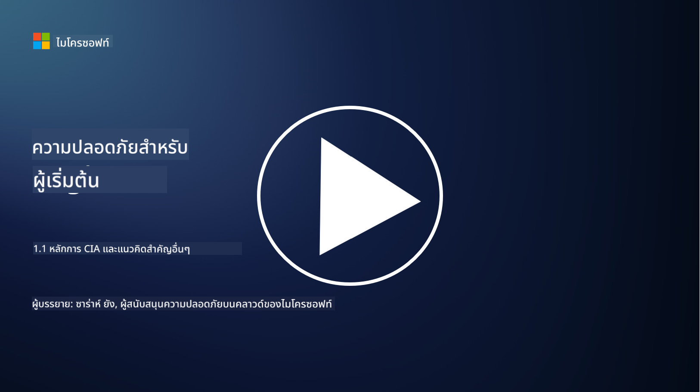
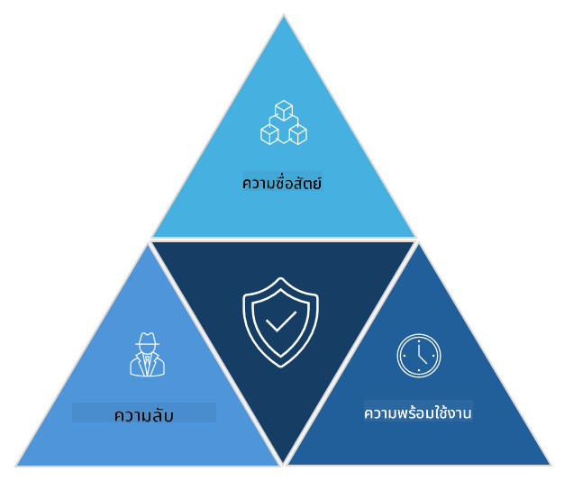

<!--
CO_OP_TRANSLATOR_METADATA:
{
  "original_hash": "16a76f9fa372fb63cffb6d76b855f023",
  "translation_date": "2025-09-04T01:09:56+00:00",
  "source_file": "1.1 The CIA triad and other key concepts.md",
  "language_code": "th"
}
-->
# หลักการ CIA และแนวคิดสำคัญอื่น ๆ

## บทนำ

ในบทเรียนนี้ เราจะพูดถึง:

 - ความหมายของความปลอดภัยทางไซเบอร์
   
 
 - หลักการ CIA ในความปลอดภัยทางไซเบอร์

   

 - ความหมายของความแท้จริง, การปฏิเสธไม่ได้ และความเป็นส่วนตัวในบริบทของความปลอดภัยทางไซเบอร์

## ความปลอดภัยทางไซเบอร์คืออะไร?

ความปลอดภัยทางไซเบอร์ หรือที่เรียกว่าความปลอดภัยของข้อมูล คือการปฏิบัติในการปกป้องระบบคอมพิวเตอร์ เครือข่าย อุปกรณ์ และข้อมูลจากการโจมตีทางดิจิทัล การเข้าถึงโดยไม่ได้รับอนุญาต ความเสียหาย หรือการขโมย เป้าหมายหลักของความปลอดภัยทางไซเบอร์คือการรักษาความลับ ความถูกต้อง และความพร้อมใช้งานของทรัพย์สินและข้อมูลดิจิทัล ผู้เชี่ยวชาญด้านความปลอดภัยทางไซเบอร์ออกแบบและดำเนินการควบคุมความปลอดภัยเพื่อปกป้องทรัพย์สิน ข้อมูล และข้อมูลต่าง ๆ เมื่อชีวิตของเรามีการเปลี่ยนแปลงไปสู่โลกดิจิทัลและออนไลน์มากขึ้น ความปลอดภัยทางไซเบอร์จึงกลายเป็นเรื่องสำคัญอันดับต้น ๆ สำหรับทั้งบุคคลทั่วไปและองค์กร

## หลักการ CIA ในความปลอดภัยทางไซเบอร์คืออะไร?

หลักการ CIA ในความปลอดภัยทางไซเบอร์หมายถึงโมเดลที่รวมเอาสามข้อพิจารณาหลักสำหรับการทำงานด้านความปลอดภัยทางไซเบอร์หรือการออกแบบระบบ/สภาพแวดล้อม:

### ความลับ (Confidentiality)

นี่คือข้อพิจารณาที่คนส่วนใหญ่คุ้นเคยเมื่อพูดถึง "ความปลอดภัยทางไซเบอร์": ความลับคือกระบวนการปกป้องข้อมูลและข้อมูลจากความพยายามในการเข้าถึงโดยไม่ได้รับอนุญาต กล่าวคือ เฉพาะผู้ที่จำเป็นต้องเห็นข้อมูลเท่านั้นที่สามารถเข้าถึงได้ อย่างไรก็ตาม ไม่ใช่ข้อมูลทุกประเภทที่มีความสำคัญเท่ากัน และข้อมูลมักถูกจัดหมวดหมู่และปกป้องตามระดับความเสียหายที่จะเกิดขึ้นหากข้อมูลนั้นถูกเข้าถึงโดยบุคคลที่ไม่เหมาะสม

### ความถูกต้อง (Integrity)

หมายถึงการปกป้องความถูกต้องและความน่าเชื่อถือของข้อมูลที่อยู่ในสภาพแวดล้อม และไม่อนุญาตให้ข้อมูลนั้นถูกแก้ไขหรือเปลี่ยนแปลงโดยบุคคลที่ไม่ได้รับอนุญาต เช่น นักเรียนแก้ไขวันเกิดของตนในบันทึกใบขับขี่ที่ DMV เพื่อให้ดูแก่ขึ้นและสามารถพิมพ์ใบขับขี่ใหม่ที่มีวันเกิดก่อนหน้าเพื่อซื้อเครื่องดื่มแอลกอฮอล์

### ความพร้อมใช้งาน (Availability)

นี่คือข้อพิจารณาที่เกี่ยวข้องกับการดำเนินงานด้านไอที แต่ความพร้อมใช้งานก็สำคัญสำหรับความปลอดภัยทางไซเบอร์เช่นกัน มีการโจมตีบางประเภทที่มุ่งเป้าไปที่ความพร้อมใช้งาน ซึ่งผู้เชี่ยวชาญด้านความปลอดภัยต้องป้องกัน เช่น การโจมตีแบบปฏิเสธการให้บริการแบบกระจาย (DDoS)

**หลักการ CIA ในความปลอดภัยทางไซเบอร์**

## ความแท้จริง, การปฏิเสธไม่ได้ และความเป็นส่วนตัวในบริบทของความปลอดภัยทางไซเบอร์คืออะไร?

นี่คือแนวคิดสำคัญเพิ่มเติมที่เกี่ยวข้องกับการรับรองความปลอดภัยและความน่าเชื่อถือของระบบและข้อมูล:

**ความแท้จริง (Authenticity)** - หมายถึงการรับรองว่าข้อมูล การสื่อสาร หรือหน่วยงานที่คุณโต้ตอบด้วยนั้นเป็นของแท้ และไม่ได้ถูกแก้ไขหรือเปลี่ยนแปลงโดยบุคคลที่ไม่ได้รับอนุญาต

**การปฏิเสธไม่ได้ (Nonrepudiation)** - คือแนวคิดที่รับรองว่าฝ่ายหนึ่งไม่สามารถปฏิเสธการมีส่วนร่วมหรือความแท้จริงของธุรกรรมหรือการสื่อสารได้ มันป้องกันไม่ให้ใครบางคนอ้างว่าพวกเขาไม่ได้ส่งข้อความหรือดำเนินการบางอย่างเมื่อมีหลักฐานที่ตรงกันข้าม

**ความเป็นส่วนตัว (Privacy)** - หมายถึงการปกป้องข้อมูลที่ละเอียดอ่อนและข้อมูลที่สามารถระบุตัวบุคคลได้จากการเข้าถึง การใช้งาน การเปิดเผย หรือการจัดการโดยไม่ได้รับอนุญาต ซึ่งเกี่ยวข้องกับการควบคุมว่าใครสามารถเข้าถึงข้อมูลส่วนบุคคล และวิธีการรวบรวม จัดเก็บ และแบ่งปันข้อมูลนั้น

## อ่านเพิ่มเติม

[What Is Information Security (InfoSec)? | Microsoft Security](https://www.microsoft.com/security/business/security-101/what-is-information-security-infosec#:~:text=Three%20pillars%20of%20information%20security%3A%20the%20CIA%20triad,as%20guiding%20principles%20for%20implementing%20an%20InfoSec%20plan.)

---

**ข้อจำกัดความรับผิดชอบ**:  
เอกสารนี้ได้รับการแปลโดยใช้บริการแปลภาษา AI [Co-op Translator](https://github.com/Azure/co-op-translator) แม้ว่าเราจะพยายามให้การแปลมีความถูกต้อง แต่โปรดทราบว่าการแปลอัตโนมัติอาจมีข้อผิดพลาดหรือความไม่แม่นยำ เอกสารต้นฉบับในภาษาต้นทางควรถือเป็นแหล่งข้อมูลที่เชื่อถือได้ สำหรับข้อมูลที่สำคัญ ขอแนะนำให้ใช้บริการแปลภาษามนุษย์ที่เป็นมืออาชีพ เราจะไม่รับผิดชอบต่อความเข้าใจผิดหรือการตีความที่ผิดพลาดซึ่งเกิดจากการใช้การแปลนี้