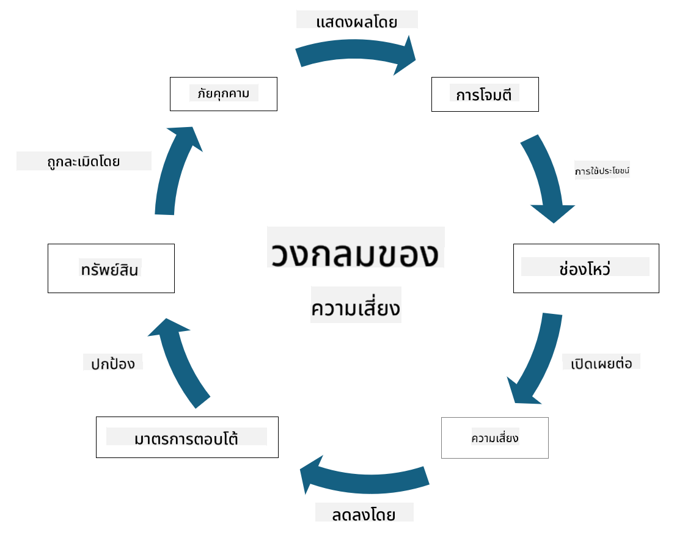

<!--
CO_OP_TRANSLATOR_METADATA:
{
  "original_hash": "fcca304f072cabf206388199e8e2e578",
  "translation_date": "2025-09-04T01:29:49+00:00",
  "source_file": "1.3 Understanding risk management.md",
  "language_code": "th"
}
-->
# การทำความเข้าใจการจัดการความเสี่ยง

## บทนำ

ในบทเรียนนี้ เราจะพูดถึง:

- คำจำกัดความของคำศัพท์ด้านความปลอดภัยที่ใช้บ่อย

- ประเภทของการควบคุมด้านความปลอดภัย

- การประเมินความเสี่ยงด้านความปลอดภัย

## คำจำกัดความของคำศัพท์ด้านความปลอดภัยที่ใช้บ่อย

คำศัพท์เหล่านี้เป็นแนวคิดพื้นฐานในด้านความปลอดภัยทางไซเบอร์และการจัดการความเสี่ยง มาทำความเข้าใจแต่ละคำและความสัมพันธ์ระหว่างกัน:

1. **ตัวแทนภัยคุกคาม**:

ตัวแทนภัยคุกคามคือบุคคล กลุ่ม องค์กร หรือระบบอัตโนมัติที่มีศักยภาพในการใช้ประโยชน์จากช่องโหว่ในระบบหรือเครือข่ายเพื่อก่อให้เกิดความเสียหาย ตัวแทนภัยคุกคามอาจเป็นแฮกเกอร์ ผู้สร้างมัลแวร์ พนักงานที่ไม่พอใจ หรือหน่วยงานใดๆ ที่ก่อให้เกิดความเสี่ยงต่อระบบข้อมูลและเทคโนโลยี

2. **ภัยคุกคาม**:

ภัยคุกคามคือเหตุการณ์หรือการกระทำที่อาจใช้ประโยชน์จากช่องโหว่ในระบบและก่อให้เกิดความเสียหายต่อทรัพย์สิน ภัยคุกคามอาจรวมถึงการแฮก การละเมิดข้อมูล การโจมตีแบบปฏิเสธการให้บริการ และอื่นๆ ภัยคุกคามคือ "สิ่งที่" อาจก่อให้เกิดความเสียหายต่อทรัพย์สินขององค์กร

3. **ช่องโหว่**:

ช่องโหว่คือจุดอ่อนหรือข้อบกพร่องในการออกแบบ การดำเนินการ หรือการตั้งค่าระบบที่สามารถถูกใช้ประโยชน์โดยตัวแทนภัยคุกคามเพื่อทำลายความปลอดภัยของระบบ ช่องโหว่อาจเกิดขึ้นในซอฟต์แวร์ ฮาร์ดแวร์ กระบวนการ หรือพฤติกรรมของมนุษย์ การระบุและแก้ไขช่องโหว่เป็นสิ่งสำคัญในการลดความเสี่ยงของการโจมตีที่สำเร็จ

4. **ความเสี่ยง**:

ความเสี่ยงคือความเป็นไปได้ที่จะเกิดการสูญเสีย ความเสียหาย หรือผลกระทบที่เกิดจากการปฏิสัมพันธ์ระหว่างภัยคุกคามและช่องโหว่ เป็นโอกาสที่ตัวแทนภัยคุกคามจะใช้ประโยชน์จากช่องโหว่เพื่อก่อให้เกิดผลกระทบเชิงลบ ความเสี่ยงมักถูกประเมินในแง่ของผลกระทบที่อาจเกิดขึ้นและความเป็นไปได้ที่จะเกิดขึ้น

5. **ทรัพย์สิน**:

ทรัพย์สินคือสิ่งที่มีคุณค่าที่องค์กรต้องการปกป้อง ทรัพย์สินอาจรวมถึงวัตถุทางกายภาพ (เช่น คอมพิวเตอร์และเซิร์ฟเวอร์) ข้อมูล (ข้อมูลลูกค้า บันทึกทางการเงิน) ทรัพย์สินทางปัญญา (ความลับทางการค้า สิทธิบัตร) และทรัพยากรมนุษย์ (ทักษะและความรู้ของพนักงาน) การปกป้องทรัพย์สินเป็นเป้าหมายสำคัญของความปลอดภัยทางไซเบอร์

6. **การเปิดเผย**:

การเปิดเผยหมายถึงสถานะที่มีความเสี่ยงต่อภัยคุกคามที่อาจเกิดขึ้น เกิดขึ้นเมื่อมีช่องโหว่ที่สามารถถูกใช้ประโยชน์โดยตัวแทนภัยคุกคาม การเปิดเผยเน้นถึงความเสี่ยงที่เกี่ยวข้องกับการมีช่องโหว่ในระบบหรือเครือข่าย

7. **การควบคุม**:

การควบคุมคือมาตรการที่นำมาใช้เพื่อลดความเสี่ยงที่เกี่ยวข้องกับช่องโหว่และภัยคุกคาม การควบคุมอาจเป็นเชิงเทคนิค เชิงกระบวนการ หรือเชิงบริหาร ถูกออกแบบมาเพื่อป้องกัน ตรวจจับ หรือบรรเทาผลกระทบจากภัยคุกคามและช่องโหว่ ตัวอย่างเช่น ไฟร์วอลล์ การควบคุมการเข้าถึง การเข้ารหัส นโยบายความปลอดภัย และการฝึกอบรมพนักงาน

สรุปความสัมพันธ์ระหว่างคำศัพท์เหล่านี้: ตัวแทนภัยคุกคามใช้ประโยชน์จากช่องโหว่เพื่อดำเนินการภัยคุกคาม ซึ่งอาจนำไปสู่ความเสี่ยงที่มีศักยภาพในการก่อให้เกิดความเสียหายต่อทรัพย์สินที่มีค่า การเปิดเผยเกิดขึ้นเมื่อมีช่องโหว่ และการควบคุมถูกนำมาใช้เพื่อลดความเสี่ยงโดยการป้องกันหรือบรรเทาผลกระทบจากภัยคุกคามต่อทรัพย์สิน กรอบนี้เป็นพื้นฐานของการจัดการความเสี่ยงทางไซเบอร์ ช่วยให้องค์กรสามารถระบุ ประเมิน และจัดการความเสี่ยงที่อาจเกิดขึ้นต่อระบบข้อมูลและทรัพย์สินของตน

## ประเภทของการควบคุมด้านความปลอดภัย

การควบคุมด้านความปลอดภัยคือมาตรการหรือการป้องกันที่นำมาใช้เพื่อปกป้องระบบข้อมูลและทรัพย์สินจากภัยคุกคามและช่องโหว่ต่างๆ สามารถแบ่งออกเป็นหลายประเภทตามจุดมุ่งหมายและวัตถุประสงค์ ต่อไปนี้คือประเภทของการควบคุมด้านความปลอดภัยที่พบได้บ่อย:

1. **การควบคุมเชิงบริหาร**:

การควบคุมเหล่านี้เกี่ยวข้องกับนโยบาย ขั้นตอน และแนวทางที่กำหนดการปฏิบัติด้านความปลอดภัยและพฤติกรรมของผู้ใช้ในองค์กร

- นโยบายและขั้นตอนด้านความปลอดภัย: แนวทางที่กำหนดไว้อย่างชัดเจนเกี่ยวกับวิธีการรักษาความปลอดภัยในองค์กร

- การสร้างความตระหนักและการฝึกอบรมด้านความปลอดภัย: โปรแกรมที่ให้ความรู้แก่พนักงานเกี่ยวกับแนวทางปฏิบัติที่ดีที่สุดและภัยคุกคามที่อาจเกิดขึ้น

- การตอบสนองและการจัดการเหตุการณ์: แผนสำหรับการตอบสนองและบรรเทาผลกระทบจากเหตุการณ์ด้านความปลอดภัย

2. **การควบคุมเชิงเทคนิค**:

การควบคุมเชิงเทคนิคเกี่ยวข้องกับการใช้เทคโนโลยีเพื่อบังคับใช้มาตรการด้านความปลอดภัยและปกป้องระบบและข้อมูล ตัวอย่างของการควบคุมเชิงเทคนิค ได้แก่:

- การควบคุมการเข้าถึง: มาตรการที่จำกัดการเข้าถึงทรัพยากรตามบทบาทและสิทธิ์ของผู้ใช้

- การเข้ารหัส: การแปลงข้อมูลให้อยู่ในรูปแบบที่ปลอดภัยเพื่อป้องกันการเข้าถึงโดยไม่ได้รับอนุญาต

- ไฟร์วอลล์: อุปกรณ์รักษาความปลอดภัยเครือข่ายที่กรองและควบคุมการรับส่งข้อมูลเข้าและออก

- ระบบตรวจจับและป้องกันการบุกรุก (IDPS): เครื่องมือที่ตรวจสอบการรับส่งข้อมูลเครือข่ายเพื่อหากิจกรรมที่น่าสงสัย

- ซอฟต์แวร์ป้องกันไวรัสและมัลแวร์: โปรแกรมที่ตรวจจับและลบซอฟต์แวร์ที่เป็นอันตราย

- กลไกการตรวจสอบสิทธิ์: วิธีการตรวจสอบตัวตนของผู้ใช้ เช่น รหัสผ่าน ไบโอเมตริกซ์ และการตรวจสอบสิทธิ์หลายปัจจัย

- การจัดการแพตช์: การอัปเดตซอฟต์แวร์อย่างสม่ำเสมอเพื่อแก้ไขช่องโหว่ที่ทราบ

3. **การควบคุมเชิงกายภาพ**:

การควบคุมเชิงกายภาพคือมาตรการที่ใช้เพื่อปกป้องทรัพย์สินและสถานที่ทางกายภาพ

- เจ้าหน้าที่รักษาความปลอดภัยและบุคลากรควบคุมการเข้าถึง: บุคลากรที่ตรวจสอบและควบคุมการเข้าถึงสถานที่ทางกายภาพ

- กล้องวงจรปิด: ระบบวิดีโอที่ใช้ตรวจสอบและบันทึกกิจกรรม

- กุญแจและสิ่งกีดขวางทางกายภาพ: มาตรการทางกายภาพที่จำกัดการเข้าถึงพื้นที่ที่มีความสำคัญ

- การควบคุมสิ่งแวดล้อม: มาตรการที่ควบคุมอุณหภูมิ ความชื้น และปัจจัยสิ่งแวดล้อมอื่นๆ ที่ส่งผลต่ออุปกรณ์และศูนย์ข้อมูล

4. **การควบคุมเชิงปฏิบัติการ**:

การควบคุมเหล่านี้เกี่ยวข้องกับการดำเนินงานและกิจกรรมในแต่ละวันเพื่อให้มั่นใจว่าระบบมีความปลอดภัยอย่างต่อเนื่อง

- การจัดการการเปลี่ยนแปลง: กระบวนการติดตามและอนุมัติการเปลี่ยนแปลงในระบบและการตั้งค่า

- การสำรองข้อมูลและการกู้คืนจากภัยพิบัติ: แผนสำหรับการสำรองข้อมูลและการกู้คืนในกรณีที่ระบบล้มเหลวหรือเกิดภัยพิบัติ

- การบันทึกและการตรวจสอบ: การตรวจสอบและบันทึกกิจกรรมของระบบเพื่อวัตถุประสงค์ด้านความปลอดภัยและการปฏิบัติตามข้อกำหนด

- แนวทางปฏิบัติในการเขียนโค้ดอย่างปลอดภัย: แนวทางสำหรับการเขียนซอฟต์แวร์เพื่อลดช่องโหว่

5. **การควบคุมด้านกฎหมายและข้อบังคับ**:

การควบคุมเหล่านี้ช่วยให้มั่นใจว่าองค์กรปฏิบัติตามกฎหมาย ข้อบังคับ และมาตรฐานอุตสาหกรรมที่เกี่ยวข้อง มาตรฐานที่องค์กรต้องปฏิบัติตามขึ้นอยู่กับเขตอำนาจอุตสาหกรรมและปัจจัยอื่นๆ

- กฎระเบียบการปกป้องข้อมูล: การปฏิบัติตามกฎหมาย เช่น GDPR, HIPAA และ CCPA

- มาตรฐานเฉพาะอุตสาหกรรม: การปฏิบัติตามมาตรฐาน เช่น PCI DSS สำหรับความปลอดภัยของข้อมูลบัตรชำระเงิน

ประเภทของการควบคุมด้านความปลอดภัยเหล่านี้ทำงานร่วมกันเพื่อสร้างท่าทีด้านความปลอดภัยที่ครอบคลุมสำหรับองค์กร ช่วยปกป้องระบบ ข้อมูล และทรัพย์สินจากภัยคุกคามหลากหลายรูปแบบ

## การประเมินความเสี่ยงด้านความปลอดภัย

ผู้เชี่ยวชาญด้านความปลอดภัยบางคนอาจมองว่าการจัดการความเสี่ยงเป็นหน้าที่ของผู้เชี่ยวชาญด้านความเสี่ยง แต่การเข้าใจกระบวนการจัดการความเสี่ยงด้านความปลอดภัยเป็นสิ่งสำคัญสำหรับผู้เชี่ยวชาญด้านความปลอดภัยทุกคน เพื่อช่วยสื่อสารความเสี่ยงด้านความปลอดภัยในภาษาที่องค์กรสามารถเข้าใจและดำเนินการได้

องค์กรต้องประเมินความเสี่ยงด้านความปลอดภัยอย่างต่อเนื่องและตัดสินใจว่าจะดำเนินการ (หรือไม่ดำเนินการ) อย่างไรกับความเสี่ยงที่มีต่อธุรกิจ ด้านล่างนี้คือภาพรวมของวิธีการที่มักดำเนินการ โปรดทราบว่ากระบวนการนี้มักดำเนินการโดยหลายทีมในองค์กร และไม่ค่อยมีทีมเดียวที่รับผิดชอบการจัดการความเสี่ยงตั้งแต่ต้นจนจบ

1. **ระบุทรัพย์สินและภัยคุกคาม**:

องค์กรระบุทรัพย์สินที่ต้องการปกป้อง ซึ่งอาจรวมถึงข้อมูล ระบบ ฮาร์ดแวร์ ซอฟต์แวร์ ทรัพย์สินทางปัญญา และอื่นๆ จากนั้นระบุภัยคุกคามที่อาจเกิดขึ้นกับทรัพย์สินเหล่านี้

2. **ประเมินช่องโหว่**:

องค์กรจะระบุช่องโหว่หรือจุดอ่อนในระบบหรือกระบวนการที่อาจถูกใช้ประโยชน์โดยภัยคุกคาม ช่องโหว่เหล่านี้อาจเกิดจากข้อบกพร่องของซอฟต์แวร์ การตั้งค่าที่ผิดพลาด การขาดการควบคุมด้านความปลอดภัย และข้อผิดพลาดของมนุษย์

3. **การประเมินความเป็นไปได้**:

องค์กรจะประเมินความเป็นไปได้ของแต่ละภัยคุกคามที่จะเกิดขึ้น โดยพิจารณาจากข้อมูลในอดีต ข่าวกรองภัยคุกคาม แนวโน้มในอุตสาหกรรม และปัจจัยภายใน ความเป็นไปได้สามารถจัดหมวดหมู่เป็นต่ำ ปานกลาง หรือสูงตามโอกาสที่ภัยคุกคามจะเกิดขึ้น

4. **การประเมินผลกระทบ**:

ต่อมาองค์กรจะกำหนดผลกระทบที่อาจเกิดขึ้นจากแต่ละภัยคุกคามหากใช้ประโยชน์จากช่องโหว่ ผลกระทบอาจรวมถึงการสูญเสียทางการเงิน การหยุดชะงักของการดำเนินงาน ความเสียหายต่อชื่อเสียง ผลทางกฎหมาย และอื่นๆ ผลกระทบสามารถจัดหมวดหมู่เป็นต่ำ ปานกลาง หรือสูงตามผลที่อาจเกิดขึ้น

5. **การคำนวณความเสี่ยง**:

การประเมินความเป็นไปได้และผลกระทบจะถูกรวมกันเพื่อคำนวณระดับความเสี่ยงโดยรวมสำหรับแต่ละภัยคุกคามที่ระบุ โดยมักใช้เมทริกซ์ความเสี่ยงที่กำหนดค่าตัวเลขหรือคำอธิบายเชิงคุณภาพให้กับระดับความเป็นไปได้และผลกระทบ ระดับความเสี่ยงที่ได้ช่วยจัดลำดับความสำคัญของความเสี่ยงที่ต้องการการดูแลทันที

6. **การจัดลำดับความสำคัญและการตัดสินใจ**:

องค์กรจะจัดลำดับความสำคัญของความเสี่ยงโดยมุ่งเน้นที่ความเสี่ยงที่มีค่าความเป็นไปได้และผลกระทบรวมกันสูงสุด สิ่งนี้ช่วยให้องค์กรจัดสรรทรัพยากรและดำเนินการควบคุมได้อย่างมีประสิทธิภาพ ภัยคุกคามที่มีความเสี่ยงสูงต้องการการดูแลทันที ในขณะที่ภัยคุกคามที่มีความเสี่ยงต่ำอาจได้รับการจัดการในระยะเวลาที่นานขึ้น

7. **การจัดการความเสี่ยง**:

จากการประเมินความเสี่ยง องค์กรจะกำหนดวิธีการลดหรือจัดการความเสี่ยงแต่ละรายการ ซึ่งอาจรวมถึงการดำเนินการควบคุมด้านความปลอดภัย การโอนความเสี่ยงผ่านการประกันภัย หรือแม้กระทั่งการยอมรับระดับความเสี่ยงที่เหลืออยู่หากถือว่าอยู่ในระดับที่จัดการได้/มีค่าใช้จ่ายสูงเกินไปที่จะแก้ไข/อื่นๆ

8. **การติดตามและการทบทวนอย่างต่อเนื่อง**:

การประเมินความเสี่ยงไม่ใช่กระบวนการที่ทำเพียงครั้งเดียว ควรดำเนินการเป็นระยะๆ หรือเมื่อมีการเปลี่ยนแปลงที่สำคัญในสภาพแวดล้อมขององค์กร การติดตามอย่างต่อเนื่องช่วยให้มั่นใจว่าภัยคุกคาม ช่องโหว่ หรือการเปลี่ยนแปลงในสภาพแวดล้อมทางธุรกิจใหม่ๆ ได้รับการพิจารณา

โดยการประเมินความเสี่ยงด้านความปลอดภัยในลักษณะที่มีโครงสร้าง องค์กรสามารถตัดสินใจได้อย่างมีข้อมูลเกี่ยวกับการจัดสรรทรัพยากร การควบคุมด้านความปลอดภัย และกลยุทธ์การจัดการความเสี่ยงโดยรวม เป้าหมายคือการลดการเปิดเผยความเสี่ยงโดยรวมขององค์กรในขณะที่ปรับความพยายามด้านความปลอดภัยให้สอดคล้องกับเป้าหมายและวัตถุประสงค์ทางธุรกิจขององค์กร

---

**ข้อจำกัดความรับผิดชอบ**:  
เอกสารนี้ได้รับการแปลโดยใช้บริการแปลภาษา AI [Co-op Translator](https://github.com/Azure/co-op-translator) แม้ว่าเราจะพยายามให้การแปลมีความถูกต้อง แต่โปรดทราบว่าการแปลอัตโนมัติอาจมีข้อผิดพลาดหรือความไม่แม่นยำ เอกสารต้นฉบับในภาษาดั้งเดิมควรถือเป็นแหล่งข้อมูลที่เชื่อถือได้ สำหรับข้อมูลที่สำคัญ แนะนำให้ใช้บริการแปลภาษาจากผู้เชี่ยวชาญ เราไม่รับผิดชอบต่อความเข้าใจผิดหรือการตีความที่ผิดพลาดซึ่งเกิดจากการใช้การแปลนี้